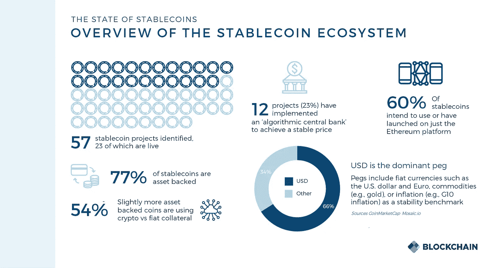
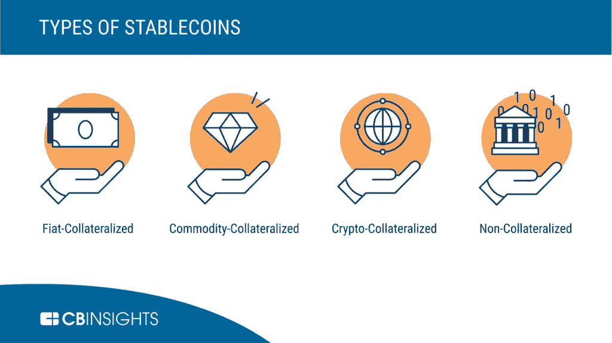

# 什么是稳定币，它与安全令牌有什么关系？|安全令牌与稳定令牌

> 原文：<https://medium.com/hackernoon/what-is-stablecoin-and-how-it-is-related-to-security-token-security-token-vs-stablecoin-8d40135928e3>

几个月前，JP 摩根公司推出名为“JPM 硬币”的稳定硬币的新闻标题占据了密码世界。

> Blockchain.com 的报告称，稳定的玉米正以前所未有的速度推向市场。

随着 stablecoins 迅速成为加密生态系统的重要组成部分，了解它们将如何影响下一代数字证券至关重要。

Image Source: Blockchain.com

安全令牌也作为一种方法出现，向加密世界引入法律含义，并在投资者之间建立信任。现在，问题是稳定币是否也是一种安全令牌。如果不是，两者有何不同。

**本文旨在理解两个流行术语“稳定硬币”和“安全令牌”之间的区别**

我们先来了解一下什么是 stablecoin。

# 什么是 Stablecoins？

Image Source: Crypviz

稳定币是一种与任何稳定资产挂钩的加密货币，例如法定货币、黄金或其他贵金属。大多数情况下，稳定硬币与控制定价和发行的分散自治组织有关。

它们旨在稳定加密令牌的值，降低其波动性。通过与另一项资产(如美元)相关联，稳定币的价值相对于该特定资产保持不变。

**由于加密货币的高波动率，推出了 Stablecoins。**用户很难使用加密货币作为交易媒介，因为他们无法支付一枚可能在另一天贬值一半的硬币。

一旦清楚了什么是 stablecoin，让我们来理解什么是安全令牌，以及它与 stable coin 有何不同。

# 什么是安全令牌？

Image source: Kiss png

安全令牌是一种加密令牌，可以从可交易的外部资产获取其值，或者由具有类似安全功能的资产支持。

证券被视为可交易的金融资产，例如，债券、期权、债券、认股权证和股票。令牌应遵守联邦安全法规，以便归类为安全令牌。

# StableCoins 与安全令牌

安全令牌和 stablecoins 之间的关系远不止是为数字证券提供支付基础。两者之间的联系可以被认为是双向的；stablecoins 允许使用新类型的安全令牌，可以使用底层编程模型将这些令牌组合起来形成新类型的 stablecoins。

在传统金融市场，创造由任何资产支持的新形式的法定货币是相当复杂的，但在加密领域不存在这种限制。非抵押或加密抵押的稳定密码可以来自安全令牌。

结合稳定密码和安全令牌可以在未来几年释放密码市场的各种关键场景。

Image Source: CBInsights

## 让我们理解下面的一些场景，它们解释了 stablecoins 如何与安全令牌相关联。

**场景 1:菲亚特抵押**

公司在银行持有资产或金库，并发行代表对支持它们的资产的权利主张的代币。他们建立了相当于支持资产数量的稳定积分。数字令牌从另一个具有定义值的资产中获得其值。

TrustToken 的 TrueUSD 是稳定的货币之一，由信托公司托管账户中持有的美元全额担保。该公司已经公开审计了智能合同，当美元符合托管账户条件时，智能合同铸造 TrueUSD，当美元被赎回时，智能合同烧掉，以确保托管账户中的美元与流通中的 TrueUSD 之间的 1:1 平价。

此外，TrustToken 计划将其模式扩展到黄金和钻石等贵金属，日元或欧元等其他法定货币以及房地产和股票等一篮子资产。

非货币扩展可以归类为安全令牌。例如，总部位于瑞士的初创公司 Eidoo 增加了一个兼容 ERC-20 的令牌 Ekon，可兑换 1 克 99.9%的纯金，储存在金库中，每 90 天接受一次审计。

Ekon 的价值来自黄金的价值，因此可以被视为安全令牌。

在交易所买卖 Ekon 的费用将以其代币 EDO 的形式为 Eidoo 带来收入。这种方法将 EDO 归类为安全令牌。

看看上面提到的情况，通过场景 1 设计的稳定币可以被定义为安全令牌。

**情景 2:无抵押(铸币税份额)**

如今，许多加密项目都采用铸币税份额模式来做美联储所做的事情。当美联储(美联储)从大型证券交易商或银行购买发行的证券时，货币供应就会增加。另一方面，如果美联储出售证券，货币供应量就会减少。

类似地，stablecoin 的初始分配被创建并与特定资产挂钩。供给会随着稳定的卷烟总需求的增加或减少而自动变化。

扩大或减少稳定的债券供应的常用方法是“债券和股票”法。它最初是由 Basis 推出的，该公司在推出之前为他们的 stablecoin 项目筹集了 1.33 亿美元。

挑战在于创建一个系统来检查你是否需要以分散的方式增加或减少货币供应。为了解决这一问题，该体系提供面值为 1 美元的债券，以一定的折扣出售，以激励持有者消除稳定债券的流通。

当稳定币的价格低于目标范围时，这个过程就会发生。万一未来需求上升，系统必须增加“货币供应”。首先，债券持有人按照他们被购买的顺序得到支付。一旦所有的债券持有人都得到了偿付，系统就会向持有股票的人支付。

在这种机制中，收缩不是有限的，因为每次债券发行都包含了未来总供给增加的承诺。当新债券发行时，债券队列会增加。结果，债券价格下降，从流通中去除的稳定的硬币也减少了。

上述机制似乎具有更多类似安全性的特征。债券和股票的发行过程、定价方式、股息支付流和评估、涉及的风险类型以及债券持有人和股东的预期都是与证券相关的特征。

**情景 3:加密抵押**

在这种情况下，分散的加密资产支持稳定币。例如，戴使用相同的机制。

与 TrueUSD 和 Tether 不同，Dai 由基于以太坊的智能合约中作为抵押品持有的乙醚支持。抵押品保存在智能合约中，可以通过支付 stablecoin 债务获得，或者在抵押品低于特定阈值时通过合约代码出售。

这种情况的问题在于支持稳定货币的抵押品可能会波动。由于它是由加密资产支持的，它可能会很快失去它们的价值。这就是为什么基于这种机制的项目被过度抵押以应对剧烈的价格波动。

在场景 3 中，虽然担保是通过加密资产完成的，但担保资产的价值可以代表稳定硬币的固定价值。硬币以加密货币资产作为抵押，其价值可以从这些资产中确定。可以通过抵押加密资产的价值来追溯到菲亚特。

> stablecoins 持有人可以对数字资产提出索赔，stable coins 从该特定资产中获取其价值。因此，这种情况也属于安全令牌定义的范畴。

从上面提到的分析来看，似乎所有创建 stablecoins 的场景都可以具有类似安全的特性，并且可以归入安全令牌的类别。

*在 LeewayHertz，我们有一个由* [***稳定币开发***](https://www.leewayhertz.com/stablecoin-development/?utm_source=hackernoon_leewayhertz) *专家组成的团队，他们可以创建由任何资产支持的稳定币，包括加密资产、实物资产或贵金属。*