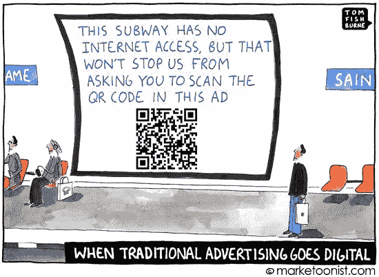
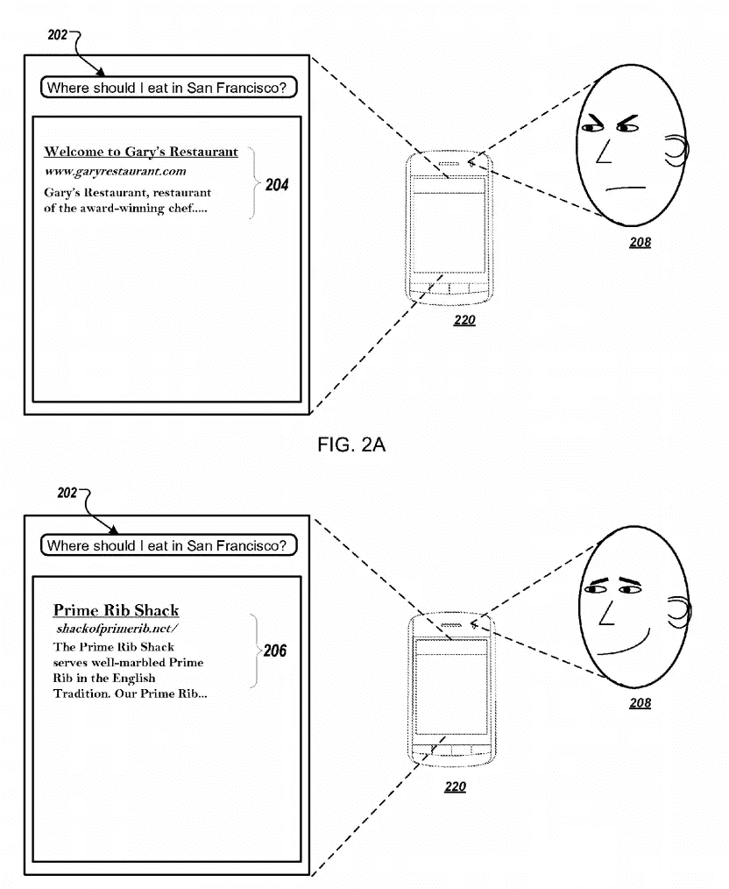
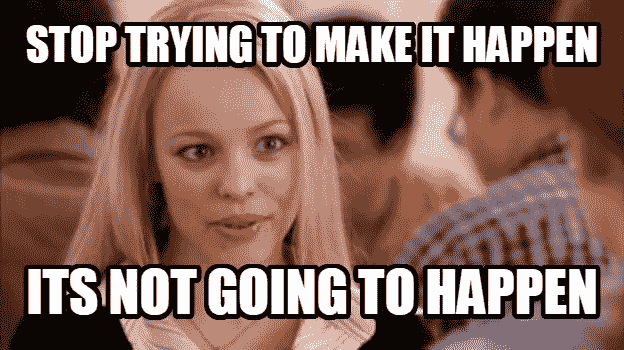
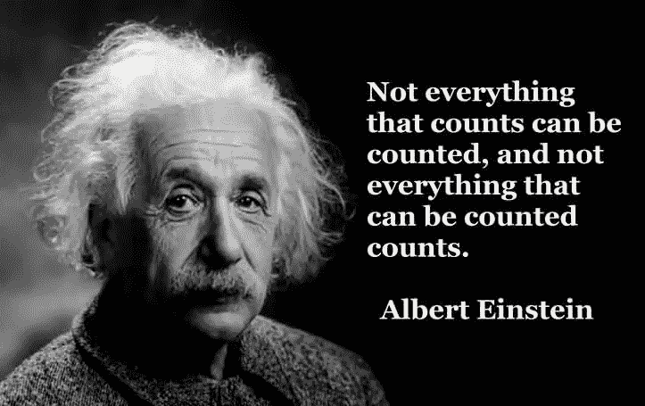

# 营销人员忘记了什么营销

> 原文：<https://medium.com/hackernoon/what-marketers-have-forgotten-about-marketing-b713fb0d519d>

## 营销和销售不是一回事

好吧，这个标题有点吸引人。因为我并不认为这是营销人员忘记了的。我认为这是那些付钱给营销人员的人所忘记的。

这就把我们带到了一个奇怪的地方。

过去，有经验的营销人员对品牌和创意了如指掌，但对数字却一无所知。

现在，它被翻转了。

我和很多公司谈过，他们说“我们非常擅长效果营销，现在我们需要搞清楚品牌。”

这是我在任何地方都能看到的一种模式。这是一个问题。

我一次又一次地听到同样的事情，这是因为我们已经忘记了营销和销售之间的区别。

“但现在营销和销售完全是一回事，”D2C 一家初创公司的工程师创始人说。“你只是过时了。”

不幸的是，尽管我们被告知我是如何遇见你母亲的，新的并不总是好的。

如今，许多企业将绩效营销(实际上是销售)视为唯一重要的营销方式。因为对他们来说，销售才是最重要的。

# 绩效营销=销售(不是营销)

看到单纯关注销售的问题是，为了推动可持续的销售和增长，**你需要实际的营销**。是的，在一个企业的早期，绩效营销作为帮助你找到适合市场的产品的第一步是非常有价值的。如果做得好的话，从长远来看，这也是一件好事。但依赖它的问题是，随着时间的推移，它会停滞不前。既然你没有从建立一个任何人都关心的品牌开始，你就会陷入困境。然后，你试图将“品牌”作为“新兴增长渠道”融入你的业务。但品牌不是渠道。品牌是人们想起你时会想起的独特故事——在最后对它进行改造是一个错误。

**营销**:了解你的受众，创造一个有意义的主张，接触并说服顾客尝试你的产品，鼓励忠诚和推荐

**销售(和绩效营销)**:完成交易

如果你把所有的营销都集中在绩效营销上，你实际上是把所有的努力都集中在销售上，这是一块非常有限的馅饼。

消费者不是机器人。他们买东西之前会考虑一下，就像你一样。你可以将 Google Analytics 上的归因窗口更改为 3 天或 30 分钟，并根据你的需要对销售进行优化——这不会改变你的客户需要几周/几个月/几年才能真正决定选择你的产品的事实。这意味着你在优化最明显的指标，试图让最容易衡量的东西看起来像是在工作。

**这不合逻辑，而且忽略了你的顾客。**

如果你只关注销售或绩效营销，你的想法是短期的，并且保证在某个时候，你将很难以可持续的速度增长。这甚至还没有考虑到你对特定平台的极度依赖，这些平台可以随时改变它们的算法并提高它们的定价(它们可以，它们会这样做，它们也会这样做)。这是假设，如果所有因素保持不变，你可以通过这些渠道接触到的潜在客户群，他们对这些渠道做出反应，将不可避免地枯竭。

Enjoy the days of current SEO while you can — Google published a patent [application](https://patents.google.com/patent/US20160103833A1/en) to score and rank search query results using emotional and biometric parameters of satisfaction and engagement.

“但是看看亚马逊！”创始人说。“他们从来不做任何营销，看看他们。”但事实是，他们确实在营销上花了钱。大量营销。价值 82 亿美元的营销。

“好吧，但是 Booking.com 怎么办？他们的业务完全建立在绩效营销的基础上。”

同样，不是最好的例子。2018 年，Booking.com 在品牌营销上花费了[5.09 亿美元](https://www.phocuswire.com/My-Method-Booking-brand-marketing)。首席执行官格伦·福格尔说，**“这些营销项目变得越来越重要，因为我们的许多绩效营销合作伙伴正在经历客户增长放缓。”**

因为事实就是这样——效果营销一直很神奇，直到它不再神奇。如果你等到停滞期才创建一个合适的品牌，并开始考虑营销，那你就有麻烦了。你越依赖早期的表现渠道，你就越有可能走得很宽，很浅，很快就稳定下来。只摘容易摘到的果子是一种极其短视的思维方式，从长远来看，这种方式可能会造成损害。投资者足够聪明，能够理解这种类型的增长将很快达到极限。如果你很早就理解了营销和销售的关系，你就可以为一些有意义的事情打下基础，这些事情将持续发展并最终持久。

有人说营销是一对多，销售是一对一。我完全不同意这一点。我认为有很棒的一对一营销，不会把销售策略强加给消费者。如此多的优秀企业都建立在惊人的内容之上，这些内容为客户今后的销售创造了条件。“未来”可能是一天后、一个月后或一年后，这取决于商业模式、行业和消费者行为。这些企业了解他们客户的流程，决策是一个情感过程，伟大的营销随着时间的推移会建立信任和忠诚。

优秀的营销人员和优秀的领导者明白在每个可能的接触点接触客户的重要性——从他们知道你是谁之前，到他们准备第一次购买的那一刻，到他们准备第二次购买的那一刻，再到他们向朋友推荐你的产品的那一刻。

我真的觉得初级营销人员进入入门级的工作这些天。如今，一名优秀的初级营销人员应该了解关于 SEO / ASO /付费搜索/展示/脸书广告/ Instagram 广告/ Pinterest 广告/ Snapchat 广告/ YouTube 广告/电子邮件/忠诚度/推荐/附属机构/现有的每一个分析平台/ sql /编码/ a/b 测试/归因建模/预测/品牌/设计/ UX / CRO /营销自动化/视频制作/ 内容创作/内容分发/文案/电视/ OOH /播客/社交媒体/社区管理/公关/影响者外联/合作伙伴关系/活动/“新兴渠道”/项目管理/代理管理/活动管理/用户研究等等。

“T 型营销者”神话的问题在于，实际上这是“万事通，无所不能”的另一种说法。我个人见过的最好的 T 型营销人员理解绩效营销和代码，但他们不理解品牌建设、内容、宣传或任何创造性的或电子表格之外的东西。他们的工作非常出色！然后，你有惊人的人与公关和影响者一起工作，他们被迫证明他们的工作是 SEO 或附属程序，实际上注定要失败，尽管他们工作的真正目的非常重要。

没有人能在所有方面都令人惊叹，期望他们做到这一点是不公平的。尤其是没人教他们的时候。这也非常接近于一种保证产出平庸的方式，即试图做所有的事情，但没有特别好地完成任何事情。专业知识是有价值的——贯穿消费者旅程的所有部分，而不仅仅是最终销售。

是的，你需要早期的多面手——但不要期待奇迹。但从长远来看，至少 T 型营销人员还有机会，因为他们接触过不同的营销领域。在我看来，风险最大的是那些专注于做纯粹业绩营销人员的人(他们的头衔中可能会出现“增长”一词，因为这意味着他们必须善于分析)。这些人从未被教导要考虑受众，因为机器会优化那些点击购买的人。在他们的工作完全自动化之前，他们很有可能还有两到三年的时间。由于没有人教他们什么是市场营销，而不是他们实际从事的销售工作，他们需要从头开始学习。

营销人员不应该被迫成为销售人员、财务人员或开发人员。是的，当然，他们应该能够说其他团队的语言，并有效地与他们沟通。但是当你的营销人员不会写代码时感到震惊意味着你的期望不在正确的地方。让你的员工做好他们擅长的事情，不要阻碍他们。

企业领导层的工作是设定和管理对营销团队的期望——无论个人的职责是营销还是销售——并明确目标以及每个人在大局中的角色。

这包括领导团队了解客户旅程中每个渠道的目的。营销渠道应该根据它们的目的来衡量，销售渠道应该以不同的方式来衡量。坦率地说，根据直接销售指标来衡量 Trueview 广告是荒谬的。你上一次决定不看你要看的 YouTube 视频是什么时候，因为你决定点击播放前的视频，然后立即去买东西？不要指望顾客做你知道自己永远不会做的事情！这根本不是大脑工作的方式。弄清楚你需要什么——然后找到合适的渠道来实现它——然后根据它们的目的来衡量这些渠道。

我经历过的最常见的营销争论是关于公关的。“既然很难衡量，那就不值得去做”/“我们得到了巨大的压力，但我们没有看到销售的激增”/“如果我们看不到即时的销售，那一定是浪费”/“我们应该把我们的努力集中在我们可以看到成功的地方。”

再次重申:

好的，让我们从基础开始。如果你正在阅读这些文字，你就是在阅读出版物上的一篇文章。不是媒体的种子，也不是兜售产品，但你在阅读它，因为你在一个你信任的媒体上找到了它。很有可能，你从媒体或你的朋友与你分享的信息(通常包括媒体链接)中了解到你所知道的大部分事情。你会点击进入并立即购买吗？不。那会使它无效吗？不会。它会影响你的决定吗？是的。可以测量吗？是的，不可否认这比付费搜索广告要困难得多。

虽然它是可以衡量的，但有时你也需要信任你的企业和产品。这意味着理解让人们听到你的产品足以启动购买过程的最早期阶段，即使你没有立即看到销售。如果你不相信有人听到你的产品有多棒、有多相关会有影响，我怀疑你内心深处可能并不真的认为你的产品很好。一些值得思考的事情。

仅仅因为你没有看到一个立竿见影的销售高峰(记住，营销不是销售)，并不意味着它不起作用。要相信你的产品足够好，当你让人们意识到这一点时，你会引发他们的考虑，这与其他形式的说服一起，足以帮助绩效营销在以后为你达成交易。你可以用不同的方式来衡量这一点，可以简单到在你的网站上问一个“你从哪里听说我们”的问题。

如果没有营销努力让人们知道你的存在并考虑购买你的产品，你的效果营销的效果可能会差得多。它只会在极少数人身上发挥作用，这些人没有被引导，但仅凭效果营销就能被说服购买你的产品。你我都知道这部分观众非常少。

# 基于客户旅程构建整体营销

我说的很多话可能会让我听起来像是反对绩效营销。我怎么强调都不为过——我没有。我认为这非常重要，尤其是在一家企业的早期，我曾在一些公司工作过，这些公司在使用绩效营销和其他渠道时非常成功。这是我的主要观点——它需要被纳入一个更广泛的营销计划中。仅仅针对最终销售进行优化是不够的，还必须考虑完整的客户体验。

以下是帮助你思考这个问题的一些步骤:

1.  **弄清楚你的品牌是什么**

*   你的观众是谁
*   你真正卖的是什么
*   你的品牌代表什么

不要在以后翻新你的品牌——如果它是真实的，并且从一开始就确定了，那会好得多。想想 a)你真正关心的是什么，b)你的品牌有什么意义。当创建一个强大的、一致的和可识别的品牌时，确保你从第一天起就清楚你的使命和目的是至关重要的。了解你的受众包括了解完整的客户旅程实际上需要多长时间，以及在这个旅程中有多少接触点——从第一次发现你的品牌到购买你的产品。

2.想想**在**早期什么渠道最有意义。测试绩效营销渠道可能最有意义，可以增加你的受众，找到适合市场的产品，但你也可能希望创建有用的内容，以对你的品牌有意义的形式向你的受众介绍概念。测试你有资源测试的一切，不要低估测试中创造性选择的力量。避免立即迷上付费媒体——当你开始时，它总是最便宜的，并且永远不会像你希望的那样可持续。

3.**提高产品市场契合度**。利用你从早期客户和营销销售活动中学到的一切，根据你的见解优化你的产品。

4.随着你业务规模的扩大，**优化你的牌桌赌注绩效营销，同时提高你的整体营销和口碑。**考虑客户的整个旅程，以及他们在决策过程的每个阶段需要什么信息。

5.随着你从规模扩张进入超增长，随着你的忠诚度和口碑变得更强，绩效营销将退居二线。**在这一点上，通过品牌建设实现差异化**将需要成为主要焦点，创造力将是你团队中每个营销人员都需要的技能。

简而言之:不要仅仅因为绩效营销/销售更容易衡量就对其着迷。不要因为单纯的销售渠道而忽视市场营销——你永远都需要这两者，它们是相辅相成的。随着时间的推移，这种平衡会发生变化，但着眼于大局总是必要的。只关注短期销售会伤害你的未来。你需要记住营销实际上应该做什么，以及它为什么重要。