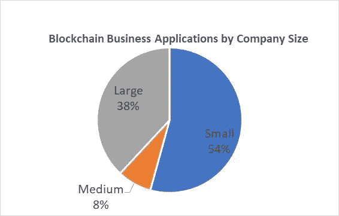
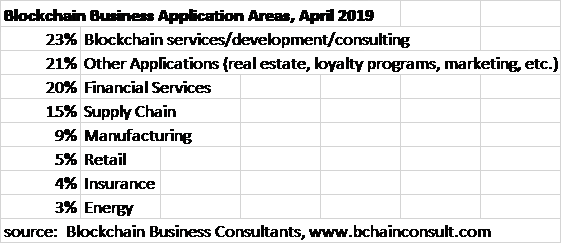
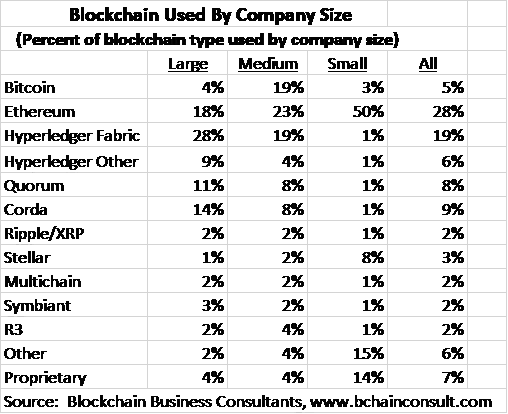

# 小公司和“中间市场”用区块链做什么

> 原文：<https://medium.com/hackernoon/what-small-companies-and-the-middle-market-are-doing-with-blockchain-25843ea0dc5d>

> drmiller@bchainconsult.com 区块链商业顾问公司董事总经理 Drew Miller 博士

2019 年 4 月，福布斯发布了新的“区块链 50 强榜单”，涵盖了大公司对区块链的使用。这是一篇很棒的文章，但在关注使用区块链的最大公司时，福布斯给出了一个有点扭曲的商业使用 BC 的观点。福布斯 50 大应用主要是金融和供应链应用。小型业务连续性创业公司正在做大公司的业务连续性应用，但许多更具创新性和大胆的应用，追求业务连续性的使用，可能会产生更多的颠覆和行业的长期发展。德勤做了一个 BC 使用的年度调查，也非常偏向财富 500 强。大多数推出区块链应用的公司都很小。“中间市场”(1 亿至 30 亿美元的销售额)约占私营部门销售额的三分之一，小企业占另外三分之一。这篇文章总结了截至 2019 年初，占总销售额三分之二的绝大多数中小企业如何使用区块链。

在区块链业务顾问的数据库中，有超过 500 家寻求区块链应用的公司(包括所有的福布斯 50 强，不包括刚刚开发新区块链的小型 ico ),我们发现 62%的已知业务连续性应用是在中小型公司:[【2】](#_edn2)

来源:区块链商业顾问，商业区块链应用数据库，【www.bchainconsult.com 

虽然福布斯文章和德勤区块链年度调查提供了非常有价值的信息和区块链商业应用的例子，但它们对区块链商业应用的概述有失偏颇。他们忽略了区块链在中小型市场企业中的许多用途，有时还会对最重要的 BC 用途给出误导性的结论。

例如，在福布斯 50 强排行榜中，BC 的主要用途是金融服务。我们的区块链数据库显示，大型公司约占金融服务 BC 应用的 70%。就总应用程序的百分比而言，小公司没有追求区块链的许多金融服务应用程序(我们没有将加密货币交易或钱包算作金融服务)。如果包括各种规模的公司，金融服务约占区块链应用程序的 20%。

区块链即服务和区块链咨询与开发占了稍大的百分比，供应链约占区块链应用的 15%。

另一类区块链应用程序包含小公司和初创公司正在追求的无数应用程序，一些创新远远超出了你在最大的公司中看到的。房地产、投票应用程序、客户忠诚度计划和许多其他区块链应用程序正在小公司开发或使用，可能会产生重大影响。

福布斯 50 强中没有餐饮公司，但许多中小型餐饮公司接受加密货币支付，并使用区块链进行其他商业应用。比特币最初用于购买的用途之一是购买披萨。不是完整的大型连锁店，但俄罗斯的汉堡王创造了一种“WhopperCoin”加密货币，奖励顾客的购买。Bloomin' Brands 是 Outback Steakhouse、Carrabba's 和其他连锁餐厅的所有者，它正在试验一种区块链解决方案，这种方案在采购方面提供透明度和问责制，并在食品安全相关的召回事件中提供帮助。越来越多的餐馆强调他们在本地采购，以获得更好的新鲜度和安全性，并促进当地经济。区块链也可以用来证明这种来源，消费者可以扫描菜单上的条形码或餐厅的海报，以查看原料的确切来源。一家牛排餐厅刚刚添加了这个 BC 应用程序。根据食品营销研究所的研究，44%的顾客希望知道他们的食品是按照道德标准生产的，75%的顾客不相信食品标签上所列的内容。[【4】](#_edn2)

虚假和误导性的餐馆评论对餐馆和顾客都是一个问题。很难知道哪些评论是诚实的，哪些是捏造的，以帮助或伤害一个机构。[【5】](#_edn3)Bloomin Brands 的执行副总裁在他们关于餐馆 BC 使用的视频中说，Yelp 评分每提高 1 星，销售额就会增加 5%到 9%。SynchroLife 等公司希望通过奖励对餐馆做出评论的评论者加密货币代币来解决评论问题，这些代币存储在区块链中，不能被修改。用户和餐厅都抹不掉差评。SynchroLife 的机器学习算法也将用于提供建议。

因此，就在餐饮服务这一传统上技术含量不高的行业中，我们看到了大量对 BC 的创新应用，但福布斯 50 强中没有餐饮服务公司，因为它们专注于巨型公司。

一些行业只有一家公司使用区块链。鲜为人知的(在 300 万到 500 万美国“预备者”之外)preparation，survival industry 有一家公司为公用事业令牌做了 ICO，不仅规避了监管问题，而且价值上升，因为 cryptocurrrency 令牌不仅为您提供了加入 Fortitude Ranch survival 和 recreational 社区的固定价格，还提供了在等待名单形成时加入的优先权。与 2017 年 12 月比特币价格暴跌后硬币价格暴跌的大多数 ico 不同，Fortitude token 的价格上涨了 45%，因为它具有实际价值。许多其他公司应该使用加密货币公用令牌来进行新产品和服务的预售——使客户能够优先购买热门新产品，或许还能获得固定价格，但如果令牌升值或他们决定不购买，他们可以将令牌出售给其他人。[【第八期】](#_edn6)

使用 BC 的小公司和大公司之间的一个巨大差异是，大公司不愿意冒证券监管问题的风险，并忽视 ico，成千上万的小公司和初创公司利用 ico 来筹集资金。icodata.io 列出了截至 2019 年 4 月的 1，883 个已完成的 IOC。[【9】](#_edn7)这些 IOC 中有些是欺诈性的，有些已经失败，但我们猜测大约有 1000 家小型 ICO 资助的创业公司仍在开发新的区块链、新的 BC 应用和一些新的行业。

一些像 Everledger 这样专注于区块链的初创公司已经不再是小公司了。Everledger 成立于 2015 年，在区块链的数字账本上追踪钻石等高价值资产的来源。通过使用区块链、智能合同、物联网和机器视觉，Everledger 为用户提供了关于产品所有权的不可变数据，以及完整的原产地和转让历史，从而使假冒商品或从军阀处采购等不良行为变得困难。2018 年，Everledger 又筹集了 1000 万美元的融资，并迅速扩展到钻石以外的许多消费品领域。Everledger 现在是一家中型公司，在世界各地有 12 个办事处。他们理所当然地称自己是“数字起源的先驱”

Everledger 很好地说明了中型市场和大型公司将如何应对小型 BC 公司新贵。一位珠宝行业顾问在 2018 年警告说，“区块链技术正在进入珠宝行业，而且来得很快。”实际上，它在几年前就已经出现了，只是大公司没有注意到。大型钻石矿商 DeBeers 对 Everledger 的反应是创建自己的钻石供应链区块链，并于 2018 年底推出。其他一些珠宝供应商、制造商和零售商与 IBM 的 TrustChain 合作，形成了另一个珠宝供应链区块链，该供应链要到 2019 年晚些时候才能运营——而 Everledger 继续扩大其巨大的领先优势，并进入珠宝以外的更多市场。

沃尔玛有一个正在使用的食品安全私人区块链，农产品供应商必须使用，未来可能所有供应商都必须使用。根据早期 BC 采用者和比特币粉丝的标准，像沃尔玛这样使用中央控制的私有 BC(其供应商被迫使用)的巨型公司不符合区块链的标准。对于这些纯粹主义者来说，业务连续性就是去中心化运营，消除任何中心控制权力。许多，也许是大多数小型 ICO 资助的 BC 创业公司确实是由致力于摧毁大银行、大公司和滥用控制和权力的区块链爱好者经营的。

一些小型创业公司公开追逐大公司。SharedChain 是一只“咆哮的老鼠”,它与区块链一起建立了新的共享供应链和电子商务系统，同时追逐亚马逊和沃尔玛，帮助小型零售商以更低的成本采购，获得更快更便宜的当天送货，并在与大型零售商的竞争中生存下来。SharedChain 创始人兼首席执行官卢克·李(Luke Lee)指出，“没有人尝试过这种方法，因此没有有效的公共流程系统，没有基础设施或真实市场的平台。”[【12】](#_edn10)李开复为他的商业概念申请了专利，开发了软件，并对 SharedChain 进行了市场测试，shared chain 是一个使用他的专利互联网概念和区块链的共享供应链和电子商务系统。通过利用互联网的共享电子商务系统中的网络效应，以及共享供应链系统中的实物商品规模经济，SharedChain 实现了与每个供应商的“竞争-合作关系”,“能够实现比以前更高的效率、生产率和应用能力”[【13】](#_edn11)李开复恰如其分地称之为“供应链革命”他正在构建一个“与第三方通信基础设施捆绑在一起的网络化、公共、真实的供应链基础设施”[【14】](#_edn12)和区块链，以实现更好的数据安全性和可信度。[【15】](#_edn13)

 [## 用区块链打败亚马逊

### 以及共享的供应链和电子商务系统

hackernoon.com](https://hackernoon.com/beating-amazon-with-blockchain-f46fa240c3e8) 

《福布斯·区块链》的文章引用马克·扎克伯格的话说，“如果我们想的话，我们可以做完全分散的认证。我认为真正的问题是，你真的想要这样吗？”当亚马逊、沃尔玛、脸书或苹果拥有强迫客户和顾客使用他们系统的市场力量时，他们为什么要将控制权交给一个分散的区块链应用程序呢？比特币的早期倡导者认为，由中央控制的私人区块链是一种诅咒和矛盾。为什么要为一家占主导地位的公司控制的区块链而烦恼呢？沃尔玛可以简单地要求其供应商使用沃尔玛控制的区块链——那么为什么不使用传统的沃尔玛运行数据库呢？事实上，使用区块链确实很有意义，即使它有一个完全由一家公司控制的共识机制，因为“区块链是一个记录保存机制，使企业在互联网上更容易、更安全、更简单地合作。”[【17】](#_edn2)区块链非常适合与业务合作伙伴的 IT 系统和数据库集成和共享信息，而无需尝试直接连接它们的成本和风险，如下文所述:

 [## 区块链未被充分重视的最大应用是集成:IT 系统和业务…

### 虽然大多数人都知道区块链是加密货币的基础，但即使是区块链的爱好者似乎也…

medium.com](/@collapsesurvivor/blockchains-underappreciated-greatest-application-is-integration-it-systems-and-business-partner-6b1392a9b7ba) 

但是，大公司也可能希望保持对其私有 BC 的集中控制，以出售和利用其系统上的数据。

《福布斯》公元前 50 年排行榜的另一个误导性方面是，它们要求将一些美国业务包括在内。根据沃顿商学院(Wharton Business School)的一份报告，中国在申请区块链方面领先于美国许多其他报告和文章表明，中国在区块链的项目可能比美国多，其中大部分来自可能在美国没有业务的公司。[【18】](#_edn2)从阿里巴巴这样的巨头使用 BC 作为其庞大的供应链，到其他大大小小的创业公司，在政府的大力支持下，中国正在推出一系列区块链企业。世界上最大的银行之一中国农业银行已经开始使用 BC 实时更新借款人信息，为客户提供更高的透明度和更快的审批时间。同样，关于追求业务连续性的公司数量的数据本质上是不可靠的，因为许多公司会对他们的工作保密，或者媒体没有报道，其他公司的区块链系统的用户(尤其是供应商)不会被看到。许多小国也热衷于加密货币和区块链业务，渴望利用第二次互联网革命，包括爱沙尼亚、马耳他、瑞士、新加坡和阿联酋。

到目前为止，BC 的最小用户是中型市场公司(销售额为 1 亿至 30 亿美元)，它们不愿意像大型公司一样进行投资，也无法承担小型创业公司加入 ico 和开创性使用 BC 的监管和法律风险。虽然现在中型市场公司在业务连续性使用方面落后，但无论他们是否愿意，他们都必须迅速行动起来使用业务连续性。如果他们向沃尔玛或空中客车这样的大公司供货，或者通过亚马逊销售(我们预计亚马逊将在某个时候要求使用 BC，当然是根据他们规定的条款使用他们的系统)，他们将不得不使用他们的区块链。如果他们的行业面临来自利用区块链产生决定性新竞争优势的小公司的破坏，他们将不得不效仿。

相对于小公司，大公司使用区块链的另一个很大的不同是他们使用的区块链。正如你所料，大公司青睐私人区块链，尤其是 Hyperledger 织物。小公司使用更多的区块链，并且大部分是公开的区块链(正如一些纯粹主义者所说的“真正的”BCs)。我们在区块链应用程序上的数据显示，28%的区块链大公司建立在 Hyperledger Fabric 上，相比之下，小公司只有 1%。以太坊是最受欢迎的商业用区块链，但是尽管一半的小公司应用程序都在以太坊区块链上运行，只有 18%的大公司使用它。这一区块链使用分析没有计算区块链的 ICO 使用量。如果是这样的话，以太坊的统治地位将会更高，因为已经有一千家小公司使用以太坊区块链作为他们的 ico。财务应用程序区块链在大公司中也比小公司普遍得多，许多公司使用专门为银行业务开发的业务连续性系统。小公司有更多的小区块链用例，以及更多的专有区块链。

虽然最大公司的业务连续性应用令人印象深刻，并可能成为行业标准，但商业历史以及人类和组织行为现实的教训表明，最具破坏性的业务连续性应用可能来自更小、更敏捷的公司和完全专注于其业务连续性应用的初创公司。我们怀疑像 Everledger 和 SharedChain 这样的小型创业公司 BC 用户更有可能开发和利用区块链最具破坏性的应用程序。下一个 BC 支持的亚马逊很可能在这里，而不是在财富 100 强中。《福布斯》区块链 50 强榜单和文章是优秀区块链申请的宝贵信息来源，但从只关注最大公司的榜单中吸取区块链趋势或潜力的教训是不明智的。

我们发现，许多中型市场公司的 IT 人员知道他们应该进入区块链，但要么没有资金，要么无法轻松计算区块链应用程序的可能投资回报。与典型的 It 系统改进项目相比，评估您无法控制的区块链应用程序的投资回报率确实要困难得多，但正如下面的文章所解释的那样，这是很容易做到的:

 [## 评估区块链应用的投资回报(ROI)

### 行动纲要

medium.com](/@collapsesurvivor/assessing-the-return-on-investment-roi-of-blockchain-applications-29a3ec39af04) 

我们的一些中间市场客户已经评估了感兴趣的区块链应用程序，开发了一个原型来与值得信赖的业务合作伙伴进行测试，但大多数客户都在观察和等待，而不是现在就推出。

在接下来的几年内，我们预计不仅仅是 90%的财富 500 强，而是 90%的 Russel 2,000 强将成为 BC 用户。中型市场公司将不得不采用 BC，要么为需要使用其 BC 供应链系统的大型公司供货，要么与利用 BC 扰乱其行业的新贵公司竞争。

Dr. Drew Miller，Blockchain Business Consultants 董事总经理，drmiller@bchainconsult.com

[1] Michael del Castillo，“Blockchain Goes To Work at Walmart，IBM，Amazon，JPMorgan，Cargill 等 45 家企业”，Forbes.com，2019 年 4 月 16 日

[2]如果超过 1 个区块链应用程序，有些公司会加倍计算，不包括发行密码货币来开发区块链或商业应用程序但尚未交付的小型公司，也不包括像沃尔玛供应链区块链这样的区块链系统的用户。Blockchain Business Consultant 的数据库绝不是一个完整的科学调查。它基于我们为之工作的客户和我们在媒体上看到的区块链应用程序。有这么多中小企业在追逐区块链，其中很多都是秘密进行的。一些公司正在不同的领域追求几个 BC 应用程序，一些应用程序覆盖多个领域(如贸易信贷融资——一种金融服务，但也包括供应链)。

[3]关于区块链在餐饮业的使用的白皮书，有更多的细节和来源，可应要求提供，drmiller@bchainconsult.com

[4]食品营销研究所数据引自《食品服务业中的块状链》，[https://smart bridge . com/区块链-video-series-区块链-食品-服务业/](https://smartbridge.com/blockchain-video-series-blockchain-food-service-industry/)

[5] Dawn Kuczwara，“Blockchain 为餐厅提供多种优惠”Business.com，2017 年 12 月 19 日

[6] Bloomin Brands，One Network，【数字时代重塑餐饮供应链】视频发布于物流管理网站,[https://www . logisticmgmt . com/article/resforming _ the _ Restaurant _ Supply _ Chain _ in _ Digital _ Age](https://www.logisticsmgmt.com/article/reshaping_the_restaurant_supply_chain_in_the_digital_age)

【7】[www.fortituderanch.com](http://www.fortituderanch.com)

[8]如果您对本申请的更多信息感兴趣，请联系 drmiller@bchainconsult.com

【9】[https://www.icodata.io/ICO/ended](https://www.icodata.io/ICO/ended)

[10] www .everledger.io

[11] Andrea Hill，“珠宝行业为供应链可追溯性做好准备”，Forbes.com，2018 年 10 月 7 日

[12] Luke Ho-Hyung Lee，“3-D”供应链流程系统如何革新业务”，《供应链季刊》，第 2 季，2013 年

[13] Luke Ho-Hyung Lee，“一个“三维”供应链流程系统如何能够革新业务”，《供应链季刊》，第 2 季度，2013 年

[14] Luke Ho-Hyung Lee，“一个“三维”供应链流程系统如何能够革新业务”，《供应链季刊》，第 2 季度，2013 年

[15] [www.sharedchain.io](http://www.sharedchain.io)

[16] Michael del Castillo，“区块链在沃尔玛、IBM、亚马逊、摩根大通、嘉吉和其他 45 家企业开始运作”，Forbes.com，2019 年 4 月 16 日

[17][https://www . inbound logistics . com/CMS/article/a-区块链-reality-check/](https://www.inboundlogistics.com/cms/article/a-blockchain-reality-check/)；[https://medium . com/@ collapse survivor/区块链-under appreciated-great-application-is-integration-it-systems-and-business-partner-6b 1392 a9 B7 ba](/@collapsesurvivor/blockchains-underappreciated-greatest-application-is-integration-it-systems-and-business-partner-6b1392a9b7ba)

[18][https://knowledge . Wharton . upenn . edu/article/can-u-s-catch-China-区块链-dominance/](https://knowledge.wharton.upenn.edu/article/can-u-s-catch-chinas-blockchain-dominance/)