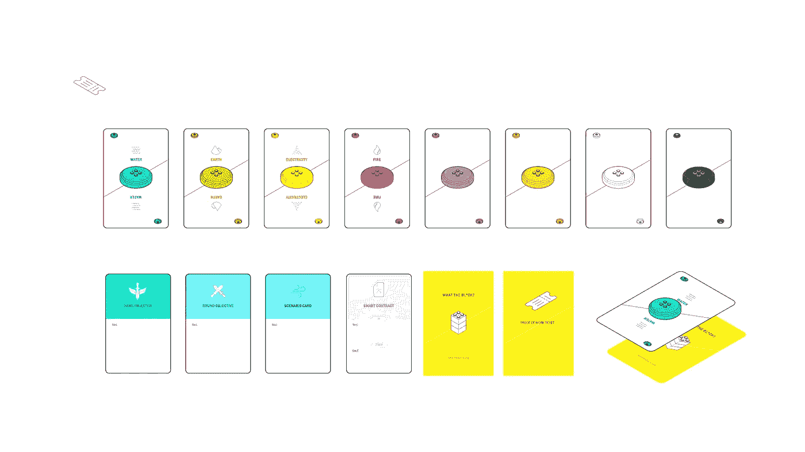
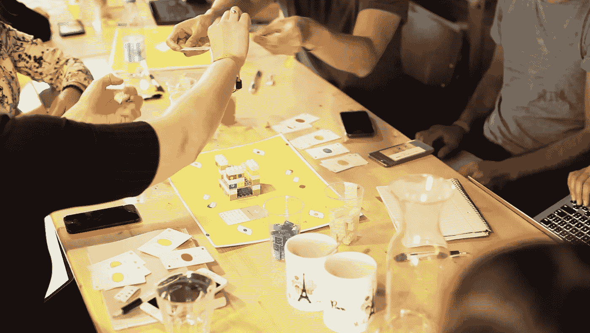
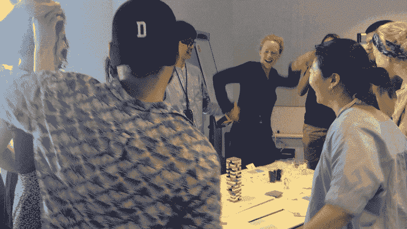

# 区块链到底是什么？

> 原文：<https://medium.com/hackernoon/what-the-bl-ck-is-blockchain-614d87258d8a>

## 为什么我们设计了一个游戏来帮助区块链变得更人性化

> [What The Block](https://whattheblock.org) 是一个旨在让人们通过设计来学习和发现新技术潜力的项目。我们从区块链开始，因为设计人员使用区块链，我们已经被同事、同行、客户、家人和朋友的请求淹没，无法解释它——问题是我们无法在那里找到任何好的现有材料。

所以我们决定尝试改变这一点，通过创造一些东西，让[学习](https://hackernoon.com/tagged/learning)[区块链](https://hackernoon.com/tagged/blockchain)变得有趣、可及，并有希望激发人们去建立有趣的项目。我们最终设计了一个游戏，现在已经有一百多人玩过了，并且获得了国际奖项的认可，所以我们想分享我们的故事。

# 项目的起源

2017 年，[约翰·费雷拉](https://dk.linkedin.com/in/johnfwferreira)和[我自己](https://posthuman.website)，像许多其他人一样乘着加密乐观主义的浪潮，推出了一个将改变世界的区块链产品。在区块链领域，我们的档案很不典型。我们不是黑客、数学家、软件工程师或前金融家，而是设计师。我们的设计同行中很少有人理解我们试图做什么，几乎没有人对区块链有任何了解，但他们中的大多数人对它持高度批评态度。

我们成了“区块链人”，成为其他人的目标，这些人希望反刍他们在网上略读的东西。我们因区块链未能接触到大众而受到指责。我们被骂区块链*没有发挥潜力。我们被问及缺乏日常应用的问题。*当然我们被告知*只是为了非法活动*(伴随着指责的眼神)*。*

更普遍的是，似乎当我们对这个话题越来越感兴趣的时候，其他人对区块链的批评也越来越多，越来越多越来越不消极的敌意直接针对它。一个很好的例子是，这篇关于区块链失败的大肆渲染的文章已经在媒体上获得了超过 5 万的点击量。M [y 讽刺回应](/@cy_rus/i-think-you-missed-the-point-of-blockchain-entirely-7ab52ad1c274)只收到 1k。

虽然我很想说这是一派胡言，但问题是证据对我不利。随着 2018 年的开始，我们看到了席卷我们所有人(包括我们自己)的加密波，猛烈地撞击着海岸，讽刺的是，除了鲸鱼之外，任何东西都被彻底搁浅。在无数伟大的想法中，真正的、可扩展的产品少之又少。人们拼命支持的通过 ICOs 发起的大多数项目，现在不是[奄奄一息，死了，就是蒸发得无影无踪](https://deadcoins.com/)。事实上，许多阴谋、传言和兴趣现在已经消散。

因此，一年前，当区块链开始陷入幻想破灭的低谷时，在这个最合适的时刻，我们决定创建区块链的雄心勃勃的目标，试图教育大众关于区块链的知识，并激发人们对这项技术的更大热情，不是通过告诉人们它是什么，而是向他们展示它能做什么。

这个目标源于约翰和我共有的一种集体不满，这种不满延伸到多个主题:

1.  我们对那些给非专家的垃圾信息感到非常沮丧。
2.  区块链工业在设计、可用性和美学方面的糟糕状况经常让我们感到沮丧。
3.  我们很大程度上对缺乏想象力和对金融、供应链和身份的无情关注无动于衷(即使它们都是重要的话题)。
4.  我们感受到了非区块链人，或者更准确地说，非加密人，即大多数人，对任何与区块链有关的事物的冷漠。
5.  不过，最重要的是，我们不得不向人们解释我们在区块链项目中所做的事情的次数。

虽然一些人最初表现出兴趣，但总体而言，非区块链人(即大多数人)对任何与区块链相关的东西都漠不关心，完全愤世嫉俗，这是真正打动我们的，因为这项技术可能会提供什么。

所以我们决定尝试改变这种状况。我们决定开始分享我们的知识，利用我们作为设计师的技能来重新审视区块链，看看我们是否能比其他方法更好地解释它及其潜力。考虑到这一点，我们为 2018 年设定了一个目标，为所有背景的人开发和教授一个关于区块链的研讨会。

# **我们的流程**

几乎立刻就有了开发游戏的想法，逻辑是游戏很有趣，人们喜欢有趣。但是我们怎样才能让学习区块链变得有趣呢？

我们做了一些研究，试图理解为什么学习区块链目前如此痛苦。这让我们意识到媒体(主要是视频)和信息(区块链是什么)让人们感到沮丧。他们真的想知道它能用来做什么，但是在缺乏明确用例的情况下，这很难理解。

由于这项技术的大规模采用还有一段路要走，而且在日常生活中真正使用它的机会很少，我们决定开发一种可以快速解决区块链基本问题的东西，然后再进行更困难的任务，让人们探索它可以做什么。这需要一个故事，游戏经常利用这个故事让人们沉浸其中，帮助他们相信这是真实的。虽然我们的游戏永远不会是一个史诗故事，但我们需要精心设计一个故事，为人们创造性地探索提供背景和许可。

通过我们的研究，我们偶然发现了克里斯·斯皮德和爱丁堡大学设计信息学实验室的工作。他们创造了一个基于乐高的车间工具来解释比特币。我们看到了这一点，并认为我们可以在此基础上设计一个成熟的游戏，并对其进行扩展，以融入更多区块链的核心元素，如代币、采矿和智能合同。所以我们开始制作原型。

An early prototype of the game before we had shiny cards and fun people to play with

通过原型制作和测试我们的想法，我们很快确定了游戏组件的逻辑设置和游戏的结构。然而，不知何故，它似乎并不有趣，当我们与人测试它时，很明显有一些东西不见了。

为了寻找灵感，我们开始经常去当地的桌游咖啡馆玩游戏。他们确实比我们的原型有趣得多，虽然其中一些归结于主题，但很多来自基本的游戏元素，如规则、清晰的结构、目标和赢家。虽然我们不一定希望人们赢，但给人们一个明确的目标，一个继续玩下去的理由，显然是重要的。

# 游戏

因此，我们开始设计一个游戏，这个游戏采用了精心编写的场景、特别设计的卡片和乐高积木，带领人们“从零到区块链英雄”，进行了四轮游戏。我们选定的是一个游戏，开始时是一个简单的交易游戏，随着回合的发展，参与者逐渐积累知识，他们可以在后面的回合中应用这些知识。

这是我们的一些卡片的照片:

前四张彩色卡片代表游戏中交易的资源。剩下的四张卡片是“空白”资源，在后面的几轮中用来辅助头脑风暴。我们创建了回合和整体游戏目标卡、场景卡和智能合约卡，可以用来详细说明智能合约的规则。

游戏本身是使用棋盘来玩的。董事会成为一个活动中心，一个发生社会经济互动、定义规则和条件、建立关系的系统，所有这些都记录在乐高区块链上。

我们的董事会最终看起来像这样:

The game board from What The Bl*ck game

虽然区块链是一种数字技术，但我们的方法故意使用模拟游戏格式，以创造一些有形的东西。从我们的研究中，我们了解到使用实物有助于人们更好地记住信息。因此，游戏中的每个元素都经过了仔细的思考和考虑，以帮助人们建立核心区块链元素(如令牌、区块和账本)的精神和物理表示。

Participants playing the trading game at Techfestival 2018

游戏进行了四轮。第一轮和第二轮涉及一个简单的交易游戏，在此期间，参与者了解区块链最基本的概念和功能。第一轮游戏非常简单，目的是帮助参与者熟悉游戏的规则和格式。即使在这个早期阶段，他们也开始学习区块链的一些基本特征，如区块、账本和加密令牌。

在第二轮中，团队被引入更复杂的想法，如分权、采矿和重复支出。除了主游戏，他们还玩一个我们编写的在线游戏，模拟机器之间发生的史诗般的战斗，以获得新的价值，也称为工作证明挖掘。采矿游戏的获胜者可以打开一个魔盒，这与区块链世界中的采矿类似，以代币的形式提供新的价值。

A winning miner opening the magic mining box (on loan from colleagues at CIID)

在第三轮中，我们使用前几轮积累的知识为 *value* 开发新概念，这是一个非常困难的概念，远比区块链如何工作更难理解。每个团队集思广益，想出一个有趣的新概念，将其打包在一个令牌中，然后尝试与其他团队进行交易。随着这一轮的进展，团队能够迭代和建立他们的想法。

Participants learn by doing, building mental and physical representations of Blockchain concepts.

在第四轮中，我们通过使用智能合同将治理带入角色。使用我们的智能合同卡，这些团队试图创建适用于当前全面流动的整体经济体系的规则。这标志着游戏的高潮，团队交易新的令牌化价值概念，由智能合约管理，所有这些都记录在公共账本上。

This is what a smart contract looks like

通过游戏，我们激发好奇心，让人们在没有任何先决知识的情况下，以有趣和快节奏的方式学习。我们通过一种称为自上而下学习的技术来做到这一点——让参与者沉浸在区块链的世界中，建立他们的知识，并允许他们开始提出相关和有见地的问题。这通常会演变成由我们促成的小组讨论，使用幻灯片、故事和示例等工具来巩固知识并开发精确的技术词汇。

# 游戏管用吗？

迄今为止，我们已经在我们的“区块链设计”研讨会中使用了这款游戏，研讨会时间从半天到五天不等。在更长的会议中，我们举办了一个完整的设计研讨会，以帮助人们提出利用区块链功能的强大概念——在透明的系统中促进价值转移，信任是其中的一个特征。

We’ve taken the game from Copenhagen to Kochi

到目前为止，我们已经有 100 多人玩这个游戏，从哥本哈根到高知举办了研讨会，反馈非常好。我们有计算机科学毕业生告诉我们，它帮助他们理解了区块链。我们已经启发了一位商业教授去区块链兔子洞。总的来说，这款游戏已经被证明是一个很好的均衡器，使得这项技术和它的潜力能够被广大的观众所接受。

我们从许多人那里听说，他们已经努力了几个月，试图掌握区块链的基础知识，但通过玩我们的游戏，在短短几个小时内，他们不仅可以理解区块链是什么，而且可以开始构思自己的概念。我们对来自慈善机构、非政府组织和公共部门的参与者的反馈感到特别自豪，他们告诉我们，我们的方法帮助他们发现了一个充满新机遇的世界。

# **下一步是什么**

我们对这款游戏有着惊人的反应，获得了一些奖项的提名，并收到了大量开办工作室的请求([，我们总是很高兴收到更多的](mailto:cyrus@whattheblock.org))。

由于我们目前是两个人的团队，很难运行足够的工作室，所以今年，我们将开发一个可以在组织、教室甚至家里使用的单机游戏。即将来到你最喜欢的众筹网站！

最令人满意的是，我们让教育变得有趣的方法，以及创造一种与区块链互动的新方式，似乎引起了共鸣。虽然这篇文章主要关注游戏，但我们将在未来几周内发表进一步的文章，解释我们对区块链的看法以及我们利用区块链设计研讨会的一些成果。

[Cyrus Clarke](https://posthuman.website) 和 [John Ferreira](https://dk.linkedin.com/in/johnfwferreira) 是 [What The Block](https://whattheblock.org) 的联合创始人，让区块链更人性化。我们是[哥本哈根交互设计学院](https://ciid.dk)的校友，今年晚些时候我们将和他们一起举办[研讨会](http://ciid.dk/education/summer-school/ciid-summer-school-copenhagen-2019/workshops/designing-with-blockchain-2/)。(报名！)

## 我们很想听听你的想法，所以请回复你可能有的任何问题和评论。当然，您也可以在这里[联系我们](mailto:hello@whattheblock.org)