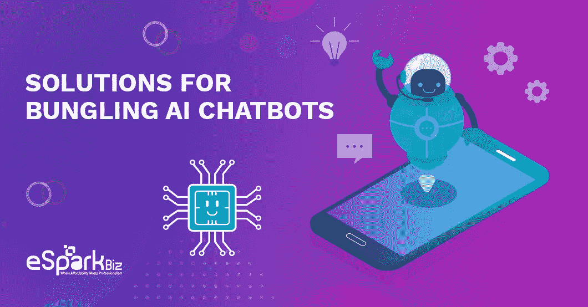
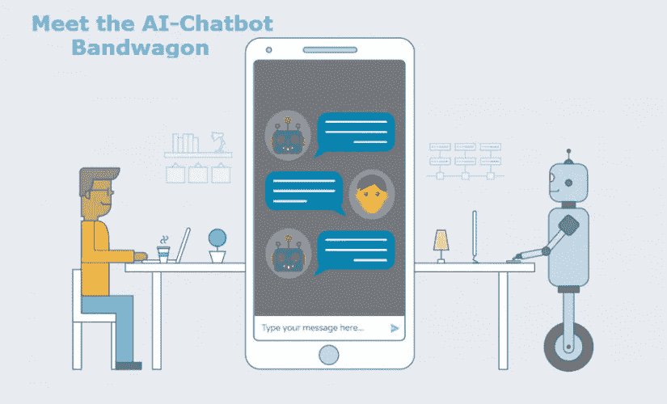
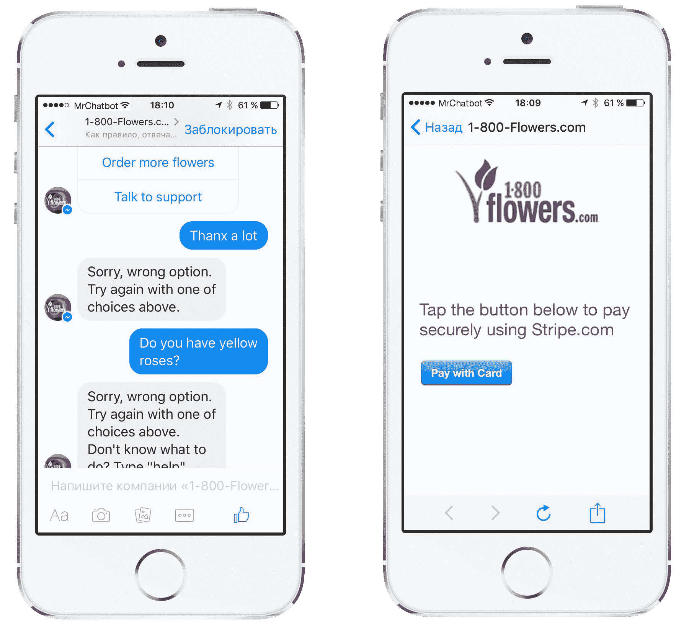

# 当 AI 聊天机器人出错时该怎么办？

> 原文：<https://medium.com/hackernoon/what-to-do-when-ai-chatbots-get-it-wrong-9c343be876c2>

AI Chatbots

今天，每个人都很兴奋，因为人工智能终于在世界上获得了突出的地位，这是因为进步的[人工智能/人工智能开发公司](https://www.esparkinfo.com/ai-ml-development-company.html)。

在某些时候，网上购物者必须面对一些真正不理智的聊天机器人，除了行为不端和炫耀自己的智力外，他们不知道自己想要什么和需要什么。

糟糕的聊天机器人给顾客的印象是，它们是为了削减客户服务成本而创造的；然而，为什么会出现这种情况呢？

尽管人工智能(AI)无疑每天都在变得更好，但我们的机器人朋友，即聊天机器人技术，在实用性和良好的判断力方面仍然存在真正的不足。因此，聊天机器人完全准备好加入并融入人类社会还需要一段时间。

**以运行中的聊天机器人的查询为例:**

> “服装放不进黑色的包里，因为它太大了。什么太大了？”

服装，很明显，因为如果包太大，句子就会失去意义。

尽管如此，聊天机器人仍然尽最大努力去理解这种语言。

***下面是另一个无效数字助理的例子:***

> "市政当局拒绝给这些积极分子发放通行证，因为他们担心会发生流血事件。"普通人很容易理解，城市市政当局害怕流血，而不是抗议者；然而，聊天机器人很难搞清楚这一点。

聊天机器人一般都非常擅长统计分析；但话说回来，这种深思熟虑的智力对他们来说并不自然。此外，通过统计分析来设计这种解释和语言敏感性是具有挑战性的。

## 虽然本质上很笨，聊天机器人并不是垃圾

尽管聊天机器人基本上是愚蠢的，但它们不能被剥夺其建设性的潜力。

商业机构可以利用它们赚很多钱。此外，企业需要他们重组和现代化他们的客户服务部门，使其更加有效和简单。

例如，实时聊天的工作示例；由于它的即时响应(只有聊天机器人才能做到)，它非常受欢迎。

## **为什么客户更喜欢实时聊天？**

通常，当客户遇到问题时，他们希望问题得到及时解决；典型的人性。消息统计显示，一般来说，客户不喜欢等待回复超过 60 秒。

因此，聊天机器人并非完全没有意义，可以有效地用于提供快速响应和简单的解决方案。

人们对聊天机器人的一些赞赏包括:

1.  他们太友好了！感觉你在和一个真正的朋友聊天。
2.  聊天机器人让购买体验更加愉快。
3.  聊天机器人提高了我产生利润的机会。
4.  事实证明，聊天机器人对我的公司来说非常划算。

## **聊天机器人失败的好理由**

*以下是聊天机器人令顾客失望和恼怒的一些原因:*

*   倾向于做出糟糕的决定
*   犯愚蠢或粗心的错误
*   给出愚蠢或不恰当的回答
*   缺乏常识
*   无法清晰思考
*   不善于聪明地行动
*   被突如其来的意外询问弄得不知所措的行为
*   看起来不真实或者不自然
*   显示出缺乏自然或自发性
*   展示计算机生成的人类动作或行为
*   假装彬彬有礼
*   不要看重上下文
*   不要承认人类的失误
*   看错了买主

## 聊天机器人和他们的酷把戏

有了聊天机器人，必然会有:

*   对简单问题的回答
*   将预设短语插入消息应用程序

帮助聊天机器人交流的程序是决策树逻辑的结果；并且总的来说，不适合各种各样的对话。

***下面是整个事情的运作方式:***

例如，你有一个聊天机器人，希望把衬衫挂起来出售，而买家要求看到裙子，机器人会安排它可怜的默认消息，如“对不起。我不明白。没有什么比收到预先加载的回应更能让你热血沸腾的了。

## **聊天机器人放弃销售**

没有什么比一个廉价愚蠢的聊天机器人更能破坏潜在买家的热情了。

一个人想要为一个特定的产品付费，甚至定位该公司的机器人并向其发送消息以启动与该企业的通信。

但是，如果在买家与一家公司的首次接触中，聊天机器人管理不善，把事情搞得一团糟，那么跨国公司一秒钟前，由于没有大脑的聊天机器人，未能抓住一个完全合适的买家。

## **笨拙聊天机器人的不愉快事件**

没有什么比和一个笨拙的聊天机器人打交道更让人紧张的了。

这些难以处理的情况出现是因为这些聊天机器人的开发者没有足够努力或者没有时间让它们变得更聪明。

许多聊天机器人的对话都很好，但当机器人开发者在构建过程中不太注意细节时，会出现一些尴尬的情况。

更重要的是，这些笨拙的机器人及其令人不安的交易会对公司的交易和销售产生负面影响。

## **聊天机器人如何浪费商业资金**

与有能力的聊天机器人开发者签约是解决这些困难的一种方法。

聊天机器人的设计者应该足够谨慎，首先测试它，并确保他们选择了最好的和适当的关键字来触发某些响应。

***决策树逻辑是这样运行的:***

*   特定的短语或关键字会触发聊天机器人的响应。

这意味着，如果开发人员没有投入足够的时间，将精确的单词触发器插入到机器人的智能中，它将保持简单。和一个简单的聊天机器人交谈是没有意义的。

事实上，简单的聊天机器人可能会导致公司亏损。

> **也可阅读:** [**创建 Whatsapp 聊天机器人的有效方法**](https://chatbotsjournal.com/lets-explore-the-most-effective-ways-to-create-whatsapp-chatbot-f64eb5970c2f)

## **聊天机器人的感知和信息有限**

聊天机器人的信息在范围、领域或应用方面受到限制，因为它们的意识受到控制。

以 Facebook Messenger 聊天机器人为例；它只会收集与特定交互相关的用户数据。

*不考虑以下情况:*

*   如果每个访问者定期在特定网站停留
*   什么样的事情会吸引一个人的注意力
*   产品对用户的吸引力有多大

这是一个挫折，因为买家通常更喜欢个性化的报价。那么，在消费者对聊天机器人几乎一无所知的情况下，聊天机器人将如何为他们提供个性化服务呢？

鉴于聊天机器人不知道用户的喜好和厌恶，因此他们不能定制他们的消息。公众喜欢收到定制的报价，上面有他们的名字、购买历史等。因此，这对聊天机器人开发者和企业来说都是一个棘手的问题。

## **高估了人工智能机器人的收益前景**

有大量流言称，人工智能聊天机器人主要是机器人，可以进行高级和高于平均水平的互动和思想交流。

机器人有自己独特的特征和行为，它们的脸要么像人，要么像机器人。

这种可能性的强化主要是由于 NLP 引擎的雄心勃勃和一心一意的商人想要宣传这种新的和有前途的但尚未完全成型的技术。

尽管如此，贸易和工业还是希望在聊天机器人中获得真正的情报。这是企业不合理和不公正的期望，因为这是一项处于早期阶段的新生技术。

## **错误的培训方法**

人工智能机器人需要训练，以达到商定的熟练标准。

这里的训练意味着给聊天机器人提供帮助，以便它能够提高识别意图和运行对话的上下文的能力。

实际上，系统管理员(或 NLP、会话专家等)

*   应该重新评估故障转移
*   丰富 NLP 引擎中的规则，以提高对用户意图的识别

那是死循环。

一个选择是有一个好的语料库对话来训练你的 NLP 引擎进行相关的对话，另一方面，用户不会开始和你的聊天机器人说话，直到它处于良好的状态。因此，你无法对对话有个大概的了解。

## **那么，我们有什么选择呢？**

事实上，有两种可能性:

*   接受高级工具和流程
*   远离使用人工智能聊天机器人

## **让 AI 机器人训练过程更令人向往**

现在，人工智能机器人训练程序可以以更好的方式进行改进，而不必等待有影响力的公司带来最新的解决方案或在数据科学上进行不合理的投资，方法是:

从一开始就利用你与终端客户的所有对话来训练你的 NLP 引擎。

无论你有什么(通话记录、邮件对话或对你的 FB 的 live agent 的查询)，任何东西都可以用来在零日之前训练你的 NLP。

**b)** 如果历史对话的主体不可用，则可以使用实时代理，他们将跟踪已定义的对话脚本。

当给予足够的训练后，可以一点一点地获得自动反应。

**c)** 当意图未被认可或客户对回应不满意时，立即联系现场代理。

这种技术可能很昂贵，但对用户来说是令人满意的，并且不像公开的流程-首先公开你的 AI 机器人，一旦它加速了就训练它。

> **又读:** [**医疗保健中的聊天机器人**](/@eSparkInfo/chatbot-technology-in-healthcare-optimizing-the-patients-health-df47321f059d)

## **升级 NLP 引擎**

NLP 引擎也将开始改进。

**比如:**

*   当系统中的意图数量在上升时，NLP 引擎必须帮助排除和支持一般的拼写错误(现在不是这种情况)。

此外，他们应该从系统中的所有对话中(而不仅仅是单个帐户中)找出并了解；此外，他们可以就机器人中缺少的内容提出建议。

NLP 引擎之间的不同，尤其是英语，更是无处可寻；从 NLU 的角度来看，它们看起来一样。

## 拥有人工智能聊天机器人是必要的吗？

许多客户期待并坚持聊天机器人的专业服务，如:

*   预约
*   付钱买票
*   下订单
*   在餐馆等预定座位。

他们不期望聊天机器人参与各种对话。

***比如:***

当你进入一家超市时，你期待与他们的店员讨论人工智能吗？答案很可能是否定的。

聊天机器人也有类似的情况。

如果聊天机器人在你的组织中不是必不可少的，那么你可以安全地远离它们。

## **英语和西欧语言的 NLP 就足够了**

NLP 引擎在很大程度上受市场需求和语言特性(它是结构化的)的控制。

此外，还有一些用于其他语言的 NLP 引擎，或者它们无法访问。例如，乌克兰语没有 NLP 引擎。

在用一种特定的语言构建聊天机器人之前，有必要先仔细研究这种语言。从一开始就拥有足够数量的对话(用那种语言)来训练机器人是一个重要的标准。

如果缺乏对话数据，就不提倡使用人工智能聊天机器人。如果一个人继续，尽管没有会话数据，这将导致不愉快的经历和时间和金钱的滥用。

因此，如果某种语言的大量对话不可用，那么要么应用上述程序，要么不要用该语言构建 AI 聊天机器人。

## **聊天机器人必不可少的时候**

有些时候，你的聊天机器人必须配备人工智能。例如，在聊天机器人界面不提供任何按钮的情况下。WhatsApp 和 SMS 就是最好的例子。在这里使用聊天机器人是不可避免的。

当大量内容必须传递给最终用户时，聊天机器人最好有按钮和独特的对话。例如:一个大的 FAQ 需要这样的聊天机器人。

# **结论**

AI 成长已经到了顶点；如果明智地实施，聊天机器人开发可以是一大幸事。