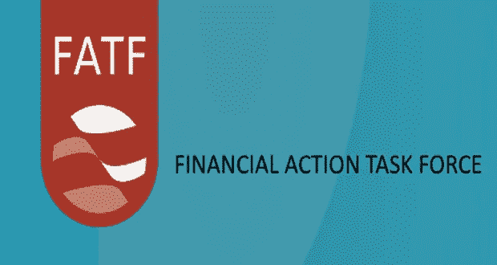
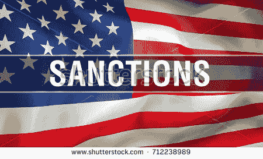
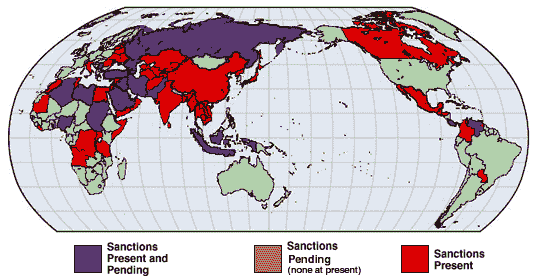
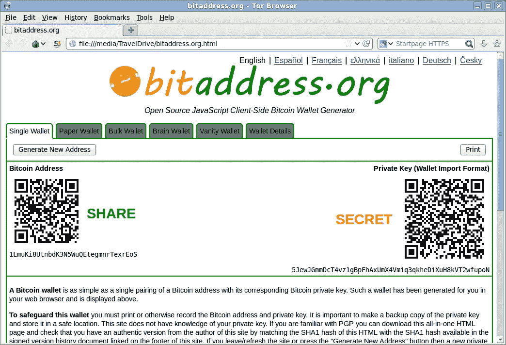

# 对新 FATF 密码准则有什么期待？

> 原文：<https://medium.com/hackernoon/what-to-expect-from-the-new-fatf-crypto-guidelines-f21b82531875>

FATF(金融行动特别工作组)最近发布了一套适用于加密部门的新准则，主要涉及虚拟资产和虚拟资产服务提供商。但是，让我们来理清一些事情，否则这些事情可能会有点混乱，并且在加密社区中已经产生了某种程度的警报。

## **什么是 FATF**

该金融工作队是由当时的七国集团各部于 1989 年创建的，目的是制定标准并促进实施法律、监管和业务措施，以打击洗钱、资助恐怖主义和其他对国际金融体系完整性的相关威胁。**FATF 不是一个立法机构，它没有具有约束力的监管权力，因此它仅仅是一个****的“决策机构”，致力于产生必要的政治意愿，在这些领域实现国家立法和监管改革*。它的*准则*就是那个，*准则*，也就是说它们既不是法律也不是法规，在成员国在国家管辖范围内通过和实施之前，对任何人都没有约束力。*

***然而，FATF 的力量不可小觑**。事实上，不遵守其准则的会员国可能会被列入黑名单，因此在与传统金融体系内的其他国家交往时会受到更严格的控制。*

*目前，只有伊朗和朝鲜这两个国家被列入黑名单，而其他一些国家正受到密切监控，其中包括巴拿马、叙利亚、巴哈马、巴基斯坦和突尼斯。自 1989 年以来，由于一些附属组织，FATF 已发展成为一个由 38 个成员国组成的网络，覆盖全球 200 多个管辖区。它的影响无疑是全球性的。*

## ***建议和准则***

*FATF 通过发布一套建议和随后的解释性准则来运作。最新的一组建议于 2012 年发布。然后，每当出现新的发展时，就有必要定期根据新的发展重新解释这些建议。因此，定期发布新的解释指南。2019 年 2 月，发布了一份解释性说明，该说明随后在 2019 年 6 月成为最终版本，当时发布了这套[新指南](http://www.fatf-gafi.org/media/fatf/documents/recommendations/RBA-VA-VASPs.pdf) —涉及 VA 和 VASPs。*

## ***背景—虚拟资产和虚拟资产服务提供商***

*这套新指南适用于 VAs 和 vasp，因为它们在之前的 2018 年 10 月指南中已有定义。*

*简单回顾一下， ***虚拟资产* *是价值的数字表示，可以进行数字交易或转移，并可用于支付或投资目的*** 。该准则不包括法定货币的数字表示，如电子货币或稳定硬币，以及安全代币或其他金融工具已经涵盖在其他地方的建议。加密货币——如 BTC、ETH 或 XMR——和各种类型的非安全代币都在指导方针的范围之内。*

*就公用代币而言，似乎使准则适用或不适用的决定因素——根据第 47 段——是代币是否可转让、可交换、可替代。事实上，FATF 澄清说*它并不寻求涵盖* ***不可转让、不可交换和不可替代的闭环项目类型****…例如航空里程、信用卡奖励或类似的忠诚度计划奖励或积分、* ***，这些项目不能在二级市场上出售。****

***虚拟资产服务提供商**是指从事以下一项或多项业务活动的自然人或法人:*

*I)增值和法定货币之间的兑换；*

*ii)不同增值业务之间的交换；*

*iii)增值服务的转让*

*iv)保管和/或管理增值服务或能够控制增值服务的工具*

*v)参与和提供与发行人发行和/或销售增值服务相关的金融服务。*

*上述定义的范围足以涵盖交换和转账服务、钱包提供商、保管服务(如托管钱包或保管或控制他人的增值服务、钱包和/或私钥的服务)以及 ICO 的金融服务提供商。*

*但这还不是全部。可能包括托管服务，如涉及智能合同技术的服务，当提供服务的实体对资金进行托管时；促进增值服务发行和交易的经纪服务；订单簿交换服务，将买卖双方的订单汇集在一起，通常通过使用买卖订单匹配引擎，使用户能够找到交易对手、发现价格并进行交易；以及高级交易服务，例如保证金交易或基于算法的交易。*

## *【VASPs 将如何受到指南的影响*

*该指导方针尤其更新和影响了现有的**建议。10 和 16** 。*

*根据 Nr 10，VASPs 应出于反洗钱/反恐怖融资目的对客户进行尽职调查的门槛**降低到仅 1.000€乌尔/美元的转账，而不是适用于法定转账的正常的 15.000€乌尔/美元**。*

*在 Nr 下。16 转让方的 VASP 必须识别和收集转让方的所有个人信息，并与受让方的 VASP 共享。受让方的 VASP 也应如此。**基本上，转账双方都必须被识别(就像银行电汇一样)**。*

## ***评论和实用性***

*坦率地说，我不理解上述条款背后的基本原理，这些条款大多不可执行，几乎没有实际用途，不会对反洗钱/反恐怖融资活动产生不利影响，但会增加合规成本、不必要的文书工作，并可能减缓将实施这些条款的国家/地区的加密部门的发展。*

***当—基于事实—** [**秘密洗钱仅占全球每年 2 至 4 万亿美元非法洗钱问题的 0.081%时，降低 15 倍的*临时* VA 交易门槛如何有效打击洗钱？**](/@andreabianconi/https-medium-com-an-biconi-reading-between-the-lines-of-lagarde-s-blog-e0f8905fbd76)*

*这就像通过禁止放屁来减少全球二氧化碳排放量一样。*

*此外，你如何实际识别非托管 BTC 地址的受益人？(即某人私下持有钥匙的新地址，而不是在交易所或经纪人或保管人处的地址)。不会吧。*

*此外，这一规定将鼓励通过非托管钱包进行点对点转移，这使得当局更难跟踪和控制(如果不是不可能的话)。例如，我可以将资金从交易所发送到一个非保管钱包(在那里我控制私钥)。然后，我可以从那个钱包里把硬币送到不同的交易所，两个平台都不会看到交易的双方。*

## ***结论***

**

*courtesy of shutterstock.com*

*除非你认为 FATF 的工作人员在密码相关问题上非常无能，那么唯一可以得出的结论是，实施不切实际和不可执行的指导方针的真正原因在别处。*

*这是想破坏这个部门吗？或者，这可能是一个笨拙的尝试，以加强传统金融行业对加密领域的控制，就像他们对 T4 臭名昭著的比特许可证所做的那样？*

**

*Practically, the US are — more or less — in bad terms with more than two thirds of the world*

*或者，这可能是美国领导的一项举措，让受制裁的国家(如中国、俄罗斯、中东大部分地区、半个中南美洲、半个非洲大陆，可能很快还有欧盟)通过使用密码而不是美元来规避制裁变得更加麻烦？*

*我问:*崔最烦*？*

*时间会证明一切。*

*幸运的是，真正去中心化的区块链(像 BTC)也是因为同样的原因而诞生的:抵制审查，有弹性，没有失败的中心点。*

**

*[US Treasury Secretary Steve Mnuchin put his weight behind the FATF guidelines released in June 2019](https://home.treasury.gov/news/press-releases/sm713)*

*现在，FATF 可以将违规国家的金融机构列入黑名单。但是，将 VASP 列入黑名单实际上会达到什么目的呢？让我们假设某个国家没有实施这些指导方针。还假设 FATF 将 X 国的加密交换列入黑名单。*

*黑名单只能适用于遗留金融体系内的金融机构之间的法定交易，这些交易将受到更多审查。这将影响那些想将法定资金转移到该交易所的投资者。*

**

*A non-custodial BTC address and its public and private keys*

*但如上述示例所示，它不会影响点对点密码传输，也不会阻止您和任何其他个人和企业将密码从任何非托管地址传输到此类黑名单交易所，而不管制裁/黑名单。反之亦然。*

*一如既往，得出自己的结论。*

*********************************************************************

****如果你喜欢这篇文章，请在左下角“鼓掌”x 次，这样它就会被更多的人分享。非常感谢****

*区块链# bianconiandrea # crypto # think block tank # FATF #比特币#洗钱#恐怖分子融资*