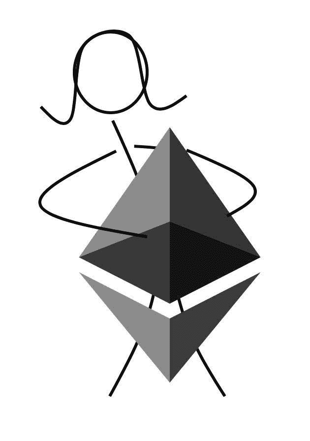
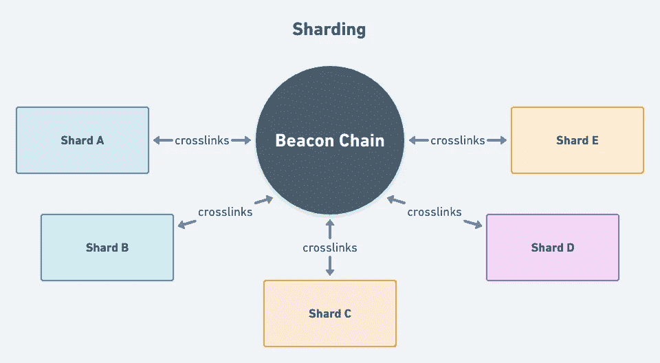
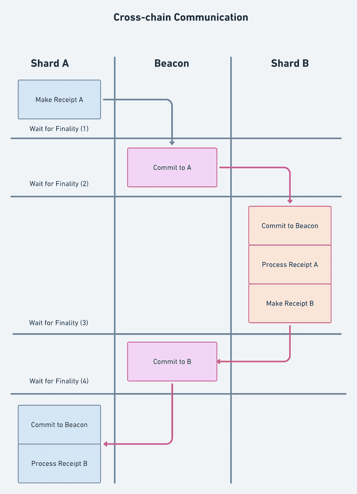
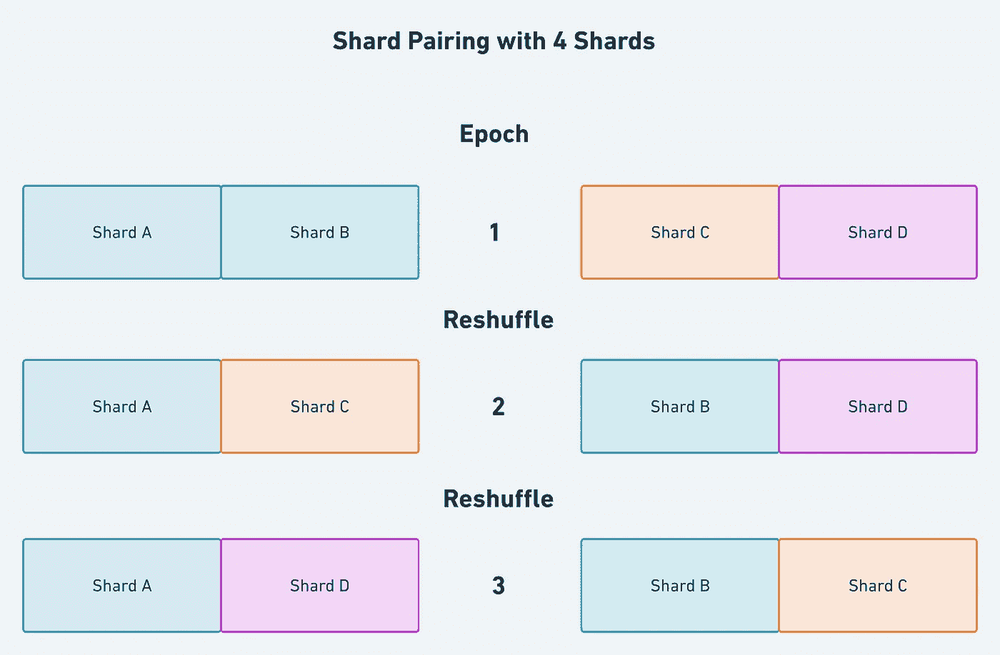

# 当 ETH 怀孕的时候会期待什么

> 原文：<https://medium.com/hackernoon/what-to-expect-when-eths-expecting-80cb4951afcd>

# ETH2.0 工程师指南

*Special thanks to* [*Nic Carte*](https://twitter.com/nic__carter)*r for this ridiculous image which he made in PowerPoint.*

## 什么是 ETH2.0？

ETH2.0 是以太坊的计划替代品。在接下来的几年里，ETH2.0 的设计者打算完全包含以太坊的共识系统和状态。由于范围如此之广，我们无法准确地说出 ETH2.0 将包括或不包括什么。我们确实有一些规范，也有相当多的团队在研究早期的实现。在这一点上，ETH2.0 设计者初步计划包括分片、Casper、state rent 和一个 eWASM VM。初始客户端测试正在进行中，一个功能轻的 ETH2.0 测试网预计将在三个月内(Q1 2019)推出。起初，ETH2.0 将从主以太坊链中获取其以太(但不是其安全性)，但设计者最终计划通过将 ETH2.0 作为主链，而将以太坊 1 作为主链来反转这种关系。x 在其管理下的碎片链。

## 那么这对工程师来说意味着什么呢？

如果你是一名 Solidity 或 Dapp 开发人员，希望部署 ETH2.0 智能合约，预计会有很多变化。ETH2.0 是以太坊的完全替代品，将改变我们在编写智能合约时做出的许多假设。其计划的多年分阶段推出更像是一个产品发布周期，而不是一个升级周期。**我们为 ETH1 编写的** **工具和合同。x 可能需要为 ETH2.0 完全重新设计和重写。为了帮助启动这个项目，我想讨论一下当前的路线图，并涵盖一些工程上的分支。**

# 分阶段推出

目前，[分片路线图](https://github.com/ethereum/wiki/wiki/Sharding-roadmap#phase-0-pos-beacon-chain-without-shards)(兼作 ETH2.0 路线图)列出了七个阶段。只有[阶段 0](https://github.com/ethereum/eth2.0-specs/blob/master/specs/core/0_beacon-chain.md#proposer-slashings-1) 有一个充实的规范，它接收[定期更新](https://github.com/ethereum/eth2.0-specs/commits/master/specs/core/0_beacon-chain.md)。[第一阶段的规格](https://github.com/ethereum/eth2.0-specs/blob/master/specs/core/1_shard-data-chains.md)不太精确，而且[似乎还没有在积极开发中](https://github.com/ethereum/eth2.0-specs/commits/master/specs/core/1_shard-data-chains.md)。在第一阶段之后，路线图变成了目标列表，而不是技术文档。例如，在第二阶段，路线图链接到[ethreseear . ch](https://ethresear.ch/)的次数是 github 的三倍。因为任何更远的事情看起来都像是推测而不是工程，所以我们的具体讨论仅限于阶段 0、1 和 2，并且我们已经包括了后面阶段的可能方向的几个粗略轮廓。

# 阶段 0 —信标链

阶段 0 引入了“信标链”ETH2.0 的设计者希望信标链成为 ETH2.0 生态系统的中枢，成为所有其他碎片的安全性和有效性的根源。一旦部署完毕，信标链将使用友好的终结性小工具 Casper(“Casper FFG”)运行利害关系证明。信标链的早期迭代被设计为尽可能简单，这就是为什么阶段 0 将不支持智能合同、账户、资产转移，并且将不包括任何碎片。信标链上的以太不能在链上转移，这意味着用户不能将它存放在交换中。

## 贝丝:新以太

Beacon ETH (BETH)是一项新资产，仅由 Beacon 链上的利益相关者(“验证者”)使用。它是通过两种方法创建的:1)作为对验证信标链(以及第 1 阶段后的碎片)的奖励，以及 2) BETH 可以由任何 ETH1 以 1 ETH 购买。x 用户通过一个 [ETH1。x 合同](https://github.com/ethereum/beacon_chain/blob/master/contracts/validator_registration.v.py)。合同称之为“押金”工程师可能会注意到，合同没有撤销功能。这是因为在阶段 0 中没有办法从信标链中撤回 BETH。也就是说，一旦存放在 ETH1 中。x 验证器注册契约。乙醚被有效地燃烧。Beacon chain 验证器监视该合同，并将存款信息提交给 beacon chain，后者将向存款人发放新的 BETH。因此，我们希望在 ETH 发送到验证者注册合同后不久，新的 BETH 将在信标链上发布。对存款的临时审查是可能的，但根据卡斯帕的规则，永久审查不太可能发生。

信标链上的以太传输直到第二阶段才会被允许，我也不相信会有什么办法把 BETH 移回 ETH1。x 直到 1。x 完全被折叠进了碎片生态系统。鉴于第 0 阶段尚未完成，也没有可靠的第 1 阶段规范存在，假设 BETH 将作为独立且不可转让的资产存在至少两年似乎是合理的。一旦第二阶段完成，贝丝将可以在碎片间来回转移；然而，ETH 不会。这不太可能造成重大的经济困难。过去，像 BETH 这样的预发布和低功能令牌一直通过借据在交易所交易。例如，在 Tezos 众筹期间推出的 HitBit 和 BitMEX XTZ 期货市场。如果对 BETH 有需求，我们应该期待看到一个充满活力的交易所生态系统，支持托管 BETH 交易和赌注。然而，对贝丝的需求似乎值得怀疑。贝丝做了一个糟糕的投资，因为从 ETH 到贝丝的单向挂钩给贝丝一个 ETH 的价格上限。也就是说 BETH 永远不会比 ETH 更值钱，但会更不值钱。

# 阶段 0+ —打桩

用户可以在信标链上下注 32 BETH 来成为验证者。在阶段 0 中，验证器将只管理信标链。从第一阶段开始，验证者还将管理 1024 个碎片链。信标链(和每个碎片链)将使用卡斯帕 FFG 来完成块。FFG 是一个利害关系算法的证明，对链停止和审查等不良行为实施利害关系削减。敏锐的读者会注意到 FFG 的堂兄 Casper CBC 在切分路线图的“以太坊 3.0”部分——同时对 FFG(当然还有 CBC！)不在本文讨论范围之内，我推荐阅读[维塔利克关于混合动力 PoW/FFG 的笔记](https://vitalik.ca/files/casper_note.html)，他在[发表的关于最低苛刻条件的中型文章](/@VitalikButerin/minimal-slashing-conditions-20f0b500fc6c)和 [FFG 的论文](https://arxiv.org/abs/1710.09437)。

## 赌注登记者做什么？

分片旨在跨节点分割(分片)状态信息，而不要求任何节点拥有网络的全貌。因此没有验证器会验证所有的碎片。相反，信标链将协调所有其他碎片的验证，并且所有验证器将验证信标链。每个时期(64 个块或大约 6.4 分钟)，信标链将[洗牌，验证器](https://github.com/ethereum/eth2.0-specs/blob/master/specs/core/0_beacon-chain.md#get_shuffling)和[将它们分配到一个碎片](https://github.com/ethereum/eth2.0-specs/blob/master/specs/core/0_beacon-chain.md#get_shard_committees_at_slot)。分配给一个碎片的一组验证者被称为委员会。委员会的目标是 128 名成员。在阶段 0 中，这意味着每隔 6 分钟，信标链将选择可用的验证器来形成接下来 6 分钟的委员会。在第一阶段，信标链将为 1024 个碎片中的每一个任命一个验证委员会。精确的方法是复杂的。它涉及[多阶段随机数生成](https://github.com/randao/randao)流程以及[可验证延迟功能](https://blog.trailofbits.com/2018/10/12/introduction-to-verifiable-delay-functions-vdfs/)以进一步挫败操纵委员会选择流程的企图。

ETH2.0 随机选择委员会，并经常轮换委员会，因为他们的工作非常重要。委员会负责维护其碎片的安全性、活性和完整性，并证明信标链上的碎片状态。这是信标链了解碎片状态的唯一方式，反之亦然。从所有的验证者中随机选择他们可以最小化委员会作为一个整体撒谎或欺骗的机会。轮换他们通常是为了减轻一个糟糕的委员会可能造成的伤害。换句话说，恶意或利润最大化验证者应该很难使用委员会选择作为攻击网络任何部分的工具。此外，如果他们偶然获得一个碎片委员会的控制权，他们将控制它不超过 64 个街区。

## 工程师的利益证明

同时记录了 ETH1 和。x 的工作证明和 ETH2.0 的利益证明是一个正在进行的过程，值得注意的是，一些 PoW/PoS 特性的差异确实会直接影响工程师。例如，虽然 PoW chains 支持[无状态 SPV 证明](/summa-technology/cross-chain-auction-technical-f16710bfe69f)和[nipo PoW](https://nipopows.com/)-远程状态汇总跟踪，但 PoS 禁止任何低状态通信。主观性阻止了状态光证明。换句话说，利害关系证明上的远程状态证明将包含与 PoW 无状态 SPV 证明大致相同的数据量，但需要对整个 PoS 历史进行事先验证。相反，无状态 SPV 证明不需要其他信息来验证。这意味着，在主观的风险证明环境中，跨碎片或跨链应用程序减少了功能，增加了开销。

# 第 1 阶段—分片

第一阶段的目标是对碎片链的内容达成共识，而不是对它们的意义达成共识。换句话说，这是分片结构的一次试运行，而不是尝试使用分片进行扩展。信标链将碎片链块视为没有结构或意义的简单比特集合。碎片链还没有账户、资产或智能合约。由信标链在每个时期为每个分片随机选择的分片确认器，仅仅就每个块的内容达成一致。只要所有委员会达成共识并定期更新碎片上的信标链，碎片块中出现什么信息并不重要。

碎片验证器通过一个称为交联的过程来证明碎片的内容和状态。简而言之，委员会必须在信标链中包含关于碎片(比如 Merkle 根)的可验证信息。在阶段 2 或以后，交联将支持跨碎片通信。一旦信标链从多个委员会接收到给定交叉链接的准确性的证据，信标链可以相信交叉链接是碎片的真实表示，而无需验证整个碎片。如果委员会在交联的有效性上意见不一，显然有一个委员会是有问题的，应该被砍掉。这是所有碎片安全性的根源:验证器的不当行为最终会被信标链发现并惩罚。

第一阶段没有什么特别有趣的东西。从根本上说，这是交联的引导阶段，也是碎片引用信标链的对称机制。设计者似乎对这些机制的工作很有信心。主要的未决问题围绕着规范和实现策略。考虑到阶段 0 已经花了大约一年多的时间来达到一个合理的规范水平，我认为阶段 1 也需要同样长的时间。有趣的是，阶段 0 的实现与规范同时发生。即使在今天，离 testnet 还不到三个月，阶段 0 规范也在定期变化。这意味着未来的 ETH2.0 阶段在开发时间上会有非常大的差异。虽然乐观主义者告诉我六个月，但很容易看到在阶段 0 进入测试后，阶段 1 需要 12-18 个月的开发。

# 第 2 阶段—智能合同

第二阶段最终带来了一个类似我们熟悉的以太坊的系统。随着阶段 2 的发布，碎片链从简单的数据容器过渡到结构化的链状态。此时，BETH 将变得可转让，智能合同将被重新引入。每个碎片将管理一个基于 [eWASM](https://github.com/ewasm/design) 的虚拟机(我们称之为“EVM2”)。我们希望 EVM2 支持账户、契约、状态和其他我们从 Solidity 中熟悉的抽象概念。然而，大量的幕后变化很可能会打破大多数现有的工具。幸运的是，eWASM 团队已经为 solc、truffle 和 ganache 做了一些基础工作。在第二阶段的 testnet 之前或期间，我们可以期待看到大多数熟悉的工具被移植来支持 EVM2。

第二阶段很可能包括的州租金，对当今的固体工程师提出了一些有趣的挑战。州租金不是能够无限期地存储代码和数据，而是要求合同开发者和用户随着时间的推移为 EVM2 存储付费。通过确保未使用的信息随着时间的推移从状态中消失，这可以防止状态膨胀。目标是让用户，而不是整个节点，来支付状态的开销。许多不同的[车型](https://ethresear.ch/t/improving-ux-for-storage-rent/3994)被[提名](https://ethresear.ch/t/improving-the-ux-of-rent-with-a-sleeping-waking-mechanism/1480)，还没有明确的赢家。

有趣的是，随着[一些以太坊升级计划](https://ethereum-magicians.org/t/ethereum-1-dot-x-a-half-baked-roadmap-for-mainnet-improvements/1995)和[著名以太坊核心开发者](https://twitter.com/5chdn/status/1067179157682036738)的推荐，州租可能是不同路线图中唯一的重叠。因此，我强烈建议计划在当前部署的合同上支付州租金，并设计未来将州租金传递给用户的模型。我们不知道国家租金的精确设计，但我们应该计划成本。

除此之外，我们不知道第二阶段会发生什么。它仍处于非常早期的研究阶段，包括几个主要的未解决的问题。鉴于非正式的规范和开发过程，以及第二阶段相对于第一阶段的扩展范围，认为第二阶段可以在 2020 年之前启动似乎是不合理的。也就是说，虽然 ETH2.0 可能会在今年推出，但至少在 2020 年之前，不要指望 ETH2.0 支持资产转移或智能合约。

# 阶段 3 —离线状态存储

现在，为了更多地讨论智能合约，我们将几乎完全跳过第 3 阶段。第 3 阶段通过尽可能多地移出链来最小化链上状态。链不是存储整个状态，而是存储一些状态信息和一个聚合器(聚合器是代表长数据列表的短数据；Merkle 树是一种聚合器)。用户将负责存储完整的离线状态。当用户希望与状态交互时，他们会在事务中包含当前状态的证明。这样，运行验证节点的资源需求可以低得多。已知几种具有不同属性和性能特征的聚集器设计，但是没有选择任何方法。在这一点上，我们不再能够利用链上通信来协调用户，所以我们必须计划通过一些其他系统来同步状态。事件对这里的工程师变得不那么有用，因为链不再保证数据的可用性。在阶段 3 中，维护和检索链外状态将成为 dapps 的关键设计约束。

# 第 4 阶段—分片合同

然而，一个不可克服的问题仍然存在:尽管 ETH2.0 契约将像以太坊契约一样强大，但它们被绑定到单个碎片，并且永远不能与另一个碎片上的契约直接交互。这是分片的直接后果。分片的目标是在分片之间分离状态，而不需要直接了解其他分片。它通过拆分状态和最小化任何验证器上的负载来实现缩放。直接的互动需要直接的知识。根据设计，一个碎片不直接了解其他碎片。它只能通过信标链的交叉链接来了解其他碎片。因此，每当我们想要跨 shard 交互时，我们必须等待信标链。具体来说，这意味着如果 SafeMath 部署在 Shard A 上，Shard B 上的用户要么必须等待访问它，要么在 Shard B 上部署一个新的 SafeMath。

像 SafeMath 这样的简单工具将被部署到每个分片上——1024 个分片上有 1024 个 safe math——但是像 Maker 或 Compound 这样的市场呢？#DeFi 对可组合金融的承诺变得难以跨越碎片边界。开立 CDP 和收到 DAI 之间的长时间延迟会导致不可接受的财务损失。如果市场变动，CDP 在用户收到 DAI 之前被清算，该怎么办？在实践中，这可能意味着用户将在包含引人注目的智能合同的每个分片上拥有帐户，跨分片组合将完全丢失。只有当 Maker 和 0x 都部署在同一个分片上，并且 0x 用户在该分片上也有资产时，它们才能交互。

## 基本权衡:同步还是规模

ETH2.0 的设计者不知道跨分片通信系统会是什么样子。通过阅读许多提案，似乎在即时反馈和可预测性之间存在着根本性的权衡。分片的本质是无法改变的:用户无论如何都必须等待跨分片通信。然而，我们可以在每个分片上紧密或松散地耦合事务的本地和远程执行阶段。

紧密耦合将等待放在第一位。在碎片通信之前，事务什么都不做。相反，我们可以通过现在执行一部分，以后再执行一部分来松散地耦合事务。事务在本地分片上执行，然后在跨分片通信后在远程分片上执行。松散耦合向用户展示了更好的一面。他们立即看到事务的本地执行，并知道远程执行将在未来的某个时间发生。不幸的是，如果不等待，他们无法知道松散耦合事务的远程阶段的结果。紧密耦合的事务更容易预测。用户更了解结果，因为远程状态不会在本地和远程执行阶段之间转换。然而，紧耦合要求用户在看到任何结果之前等待。

我们对 ETH2.0 的通信模型知之甚少。我们知道，它无法在不牺牲几乎所有伸缩优势的情况下提供跨分片契约调用。如果你在这里停止阅读，我不会责怪你，因为第 4 阶段只有一个[思维导图和一些模糊的链接](https://github.com/ethereum/wiki/wiki/Sharding-roadmap#phase-4-cross-shard-transactions-see-here-and-more)。一个不明显的结果是，在第 4 阶段之前，ETH2.0 不会为复杂的智能合约系统提供显著的扩展优势。在此之前，希望与其他契约交互的契约必须共享一个碎片，并且受限于该碎片的速度和规模。我们预计，与 ETH1.X 相比，shards 最多只能实现较小的常数因子加速。这意味着，在第 4 阶段发布之前(可能在 2020 年代中期),几乎没有理由迁移智能合约代码或用户，因为优势很小。同时，为了更好地理解工程师和 dapp 用户之间的权衡，我研究了几个提议的模型，并在这里做了简短的描述。我认为这些都不会被采用，但我相信它们对理解所涉及的权衡是有帮助的。再说一遍:**下面的一切都是推测性的。**

## 基本模型:收据和证明

所有形式的跨链通信都利用信标链。因为信标链提交所有碎片的状态，并且每个碎片提交信标链的状态，所以我们可以将其用作碎片链生态系统中的中枢。从一个链到另一个链的消息在某种意义上必须通过信标链。我们不想发送完整的消息，因为这需要信标链自己处理每个事务，完全抵消了伸缩的好处。

相反，每当 Shard A 上的用户或合同想要与 Shard B 交互时，我们让 Shard A 生成一个带有消息的“收据”。Shard A 在其块头中提交其所有收据。信标链等待 A 完成，然后提交给 A 的头(包括提交给接收)。碎片 B 必须等待信标完成，然后提交信标报头。一旦发生这种情况，就可以向 B 提交一个新的交易，包括收据和证明。证据表明，收据包含在 A 中，A 包含在信标中，信标包含在 B 中。这样，B 上的契约可以信任从 A 发送的消息。如果 B 上的契约想要发送回响应(可能是返回值，或者错误)，我们以相反的方式重复整个过程:碎片 B 制作收据，最终找到返回碎片 A 的路。

很容易理解为什么这个过程需要时间。沟通的四个步骤都需要等待几分钟才能完成！不幸的是，我们无法完全避免等待。如果我们想确定远程状态，那么我们必须等待每一步的终结。往返通信的最佳情况是四个终结周期。也就是说，用户在三个周期后获得了信心，因为用户可以在碎片 A 看到它们之前看到碎片 B 的收据。对于 ETH2.0 的 6.4 分钟的 epoch 长度，用户必须等待 19 分钟才能看到结果，26 分钟才能获得结果。

## 具体收据:碎片之间的令牌迁移

ERC20 代币的多功能性使得它们在今天的以太坊中无处不在。然而，ETH2.0 给令牌带来了一些逻辑问题。因为智能合约管理所有令牌余额，并且该智能合约仅存在于单个碎片上，所以来自碎片 A 的令牌在碎片 b 上根本不存在。然而，通过一些巧妙的跨碎片通信，我们可以在几个碎片上部署相同的令牌，并允许在碎片之间迁移令牌，从而有效地在令牌合约之间建立双向联系。

这个方案非常简单:在部署我们的令牌(让我们称之为“酷的跨碎片令牌”或“CCT”)时，我们将使用 ERC20，并添加两个小的功能:`migrateSend`和`migrateReceive` 。我们将让`migrateSend`焚烧代币，并生成收据。收据将包括燃烧的代币数量和接收碎片。我们将让`migrateReceive`确认收据，并铸造相同数量的 CCT。然后，我们将在每个分片上部署相同的令牌契约。现在，我们可以通过在一个碎片上调用`migrateSend`来刻录令牌，然后在另一个碎片上调用`migrateReceive`来铸造令牌。我们需要在每个分片上重新部署我们的令牌契约，但这似乎是值得的。迁移是单向的，至少需要两个终结期的跨片通信。所以在我们调用`migrateSend`之后，大约 10 分钟后我们的 CCT 才能在接收碎片上使用。

## 猛拉

收据是跨碎片传递信息的一种通用方式。我们可以在收据中放入几乎所有的连锁信息。这包括整个智能合约。 [Yanking](https://ethresear.ch/t/cross-shard-contract-yanking/1450) 是一个通过在收据中包含合同代码和存储来跨分片迁移合同的提议。契约将从碎片 A 中被删除(“强拉”)，然后在收据到达碎片 B 后被重新部署。一旦在 Shard B 上，它可以直接与 Shard B 的契约进行通信，并与 Shard B 的状态进行交互。它甚至可以被拉回到碎片 a。

这将允许任何智能契约与任何其他智能契约进行通信(在跨碎片等待时间之后)。不幸的是，因为收据包括整个合同及其所有存储，所以移动大的或受欢迎的合同成本会很高。当收据在运输途中时，合同是完全不可用的。它已被从碎片 A 中拉出，但尚未到达碎片 B。这意味着所有其他用户都被锁定在该合同之外，直到它到达碎片 B。即使这样，只有已经在碎片 B 上的用户才能与之交互。因此，拉取最适合用户少的小合同。它使紧密耦合的执行成为可能，但远不是一个通用的解决方案。

## 碎片配对

从这里开始，我们转向更具异国情调的建筑。收据旨在使异步(松散耦合)通信成为可能。然而，我们可能也想要同步通信。为此，我们必须更有创造性。碎片配对是一个简单的设计，它让我们以最小的代价获得紧密耦合的执行。

分片配对是一个简单的方案。在这篇文章的[的第三段中描述，我们在每个高度将碎片混洗成同步对。每当一个分片与另一个分片配对时，任一个分片的用户都可以在它们之间执行紧密耦合的状态更新。这意味着，如果碎片 A 和 B 在高度 7 处配对，则 A 和 B 的所有验证器必须知道 A 和 B 的所有状态，并且碎片必须一起前进，否则根本不前进。在这个模型中，如果您需要在 A 和 B 之间进行跨链交易，您将等待 A 和 B 被随机配对。维塔利科描述了 100 碎片的情况。对于 1，024 个碎片，我们预计需要 512 个块—大约一个小时—但因为配对是随机的，所以可能需要更长或更短的时间。正如 Vitalik 所指出的，当你想要与多个碎片交互时，这种方法的伸缩性很差。](https://ethresear.ch/t/synchronous-cross-shard-transactions-with-consolidated-concurrency-control-and-consensus-or-how-i-rediscovered-chain-fibers/2318/8)

## 碎片区域

这是配对的一个更广泛的版本。每个时期我们将碎片分成几个由多个碎片组成的“区域”。区域必须同步进行，这意味着区域中的所有碎片一起更新它们的本地状态。通过同步进行，区域提供了碎片之间的自由移动以及与区域中任何契约的直接交互，但是对于与区域之外的任何碎片的通信没有优势。此外，因为区域要求验证器知道区域中所有分片的状态，所以它们否定了分片的许多伸缩优势。如果一个区域由 16 个碎片组成，我们牺牲了大约 15/16 (=94%)的规模优势，而只获得了整个网络的 15/1，024 (=1%)的执行紧密耦合。

## 财产留置权

跨碎片(和跨链)通信的一个不明显的特性是，用户对消息的信任比所涉及的链更快。爱丽丝，从碎片 A 发送 5 个贝丝到碎片 B，知道她一发送就到了。看到发送的 Bob 知道，只要发送在分片 A 上完成，BETH 就会到达分片 B。但是，分片 B 及其合同必须等待几分钟，信标链才能在分片 A 完成时完成。这意味着一个成熟的乐观钱包可以在碎片 a 上花费资金后立即在碎片 B 上接受和花费资金。换句话说，Bob 将从 Alice 在碎片 B 上的钱包中取出一张[可执行的欠条](https://ethresear.ch/t/encumberments-instant-cross-shard-payments-over-slow-cross-shard-base-layer-communication-as-a-layer-2/4369)，因为 Bob 高度相信 Alice 已经发送了足够的 ETH 来支付它。如果夏德 B 有足够多的用户愿意观察夏德 A，接受标准化的借条，那么夏德 A ETH 可能在发出后很快就可以在夏德 B 上消费。然而，当应用于智能契约时，这种方案变得异常复杂，因为状态是不可替换的，并且状态的借据是不可能的，所以它不适合一般的交互。这意味着我们应该将阻碍视为松散耦合中的 UX 改进。它允许松散耦合来模拟某些事务的快速执行的紧密耦合。

## 脱离共识和状态

一个更加复杂和刺激智力的可能性是[共识过程将从状态更新过程](https://ethresear.ch/t/synchronous-cross-shard-transactions-with-consolidated-concurrency-control-and-consensus-or-how-i-rediscovered-chain-fibers/2318)中分离出来。今天，以太坊矿工和完全节点只有在执行了块中包含的所有状态更新之后才接受块。不一定是这样的。相反，它们可以接受阻塞，但稍后更新状态。在这种情况下，我们不会像在以太坊中那样就系统状态达成共识，而是会就所有碎片上所有交易的总历史(或“总订单”)达成共识。这样做意味着每个分片可以快速添加块，而不需要知道任何其他分片的状态，这就是分片产生伸缩优势的方式。然而，事务对碎片状态和整个网络的影响只有在所有碎片都完成后才能知道。换句话说，状态的终结落后于分片内容的终结。

从用户的角度来看:我们会立即提交事务，我们知道它们包含在内，但是我们必须等待确定事务的结果。随着碎片的终结，我们逐渐获得了更多关于状态的信息，但是在所有碎片都终结之前，我们不能完全确定。与担保权类似，在某些情况下，用户可能在交易链开始之前就确定交易的结果，并据此采取行动。

# 结论和工程方向

ETH2.0 将是一个与以太坊完全不同的系统。它们将并行存在数年，并具有非常不同的特性集。在不久的将来，可以预期从 ETH 到 BETH 的单向挂钩。如果你运行一个交换或托管服务，考虑你如何能支持贝丝托管交易和赌注之前，你的用户是可转让的链。从长远来看，考虑一下你的智能契约将如何适应有和没有跨分片通信的分片。最重要的是，密切关注研发过程。ETH2.0 是一个复杂且不断发展的系统。所有 dapp 工程师都需要对 ETH2.0 计划和进度有清晰的理解。

*詹姆斯·普雷斯特维奇(*[*@ _ 普雷斯特维奇*](https://twitter.com/_prestwich) *)是一名工程师，也是一名库里发烧友。他是 Summa 的创始人，Summa 是链上和跨链金融服务的领先提供商。*

*详情请访问*[*summa . one*](https://summa.one/)*，或通过 team@summa.one 联系我们*