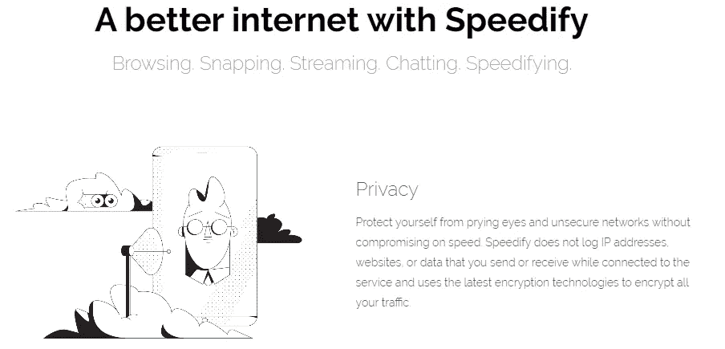

# 关于数据记录，哪些 VPN 服务没有告诉您

> 原文：<https://medium.com/hackernoon/what-vpn-services-arent-telling-you-about-data-logging-4ce15e4c90f0>

你能想到任何流行的 VPN 服务前面没有一个大的“禁止登录”标签吗？

老实说，我想不出任何这样的 VPN。虽然一些提供者确实遵循了严格的无日志规则，但情况并非总是如此，许多提供者虚假地宣称他们避免任何形式的数据日志记录。

这就引出了一个问题:谁能确定一个 VPN 提供商的所有声明都是真实的呢？这不是一个容易回答的问题。

我可能正走上一条死路，试图找到这个问题的答案，但回顾多年来的几十项 VPN 服务，让我了解到一些提供商为了自己的利益而经常采用的操纵策略。

是时候解决房间里这只奇特的大象，让它在 VPN 行业的走廊里漫步了。

呼吸新鲜空气不会伤害任何人。

# VPN 日志记录的真相(或者说半真半假)

在市场营销中，利用模糊信息来影响消费者行为和促进销售的情况屡见不鲜。VPN 行业对这些策略并不陌生。这在 VPN 提供商用来描述他们对日志的立场的语言中表现得最为明显，在大多数情况下，这些语言只是半真半假。

由于 VPN 有需求的一个主要原因是它们能够向用户提供在线隐私，所以诸如“零日志服务”这样的短语被显著地写在 VPN 的主登录页面上。

大多数用户没有意识到的是，这些短语并不准确。事实上，VPN 提供商利用了这样一个事实，即像“数据记录”这样的广义短语根据上下文可以有多种含义。

你看，每次你连接到互联网，VPN 服务提供商可以看到一堆关于你的信息。这可能包括也可能不包括您的 IP 地址、DNS、带宽使用、连接时间戳，甚至您正在访问的网站。简而言之，服务提供商可以维护几十种不同类型的用户详细信息日志

如果你想快速查看不同提供商保存的日志类型，你可以查看这个有用的 [VPN 比较](https://www.vpnranks.com/vpn-comparison/)表。您可以看到，并非所有 VPN 公司都保留相同的用户相关数据日志。

在一个公平的世界里,“零日志记录”一词在逻辑上意味着提供商不保留任何类型的日志，无论它是否包含用户正在访问的设备、他们的网络活动、IP 地址、他们的姓名、地址、出生日期、婚姻状况、宗教、爷爷最喜欢的雪茄、你的猫的第一个孩子的名字等信息。

I name thee: Rollin’ furball

但是 VPN 服务的官方网站上的首页标语经常忽略这些细微差别，并且关于他们的登录策略的笼统声明很少准确地表示他们的实际策略。

事实上，关于 VPN 提供商的隐私政策的更详细的声明经常与 VPN 的宣传页面和广告中不小心做出的“不记录”声明相矛盾。

我联系了安全研究员 [x0rz](https://twitter.com/x0rz) ，请他发表评论，他对网络上流行的隐私和网络安全问题有着敏锐的眼光，他精辟地总结了这个问题:

> “零日志”这个术语经常会引起误解。VPN 服务器很可能会保留某种日志(如果您使用默认的 OpenVPN 服务器，您将获得连接/断开的日志)，这可能是出于技术原因(您需要知道谁在连接什么以防止滥用)，也可能是出于合法原因(在某些国家可能是强制性的)。他们可能指的是“流量日志”，但即使是这个术语也是模糊的，如果他们不提供技术工具来实现隐私(例如，带有内核模块以防止恶意系统管理员滥用的“盲操作员模式”)就没有任何意义。我希望在 VPN 提供商中看到更多的透明度。这是信任的问题。”

公平地说，你不能责怪 VPN 服务保留某些类型的日志。没有任何数据记录，就不可能运行软件服务、正确管理软件服务和解决客户查询。正如 x0rz 准确指出的，从技术上来说，完全避免伐木行为是不可能的。

然而，当 VPN 公司真的懒得解释“无日志”服务的真正含义，并且实际上利用用户的无知来假装他们不是的东西时，问题就出现了。

现在让我演示一下 VPN 公司关于日志记录的声明是如何误导人的。

# speed ify——关于日志的矛盾说法？

Speedify 是一家总部位于美国的 VPN 服务公司，除了其他服务之外，它还把自己标榜为在线隐私解决方案。

提供商在其主页上明确提到*“…不记录你发送或接收的 IP 地址、网站或数据…”*

你只需要打开隐私政策[页面](https://speedify.com/privacy-policy/)，就能立即看到声明中的矛盾之处，并且让你惊愕的是，提供商确实保留了 IP 地址日志:

在同一页面上，提供商有一个突出显示的声明，内容如下:

好吧，现在事情越来越清楚了。事实证明，Speedify 确实**不会**跟踪**你的网络活动**或你访问的网站的 IP 地址**。首页声称*“Speedify 不记录 IP 地址”*实际上是指网站 IP 地址，而不是用户/设备/客户端 IP 地址，这实际上是由提供商存储的**，如上面带下划线的红色高亮显示。****

**由于记录你的 IP 地址很容易将你的隐私置于风险之中，Speedify 并不是真正的“零日志”提供商。**

**这就是我所说的 VPN 公司编造的半真半假和含糊不清的陈述，最终误导了客户。**

**完全有可能的是，提供商并不打算纵容，而这种含糊不清只是懒惰的结果。但不管怎样，他们确实应该因为缺乏专业精神而受到指责。**

# **le VPN——没有日志记录……还是有？**

**Le VPN 是另一个犯有类似误导的 VPN 服务。该提供商毫不避讳地将*“无日志”*作为其显著特征之一:**

****

**但是如果你深入挖掘并打开隐私政策[页面](https://www.le-vpn.com/vpn-terms-of-use/)，你会发现当你连接和断开与他们的 VPN 服务器的连接时，乐 VPN 会保存**时间戳**和 **IP 地址日志**:**

****

**“没有记录日志”的说法到此为止。**

**同样，值得一提的是，提供商给出了他们需要保留这些日志(出于管理目的)的合理理由，但这些人肯定可以简单地写下“无流量日志”，而不是在主页上提到的功能列表中笼统、明确的术语“无日志”。**

# **VPN 日志策略实际上应该是怎样的**

**正如我之前提到的，如果你正在寻找一个不保留任何日志的 VPN 服务，那么恐怕你找不到。但我们能够并且应该努力找到的是一种至少不存储用户任何个人身份信息的服务。**

**因此，缩小术语“零日志”的确切含义是有意义的，我建议的定义是:**

**“零日志服务不保留用户的任何个人身份信息”。**

**根据这个定义，VPN 行业的情况并不完全令人沮丧。有一些 VPN 提供商信守承诺，保证用户隐私的安全。**

**激发对 VPN 日志策略信任的第一件重要事情显然是提供商声明的一致性。也就是说，就个人可识别信息而言，如果“无日志”宣传标签实际上得到隐私政策声明的证实。**

**如果 VPN 提供商没有在宣传页面中故意使用模糊的语言，并且隐私声明与正在记录的数据类型的明确披露一致，那么我会认为该 VPN 公司值得信任。**

**这种 VPN 服务的最好例子是 ExpressVPN。如果该提供商保证不保留日志，其隐私政策也支持这一说法:**

****

**事实上，该公司是塞翁失马焉知非福的受益者，因为它的服务器被调查俄罗斯大使安德里·卡尔洛夫遇刺案的土耳其机构查封。该机构有情报称，嫌疑人利用 ExpressVPN 删除了关于暗杀的罪证。**

**调查人员在 ExpressVPN 的服务器上没有发现任何可操作的信息，这证明该提供商确实没有记录用户活动或其他可能被用来暴露他们身份的信息。**

**虽然如果这项服务实际上被用来破坏调查是非常不幸的，但同时它也证明了 ExpressVPN 通过避免保留潜在的暴露用户日志来保护用户隐私。**

**透明度和诚实营销的另一个很好的例子是一个小的 VPN 提供商:Anon.AF，它刚刚在 VPN 行业站稳脚跟。**

**该提供商将“零流量日志”作为其核心价值观之一:**

****

**请注意这里使用的术语“流量”。事实是，很快。AF 保留 IP 地址和时间戳，因为它是一项基于法国的服务，并受法国法律的约束。**

**但关键是，提供商不会保留**的流量日志**，也不会承诺更多。**

**这本身就非常让人放心，说明提供商其实是尊重用户的。事实上，他们会深入细节，进一步明确他们实际记录的内容和不记录的内容:**

****

**令人耳目一新的是，看到一家提供商做出改变，不再围绕模糊的促销语言来编织网站，而是通过故意避免令人困惑的复杂使用条款来保持网站的简单。**

**我希望更多的 VPN 提供商从 Anon 那里得到启示。并努力达到这些人令人钦佩的诚实透明的水平。**

# **最后的想法**

**数字技术革命对现代生活产生了许多重要影响。虽然没有任何论点可能怀疑世界正在享受的技术带来的好处，但它对我们隐私的影响可能是我们被迫处理的不太理想的副产品之一。**

**VPN 服务正在进行一场艰苦的战斗，从政府机构和公司的魔掌中夺取一些对隐私的控制权，并把它还给用户。**

**但是，只有真诚地致力于满足用户的需求，并采取透明诚实的政策，我们才能希望站在大众一边的人，而不是占统治地位的少数人赢得这场战斗。**