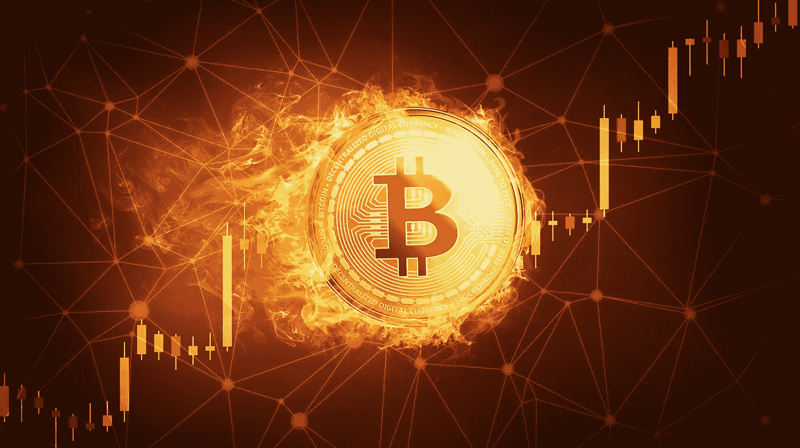

# 2140 年挖矿奖励结束，比特币上链 TX 费用会是多少？

> 原文：<https://medium.com/hackernoon/what-will-bitcoin-on-chain-tx-fees-be-in-2140-when-mining-rewards-end-62035a99b6c>

比特币挖矿刚开始的时候，挖矿奖励是每块 50 BTC。随后，BTC 降至 25，BTC 降至今天的 12.5。奖励减半将持续到大约 2140 年，届时奖励将完全停止，所有 21，000，000 个比特币都将流通。

一旦奖励停止，矿工将完全从 TX 费用中获得报酬。这也是为什么小型住宅支持者如此强烈地支持增加 TX 费用的原因之一。如果没有费用，网络就没有安全性。

但如果比特币块大小永远保持在 1 MB，这实际上意味着什么？

## 假设

为了开始寻找一个数字，必须对 2140 年的采用情况做出一些基线假设:

*   加密货币将在全球范围内完全取代法定系统。
*   比特币的统治地位将保持不变。
*   TX 费用将 1:1 取代 block 奖励。

我们不会对通货膨胀做任何假设，因为我们只关心相对价值，我们也不会试图估计未来改进的任何好处，如 Schnorr 签名。

## 2140 年比特币市值和价格

根据美国中央情报局的数据，世界上大约有 80 万亿美元的货币，其中大部分是美元。如果我们假设 100%转换为加密货币，目前[比特币的主导地位](https://coinmarketcap.com/charts/#dominance-percentage)为 55.2%，**比特币的市值将达到 44.16 万亿美元**。

这意味着，假设 2100 万枚比特币都完好无损，1 BTC 的基准价格将为 2102857 美元。[估计](http://fortune.com/2017/11/25/lost-bitcoins/)认为如今所有比特币中有高达 23%丢失，而且这个数字只会继续增长。假设损失 50%，每 BTC 的基准**价格将为 4，205，714 美元**。

## 比特币市场上限与区块奖励比率

比特币工作保障证明背后的基础是经济。随着市值的增加，作为奖励的硬币的价值也会增加。因此，网络的安全性反映的不是一个不变的价格，而是一个比率。

目前的比特币市值为[145，979，300，090 美元](https://coinmarketcap.com/)，每块总奖励约为[109，206 美元](https://bitinfocharts.com/comparison/bitcoin-transactionfees.html)。这给出了每个区块 1，336，733:1 的**比率，或每年 3，662:1**。

## 比特币交易费用计算

把这些放在一起。44.16 万亿美元的市值和 1，336，733:1 的每块比率将产生 33，035，767 美元的每块 TX 费用奖励**。使用当前平均每块 [2，500](https://www.blockchain.com/en/charts/n-transactions-per-block) 笔交易，得出平均每笔交易的费用为……(鼓声)……**13，214 美元！****

这一估计是基于菲亚特 80 万亿美元的财富。如果你把财富从衍生品转移到加密市场，这又是一个 120 万亿美元的巨大数字。考虑到投机和波动性，它实际上可能会高得多。

如果你喜欢这个，请考虑给它一些掌声。

**不要见外。通过关注我的**[**Twitter**](https://twitter.com/jordan_mack)**保持联系。**