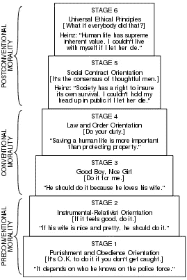
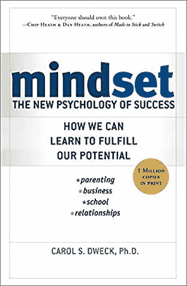
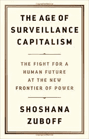
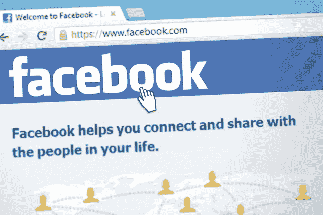

# 监控资本主义和社会领域的下一步是什么？

> 原文：<https://medium.com/hackernoon/whats-next-for-surveillance-capitalism-and-social-domains-123bc83a6706>

## 心理学家对数字隐私侵犯为何、如何以及何时困扰我们的观点

基于他的实地工作，世界著名的人类学家 Richard Shweder 发现社会是由三种伦理构成的:**自治，社区**和**神性。自主在很大程度上关系到我们的个人领域:我们如何构建自己的个性，如何管理自己的思想和感情。公共领域包含了保持我们的社会平稳运行的社会规范(在道路的右侧行驶，避免时尚失礼，等等)。).最后一个领域，神性领域涉及宗教和道德信仰和仪式。**

Examples of moral reasoning at each of Lawrence Kholberg’s stages of development.

这一理论被用来理解道德发展是如何以及何时发生的。像劳伦斯·霍尔伯格这样的心理学家通常认为，儿童是依次发展这些道德规范的。首先，一个孩子的是非感取决于一个行为是否会使他们受益(“自主”)，然后他们会基于社会习俗发展是非感(它是合法的还是非法的？；“社区”)，直到最后，他们基于后传统的关注点(法律是正义的吗？，“神性”)。然而，埃利奥特·图里尔和拉里·努奇在指出这些领域的顺序发展是错误的之后，发展了社会领域理论——即使是小孩子也明白 Shweder 的领域确实是不同的。他们通常理解用手吃饭在道德上没有错(但人们认为这很奇怪)，他们穿的内衣的颜色不关任何人的事，即使规则允许，不请自来的伤害也是错误的。个人领域不会随着时间的推移而变得无关紧要，神性领域也不一定是终极目标。

这三个社交领域经常毫无问题地相交(即，我们认为我们应该控制谁可以访问我们的日记，这得到了道德信仰的支持，即某人未经允许阅读我们的日记是错误的)。但有时这些领域相互摩擦，产生摩擦，并引起人们注意不同领域可能需要不同的行动过程。这往往反映在社会进步的漫长而缓慢的舞蹈中，在这种舞蹈中，社会习俗与道德问题对立，隐私有时与政府监管存在争议。

对于这三个社会领域来说，数字权利是一个相对较新的领域来解决他们的管辖权问题。当我与许多人谈论围绕监控资本主义的问题时，出现了一个主题:人们是否发现它有问题，在多大程度上，以及为什么，没有真正的共识。一些人采取了强硬的新自由主义立场:这是一种精明的商业模式，一个人从用户自愿放弃的数据中赚钱有什么错？其他人对此感到困扰，但无法指出原因。少数人愤怒或恐惧，害怕某种算法法西斯主义。还有一些人很务实:我没有什么好隐瞒的，我喜欢我得到的服务——所以我为什么要在乎呢？不同的观点往往植根于对不同领域的更大关注，也许是对监控资本主义的基本支撑问题缺乏明确性。

## **为什么隐私领域很重要**

Carol Dweck’s seminal book about growth versus fixed mindsets, and perceived control over achievements.

自主被认为与一个人的身份感有着错综复杂的联系。也就是说——没有解释或控制周围环境的能力，就不清楚自我可能意味着什么。心理学家倾向于想当然地认为拥有自主权是健康心理功能的必要组成部分。事实上，“习得性无助”或慢性“外部控制点”(两者都指一种持续的感觉，即一个人无法控制自己生活的结果)会导致抑郁。斯坦福大学心理学家卡罗尔·德韦克(Carol Dweck)将这一概念推广为“心态”，并发现固定的心态往往会阻碍成就——她最显著的发现发生在学术表现上。当人们感到他们在控制时，他们会更好地控制。这一切和隐私有什么关系？

隐私是自主权得到保证的领域。甚至当当局要求我们穿制服时，我们通过选择穿什么内衣(或不穿)来保持我们的自主权！).“这不关任何人的事”很快传达了一个信息，即一个人可以控制他们生活的那个方面。在[接受拉里·努奇](https://anchor.fm/amber-cazzell0/episodes/Stupid-Rules-Social-Domains-and-Moral-Development-with-Larry-Nucci-e4crhb)采访时，他甚至提到，在独裁统治下或在死亡集中营工作的人以最小的方式来区分彼此——例如，在他们的制服上打一个额外的细丝结。这让他们在过多的外部力量造成的身份危机中获得了某种程度的理智和尊严。

Click image to listen to Larry Nucci’s interview

当谈到在监督资本主义的背景下理解这一领域时，一个重要的问题是企业是否会潜在地破坏我们的自我意识。如果是，又是如何做到的？对监视资本主义感到特别沮丧或害怕的人发现脸书的大规模情感实验令人不安。脸书臭名昭著的情绪传染研究表明，他们可以操纵大量用户感到更快乐或更悲伤。部分原因是情绪和想法通常被认为是隐私的核心。没有人可以操纵我们的思想和感情，这为我们创造了一个缓冲区，让我们考虑我们在这个世界上的反应和互动。

Book which coined the phrase “surveillance capitalism”

最重要的是，大型科技公司在行为矫正方面有既得利益，这种情况让大多数人感到不安。哈佛商学院名誉教授、《监控资本主义的时代:在新的权力前沿为人类未来而战》一书的作者 Shoshana Zobhoff 指出，大型科技公司会根据人们最有可能购买商品的心情来选择投放广告的时间。当我们的情绪被操纵，我们的购买或投票行为被操纵——在我们不知情的情况下，什么是自主，什么是自我？自我是否以一种有意义的方式存在？监视资本主义的业务一直是悄悄修改我们的私人思想和情感——让我们感觉像自己的那部分。

## **为什么社交圈很重要**

许多心理学家称人类为“超社会物种”我们比地球上任何其他动物都更合作。我们有共同的道路，我们有礼貌，我们有装配线。我们彼此依赖，这是前所未有的。这些关系是使我们成为人类的一个重要方面。“归属需求”是人类最基本的需求，还有像住所和睡眠这样的需求。正如臭名昭著的米尔格拉姆电击实验和大学欺凌仪式所证明的那样，这并不总是一件好事。

然而，正如自主性一样，社会性是健康功能的一部分——抑郁的人往往会退出社交互动，包括社交媒体。隔离的经历是极其负面的——从长期单独监禁的后果可以看出这一点。神经成像研究也显示了归属感需求的强度，该研究揭示了孤独激活大脑活动的区域与经历身体疼痛的区域相同。

这种极端的社会性需要协调，有时是以法律的形式，但往往是以默契的规范的形式。我们可以看到，许多规范都是为了促进网络社交而发展起来的。一个是，我们现在通常都是先有身份，而不是像 90 年代那样使用奇怪的把手。参加聚会的人通常会查找房子的方位，而不是主人给被邀请者指路。如果你和同事一起做一个项目，你发一封电子邮件。如果你正和朋友一起喝咖啡，你就发短信。

当谈到监视资本主义时，一个重要的考虑因素是人们是否使用大型技术作为寻找社会归属感的途径。看来，至少在社交媒体的情况下，答案肯定是肯定的。在许多其他情况下，答案也可能是肯定的(如上面提到的电子邮件和导航规范)。如果大技术是获得社会归属感的途径，我们必须问个人在多大程度上被迫接受点击包装服务条款。简而言之:如果一个人不同意服务条款，他们在多大程度上牺牲了社会资本？在我看来，这应该表明一个人同意被数据挖掘的程度是被迫的，因此是非法的。

## **为什么道德领域如此重要**

在监控资本主义的背景下，道德领域取决于一个重大技术权利和用户伤害的问题。如果大型科技公司无法挖掘数据，会给企业带来什么后果？如果用户停业，他们可能会失去这些服务。当然，看起来大型科技公司可能会遭受重大损失，除非他们能够重新设计他们的盈利模式(要么通过服务收费，要么通过无针对性的广告，要么通过媒体合作等)。).沉重的监管似乎对这些创新的大公司及其股东“不公平”，他们只与许多随时可以自由离开的用户签订所谓的持续“同意”合同。另一方面，有人可能会问，基于什么样的道德基础，他们有权垄断人际网络效应，或者即使有合同也有权侵犯隐私？

在这种情况下，道德领域似乎在很大程度上回应了社会和隐私领域。把一个人对隐私的渴望和对社交的渴望对立起来可以吗？如果不是，破坏企业家的不朽成就可以吗？

# **现在怎么办？**

任何在之前看过[我的博客的人都知道我对分散化技术有强烈的偏好。网络去中心化将决策权交还给所有利益相关者。你可以决定谁能拿到你日记的钥匙。**你可以决定与谁分享你的数据——在你和他人之间没有垄断。**我认为分散化技术是唯一能够防止隐私和社交领域之间出现两难局面的技术。](https://hackernoon.com/@ambercazzell)

我正在用[时代](https://era.eco/#step1)构建去中心化网络的平等主义基础设施。*如果你喜欢这篇文章，如果你为它鼓掌，分享它，并在*[***Twitter***](https://twitter.com/ambercazzell)*上与我联系，这将意味着很多！也可以订阅* [***看***](https://www.youtube.com/playlist?list=PL-UMfJVuezk-YgNUNSgpv-fE6q5Qjokdp) *或者* [***听***](https://open.spotify.com/show/3e3030cJwqwKa2A4UzBwnK) *到我的播客！*