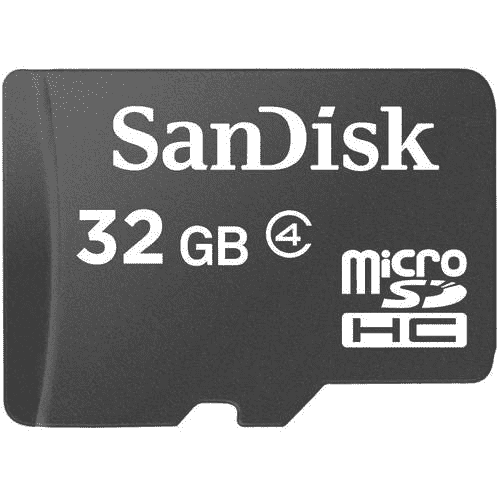

# SD 和 Micro SD 存储卡有什么区别？

> 原文：<https://medium.com/hackernoon/whats-the-difference-between-sd-and-micro-sd-memory-cards-dba4ff23c4f1>

存储卡用于扩展手机、单反、Dash cam、无人机和其他电子产品的存储容量。通常我们把存储卡称为 SD 卡。但其实我们所说的并不准确，存储卡有很多种类型，SD 卡只是其中一种，还有一种是 Micro SD 存储卡(TF 卡)。那么 TF 卡和 SD 卡有什么区别呢？下面的解释会给你一个思路。

# 1.SD 卡和 Micro SD 卡的尺寸差异

Micro SD 卡和 SD 卡的大小差别很大。简单来说，SD 卡更大，Micro SD 卡更小。SD 卡的具体尺寸是 24 mm x 32 mm x 2.1 mm，而 TF 卡是 15 mm x 11 mm x 1 mm，因此，称手机 SD 卡的内存卡是不准确的。其实就是一个 Micro SD 卡，也简称 TF 卡。

# 2.它们的应用是不同的

[批量 SD 卡](https://www.hugdiy.com/detailed-explanation-of-the-knowledge-about-sd-cards-sd-minisd-microsd-sdio-b-179)的意思是安全数字卡，其工作原理是基于半导体闪存。而且 SD 卡的起源更早，是上世纪末研发的成果。TF 卡的全称是 T-Flash 卡，是内存卡的一种。使用的内存技术是相对较新的 NAND MLC。TF 卡是 2004 年推出的，比 SD 卡晚了 5 年左右。

SD 卡通常用于数码相机、婴儿监视器或掌上电脑。因为是闪存，所以可以用来存储文件，类似 u 盘。但是，您需要使用读卡器来读取或写入普通桌面上的 SD 卡。SD 存储卡是一个完全开放的标准(系统)，多用于 MP3、数码摄像机、数码相机、电子书、AV 设备等。，尤其广泛应用于超薄数码相机。

微型 SD 卡是一种非常小的闪存卡。这是一种用于手机、GPS、仪表盘摄像头、无人机和其他数字设备的存储卡。这种格式是 SanDisk 发明的。 [Micro SD 卡](https://www.hugdiy.com/blog/micro-sd-card-c-3)的设计基于 SD 架构。大小差不多有一个指甲盖那么小。

它的前身是 Trans-flash 卡，SDA 协会于 2004 年底正式更名为 Micro SD 卡。在推出 Micro SD 之前，手机厂商使用的是嵌入式内存。尽管这些模块易于安装，但它们不能满足当前趋势的需求——容量有限。手机已经没有升级空间了。然后 Micro SD 模拟 SIM 卡应用模式；这意味着同一张卡可以在不同类型的手机上使用，这样手机制造商就不必再担心插件 R&D 的设计了。

# 3.最大容量不同

在存储容量方面，SD 卡和 TF 卡也有一些区别。具体来说，我们在市面上能找到的 SD 卡容量小至 128MB、256MB、512MB 等。，最大容量高达 512GB 和 2TB。但由于体积的限制，TF 卡的最大容量只能达到 512GB。

# 4.安全技术是不同的

安全技术方面，SD 卡上有一个保护开关，而 TF 卡没有那个锁。而且现在的 SD 卡已经开发出了极限高速卡，而 TF 卡还没有。

SD 卡最大的特点就是加密功能可以保证数据的安全性和保密性。它还具有版权保护技术，使用的版权保护技术是 DVD 中使用的 CPRM 技术(可记录媒体内容保护)。SD 卡具有体积小、容量大、抗震、耐高温、性能稳定、数据存储永久有效、无噪音、无寻道错误等特点。这是一种流行的存储卡。SD 卡连接到标准 ATA IDE 接口。作为标准的 IDE 存储设备，也可以存储软件安装程序。

不过，虽然 SD 卡和 TF 卡有很多区别，但本质是一样的——都是存储卡。如果要分别选择这两类存储卡的话，那么相机里经常用 SD 卡，dash cam，手机，GPS 用 TF 卡。如果要考虑购买的成本，可以选择 TF 卡，因为 TF 卡可以用 SD 适配器转换成一张 SD 卡，但是 SD 卡不能变成一张 micro SD 卡。所以相对来说，TF 卡更经济，更灵活。