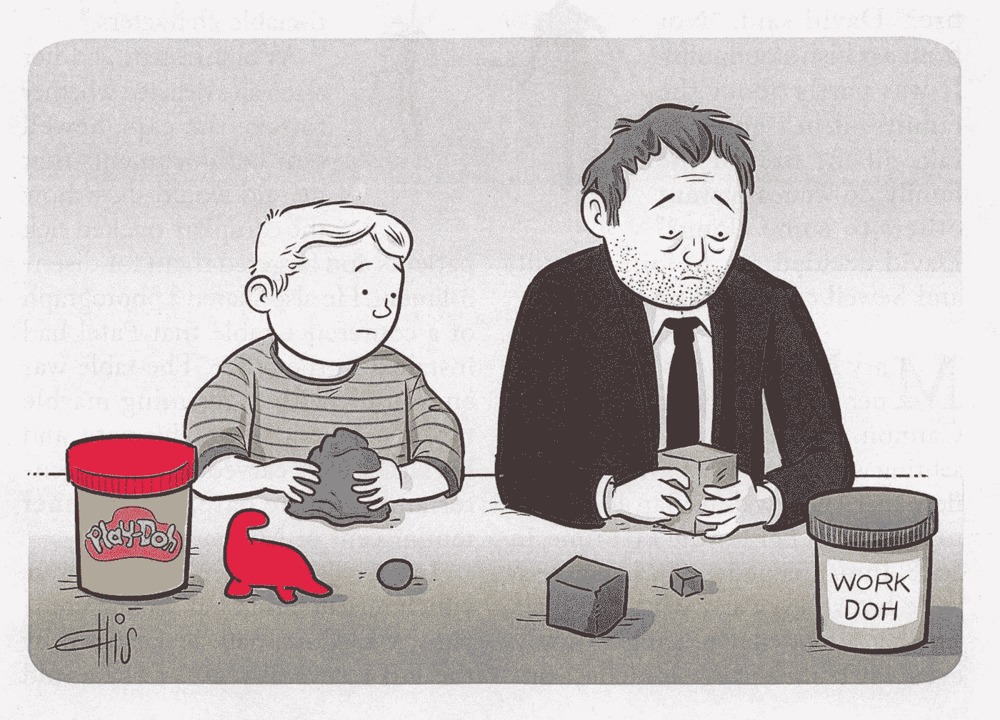

# 当工作被玩耍时

> 原文：<https://medium.com/hackernoon/when-work-is-play-df3045532e88>

From [The New Yorker](https://www.newyorker.com), Feb 4, 2019

我已经注意到我是如何把工作的体验变成 T2 的游戏的。一整天，我都会记下要做的事情的清单，当它们完成时，我会核对一下。如果我想到我可以或“应该”做的事情，我会把它列在清单上。我定期检查这个列表，决定下一步做什么，什么留到以后做，什么放弃或无限期推迟。每隔几周，我都会回顾一下这个清单，并制作一张幻灯片，总结我过去两周的进展。这份总结让我很满意，我也与我的经理分享了这张幻灯片。

我有时会注意到清单上有一些项目让我感到有些抵触。这种抵触情绪往往是因为我怀疑自己是否能够顺利完成任务。当这种情况发生时，我已经养成了一个习惯，首先完全承认这种感觉，然后决定无论如何都要尝试这个任务。这些任务看起来很有挑战性，只是因为我几乎不知道从哪里开始；他们身上似乎有太多不为人知的东西。我已经学会将此视为真正的乐趣，因为这显然是一次冒险。谁想一直做他们已经知道如何做的事情呢？于是，我找到了我*可以*做的第一步，不管有多小。第一步可能是研究如何进行，或者可能是调查其他人是如何解决类似问题的。

我通常会把大部分工作归结为某种探索、总结、组织或创造；都很过瘾。当我遇到障碍时，我有时会发现自己的计划被挫败了。相反，我学会了放慢速度，专注于解决障碍；毕竟，这才是真正需要解决的问题。这可能会给我的待办事项列表带来更多有趣的项目。这个“路障”只是我要应对的另一个有趣的挑战，一个我之前根本不知道的迷人的惊喜。

即使当我在做一些可能被一些人认为无聊或乏味的工作时，我倾向于最终发现它充满了学习、实验、探索和玩耍。有时我很惊讶，我实际上获得了很好的补偿，在一个凉爽的环境中闲逛，解决挑战性的问题，这些问题需要我学习新的有趣的东西。我也可以和超级聪明有趣的人在一起。

在我职业生涯的早期，有一个和我年龄差不多的人，但是他在不同的团队工作，处理稍微不同的问题。他似乎对自己的工作非常不满意。午餐时，我注意到他会在他经理面前非常显眼地阅读报纸上的招聘广告。我想我一定是看起来对我正在做的事情非常兴奋，不知怎么的，我觉得他有点嫉妒我。

不久之后，这个人转到我的小组，从事与我非常相似的工作。他起初似乎很热衷，但一两周之后，他似乎又回到了默认的萎靡状态。不久之后，他又回到了原来的工作岗位。我推测他发现他把自己的厌倦带到了新的角色中，这个角色他可能也感到不太胜任。

到目前为止，我已经在足够多的不同领域参与了足够多的项目，知道几乎任何类型的工作都可以是超级有趣、具有挑战性、促进成长和有趣的。假设我有一个积极的情绪环境，我可以挖掘一个问题，并从中找到乐趣。

工作中的成就感不在于我具体在做什么，而在于我能在多大程度上把它当作一种游戏。