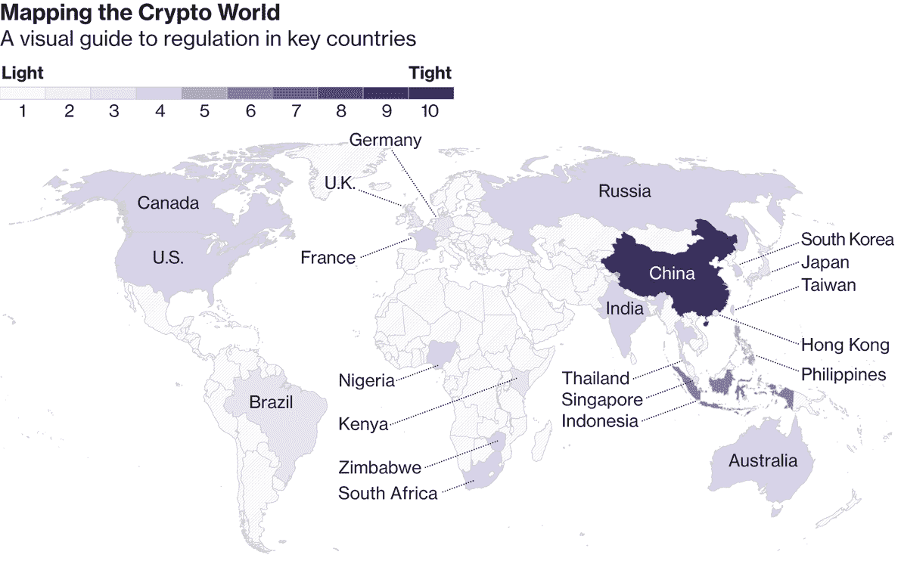

# 亚洲的“马耳他”在哪里？

> 原文：<https://medium.com/hackernoon/where-is-the-malta-of-asia-e4b3117c396f>

数字经济催生了伦敦、新加坡、香港和纽约等特大城市。麦肯锡最近的一项研究表明，全球 600 个城市创造了超过 60%的全球 GDP，预计到 2025 年将有超过 130 个新城市进入前 600 名，所有这些城市都来自发展中国家，100 个新城市来自中国。这些城市变得越来越智能，并将受益于第四次工业革命。

连通性、人力资本、互联网服务的使用、数字技术的整合和数字公共服务是用来衡量数字经济的成功和影响的指标。

但是，发达城市就是这样。另一边呢？

# **新兴经济体案例**

印度是一个很好的例子。尽管中国政府积极主动地将不同经济领域数字化，但政府与民众之间最大的摩擦点是公共服务不能及时提供。一些服务交付效率低下的例子是获取您的身份证明或资产所有权被交换的证明。为了处理交易，人们必须亲自到场，让政府官员在相关文件上盖章。这在数字时代似乎很古老。

区块链技术非常适合简化政府和人民之间的低效率。例如，在印度的早期采用者邦中，特伦甘纳邦拥有数字基础设施来适应基于区块链的公共服务。对于公民来说，这将是令人难以置信的授权。通过使用区块链技术提供的这一额外的透明层只会培养人们对政府服务的信任。

# **海德拉巴:潜力之城**

海得拉巴作为该国最先进的 IT 目的地之一屹立不倒，仅次于班加罗尔，但凭借特伦甘纳邦政府的商业友好前景，它正快速稳坐榜首。这座城市提供了先进的基础设施、创业文化、与全球市场的联系，当然还有有利于商业的政策。它拥有一些最好的高科技城市，高科技城和基因组谷，这些城市在以低得多的成本开发智能和高效的城市环境方面为其同行提供了线索。技术加上整个国家最高标准的生活，它有可能成为突破性技术创新的新的全球目的地，包括人们津津乐道的区块链地区。

事实上，海德拉巴与马耳他对新兴技术有着相似的品味。作为对比，我们来看看成为“区块链岛”是如何提振马耳他经济的。

# **画一条平行线与灵感**

这个欧洲小岛的政府已经向区块链和其他所谓的分布式账本技术敞开了大门。欧盟委员会预计，2019 年期间，这个小岛国的经济将大幅增长 5.2%，超过整个大陆的经济增长。

[**马尔他**](https://www.newsbtc.com/2018/04/23/malta-is-fast-becoming-a-central-hub-for-cryptocurrency-businesses/) 也许是全球范围内对区块链产业最友好的国家&数字货币浪潮，这已经清楚地反映在他们的增长率上。由于有利的立法，该国已经吸引了一些来自加密货币和区块链领域的大公司来到其海岸——如 BitBay、ZebPay 和币安。这反过来增加了就业机会和国内生产总值，是经济增长的主要驱动力。

# **监管格局**

马耳他最近通过了为 DLT 业务提供全面监管框架的法律，这在同类法律中尚属首次。简而言之，这些法律不仅涉及数字货币和交易，还非常关注分布式账本技术的企业应用。预计随着新法律的出台，它们将创造一个具有竞争力的税收制度的有利环境，以吸引更多的加密和区块链企业对马耳他的兴趣。

Bloomberg 2019

他们了解区块链技术从长远来看可以提供什么，而不是其他国家，他们通常着眼于加密和区块链的短期收益。在马耳他经营的区块链公司和初创企业的主要好处是政府的态度。

该国甚至制定了国家区块链战略，探索数字身份、公共登记、公共交通网络、智能手机投票和保护医疗保健信息等项目。

# **前方的路**

作为一名印度公民，看到区块链如何改变印度的权力格局令人兴奋。印度的治理风格深受裙带关系、腐败政客和人民机会不平等的困扰。此外，在多次未能做到透明和向大众提供平等机会后，无论哪个政府执政，缺乏信任的气氛都在加剧。由于 Telangana 已经是数字化计划的领导者，因此有一个强大的框架来迁移到基于区块链的系统，并为智能治理设定标准，因为区块链有可能减少与政府服务直接接口的麻烦。

# **想象一下区块链友好的特伦甘纳长什么样**

**赋能当地开发者:**区块链可以让特伦甘纳邦政府获得真正无国界的经济。它将授权给当地的房地产开发商，允许他们以简单、透明、安全的方式从世界任何地方为项目筹集资金，并有清晰的审计记录。

**包容性投资机会:**特伦甘纳邦政府可以利用区块链允许部分拥有[资产](/blockchain-for-everyone/blockchain-and-the-ownership-game-50ebea318db8?utm_medium=print&utm_source=medium.com&utm_campaign=article+reach)，这将把房地产行业从缺乏流动性的市场中释放出来。通过这样做，Telangana 可以为所有收入范围的投资者提供房地产投资机会，从而扩大投资者基础。

就业机会增加:整个国家正面临一场全国性的失业危机，国家抽样调查办公室( [NSSO](http://www.mospi.gov.in/national-sample-survey-office-nsso) )报告的失业率是 45 年来最高的。海得拉巴已经是数十亿美元的跨国公司的大型办事处的热点，如果法规有利于总部设在区块链的公司，它将吸引希望进入印度市场的大型区块链公司在特伦甘纳邦设立办事处，这将使该邦创造更多的就业机会。

**身份管理**:特伦甘纳邦政府可以使用区块链准确捕获和记录个人或商业实体的身份。再加上出生证明、指纹、法庭文件等传统身份识别措施，以及语音&面部识别等其他新兴身份识别工具，他们可以创建基于区块链的身份，人们可以安全可靠地共享和验证他们的身份，以参与任何需要 KYC 的交易。

**公证服务**:任何时间戳对诉讼证据至关重要的服务。这种行为或事件可以是一个人的出生或死亡、财产所有权的交换、学位的授予或几乎任何其他事情，消除了人们必须与公共机构互动并必须保留相关机构橡皮图章的权利证明的世俗纸质交易。

这些只是区块链在公共部门的一些使用案例；然而，在投票、海关、税收、跨境汇款等方面，这份名单还可以更进一步。

现在，我们知道区块链友好的特伦甘纳长什么样了；然而，在实现这一目标之前，还有一些障碍需要克服。由于技术的复杂性，采用率很低。采用的主要障碍是教育、基础设施和预算。因此，这一现实的实现取决于决策者走向明智治理的意愿。

这是一个大问题。特伦甘纳州的相关利益相关者能否携起手来，让这座城市成为一座独一无二的城市，在先进的商业和技术事务上与马耳他不相上下，但却能提供世界上其他任何地方都无法比拟的成本效益？

*想要探索区块链的业务用例吗？马上联系我们****admin @ birth venue . in***