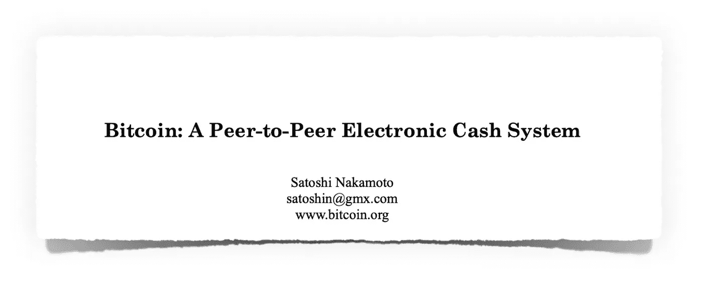
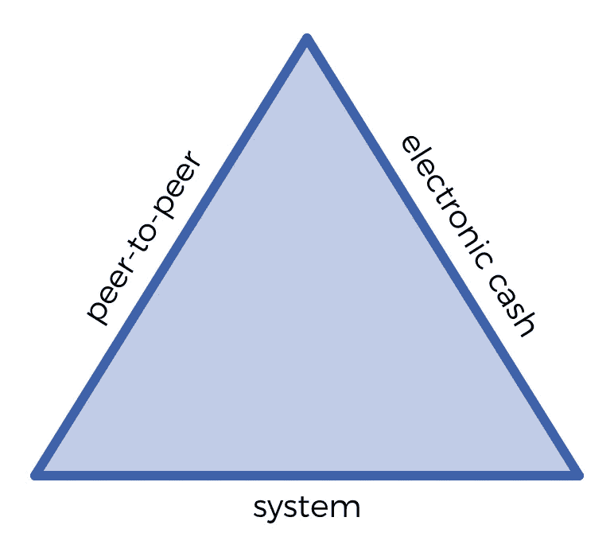
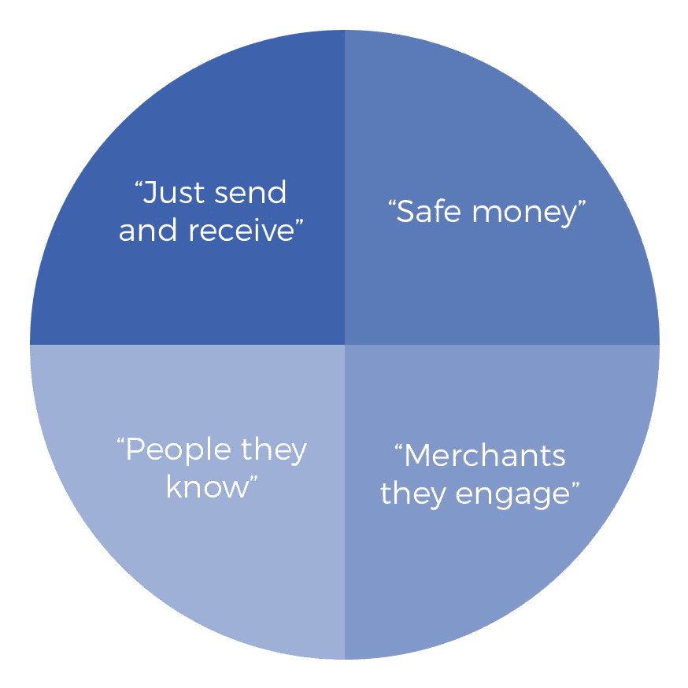
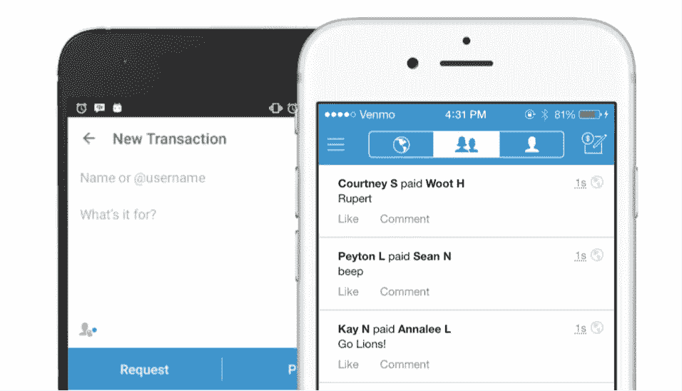
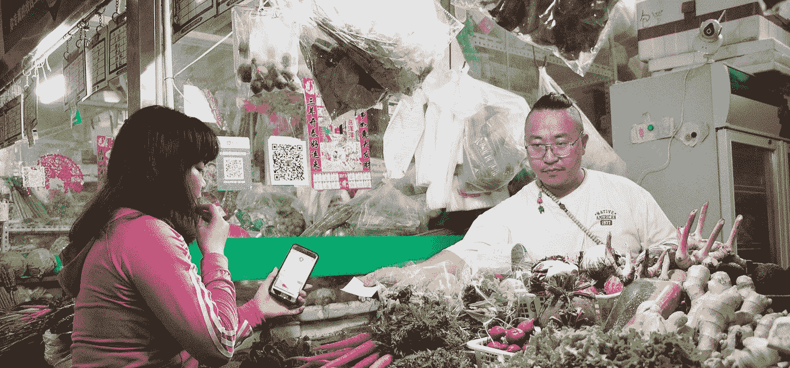
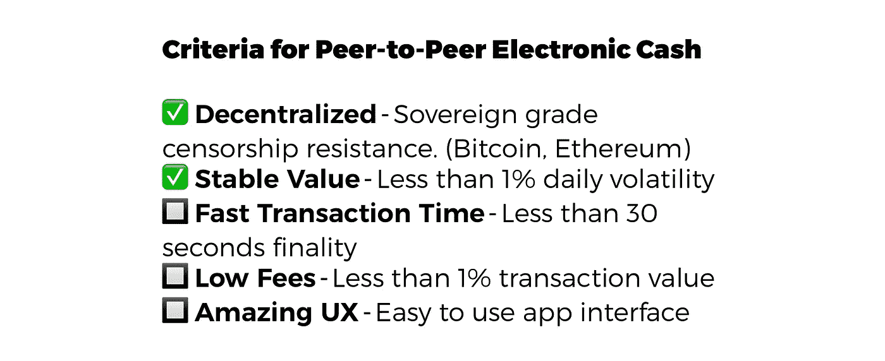
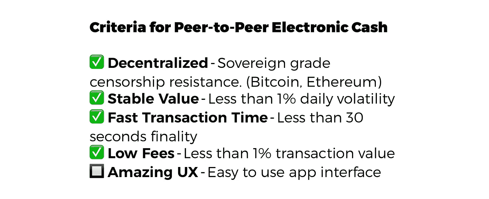
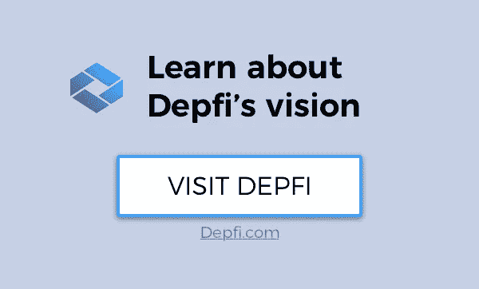

# 现在是 2019 年。哪里是我们的全球点对点电子现金系统？

> 原文：<https://medium.com/hackernoon/where-the-f-ck-is-our-peer-to-peer-electronic-cash-system-c8f43f5ad8b0>

> 在我婚礼的前一天，我们的婚礼存款被冻结了

我在越南的婚礼是在圣诞节后 3 天，我从美国转到越南支付费用的婚礼存款不见了。

多亏了美国的银行系统，有时事情随机地不工作，你必须等待 3-5 个工作日让银行解决。这意味着你根本拿不到那笔钱，它被搁置了。

如果在周五晚上发生了什么事情，那么银行在周末关闭，所以在 3-5 天的基础上增加 2 天。如果圣诞节刚好在那个周末之后，你可以再增加两天。

就这样，在我们婚礼的前一天，我没有足够的钱来支付婚礼。

当然，我有备用计划，所以对我来说，这是一个压力很大的烦恼和不便，但它提醒我不能完全拥有和控制自己的钱是多么令人沮丧。

想象一下，一个年轻的越南女人在美国实习，而她的母亲急需钱来支付一项拯救生命的手术。她寄出了她所有的东西，但是这些钱被美国银行随意扣留，导致这些钱来得太晚，救不了她的命。

加密货币已经存在很长时间了，试图解决这个问题，但我们仍然没有一个好的解决方案。这是一种耻辱。

*这个问题困扰了我几十年，正是这个问题将我吸引到了金融科技和加密领域，而我在为这篇文章进行研究时发现的解决方案的缺乏，正是这个问题驱使我从金牛天使集团(Taureon angel group)退下来，回到初创企业的怀抱。更多关于我们正在构建的内容将在本文后面介绍。*

# **我们承诺的下放资金在哪里？**

比特币在 10 年前推出，有一个简单的承诺:

然而，我们今天拥有的比特币和其他顶级加密货币的所有变体都没有实现这一承诺。

在各种加密货币最大主义者开始宣扬他们的宠物加密货币已经做到这一点之前，让我花点时间来定义一下 ***点对点电子现金系统*** 对我来说意味着什么。

**【点对点】** 对我来说，这意味着去中心化，自我主权，抵制审查。这意味着我拥有并控制我的那一部分，没有人可以撤销它或阻止我拥有或使用它。

对我来说，这意味着我可以在日常生活中把它当作钱来用。这意味着它的交易既快又便宜，也意味着它的价值相对稳定。我的购买力与持有时相比没有太大变化。

**【系统】** 一个系统是整体性的。它不仅由后端分散的账本组成，还包括整个用户体验，这意味着应用程序界面、生态系统以及二者之间的一切。

## 大多数加密货币都是“点对点”的

大多数顶级加密货币都会勾选第一个框，“点对点”。

比特币及其衍生产品莱特币、Dash 和其他各种货币在不同程度上是去中心化的、自主的、抵制审查的、点对点的。

拥有超强散列能力的比特币可能是最安全、最能抵御审查的，而 Dash 有一个强大的地面商户采用计划，以太坊的智能合约正在促成一个开放金融产品的生态系统。

人们可以在相当长的一段时间内争论各种项目分散化程度的细微差别，但考虑到它们比现有的菲亚特系统分散得多，这些网络现在已经足够好了。

## 几乎没有一种是“电子现金”

所有顶级的加密货币都非常不稳定，因此**作为记账单位或消费存储单位**毫无用处。

当我的朋友周五给我发 BTC 给他买车，而我到周一只能买 75%的车时，BTC 就不能作为现金或货币的形式使用了。

当然，从长期来看，比如说 3 年，它可能是一种很好的价值储存手段，但这并不能让它像石油或大豆一样成为现金。

是的，电子现金作为日常零花钱肯定也是有用的。购买一顿饭需要快速和无摩擦，这意味着 10 分钟的交易时间和 5 美元的交易费用也将使货币不能作为现金使用。

但如果要我对电子现金的障碍进行排名，价值波动是采用的第一大障碍，其次是费用和速度。

## “系统”是不完整的

目前市场上的一切都是不完整的体验。

我们有许多不同完成程度的后端总账，但我还没有看到它与易于使用的前端和强大的生态系统相结合。

虽然我们有很多允许用户管理多种加密货币的钱包，但我们没有一个简单地允许你向你的同行发送**现金**的钱包，它有一个易于使用的应用程序界面。

那么如何在 2019 年，**比特币推出 10 年**，**我们仍然没有一个完整的点对点电子现金系统？**

## 让我们完成构建比特币的第一个用例

我很清楚，为了分散技术的蓬勃发展，我们必须团结起来解决区块链和加密货币的第一个用例。

通过我的研究，我发现实现这一点所需的许多部分在比特币生命的前 10 年并不完全存在，这就是为什么它比预期的要长一些。

然而，由于 2017 年的融资浪潮，过去一年的技术和市场发展最终为我们提供了实现比特币愿景所需的一切。

> 我们新公司 [Depfi](http://depfi.com) 的使命是让全世界都能使用一个点对点的电子现金系统。

# 如何创建一个点对点的电子现金系统

到目前为止，我已经定义了点对点电子现金系统的一些标准:

作为一个生态系统，我们显然已经满足了 1/5 的需求；我们有许多分散的账本，对审查制度有不同程度的抵制，其中比特币和以太坊领先。

剩下的标准还没有任何明确的领导者，但随着新技术的发展，这些部分需要看起来今天可用或几乎可用，它们只是没有按照正确的顺序组装。

那么，我们如何着手组装这个系统的其他部分呢？

在深入研究我们可能使用的技术之前，让我们首先考虑用户体验，以便我们设计的系统能够得到真正的使用和采纳。

什么会被收养？用户到底想要什么？人们遇到了什么问题？

# 用户想要什么——用户体验

在这里，我只能从我自己的经历和观察中得出结论，但我想我有一些不同的经历和观察可以借鉴，我在富人和穷人中间生活和旅行过，在像美国和德国这样的发达国家和在发展中国家，特别是在东南亚的那些国家，身无分文和富裕。

在我所有的旅行中，我发现了一些关于人的普遍真理:

*   人们希望与家人和朋友一起过着满足和充实的生活
*   这意味着他们需要那些让他们活着、安全和快乐的东西，他们用钱来购买这些东西
*   这意味着他们需要挣钱、存钱和增值

所有这些都可以归结为对金钱的简单渴望:

> 人们只想在他们认识的人和他们接触的商人之间安全地发送和接收他们的钱。

打破这一点，你会发现更多的渴望:

## “只发送和接收”

我看到的大多数加密资产钱包的最大问题是，它们意味着管理多资产投资组合，使它们变得复杂和混乱。对于希望“汇款”的用户来说，他们并不真正关心各种加密资产，他们只是希望这些资产的价值能够方便地用于向其他人或商家汇款。

Nice asset management, but how do I send **money**?

用户希望发送一个接收值，以他们认为的任何货币为单位并与之挂钩，比如美元或泰铢，而不是 BTC 或瑞士法郎。

这也意味着他们发送出去的钱不会剧烈波动，因为那会使钱变得不可用。

用户不关心后端如何工作，只要他们能够合理地确信他们的钱永远不会丢失或被拿走，永远不会失去价值。

这意味着前端需要简单地向用户发送他们选择的货币，而不需要让他们面对实现这一点的复杂性。

## “安全货币”

对不同的人来说，这可能意味着不同的东西，但一般来说，这意味着他们的钱

1.  不会因为通货膨胀或其他原因而贬值
2.  不能被银行随意“丢失”或拖延
3.  不能被政府任意没收
4.  不会被一般的小偷偷走

在美国等发达国家，大多数人认为美元已经符合这些标准。欧洲也大多相信这一点，尽管在几年前欧元和其他欧洲货币兑美元汇率下跌 30%后，人们对欧元和其他欧洲货币的信心已经动摇。

在发展中国家，人们普遍认为他们的本币在上述三个方面都存在风险，但他们往往别无选择，只能使用本币。因此，你经常会看到人们将储蓄投资于美元、黄金和房地产，并持有当地货币用于消费。

人们倾向于避免在当地银行持有太多资金，因为这些银行容易被“黑”，因挪用公款而破产，或因在不包括老板的情况下做得太好而被政府查封。

正因为如此，我相信发展中国家已经准备好采用易于使用的加密货币系统，即使其本币的通胀率是合理的。

## “他们认识的人”

用户不关心 32 位十六进制地址。

用户在人与人之间进行交易，而不是在计算机之间，因此任何依赖于计算机地址的系统都将面临大量的采用摩擦。

Venmo gives instant access to pay your facebook friends

Twitter 的@user 系统等定制手柄要好得多。对用户来说，最好的体验是能够简单地选择他们认识的人并发送给他们。

Venmo 与脸书和社交图的整合以及微信支付对微信生态系统的利用是这些产品成功的原因。

分散系统必须存在于社交网络的边界之外，同时维护用户隐私，但这些网络可以用于引导采用。

朝着这个方向最容易的一步是通过一个分散的@或$ handle 系统。

## “他们雇佣的商人”

要让电子现金发挥作用，它必须能够方便快捷地在线向商家付款，尤其是当面付款。

在亚洲，向商家付款就像扫描收银机上显示的二维码一样快。在美国，信用卡和 NFC 支付快速而突出。

一个完整的电子现金系统必须支持 QRs 和 NFC，交易时间短，这样商家才能快速转移到下一个客户。

# 我们正在组装一个完整的点对点电子现金系统

## **介绍 Depfi**

在寻找这个解决方案多年后，希望有人能建立它，我决定做点什么！我与企业家兼教育家罗斯科·帕迪森(Rossco Paddison)联手，他已经培训了 7500 多人如何使用比特币钱包，并亲身体验了他们的痛苦和困惑。

这个系统是我们认为这个世界迫切需要的，我们不能再坐以待毙，等着有人来实现它，所以我们成立了 Depfi.com[来完成这个使命。](http://depfi.com)

我们的组织专注于用户体验和主流采用，因此我们正在建立我们认为生态系统中最缺乏的东西， [**Mosendo**](http://mosendo.com) ，这是一款面向主流用户群的 UX 分散支付应用程序。

基于用户的需求和需要，以及 p2p 电子现金的标准，我们正在组装一个完整的系统，要求

*   **稳定的加密货币** —一种分散的、抗审查的、点对点的、稳定的价值存储，费用低，交易时间快。
*   **简单应用** —一个简单易用的客户端钱包应用，仅使用一两种法定货币，无需 ID 即可在全球范围内使用。(莫森多)
*   **菲亚特接入** —菲亚特网关的全球网络，方便接入当地银行

## **稳定的加密货币**

价值的稳定储存必须是分散的，并能抵抗主权级别的审查，否则它与现有的银行基础设施没有太大区别。

这意味着市场上所有的菲亚特支持的银行硬币，如 USDT、USDC、TUSD、GUSD、PAX 等，都不适合这个系统。

银行硬币仍然很容易被政府、银行甚至发行代币的监管较少的组织没收。我们已经可以看到这一点，一些公司明确表示，他们可以基于违反服务条款撤销令牌，Gemini 拒绝兑现信誉良好的贸易公司提出的数千万美元的提款请求。

经验法则——银行中任何由法令直接支持的东西都不会受到审查或分散。

因此，与法定货币挂钩的加密货币是目前最有前途的货币。这些硬币与法定货币的价值挂钩，但没有法定货币的支持。

理想情况下，价值稳定不依赖于固定价值，但迄今为止，市场上还没有其他保持或评估稳定价值的方法。我怀疑这将是一个先有鸡还是先有蛋的问题，加密货币的采用允许确定稳定价值的新方法，因此盯住菲亚特是一种自举方法。

目前市场上最有趣的分散钉住稳定密码是[马克尔道](https://makerdao.com/)的[$戴](https://makerdao.com/en/dai)、[合成](https://synthetix.io/)和[二人组](https://duo.network)。

其他值得关注的是 [Reserve](https://reserve.org/) 和 [Constant](https://constant.money/) ，它们目前由菲亚特支持，但有一个去中心化和菲亚特挂钩的路线图。

特别是戴，他在加密货币的采用方面达到了一个重要的里程碑——流动性。

凭借超过 9000 万美元的已发行稳定令牌、3000 万美元的平均日交易量、健康的抵押和持续稳定的增长，DAI 终于达到了一个以前没有分散稳定加密货币达到的点，即使用 DAI 运行一个小型但完整的经济是可能的。

**可扩展性和费用**

MakerDAO 和 DAI 目前都建立在以太坊网络上，所以我们只考虑建立在以太坊上的解决方案。如果比特币网络推出一种具有足够流动性的稳定加密货币，我们可能会支持它。

以太坊应该很快就会发布 Serenity，一个更快、更便宜的协议版本。

在那之前，我们有几个分散程度稍低的解决方案可以使用，比如以太坊 POA 上的 xDai 和分散程度更高的支付渠道网络。

最初，这些为我们提供了一种以几乎即时的交易和零费用来引导生态系统的方法，并根据交易规模和使用案例构建多层解决方案。

这意味着在不久的将来，一些交易将通过侧链或支付渠道进行，一些交易将直接在以太坊网络上结算。

用户将不必体验 ETH 或 GAS，这对于主流用户来说是令人困惑和有些可怕的概念。

## 简单的应用程序— Mosendo

“钱”和“电话”越来越成为同义词，所以对于加密的采用，一个易于使用的应用程序是必需的。

应用程序中的钱必须以用户认为的货币(可能是当地的法定货币)命名和存储，并有能力持有第二种货币(可能是美元)。我们通过使用美元的 DAI 和 synthetix 的合成法定货币来实现这一点。

Mosendo

它必须易于与人交易，而不是公钥。我们通过使用分散的$motags、保存的联系人、二维码、NFC 和隐私保护社交网络导入来实现这一点(有人知道在我们的组织不存储用户数据的情况下这样做吗？).

使用钱包或持有余额不需要 ID，因为它只是一个非托管的加密货币客户端，为全球采用打开了大门，而不是被困在一个特定的司法管辖区。

私钥让许多用户感到困惑，加密货币目前也因缺乏了解而失传。在 Mosendo 中，用户可以选择硬件钱包、种子短语、通过他们最亲密的 5 个朋友和亲戚进行恢复，以及一些我们正在充实的其他想法。

Pieces assembled!

## **菲亚特接入**

理想情况下，p2p 电子现金系统是一种不需要使用银行账户或现金的综合体验。然而，这种转变需要时间，用户总是会发现自己出于各种目的需要纸币或银行账户。

包括 KYC 和反洗钱在内的汇款法规造成了许多我们正在着手解决的问题。该应用程序本身不需要 KYC/反洗钱，而是将受益于现有的货币传输合作伙伴的合规性，以将菲亚特换成加密。

该系统不能依赖于单个菲亚特网关，而是必须允许每个国家的多个网关组成的网络，以允许世界各地的人们无缝接入加密货币系统。

Mosendo 为此使用了诸如 [Wyre](https://www.sendwyre.com/) 这样的服务，以及我们正在与之谈判的其他支付处理器和现金充值商户(我们应该与谁谈判？).

The long and winding road to adoption

# **采用之路**

点对点电子现金系统将在新兴经济体中找到最强的产品/市场契合度，例如亚洲、非洲和南美洲，在这些地方，货币和金钱带来了剧烈的疼痛。

在这些地区，很容易发现恶性通货膨胀、银行盗窃、政府盗窃、腐败和其他使当地法定货币和银行吸引力下降的问题。

这些国家在跨境支付方面面临最大的问题，如汇款、跨境贸易和旅游。

通常情况下，货币管制会阻止资本从这些国家流出，掠夺性的做法会导致移民工人将辛苦赚来的钱汇回家的高额费用。

在这些地区中，许多已经看到了波动性加密货币的大量采用，如面临恶性通胀的委内瑞拉和津巴布韦。

许多非洲国家已经高度采用移动货币系统，如 mPesa 的基于 SMS 的集中支付。

许多国家已经使用电信电话服务充值信用作为一种货币形式，特别是印度，泰国和印度尼西亚。

东南亚发展中国家的智能手机普及率很高，加密货币投机的使用率也很高，这为加密货币钱包扫盲奠定了基础。

此外，东南亚国家相对较小的地理面积导致频繁的跨境货币问题。

特别是东南亚将成为加密货币系统实现高速增长的地区。

由于 Depfi 团队已经在东南亚建立了基地，我们将在这里实地工作，向日常生活中的人们学习如何为他们创造最佳体验。

从在泰国的缅甸移民工人到在海外赚取收入的菲律宾虚拟工人，我们让他们能够收回自己收入的所有权，并避开掠夺性的汇款人和不正规的银行。

在未来，我们梦想有一天，不仅我作为一个美国人可以拿出我的手机立即支付印度尼西亚街头小吃摊贩，而且一个委内瑞拉人可以很容易地支付柏林的 currywurst，一个尼日利亚人在加拿大可以很容易地汇款给家里的家人，所有这些都是快速，廉价和安全的。

Will her money be free?

# 了解更多关于 Depfi 和 Mosendo 的信息

感谢您花时间阅读本文。如果你和我们一样热衷于获取无国界的金钱和财富，请加入我们下面的使命。

Follow me on Twitter [@_TomHoward](https://twitter.com/_TomHoward)

查看德普菲团队的最新文章:

 [## 投资多年后，我为何再次创业

### 回顾过去两年，展望未来两年，开始 Depfi

medium.com](/depfi/why-im-leaving-investing-to-work-on-depfi-69d26c61d40a)  [## 来自加密应用前沿的 5 个新用户挑战！

### 让我直入主题，我很高兴在 2017 年末教新用户如何下载他们的…

medium.com](/depfi/5-new-user-challenges-from-the-front-lines-of-crypto-adoption-81ca8b259e1e)  [## 每天 2 美元收入的资金管理的惊人复杂性

### 2005 年，每天生活费低于 2 美元的人数约为 25 亿。没有太多的思考，我假设这些…

medium.com](/depfi/the-surprising-complexity-of-money-management-on-a-2-a-day-income-f48a070210a6)