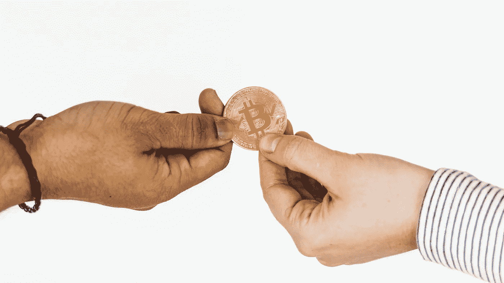

# 数十亿美元的密码交易行业的下一步是什么？

> 原文：<https://medium.com/hackernoon/where-the-multi-billion-dollar-cryptocurrency-exchange-industry-is-headed-f697af6fd7c0>

今年是加密货币交易所年。像币安首席执行官赵昌鹏和比特币基地创始人 T2 这样的远见者，通过他们的数字货币交易平台赚了数千万美元。

据[估计，十大交易所的日利润超过 300 万美元](https://www.bloomberg.com/news/articles/2018-03-05/crypto-exchanges-raking-in-billions-emerge-as-kings-of-coins)，它们无疑是加密货币领域最赚钱的业务之一，仅次于专横的采矿业。此外，正如[最近的报告](https://www.coindesk.com/5-crypto-assets-are-soaring-on-possible-coinbase-listings/)所表明的，主要交易所是该领域内令人畏惧的影响者，似乎对“选定”的加密货币的价格有着巨大的影响。

最近的新闻，如纽约证券交易所运营商推出的比特币期货交易所 Bakkt 的[公告，表明机构对加密货币交易所行业的兴趣越来越大。球在滚动，而且滚动得很快。问题是:它将走向何方，能走多远？](https://cointelegraph.com/news/nyse-operator-announces-new-global-digital-assets-platform-plans-bitcoin-futures-launch)

# 完美风暴

加密货币交易所的前景并不总是像现在这样光明。大多数早期的加密货币投资者可能在 2014 年 2 月无意中发现了 Mt. Gox 交易所臭名昭著的[黑客攻击，该攻击导致私人投资者数万枚比特币丢失，并引发了持续近 2 年的下跌趋势。这一事件代表了比特币历史上最大的挫折之一。](https://cointelegraph.com/news/the-mess-that-was-mt-gox-four-years-on)

不幸的是，故事并没有随着 Mt. Gox 的惨败而结束。尽管是苹果美国应用商店前[下载量最大的应用](https://techcrunch.com/2017/12/07/coinbase-hits-top-spot-on-apples-us-app-store/)，有争议的货币门户比特币基地目前正遭受[不讨好的用户评分](https://www.trustpilot.com/review/coinbase.com)。与此同时，其他几家加密货币交易所被指控对首次发行硬币(ico)的上市收取高额费用，有些费用据称高达 100 万美元。另一个持续的指控是，许多交易所的交易量被人为夸大，[已经被证明](https://cointelegraph.com/news/volumes-on-most-major-cryptocurrency-exchanges-are-fake-or-inflated-study)，并可能导致错误的排名，以及客户方的信任问题。

可以理解的是，此类事件引起了国际监管机构的关注，它们已经表明了关闭欺诈交易平台的意愿。一些监管者甚至怀疑大多数硬币和代币交易的合法性。正如美国证券交易委员会代表布雷特·瑞德费恩在接受美国消费者新闻与商业频道采访时提到的:“有很多交易所在交易 ico，我认为我们会看到更多的注册。”

# 金钱或业务份额

尽管发生了所有这些令人担忧的事件，这些平台背后的公司仍在持续记录惊人的收入，甚至在某些情况下超过了欧洲一些最大的银行。区块链巨头 CZ 因通过其交易所币安[和公用令牌](https://coindiligent.com/best-cryptocurrency-exchange-coins-2018)在不到六个月内成为亿万富翁而出现在许多头条新闻中，甚至登上了福布斯封面。这类新闻开始推动大型老牌机构进一步探索这个新市场。

今年早些时候，高盛子公司 Circle 斥资约 4 亿美元收购了位于美国的加密货币交易所 Poloniex。此外，几个月前，股票市场重量级纳斯达克披露了将 T2 变成加密货币交易所的意图。在欧洲大陆也可以发现类似的趋势，瑞士的主要证券交易所 SIX [计划在未来几个月支持比特币和其他替代币](http://fortune.com/2018/07/06/swiss-stock-exchange-cryptocurrencies/)。上面的樱桃是关于 ICE 的新闻，ICE 是世界上最大的证券交易所纽约证券交易所的母公司，最近宣布[一个计划于 2018 年 11 月上线的加密交易平台](http://fortune.com/longform/nyse-owner-bitcoin-exchange-startup/)。

# 将华尔街符号化

虽然传统股票市场的大玩家正在努力追赶，但比特币基地和波洛涅克斯(Poloniex)等老牌区块链公司有更重要的事情要做。股票和其他证券等金融资产的令牌化代表了一个[有前途的业务领域](https://coindiligent.com/a-look-into-the-security-token-mega-trend)——价值约 15 万亿美元的全球证券市场——有可能扰乱整个股票市场本身。这导致了建立第一个可操作的安全令牌交换的激烈竞争。

然而，在考虑开放这样的平台时，为安全令牌交换选择正确的权限似乎是主要挑战之一。在美国比特币基地证券代币交易所获得所谓的监管批准后，[仅仅几天后，该公司就被迫退出](https://cointelegraph.com/news/coinbase-tokenized-securities-approval-u-turn-or-just-a-matter-of-time)。其他的，比如中国的 OKEx，正在较小的海外司法管辖区碰碰运气。潜在目的地可能是地中海岛国马耳他和直布罗陀，以及中欧银行业中心瑞士。

最近，加密初创公司 Open Finance [宣布，它刚刚在美国推出了首个受监管的安全令牌交易所](https://cryptoslate.com/openfinance-launches-regulated-security-token-trading-platform/)。这一发展是朝着广泛采用迈出的有趣的一步，但是在这个领域仍然有许多批评的声音。 [Andy Singleton](https://www.linkedin.com/in/andy-singleton-831144/) ，安全令牌平台 aboundable 的首席执行官，在一次采访中提到“交易所只有在私人市场交易受到重大限制的情况下才被批准”。

安迪·辛格尔顿因其为专业投资者和高质量证券创造市场的运动而闻名。他指出，该行业目前没有向专业投资者出售优质的令牌化证券，我们现在看到的许多产品都是糟糕的交易。Andy 声称，虽然安全令牌交换是一个非常有前途的行业，但第一步是创建高质量的令牌化资产。

# 碎片化是关键

资产证券化无疑是一个革命性的想法，但这种升级的受益者将主要是高净值个人，即合格投资者。与此形成对比的是，分散式交易所的特点是其架构确实是为所有交易者的最大份额而设计的。

有了这个概念，所有用户都把他们的加密资产放在个人钱包里。此外，平台上的每笔交易都是点对点进行的，将通过智能合约来执行。如果以高安全标准运行，这种方法将永远使大规模黑客攻击成为过去，就像 Mt. Gox 灾难一样。

币安最近宣布了推出分散式交易所的计划。这对许多人来说是一个惊喜，因为币安是这个领域最大的集中交易市场，每个季度从他们的核心业务中赚取数亿美元。[用币安首席执行官“CZ”](https://www.ccn.com/how-binance-decentralized-crypto-exchange-beta-launch-in-2019-will-impact-the-market/)的话说:“我相信去中心化的交易所是未来”。

虽然已经有几个完全可操作的分散式交易所，其中大多数[在以太坊区块链](https://hackernoon.com/the-state-of-decentralized-exchanges-235064446ab0)上运行，但它们也因可靠性问题和次优用户体验而受到严厉批评。为了提供既安全又令人满意的用户体验，分散式交易所可能需要更成熟的区块链架构，同时具备处理高频交易的能力。

加密货币交易所的前景非常广阔。随着这个领域继续以非常快的速度发展，越来越多的大玩家进入这个领域来分一杯羹，观察它最终将走向何方将是一件非常有趣的事情。