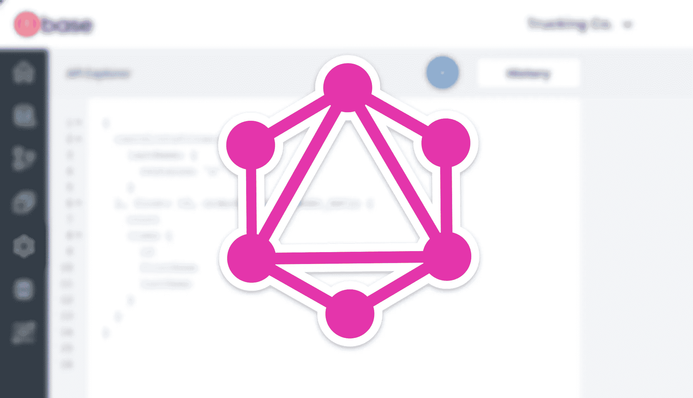
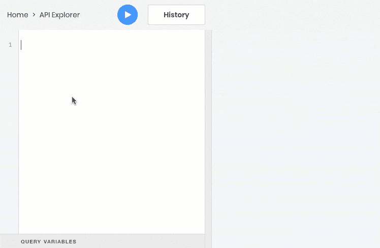
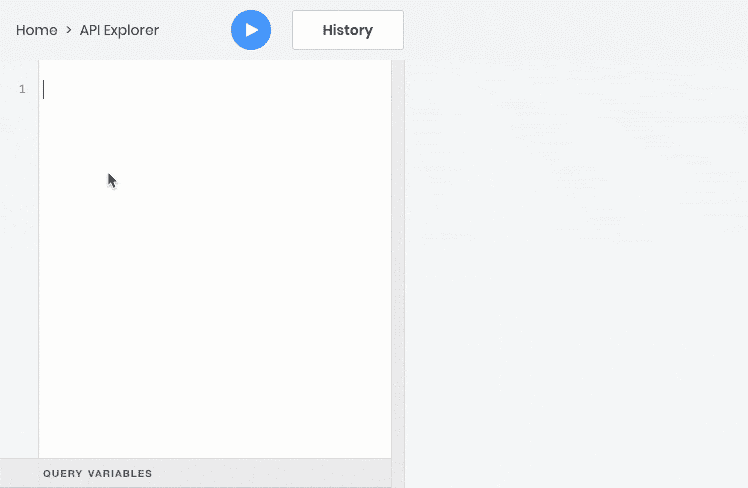
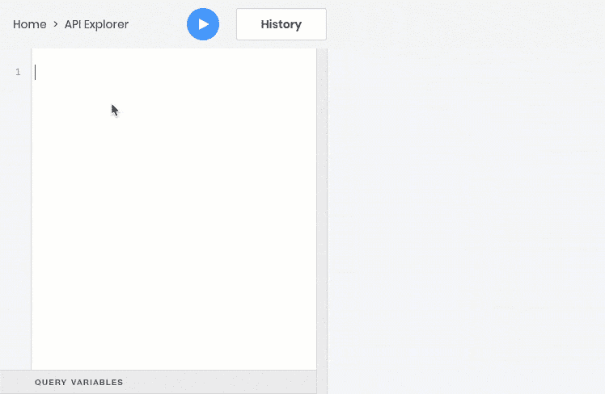
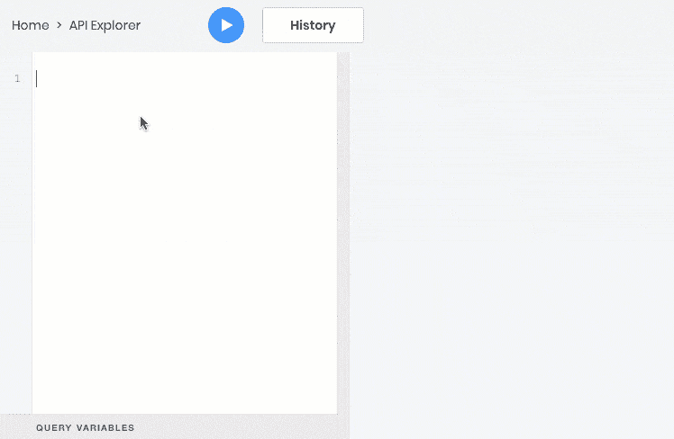
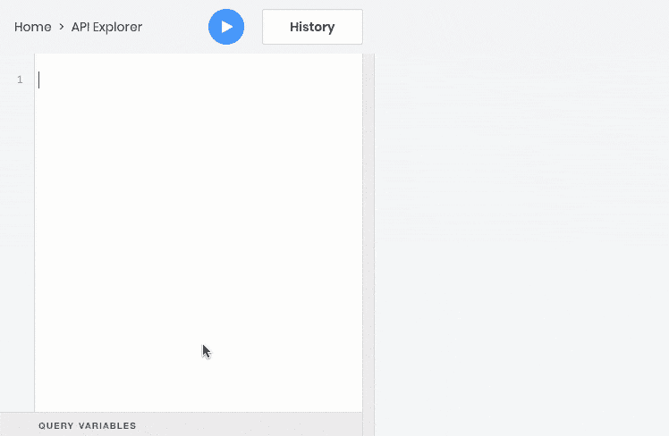
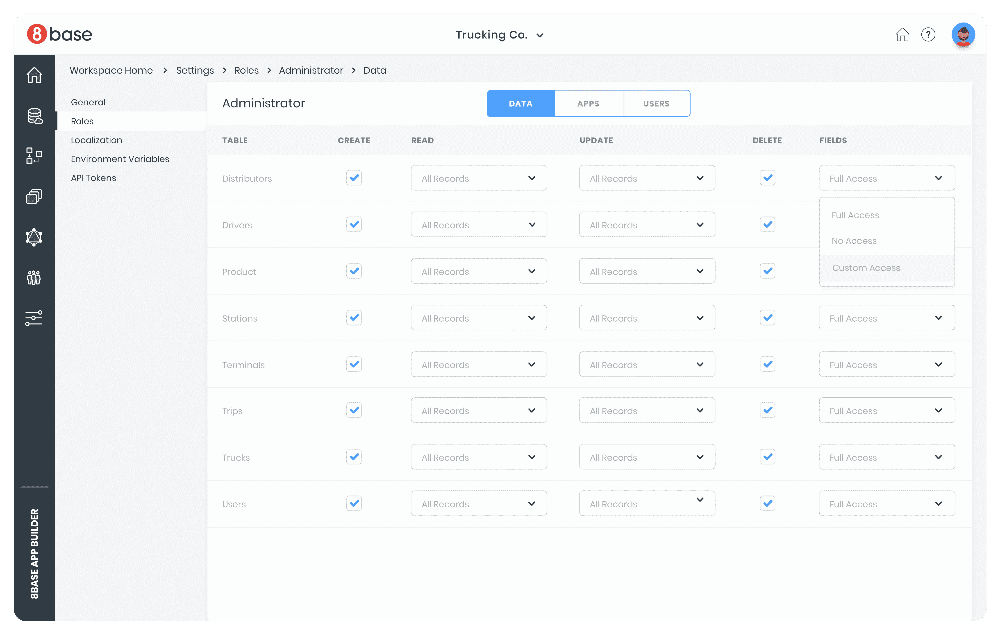

# 不管你喜欢还是讨厌脸书，GraphQL 都很棒

> 原文：<https://medium.com/hackernoon/whether-you-love-or-hate-facebook-graphql-is-awesome-bbf67f33fe10>

让我们来一次时间旅行。假设你是 2000 年代中期的一名开发人员。您正在构建一个 web 应用程序，您正在解决桌面互联网浏览器的问题，因为它是唯一可用的平台。保持服务器和客户机代码库的集成，让框架抽象出客户机-服务器的通信会更容易。

快进几年——浏览器现在已经成熟到支持 HTML5 和 JavaScript，允许更丰富的客户端功能。在这个时间点上，前端开发者出现了。尽管开发人员开始在他们的角色和职责上发生分歧，以跟上不断发展的技术进步，但是诸如 PHP、Ruby-on-Rails 和 ASP.NET 这样的整体框架由于其简单性、成本效益和普遍的遗留使用而继续主导着开发人员的生态圈。

然而，在许多方面，由于应用程序需要支持多种形式的设备和第三方 API 连接，这些整体架构已经成为一个巨大的负担。由于这些因素，对整体框架的依赖开始转向支持 API 优先的架构。

## API 优先的方法

为了适应这一新兴趋势，采用了一种新的“API 优先”方法:后端开发人员现在可以构建一个健壮的 API，各种丰富的本机或第三方客户端应用程序都可以连接到该 API，而不是单一的单层应用程序。由于其简单和优雅，REST 成为当今大多数现代 web 和移动应用程序中 API 实现的事实上的标准。与此同时，随着职业道路和技术堆栈的不断扩大，开发人员开始强烈倾向于后端或前端。

然而，REST 并不完美，尤其是对于复杂的数据驱动的应用程序。它将权力的天平向后端倾斜，给前端开发人员留下了一套僵化、不透明的端点，让他们在后端开发人员的支配下及时实现客户端应用程序所需的所有数据源。对于许多前端和移动开发项目来说，像数据的[过量/不足](https://stackoverflow.com/questions/44564905/what-is-over-fetching-or-under-fetching)和缺乏强类型化这样的问题使得 REST 的体验不是最佳的。

为了解决这些问题，脸书在 2012 年开发了一个名为 GraphQL 的新标准，并于 2015 年向公众发布。GraphQL 为 API 启用了一种查询语言。它越来越多地被 AirBnB、Stripe、GitHub、Pinterest、Shopify 和 Intuit 等公司的许多[杰出开发团队](https://graphql.org/users/)所采用。

## GraphQL 收购案

与 REST 不同，每个 GraphQL API 都提供了一个模式，其中包含输入和输出类型、它们的字段以及对象之间关系的信息。这允许 API 表达丰富的、连接的领域模型，并定义独立于客户端表示的灵活的查询和变化(对数据的操作)。GraphQL 还要求客户端开发人员显式定义要返回的数据，包括在同一请求中查询相关对象，消除数据过量和不足提取，以及减少 API 调用的数量。

## GraphQL 与 REST

让我们用一个简单的例子来比较 GraphQL 和 REST:构建一个在线博客。当渲染一个单独的博客文章屏幕时，我们需要显示文章的内容、作者的头像和姓名、评论列表以及每个评论作者的姓名和头像。

对于 REST，我们必须编写以下 API 调用:

1.  *GET /articles/:获取帖子内容的 id*
2.  *GET /users/:id 获取作者头像网址和名字*
3.  *GET /articles/:id/comments 来获取评论列表——希望后端开发人员能加入评论作者姓名和头像。否则，我们就得做*④了
4.  *GET /users/:每个评论的 id，以获取评论作者的头像 URL 和名称*

请注意，提取不足(当单个请求不能提供我们需要的所有数据)和提取过度(例如/users/:id 调用返回的信息多于我们需要显示的信息)，以及前端代码复杂性的增加，都是编排一系列相关 API 调用所必需的。

使用 GraphQL，如果 API 开发人员在 GraphQL API 模式中表达了帖子、用户和评论之间的关系，那么所有信息都可以在一个请求中接收到。此外，响应中只包含请求的字段，从而减小了响应的大小。下面是一个 GraphQL 查询示例，它在一个请求中为我们提供了所有信息:

GraphQL API allows you to get all data in a single request

用 REST 实现这一点需要后端开发人员实现一个定制的 API 端点来返回这些信息。然而，对于每个类似的情况都必须这样做，并且每当前端开发人员需要更多字段时，API 都需要更新。

这个例子说明了 GraphQL 如何改变力量的平衡，使之有利于前端开发人员，为他们提供查询所需数据的灵活性，同时允许后端开发人员以一种代表整个业务领域而不是特定客户端视图的方式实现 API。

加上充满活力的库和工具生态系统，这将前端开发人员的体验提升到了一个新的水平，使 GraphQL 成为越来越多的开发团队访问和操作数据的首选方式。这也简化了软件开发团队的过程，显著地减少了开发人员之间低效的交接数量，很可能会降低开发团队的人员配备和成本。

## 使用 8base 的 GraphQL

GraphQL API 的缺点之一是它不像 REST 那样容易实现。以一种便于在各种客户端应用程序中使用的方式公开业务数据需要大量的后端开发。为每种数据类型实现 CRUD 操作、关系、过滤器、排序和分页是非常繁琐的。数据权限和将文件附加到数据对象的能力也是必要的，但不容易构建。

[**8base 的 GraphQL API**](https://blog.8base.com/how-8base-works-serverless-graphql-cli-and-more-328e534fc022) 通过为前端和移动开发者提供工具来配置强大的 GraphQL 后端，使构建应用程序的速度无限加快，从而自动解决了这个问题。对于工作区中定义的每个表，8base 会自动生成以下 GraphQL 操作:

*   **通过 id 或任何唯一字段获取单个对象**

*   **根据过滤器、排序、分页和全文搜索标准获取对象列表**

*   **创建、更新、删除一个对象**

*   **订阅实时数据事件**

Subscribe to server-side data events via WebSockets

**所有这些操作都很好地处理了对象关系，允许开发人员与其父对象一起查询、创建和更新子对象:**

Create child objects together with parent

**可以通过基于角色的安全性来控制对每个数据表和字段的访问:**

8base Role-Based Security

## 文件呢？

在处理文件时，GraphQL 和 REST 都没有提供任何帮助。现代应用程序要求开发人员以许可的方式存储和共享文件，并将文件链接到数据对象。在其他任务中，调整图像大小、生成缩略图以及通过内容分发网络(CDN)提供它们也会遇到困难。

8base GraphQL API 提供了本地文件管理功能，可以轻松处理任何类型的文件。8base Data Builder 允许用户在任何表上定义一个*文件类型*字段，以便像存储常规数据一样存储和处理文件。通过本机 Filestack 集成，8base 提供了各种用于处理文件和文档的工具:强大的客户端文件选择器、快速内容摄取、图像操作、缩略图生成、文档内搜索、光学字符识别(OCR)、面部识别等。

**下面是如何使用 8base GraphQL API 查询用户头像信息:**

## 你自己试试

8base 使前端开发人员能够构建和运行现代 web 和移动应用程序，而无需依赖后端开发人员和 DevOps 员工组成的大型跨职能团队。但是不要相信我们的话，自己尝试一下，完成 [**快速入门指南**](https://docs.8base.com/docs/quickstart) 在 10 分钟内启动一个演示 React 应用程序。

要开始使用 8base 或只是了解更多信息，请访问[**www.8base.com**](https://www.8base.com/?utm_source=8base_blog&utm_medium=How%208base%20Works)、[**docs.8base.com**](https://docs.8base.com/docs)，在 Twitter 上关注我们@ [**8baseinc**](http://www.twitter.com/8baseinc) ，或直接发送电子邮件至***【info@8base.com****。*

*原载于 2019 年 1 月 24 日*[*blog.8base.com*](https://blog.8base.com/why-is-graphql-incorporated-into-8base-so-prominently-525750c8a280)*。*