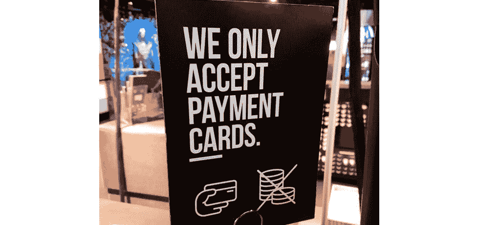
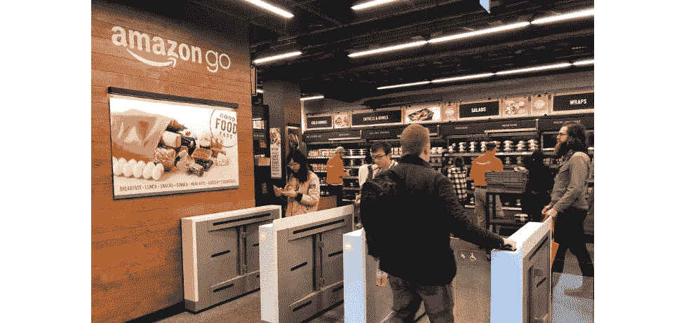
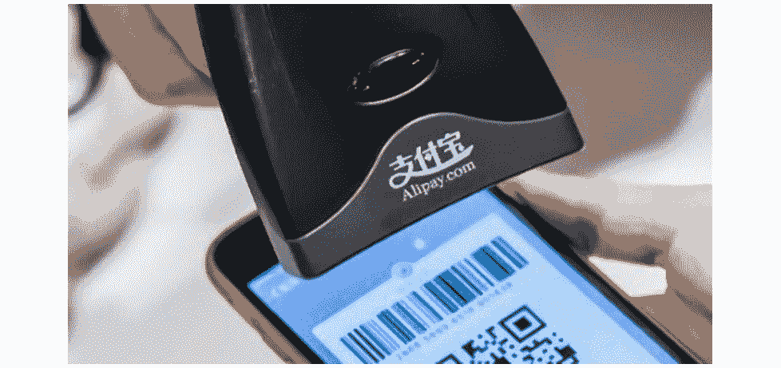
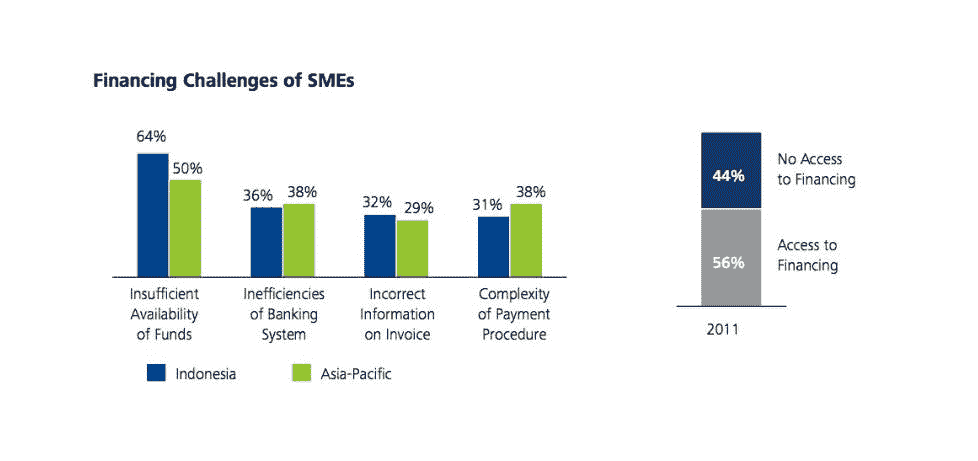

# 哪个地区将成为第一个完全无现金的地区？

> 原文：<https://medium.com/hackernoon/which-region-will-be-the-first-to-become-entirely-cashless-ad6141bb6354>

如果你有足够的信心把钱包留在家里，在乘坐出租车、喝杯咖啡或购买食品杂货时只依赖信用卡或移动设备，那么你就会知道，没有现金并不像几年前那样重要。

区块链技术似乎是这种新生活方式的最佳推动者，然而，即使没有它的帮助，这种转变也已经发生了。也许使用手机内部的 NFC(近场通信)功能并没有那么流行，但刷卡是连你的祖父母都学会做的事情。

每个人都知道支付系统未来的发展方向，当然不是现金或任何其他实物资产:而是全部电子化。

从目前只有 2%的交易以现金进行的瑞典，到拒绝接受现金的餐馆，如纽约的 Amazon Go stores，公司正在为无现金的未来制定解决方案，而 [NEXXO](https://nexxo.io/?utm_source=howtotoken&utm_medium=article&utm_campaign=6) 项目正在帮助加速这种过渡，为小企业及其客户提供区块链供电的解决方案，同时完全符合当地银行、执法机构和地方政府的要求。你认为这可能吗？是的，我们将在这篇文章中探讨他们的解决方案。

# 谁抛弃了现金？

主要的全球金融中心已经开始抛弃现金，转向数字货币。谁将成为实现 100%数字支付的人？我们得等着瞧！

# 瑞典

瑞典是当今无现金经济的最好例子之一。瑞典流通中的现金比例大幅下降，不到 T2 GDP 的 1.2%。只有 2%的交易是用现金进行的，预计到 2020 年这一数字将降至不到 0.5%。那是明年！

“现金在瑞典真的消失了。加州大学的经济学教授 Rod Garrett 解释说:“(T4)这在很多企业都不被接受，很多银行也不再处理现金业务。”。

[https://twitter.com/adrianlovney/status/817285087746281472](https://twitter.com/adrianlovney/status/817285087746281472)

在瑞典的商店里经常可以看到[“不接受现金”的标志](https://www.bloomberg.com/news/articles/2018-02-18/-no-cash-signs-everywhere-has-sweden-worried-it-s-gone-too-far)。甚至有银行不再办理现金业务。其中最大的一家，瑞典央行，正在开发一种用于移动支付的加密货币，名为 [e-Krona](https://www.riksbank.se/en-gb/financial-stability/the-financial-system/payments/does-sweden-need-an-e-krona/the-e-krona-projects-first-interim-report/) 。不过，这并不完全是为了数字化。关乎安全和效率。这就是为什么他们正在考虑为消费者和实体之间的小额支付创建一个基于区块链的资产。

# 美国

当瑞典政府支持无现金运动时，近年来无现金商店遍地开花的美国正寻求立法[禁止](http://www.grubstreet.com/2018/11/new-bill-would-make-cash-free-businesses-restaurants-illegal.html)这种商店。主要原因？他们在宣扬种族主义和精英主义。

“大多数没有信贷的人往往是低收入、少数族裔和移民。费城市议员威廉·格林利说:“在我看来，即使不是故意的，至少也是一种歧视。”。

这些不仅仅是文字。马萨诸塞州和费城已经禁止拒绝现金支付的商店。如果纽约或新泽西将实施类似的措施，这并不奇怪。

新法律甚至还没有被恰当地引入，公司发现了潜在的漏洞。随着 Jim Kenney [签署禁止不接受现金的商店的变化，如果需要付费会员才能在那里购物，商店仍然可以只使用基于应用程序的交易。](https://www.usatoday.com/story/tech/talkingtech/2019/03/09/dont-ditch-cash-yet-but-paying-venmo-phones-cards-future/3110706002/)[亚马逊 Go 商店](https://www.usatoday.com/story/tech/talkingtech/2019/03/09/dont-ditch-cash-yet-but-paying-venmo-phones-cards-future/3110706002/)没有收银机，但需要一个应用程序和一个亚马逊账户(会员)才能进入，不属于该法的管辖范围。

[https://www.cnet.com/news/amazon-might-open-thousands-of-its-grab-and-go-stores-over-the-next-three-years/](https://www.cnet.com/news/amazon-might-open-thousands-of-its-grab-and-go-stores-over-the-next-three-years/)

哪里有需求，哪里就有出路。

# 印度

印度政府进展缓慢，但它给出了明确的信号，无现金是长期目标。2016 年，印度[禁止了](https://economictimes.indiatimes.com/wealth/spend/a-year-after-note-ban-cashless-economy-is-still-a-distant-dream/articleshow/61541013.cms) 500 和 1000 卢比的纸币。这项措施是有争议的，主要是因为它是在减少犯罪行为的借口下实施的，大约 99%的钞票已经被取走。自那以后，电子交易增加了，但犯罪率仍然很高。毕竟，这次[对加密货币被指责为犯罪用途起到了适得其反的作用，导致加密货币被完全禁止。](https://www.ccn.com/breaking-india-is-considering-a-ban-on-the-use-of-cryptocurrencies)

去年，印度储备银行[命令](https://bitcoinist.com/rbi-bans-indias-financial-institutions-cryptocurrency-related-business-dealings-ulterior-motives-play/)金融机构停止向涉及加密货币的企业提供服务，允许三个月的宽限期。这一时期已经过去，印度政府是否会解除禁令仍有待观察。

# 中国

关于中国政府的支持，没什么好说的。然而，你可以很容易地看出人们对无现金社会的选择。在这种情况下，有趣的是大多数人都避免使用现金和信用卡。他们更喜欢支付宝这样的支付应用，目前支付宝在这个领域占据主导地位，估值达到 1500 亿美元。

[https://www.cnbc.com/2018/04/10/ant-financial-to-raise-9-billion-at-a-150-billion-valuation.html](https://www.cnbc.com/2018/04/10/ant-financial-to-raise-9-billion-at-a-150-billion-valuation.html)

# 新加坡

这个小小的岛国因其对新思想的开放而引人注目。事实上，政府正在通过“智能国家倡议”支持其人民走向无现金经济。使它成为一项公共运动，那些仍然使用现金作为唯一支付方式的老年人知道在哪里找到支持，并成为变革的一部分。这可能是完全无现金之前的最后一个障碍吗？

# 联合王国

英国人不再携带大量现金。每 10 笔交易中只有 3 笔是现金交易。这不像在瑞典，但他们正在取得明显的进展。他们花了十年时间才把自己从十分之六降到十分之一，预计在未来五年内会降到十分之一。

英国政府已经看到了这一趋势，他们正在推动一个无现金的未来。这不仅仅是为了方便，也是为了 T2 目前每年 50 亿 T3 的现金基础设施运营成本。但是解决方案并不简单。这些资金的一部分需要首先转向数字基础设施。去年，英国各地的购物者发现，由于网络故障，他们的 Visa 卡莫名其妙地[停止工作](https://www.theguardian.com/business/2018/jun/01/visa-card-network-failure-what-we-know-so-far)，这个任务变得越来越困难。

# 可靠的基础设施

政府在采用技术方面行动缓慢，而私营公司则愿意采用和测试它们。我们最好的例子就是金融科技公司 [NEXXO](https://nexxo.io/?utm_source=howtotoken&utm_medium=article&utm_campaign=6) 。他们对市场并不陌生，自 2014 年以来一直活跃且盈利。他们看到了区块链技术的潜力，并为小企业设计了一个区块链驱动的金融服务平台。

虽然大公司有资源和来自大型商业银行的必要支持来处理数字客户购买、员工工资或账单和税款支付，但小公司却被搁置一旁，推迟了我们完全无现金的那一天。这就是 NEXXO 推出银行解决方案的原因，该解决方案旨在解决服务不足和银行服务不足的小企业主的问题。

[https://www2.deloitte.com/content/dam/Deloitte/sg/Documents/financial-services/sea-fsi-digital-banking-small-medium-enterprises-noexp.pdf](https://www2.deloitte.com/content/dam/Deloitte/sg/Documents/financial-services/sea-fsi-digital-banking-small-medium-enterprises-noexp.pdf)

一旦该平台证明其功能完备，NEXXO 就进行了试运行，这就是 QPay 在卡塔尔多哈取得巨大成功的原因。市场需求使其成为中东地区发展最快的金融科技公司，为超过 15，000 家当地小型企业发行了超过 380，000 张银行卡([万事达卡](https://thepeninsulaqatar.com/article/14/12/2015/QPAY-joins-MasterCard-for-WPS))。没错。真实的银行卡绑定在当地银行的 IBAN 账户上。NEXXO 完全遵守当地中央银行、政府、部委和执法机构制定的当地监管法律法规。

预计该公司将在接下来的几年里扩展到越南、巴基斯坦、印度、印度尼西亚、埃及和中国，复制他们在卡塔尔取得的成功。正如您所看到的，一些地区比其他地区更倾向于无现金的未来，然而，通过部署技术解决方案，NEXXO 能够提出一种结构，帮助中央银行从其系统中提取现金，当地银行增加存款，Visa 和 MasterCard 扩大交易，小型企业获得无现金运营所需的银行服务。

# 结论

很明显，我们正在变成一个无现金的社会。但是什么时候？这才是真正的问题。2017 年，借记卡交易刚刚超过了现金等价物。战斗已经成功了一半。现在唯一剩下的事情就是找到新的解决方案来加速这一进程。[nexo](https://nexxo.io/?utm_source=howtotoken&utm_medium=article&utm_campaign=6)已经在尽自己的一份力量。从他们的方法和我们的市场分析来看，实现完全无现金系统的道路将是分段的，每个地区帮助自己的客户、企业和当地银行进行过渡。你认为你的祖国什么时候会准备好抛弃纸币？