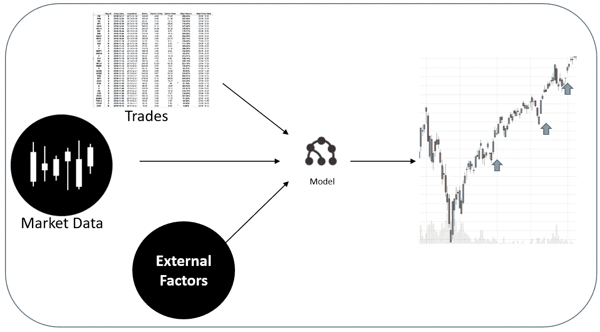
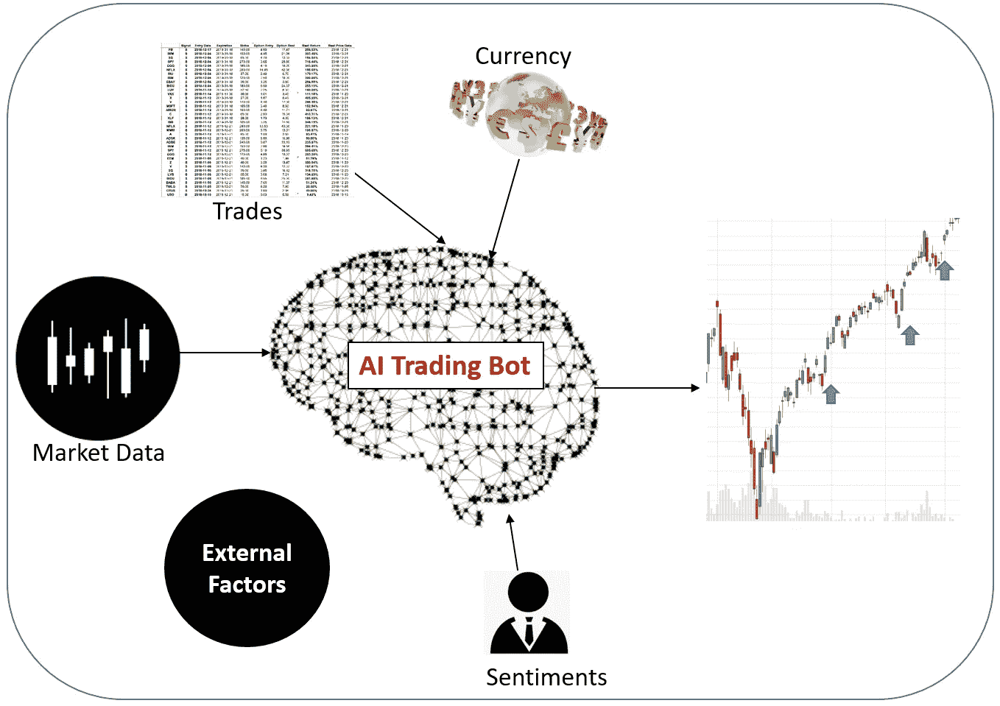

# 当算法出错时，谁负责？

> 原文：<https://medium.com/hackernoon/who-is-accountable-when-algorithms-get-it-wrong-30f7be2a1541>

假设算法是比人类更快更好的决策者。还假设算法可以不知疲倦地工作，从错误中学习，并随着时间的推移变得更好。那是思维的理想状态。这通常是真的，只要是真的，一切都会很顺利。当假设不成立，事情误入歧途时，所有的指责游戏就开始了！

例如，在超级交易世界中，ML & AI 正被积极地用于推荐和执行交易，以便将性能提高到比人类对冲基金经理的性能好一个数量级。

这些算法旨在寻找时间敏感的模式，它们的胜率和风险回报比，并利用这些模式快速执行。尽管这些模型是挖掘出来的，但仍然有一个人的因素来审查所涉及的风险和模式的有效性。

随着趋势转向人工智能，它不仅学习模式(像 ML ),而且从经验中改进，并开始像人类一样思考什么是最好的方式。它学习知识并应用它们，就像人类大脑如何工作一样。在某个时候，随着人工智能发展出自己敏锐而强大的交易思维，任何人都很难理解它为什么会这样做和做出决定。

它可以开始在不同的账户中交易相同或多个工具的多头和空头，以利用短期机会，并用其他相关工具进行对冲。随着它学习得越来越多，它可能会开始执行非常复杂的多阶段策略，这是人类思维无法理解的。

只要这个策略继续赚钱，所有这些都很好。当策略事与愿违，因为市场变化而开始失败，或者因为另一个 AI 机器人玩了一个反制游戏，变得比正在使用的 AI 智能体更聪明？

bot 代理人造成的损失谁来负责？这种解释是一个悬而未决的问题。机器学习基于输入数据和参数进行学习。因此，如果输入数据有偏差，就会对预测产生影响。

另一方面，人工智能根据发生的事情学习、适应和改变它的策略。在这种情况下，谁对它所做的决定负责？制衡在哪里？你正在处理的情况是，你不知道为什么要做多或做空的假设。还有投资的金额和多样化，可以由代理人或人来完成。

这是一个没有明确答案的领域。随着越来越多的这种自动化资金管理公司开始扩展他们的解决方案，我们将开始看到一些真正的痛苦，这将是算法交易合规性的强大动力。

## **总结:使用道德标准进行持续监控**

所有这些都指向创造性遵从的需要。验证人工智能解决方案的行为是正确的，而不是变得流氓。这不是一次性的过程。它必须在一个持续的基础上完成，因为人工智能机器人每天都在通过改进其成功指标来学习和适应。我们拥有的所有指标都是衡量预测绩效的成功指标。需要新的伦理标准来衡量模型的行为是否正确和合乎伦理。