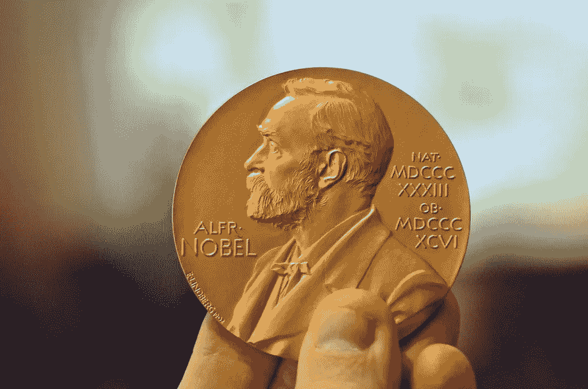

# 谁想获得诺贝尔奖？

> 原文：<https://medium.com/hackernoon/who-wants-to-win-a-nobel-prize-eb076e64718d>

## 人工智能、区块链和基因组技术如何引领生命科学革命

A new method to price health data could lead to Nobel-worthy insights, suggest two leaders in AI and genetics fields. (Flickr)

如果我们拍卖掉你身体中的所有元素——碳、氧、铁、钠等。——你的总价值约为 1 美元。五美元，如果你有合适的出价者，很明显。

但是，你不仅仅是微量元素和各种物质的大杂烩。此时此刻，在你的基因组中打转的，可能是导致癌症治愈的数据，为心脏病治疗铺平道路的见解，以及解决生命科学行业其他一系列万亿美元谜团的线索。甚至有办法将这些信息转化为情报，指导价值数十亿美元的营销决策。

那么，现在你身体和大脑的数据宝库值多少钱呢？几百万？几十亿？

这才是重点。没人知道。

一组研究人员建议，找到一种评估这些数据的方法可能是一项值得诺贝尔奖的努力，这可能会彻底改变医疗保健领域，他们补充说，这将使区块链技术更加有效。他们补充说，新技术的三驾马车可能会有所帮助。

哈佛医学院的遗传学教授乔治·丘奇(George Church)和哈佛大学的[Wyss 生物灵感工程](https://www.harvard.edu/)研究所的创始成员之一，以及 [Insilico Medicine](https://insilico.com/) 的首席执行官亚历克斯·扎沃龙科夫(Alex Zhavoronkov)最近在 [**Cell**](https://www.cell.com/trends/molecular-medicine/fulltext/S1471-4914%2819%2930104-2) 上发表了一篇论文，呼吁经济学家、数学家、生物技术学家、信息科学家、区块链专家和其他任何希望合作找到一种方法来估计人类健康数据价值的人。

根据研究人员的说法，制药公司目前购买和使用大量的人类健康数据，用于临床试验的研究和使用，以及营销目的。

“然而，很少有公司将这些数据转化为新的治疗产品，很难估计特定数据类型或组合的潜在效益，”Zhavoronkov 在最近的一篇媒体文章中写道。

在金融领域，既定的定价方法已经彻底改变了这个领域，创造了新的投资产品，并催生了万亿美元的衍生品市场。 [**布莱克-斯科尔斯模型**](https://www.investopedia.com/terms/b/blackscholes.asp) 或许是金融行业中最著名也是最重要的定价模型。该模型根据波动性、期权类型、标的股票价格、时间、执行价格和无风险利率等变量确定期权的公允价格。

> “随着区块链技术在医疗保健系统中的持续发展，数据安全性、患者数据隐私以及管理同意和与患者共享数据优势的能力变得比以往任何时候都更加重要。”

研究人员表示，人类健康数据比决定猪肚的价格和金锭的合理价格更敏感。隐私是一个大问题。尽管人工智能和大数据技术获得了越来越多的健康数据，在了解我们的健康方面取得了巨大的进步，但并不是每个人都同意捐献他们的数据，因为不是每个人都希望自己的个人健康数据在互联网上传播。

这就是**区块链**的用武之地。

Zhavoronkov 写道:“随着区块链技术在医疗保健系统中的持续发展，数据安全、患者数据隐私以及管理同意和与患者共享数据利益的能力变得比以往任何时候都更加重要。”

公共分类账可以帮助保护这些私人健康数据，以便由正确的人用于正确的目的，并由实际拥有数据的人(你和我)持续监控。它还可以创造一种方式来补偿我们为可能导致新的治愈和治疗的项目贡献我们的健康数据。

“在云中存储和处理医疗数据，或封闭的生态系统，这可以防止其非法使用，区块链技术可以通过允许他们从最初的数据销售中获利来增加患者的参与度，”Zhavoronkov 补充道。

这些独立的技术革命浪潮——区块链、人工智能和全基因组测序——可能会引发一场完美的海啸，催生一个让以布莱克-斯科尔斯(Black-Scholes)为动力的衍生品市场相形见绌的市场，并且可以说，将会以更深远的方式造福人类。

“除了这些防黑客的公共分类账，我们还有快速改进的全基因组测序和同态加密查询工具，以提供更好的隐私，这样许多人最终可以从了解和拥有自己的基因组中受益，”丘奇说。

那么，谁想治愈癌症，赢得诺贝尔奖，甚至成为亿万富翁呢？