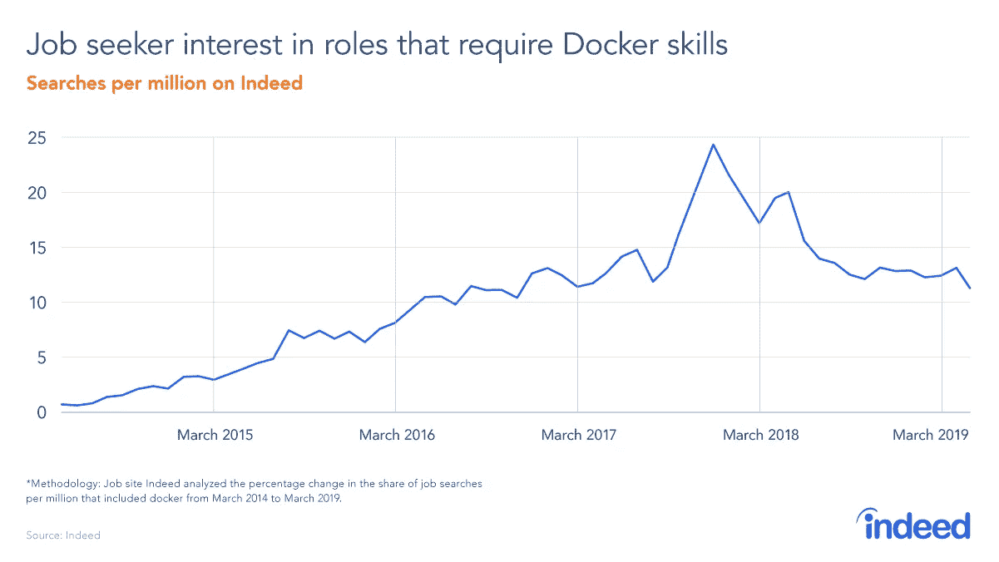

# 2019 年码头工人岗位谁在搜招？

> 原文：<https://medium.com/hackernoon/whos-searching-and-hiring-for-docker-jobs-in-2019-e66ab12d26>

容器和 Docker 在过去几年中改变了测试和软件工程，但 Docker [在 2018 年占容器](https://sysdig.com/blog/2018-docker-usage-report/)使用量的 83 %( 2019 年为 99%),这对求职者和雇主意味着什么？

[据 Seen by Indeed 数据](https://www.beseen.com/blog/talent/why-nows-the-time-to-search-for-a-docker-job/)显示，自 2014 年以来，要求码头工人技能的职位招聘增加惊人**9538.23%**。但是雇主需要的和求职者感兴趣的之间有很大的差距。在同一时期，搜索需要码头工人技能的角色的人“仅”增加了 **1，366.40%** 。

码头工人的供求之间不仅存在相当大的差距，而且这一差距还在继续扩大。下面，我们将讨论如何(以及在哪里)利用雇主需求和求职者兴趣之间的差距来获得下一份工作，包括为什么技术工人可能对 Docker 失去兴趣，以及最需要 Docker 技能的角色和公司。

# 码头工人需求升温，而求职者兴趣变冷

我们的数据显示，雇主渴望码头工人技能——自 2014 年以来，这种需求一直在稳步增长。仅在 2018 年 3 月和 2019 年 3 月之间，码头工人职位空缺**就增加了 49.24%** 。

但是，尽管雇主需求增加，工程师并不积极寻找码头工人的机会。2018 年 3 月至 2019 年 3 月，Docker 职位**的搜索量下降了 43.71%** ，与 Docker 职位搜索量激增的前一年形成鲜明对比，增长了 56.41%。

那么为什么雇主的需求大于求职者的兴趣呢？为什么求职者的兴趣在下降？有几种可能性。

# 对 Kubernetes 的内置支持

那么，为什么码头工人角色的搜索量在 2017 年 10 月大幅飙升？那时 Docker 宣布它正在为 Kuburnetes 构建本机支持，Kuburnetes 是 Docker 自己的 Swarm orchestration 工具的竞争对手，它使软件开发人员更容易部署数千(或数百万)个容器。

通过添加无缝的 Kubernetes 集成，Docker 有效地与它的一个竞争对手联合起来，成为一个更灵活的容器管理平台，吸引了那些希望将 Kubernetes 与 Docker 结合使用，但以前不能这样做的开发者和公司。

# 海里有更多的鲸鱼

Docker 是集装箱技术的先驱。但自 2013 年发布以来，该平台已经出现了源源不断的竞争对手，他们都在争夺软件开发人员、DevOps 工程师和其他技术专业人员的注意力。从 Kubernetes 到 Apache Mesos，从流浪者到牧场主，Docker 不再是唯一可用的容器选项。

# 易受黑客攻击

我们看到求职者的兴趣在 2018 年初至年中下降，大约在 Docker 开始遇到安全问题的时候。2018 年 6 月，Docker 团队从该平台的图像库中提取了 17 张恶意 Docker 图像。这些恶意内容最终让黑客获得了 9 万美元的比特币([在求职者中失去了光彩](https://www.beseen.com/blog/talent/crypto-and-blockchain-jobs/))。

不仅如此，2019 年初，Docker Hub 数据库的一个[安全漏洞](https://success.docker.com/article/docker-hub-user-notification)暴露了 19 万+用户的数据。

尽管存在这些安全问题，雇主的需求从未动摇过。这可能部分是由于在容器中运行的软件仍然比不在容器中运行的软件更安全。

# 云原生是前进的方向

越来越多的公司正在采用云原生技术 Docker 是在任何计算环境(包括云)中构建、发布和运行任何应用程序的事实标准。

事实上，在 2018 年底，Docker 就公布了[云原生应用捆绑包(CNAB)](https://blog.docker.com/2018/12/announcing-cloud-native-application-bundle-cnab/) ，这是与微软合作的项目，用于封装和运行分布式应用。这可能解释了为什么雇主兴趣在 2019 年初激增。

# 最适合申请的 5 个码头工人职位

想利用 Docker 需求增加的优势？根据 Indeed 上的招聘信息，以下是最需要码头工人技能的技术职位:

# DevOps 工程师

名列榜首的是 DevOps 工程师，他们打破了开发、发布和运营团队之间的沟通障碍，以更快、更频繁地交付软件。从自动化大规模企业系统到使用 Docker 构建和简化部署管道，DevOps 工程师使每天部署数百次成为可能，而不是每隔几天或几个月。

平均年薪:[【119，552 美元](https://www.indeed.com/salaries/Development-Operations-Engineer-Salaries)

典型的工作要求:技术领域的学士学位，加上使用 Docker、vagger 和/或 Kubernetes 构建容器以及使用 CI/CD 工具(例如 Ansible、Chef、Puppet)和 PowerShell、Ruby 或 Perl 等脚本语言的经验。

# 软件工程师/高级软件工程师

在这个角色中，您将使用 Docker 打包整个堆栈(如应用程序的库、框架和代码本身)，并将其作为一个单独的包来运输，而不必担心每个单独的组件是否会在不同的环境中运行。从金融到教育，几乎每个行业的软件工程师都使用 Docker 来更快更可靠地部署应用程序。

**平均年薪:**[107094 美元](https://www.indeed.com/salaries/Software-Engineer-Salaries)至[117927 美元](https://www.indeed.com/salaries/Senior-Software-Engineer-Salaries)

典型的工作要求:计算机科学或相关领域的学士学位，加上 Java、Scala、JavaScript 和/或 Python 技能，以及在敏捷环境中交付自动化解决方案的经验。

# 软件架构师

专注于 DevOps 的软件架构师利用他们在配置、自动化和运营方面的经验来重新定义架构、构建沟通渠道并做出高层次的设计选择。在这个职位上，您还将影响新功能的架构，推动自动化并设计创造性的解决方案来将数据移动到云。

平均年薪:[【141965 美元](https://www.indeed.com/salaries/Software-Architect-Salaries)

**典型工作要求:**计算机科学或工程学士或硕士学位，5 年以上软件或 DevOps 工程师经验，设计和构建分布式软件应用程序，并有实施现代云微服务架构的经验。

# 全栈开发者

在这个职位上，您将把 Docker 整合到开发组合中，以加速应用程序的生产、测试和部署。虽然 Docker 并不总是全栈开发人员的必备技能，但这一技能将改善您的开发工作流程，并帮助您在希望更快地将应用推向生产的雇主面前脱颖而出。

平均年薪:[【110，848 美元](https://www.indeed.com/salaries/Full-Stack-Developer-Salaries)

典型的工作要求:计算机科学或相关领域的学士学位，加上丰富的经验:数据库、后端语言、前端技术、网络服务和基本的设计技能。

# 云工程师

作为云工程师，您将利用 Docker 和其他工具来管理、自动化、扩展和监控云中的解决方案。您还可以集思广益，找到创新的方法来提高 Docker 和 Kubernetes 等容器编排平台的可靠性和性能。

平均年薪:[【118365 美元](https://www.indeed.com/salaries/Cloud-Engineer-Salaries)

**典型的工作要求:**计算机科学或相关领域的学士或硕士学位，加上用 AWS 或 Azure 构建云基础设施和微服务的经验，Scala、Java 或 Python 的技能，以及容器技术的知识。

**开始搜索** : [我们的云工程师顶级技能、城市和面试问题指南。](https://www.beseen.com/blog/talent/cloud-engineer-interview/)

# 招聘码头工人最多的公司

随着雇主兴趣的持续增长，我们研究了哪些美国雇主发布了最多需要码头工人技能的职位。以下是三家在生产中使用 Docker 来革新其开发流程的公司:

# 大写一

[Capital One](https://www.indeed.com/cmp/Capital-One) 的应用程序每天处理数百万笔交易，这意味着快速上市至关重要，尤其是在发布对抗欺诈威胁的新功能时。作为第一家采用云优先方法的美国银行，它也是技术创新的领导者。

事实上，Capital One 最近向公众发布了自己的容器编排平台 Critical Stack。该平台与 Kubernetes 兼容，之前在内部用于管理云基础设施，包括微服务和容器。尽管这意味着 Capital One 正在离开 Docker，但该公司仍在寻找拥有核心 Docker 技能的人才，以提高其应用交付的速度和灵活性，并进一步构建关键堆栈。

# 博思艾伦汉密尔顿

[Booz Allen Hamilton](https://www.indeed.com/cmp/Booz-Allen-Hamilton) 正在开创一个“dockerized”、云优先的政府，并引领政府数字化转型。其与 Docker 合作的“传统应用程序现代化(MTA)”项目正在帮助政府机构将他们的传统应用程序容器化。此外，Booz Allen 的 CodeLift 工具使客户能够使用 Docker 快速轻松地创建和部署容器应用程序。

除了集装箱技术的创新，员工们还对包容性的公司文化赞不绝口。“博思艾伦非常多元化，”一名员工说，“领导岗位上女性的数量给我留下了深刻印象。作为一名国防和航空领域的工程师，我在其他公司很少有女性同事或老板。

# 国际商用机器公司

[IBM](https://www.indeed.com/cmp/IBM) 早在 2014 年就成为第一家与 Docker 建立战略合作伙伴关系的企业，从那以后，它就一直在容器化应用领域掀起波澜。例如，面向 IBM Cloud 的 Docker 企业版(Docker EE)让其客户能够将现有应用转移到云，并通过 IBM Watson、IoT 和区块链等插件快速部署容器化应用。

一位软件工程师说，他们“喜欢和聪明而有经验的人一起研究新技术。”另一个人提到 IBM 的“高度协作和创新的文化，你周围都是才华横溢的人，他们也很好共事。”

*方法论:Indeed 分析了从 2014 年 3 月到 2019 年 3 月，Docker 在职位发布中具有 Docker 技能的职位发布比例的百分比变化，以及 Docker 每百万人的职位搜索比例。*