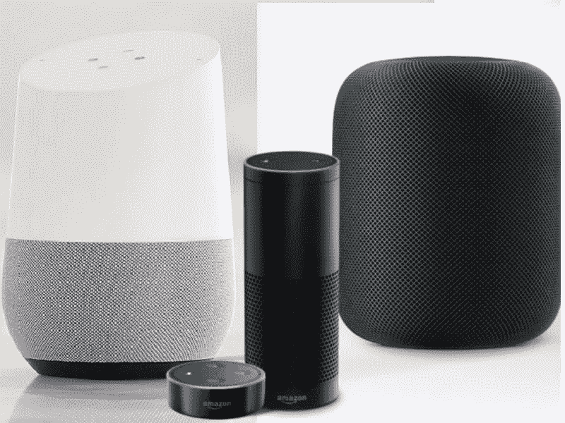

# 为什么亚马逊和谷歌要为引领语音优先经济而战

> 原文：<https://medium.com/hackernoon/why-amazon-and-google-are-fighting-to-lead-the-voice-first-economy-919917891f07>

到没有人会惊讶，CES 2019 的故事是亚马逊和谷歌之间领导新兴的语音优先世界的战斗。

CES 上充斥着由亚马逊的 Alexa 虚拟助手和谷歌助手驱动的闹钟和恒温器等产品的公告，引发了 CNET 的“[谁赢得了 CES 2019:亚马逊还是谷歌？](https://www.cnet.com/news/who-won-ces-2019-amazon-or-google/)《今日美国》 [CES 2019:谷歌 vs 亚马逊，谁赢了？](https://www.usatoday.com/story/tech/talkingtech/2019/01/11/hey-google-hey-alexa-who-won-ces-2019/2473306002/)

然而，在 CES 的余波中，有一个问题迫在眉睫:亚马逊和谷歌到底能从这场战斗中获得什么？

## **数字丰富**

亚马逊和谷歌都利用 CES 来说明他们在语音领域的领导地位(苹果、微软和三星当然是参与者，但不是语音领域的领导者，尽管苹果是一个强有力的挑战者)。谷歌[宣布](https://www.theverge.com/2019/1/7/18169939/google-assistant-billion-devices-feature-phones-ces-2019)谷歌助手在 10 亿台设备上，高于 2018 年 5 月的 5 亿台(这一数字是由默认包含谷歌助手的安卓手机的销售推动的)。亚马逊[披露](https://www.cnet.com/news/amazon-has-sold-more-than-100-million-alexa-devices/)已经售出超过 1 亿台依赖其 Alexa 虚拟助手的设备。此外，每天使用 Alexa 的人数——以及拥有不止一个亚马逊 Echo 智能音箱的人数——在 2018 年翻了一番。

与此同时，在 CES 期间，披露了更多有说服力的数字。根据 Edison Research 和 NPR 进行的研究，美国 5300 万成年人(或十分之二的美国人)至少拥有一个声控智能扬声器。家庭中智能扬声器的数量逐年增加了 78%。1 月 8 日，埃森哲[报告称](https://newsroom.accenture.com/news/smart-speaker-usage-booming-worldwide-accenture-study-finds.htm)全球一半的在线消费者使用数字语音助手，高于一年前的 42%。

这些数字并不意味着人们真的在用他们的声音从商家那里买东西。事实上，大多数人使用语音助手来执行日常任务，如听音乐和获取天气信息。但是使用数据仍然很重要。它表明，即使我们并没有生活在一个语音优先的世界，我们也正在实现这一目标——考虑到亚马逊 Echo 直到 2014 年才出现，而谷歌 Home 仅在两年后出现，我们实现得如此之快。此外，[到 2016 年](https://searchengineland.com/google-reveals-20-percent-queries-voice-queries-249917)，20%的谷歌移动查询是语音搜索。

语音的兴起也有助于解释为什么如此多的公司继续在 CES 上推出语音驱动的产品，2019 年也不例外。

## **小工具和软件集成**

CES 推出了一系列令人眼花缭乱的语音驱动产品，通常是通过谷歌助手或亚马逊 Alexa。这些产品通常专注于让人们更容易使用他们的声音在家里生活和驾驶汽车。例如:

***家中***

联想[宣布](https://voicebot.ai/2019/01/09/lenovo-made-a-google-assistant-smart-clock/)一款由谷歌助手驱动的闹钟。[凯膳怡](https://www.theverge.com/2019/1/6/18168917/kitchenaid-google-assistant-smart-display-splash-resistant-cooking-price-specs-features)和葛[推出了智能显示器，依靠谷歌助手来帮助你获取食谱、观看视频，以及做任何其他事情，让你在厨房里有事可做、娱乐身心。](https://www.theverge.com/2019/1/7/18170285/ge-google-netflix-spotify-exhaust-vent-smart-display-kitchen-hub-ces-2019)[current 的新智能墙壁插座](https://www.currant.com/)，可以通过 Alexa 和谷歌助手控制，监控能源使用情况，并建议自动关闭哪些产品以节省电量。Dalkin 智能恒温器与 Alexa 和谷歌助手配合使用，可以控制您家中的气候。

你可以在这里和这里了解更多关于主要产品发布的信息[。(2018 年 11 月，Recode](https://www.theverge.com/2019/1/10/18175524/google-assistant-devices-ces-2019-tvs-soundbars-smart-speakers-kitchen-bathroom-cars) [报道](https://www.recode.net/2018/11/12/17765390/voice-alexa-siri-assistant-amazon-echo-google-assistant)称，谷歌助手可与 10，000 台智能家居设备配合使用，而 Alexa 的智能家居设备只有 20，000 台。)但最有趣的产品，如 Currant 智能墙壁插座，使用人工智能不仅可以根据你的语音命令行事，还可以在没有你干预的情况下给你信息和管理你的家。

***上路***

亚马逊和谷歌都表明，Alexa 和谷歌助手也在为我们的移动生活提供动力。[谷歌正式将谷歌地图与谷歌助手](https://techcrunch.com/2019/01/08/google-assistant-is-coming-to-google-maps-today/)整合，这很重要，因为谷歌地图在移动寻路方面很受欢迎。正如 Mashable [提到的](https://mashable.com/article/google-assistant-google-maps-ces-2019/#wpr8Y3KyX5q1)，“谷歌设想用户向它询问回家的路线，或者附近的餐馆和保存的位置。你可以让助手在你的路线上搜索地点(比如加油站)，或者添加一个停靠点——所有这些过去都需要按几个按钮。”

亚马逊宣布加大对语音驱动汽车的开发力度。当亚马逊和 Telenav(一家联网汽车和基于位置的服务提供商)宣布建立关系时，CES 才刚刚开始，这使得司机可以使用 Telenav Alexa 驱动的导航系统来完成与谷歌地图相同的功能任务。然后亚马逊正式推出 [Amazon Echo](https://www.carscoops.com/2019/01/amazons-echo-auto-alexa-device-always-wanted-car/) 车载智能音箱。谷歌通过与 Anker 的 Roav 汽车配件的关系宣布了一个类似的产品，它本质上是汽车的[谷歌主页](https://www.cnet.com/roadshow/news/roav-bolt-is-like-a-tiny-google-home-for-your-car/)。

这些公告延续了一些人一直在进行的移动语音体验之战，谷歌、苹果和亚马逊都迅速推出了旨在成为不同汽车制造商事实上的信息娱乐系统的产品和软件。具有讽刺意味的是，主要汽车制造商一直在宣布 2018 年销量下降。但总体而言，在过去几年中，汽车行业一直是一个强劲的行业。现在汽车变得越来越智能。

## **他们想要什么？**

难怪一月份有这么多“谷歌对亚马逊”的故事。但比谁“赢得”CES 更重要的问题是，亚马逊和谷歌从所有这些语音产品中获得了什么？答案很简单:

> **拥有生态系统的公司将语音优先的世界货币化。**

拥有生态系统会带来实际利益，比如销售智能音箱获得的收入。亚马逊在智能音箱领域占据着强大的领导地位，但谷歌正在迎头赶上。截至 2019 年，亚马逊占据了智能扬声器市场 63.3%的份额，其中 Google Home 占 31%。除了收入，这些数字还有另一个重要原因:智能扬声器将人们与其他智能设备连接起来，从而成为产品集成的门户。埃森哲[在其全球智能助理用户调查中指出](https://newsroom.accenture.com/news/smart-speaker-usage-booming-worldwide-accenture-study-finds.htm)“全球有百分之二十三的消费者希望他们购买的家庭设备，如智能电视或电脑，能够方便地与他们的独立智能扬声器集成。”

***谷歌的动机***

对于谷歌来说，成为语音业务的支柱保护了该公司的在线广告业务，该业务占谷歌收入的 70%以上。谷歌需要[继续给人们理由](https://searchengineland.com/search-changes-google-changes-247228)继续使用谷歌搜索引擎、谷歌地图和谷歌 Chrome 网络浏览器等产品。当人们停留在谷歌上时，谷歌可以继续向广告商输送受众，并从受众行为中学习。随着人们使用语音，谷歌可以通过将语音纳入其产品，推出 Google Home 等新产品，并使谷歌助手成为其他公司产品的一部分，从而使他们留在谷歌上，这就是使用谷歌助手的闹钟、恒温器和汽车发挥作用。

但这并不全是为谷歌做广告。谷歌还希望智能语音助手使谷歌软件和硬件(如 Pixel phones) [更加有用和受欢迎](https://www.fool.com/investing/2018/10/14/alphabets-google-pixel-event-isnt-about-phones-its.aspx)，一个戏剧性的例子是谷歌的双工软件[，它可以代表人类打令人信服的电话](https://thenextweb.com/apps/2018/11/22/googles-ai-powered-duplex-calling-service-arrives-on-pixel-phones-in-the-us/)。

***亚马逊想要什么***

亚马逊有自己的动机。亚马逊已经是一个很受欢迎的产品搜索引擎，一半的网上购物者在亚马逊上开始他们的搜索。亚马逊还需要加入语音功能，以便在顾客使用语音变得更加舒适的时候留住他们——不仅仅是因为亚马逊希望他们用语音从亚马逊买东西，还因为亚马逊正在建立一个在线广告业务，这个业务已经是业内第三大，仅次于谷歌和脸书。

随着亚马逊创建自己的广告业务，它也需要向潜在的广告客户展示，它可以向他们提供受众——无论是在家里还是在路上，无论他们是使用语音还是文本来获得他们需要的东西。2018 年，[有报道称](https://www.cnbc.com/2018/01/02/amazon-alexa-is-opening-up-to-more-sponsored-product-ads.html)亚马逊正在与宝洁等广告巨头谈判，以允许他们在亚马逊 Echo 音箱上做广告。[亚马逊否认将允许通过 Alexa](https://martechtoday.com/amazon-vp-reaffirms-no-plans-for-ads-on-alexa-devices-228928) 做广告。但是，即使亚马逊本身不提供广告，它也可以使用语音来挖掘关于其客户的有价值的数据，这些数据对其广告商来说是有用的，就像谷歌一样。

亚马逊已经在与企业合作，将技能货币化。通过位于 Alexa skills 内的被称为[的技能内产品](https://developer.amazon.com/docs/in-skill-purchase/isp-faqs.html)的优质内容，企业可以出售游戏内货币等优质内容。例如，Stoked Skill 提供免费游戏，如[逃离房间](https://www.amazon.com/Stoked-Skills-LLC-Escape-Room/dp/B075J914W2/)和[逃离飞机](https://www.amazon.com/Stoked-Skills-LLC-Escape-Airplane/dp/B07CMB6DZQ/)。游戏设置为 Alexa 技能。玩家使用 Alexa 技能寻找线索，帮助他们逃离果冻细胞和汽车等空间。顾客可以付费购买可选的“提示”包(在技能产品中)，使他们更容易逃脱。

我可以看到亚马逊也向使用 Echo 的 Prime 客户提供品牌内容和产品，例如通过亚马逊 Echo Auto 独家解锁的当地餐馆折扣。这样做可以在没有更多侵入性广告的情况下将语音货币化，因为这些广告缺乏任何有用的优惠。

最后，亚马逊有其他计划在企业中实现语音货币化，如 [Alexa for Business](https://aws.amazon.com/alexaforbusiness/) 帮助企业使用 Alexa 提高员工生产率。[正如这些例子显示的](https://aws.amazon.com/blogs/business-productivity/category/business-productivity/alexa-for-business/)，公司正在使用 Alexa for Business 预订会议室，管理共享设备的连接状态，以及其他工作场所任务。但是亚马逊在企业中有竞争，最明显的是来自[苹果](https://www.salesforce.com/company/news-press/press-releases/2018/09/180924-g/)和[微软](https://blogs.microsoft.com/ai/cortana-for-enterprise/)。

## **应该做什么生意**

品牌有一个明确的使命:为一个语音优先的世界做好准备，一个现在由亚马逊和谷歌发号施令的世界。当消费者开始真正通过语音助手购买产品和服务时，品牌将需要与控制语音生态系统的公司合作。下面是 Recode [如何设想](https://www.recode.net/2018/11/12/17765390/voice-alexa-siri-assistant-amazon-echo-google-assistant)世界将如何发展一种方式:

> 工作原理:如果你让亚马逊的 Alexa 或谷歌助手去买，比如说，洗发水，他们会把他们认为你想要的东西展示出来。Alexa 使用几个标准来建议购买选项:你的订单历史，某个产品是否有资格享受免费的 Prime shipping，以及该产品是否有“亚马逊的选择”认证——“高评级、价格合理的产品可以立即发货。”
> 
> 谷歌从商家那里挑选与查询最相关的产品。它还考虑了购买历史和用户偏好信息，以及商品的可用性和邻近性。
> 
> 两家公司都表示，没有偏袒特定的零售商——或者他们自己的产品。
> 
> 品牌也不能为知名度付费——目前还不能。目前，亚马逊和谷歌正试图通过尽可能提高搜索结果的相关性，在为数不多的新语音买家中建立信任。然而，不需要太多的想象力就可以看到未来亚马逊或谷歌的商家可以付费让他们的智能助手推荐他们的产品——比如挤满他们网站的赞助广告——作为产生更多广告收入的一种方式。

如今，企业通过创造有时聪明且有创意的基于语音的品牌建设体验来参与其中，例如 HBO 的声控 [Westworld](https://www.adweek.com/creativity/you-can-now-explore-the-depths-of-westworld-by-talking-to-alexa/) 游戏，在该游戏中，人们使用 Alexa 探索神秘的西部世界。其他企业已经创建了自己的品牌 Alexa 技能。凭借 [Tide 的去污剂技能](https://www.amazon.com/P-G-Productions-Tide-Remover/dp/B01M9B7ZTB)，你可以通过 Alexa 获得与你分享的去污剂使用说明。坎贝尔通过[坎贝尔厨房](https://www.amazon.com/Campbells-Kitchen/dp/B017OBWHCQ)提供食谱。据推测，如果他们愿意，这些企业可以提供技能型产品，例如 HBO 提供了一款顶级的西部世界游戏供购买。企业正在优化他们的内容，以便通过语音搜索找到。

亚马逊和谷歌并不是唯一承担重任的公司，但它们正在引领一个语音优先的世界。聪明的公司会跟着他们走。