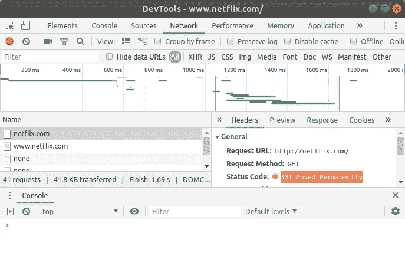
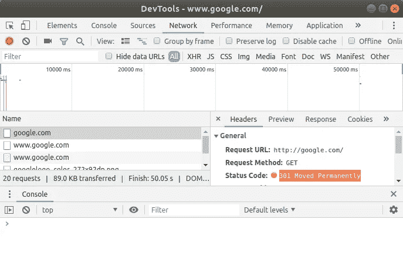
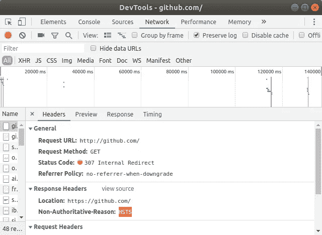

# 为什么我们(仍然)在互联网上发送这么多未加密的网络流量？

> 原文：<https://medium.com/hackernoon/why-are-we-still-sending-so-much-web-traffic-unencrypted-over-the-internet-383317b758ec>

Image credit: Bernard Hermant from [Unsplash](https://unsplash.com/photos/X0EtNWqMnq8)

现在是 2019 年，但仍然有大约 25%的互联网网站是在没有加密的情况下访问的。我们来看看为什么。

这是关于公共 Wi-Fi 不安全的三部分系列的第二部分。在第 1 部分中，[我展示了](https://hackernoon.com/a-hacker-intercepted-your-wifi-traffic-stole-your-contacts-passwords-financial-data-heres-how-4fc0df9ff152)即使在今天，黑客也可以很容易地攻击公共 Wi-Fi 网络的用户。我[开发了一个工具](https://github.com/pdub/packetbeacon)来捕捉公共 Wi-Fi 上发生的潜在不安全活动有多普遍，并将结果与谷歌的类似报告进行了比较。

> 结果一直很惨淡:[大约四分之一的网站访问没有使用 HTTPS](https://hackernoon.com/a-hacker-intercepted-your-wifi-traffic-stole-your-contacts-passwords-financial-data-heres-how-4fc0df9ff152) 。

我很好奇为什么在未加密的 HTTP 上会有这么多的流量，但这需要在更深的层次上检查数据包。我觉得监狱听起来不好玩。所以，回到家里，我建立了一个小的数据包捕获实验室来捕获，然后使用 Wireshark 深入检查我自己的个人流量，看看它是否能揭示到底发生了什么。

这是我的发现。

## 摘要

*   **网络的大部分流量都没有加密——原因不明**
*   **包括 google.com、netflix.com 和一些主要金融机构在内的热门网站不正确地设置了与安全相关的 HTTP 报头，可能会使用户遭受中间人攻击**
*   **DNS 仍在破坏互联网安全的尝试**
*   **互联网的信任链非常复杂，难以正确实施**

# 热门网站对 HTTPS 的要求不够严格

打开一些现有的 web 浏览器选项卡，并且已经登录到服务(电子邮件、社交媒体、银行)，我的流量看起来相当安全，当我连接到我的测试网络时只有一个初始 HTTP 数据包(由我的操作系统生成，用于测试和查看它是否在强制网络门户后面)。使用 HTTP 探测网络没有害处(除了将我的操作系统暴露给任何窥探特定网络的人)。

接下来要测试的是，如果我关闭一个标签，然后试图重新访问我之前在 HTTPS 访问过的一个网站，会发生什么。即使我没有在 URL 开头指定“https://”,我的浏览器会自动知道通过 HTTPS 发送所有流量吗？如果网站正确实施 HTTP 严格传输安全(HSTS)策略，就会发生这种情况，这就像使用 301 重定向从 HTTP 切换到 HTTPS，然后通过 HTTPS 用一个特殊的 HTTP 头`Strict-Transport-Security`进行响应一样简单。

当我打开一个新标签，输入“google.com”(故意省略了“https://”)时，我以为 HSTS 政策会起作用，自动强制 https 在明文 HTTP 上发送哪怕一个数据包。

## 谷歌，世界上访问量最大的网站之一，必须正确实现 HSTS，对吗？

没有。

我进入“netflix.com ”,期待 HSTS 政策的出台。

*没有。*

疯狂地，我访问了一个流行的银行网站，关闭标签，打开一个新的标签，并尝试。我尝试了几个额外的热门网站。

没有。没有。没有。没有。

我在 Firefox 和 Chrome 上都进行了测试，得到了相同的结果，但随后我注意到“accounts . Google . com”*是否执行了 HSTS 政策。这让我恍然大悟:HSTS(有时)只对热门网站的子域名强制执行，而不是母域名。*

我确认了“www.google.com”和“www.netflix.com”从来不经过 HTTP，根“github . com”*(干得好，Github，做得对！)*显示浏览器正在正确执行 HSTS 策略，但是…

> **…包括谷歌和网飞在内的大多数流行网站都只为子域名而不是其父域名设置 HSTS 政策，或者根本不设置 HSTS。**
> 
> **这削弱了 HSTS 的整体优势，导致流量在未加密的情况下发送，并在任何共享或公共网络上创造了一个容易的攻击媒介。**

Popular websites failing to enforce HTTP Strict Transport Security for root domains, potentially exposing visitors to man-in-the-middle attacks (as of March 2019)

> ***一个简单的测试，看看 HTTP 是否执行了严格的传输安全:***
> 
> *1。在 Chrome 上的开发者工具中选择网络选项卡，然后输入您以前访问过的 URL(不带“https://”)。*
> 
> *2。如果您得到的状态 307 设置了响应头“非权威原因:HSTS ”,那么 HTTP 严格传输安全正在实施。如果有任何其他类型的重定向作为第一重定向，那么它不是。*

Great job, Github! You implemented HTTP Strict Transport Security properly!

好吧，这并不能解释我的分析器工具报告的所有不安全的 HTTP 流量，但非常令人担忧的是，只需要通过 HTTPS 访问的网站，包括许多试图执行严格的 HTTPS 政策的网站，都没有正确配置。这意味着不仔细检查 HTTPS 证书和 URL 的用户面临中间人(MITM)攻击和信息网络钓鱼的风险。不太好。

## 但是，HSTS 也不是一贯正确的。

还记得本系列[第 1 部分](https://hackernoon.com/a-hacker-intercepted-your-wifi-traffic-stole-your-contacts-passwords-financial-data-heres-how-4fc0df9ff152)中统计的 UDP 端口 123 吗？这是由网络时间协议(NTP)使用的，并且是完全未加密和未验证的。HSTS 通知 web 浏览器记住 HSTS 政策，直到设定的到期时间，但每个人的时钟都可以被篡改，只需执行 NTP MITM 攻击。

> 这意味着，通过简单地侵入时间，甚至对实施 HSTS 的网站来说，也有可能执行 [TLS/SSL 剥离攻击](https://blog.cloudflare.com/performing-preventing-ssl-stripping-a-plain-english-primer/)。

另外，HSTS 的使用也带来了相当大的隐私问题。想要跟踪个人在线行为的资源充足的机构可以像超级书签一样利用 HSTS。

# DNS 代表“恐龙”

这个问题源于域名系统(DNS)。DNS 是高效的，但它非常不安全，几十年来每个人都知道这一点。例如:

*   无法验证通过 DNS 接收的 IP 地址响应实际上是由我们想要的 DNS 服务器发送的，而不是某个中间人攻击者
*   DNS 查找没有加密
*   DNS 条目和 web 服务器加密之间也没有联系*(唯一的例外是域名密钥，我想是为了减少欺骗的垃圾邮件)*，所以有可能欺骗 DNS 回复指向邪恶的服务器，并利用 HSTS 策略并不总是正确配置的事实

*让我们来谈谈技术问题:*我不想让我的头被反 DNSSEC 的人群咬掉，所以我会在这里做我的尽职调查，并提到我并不是说我支持目前的 DNSSEC 协议，我完全知道有许多效率和管理方面令人头痛的问题[与](https://bugs.chromium.org/p/chromium/issues/detail?id=50874#c22) [DNSSEC](https://sockpuppet.org/stuff/dnssec-qa.html) / [丹麦](https://www.imperialviolet.org/2015/01/17/notdane.html)。我甚至喜欢 HTTP 公钥锁定的想法，也知道它的优点，但是密钥锁定已经死了，HSTS 也不足以保护公众。

所以，我要说的是:

> ***现在是 2019 年，我们仍在使用旧的、不安全的 DNS 系统，而且(尽管有像 HSTS 这样的技术),人们实际上仍然很容易受到非常可预防的方式的攻击。***

我是一名技术专家，所以让我问技术专家们这个问题:技术和它的实践者(我们)到底有什么问题，我们还没有实现一个解决方案，为什么这仍然是一个问题？我们一起来修互联网吧！这涉及到一个被称为*可用安全问题*的复杂讨论，但是让我们继续这个讨论，并把让技术更好地为使用它的人服务作为我们的首要任务。

Mic drop

# 为什么我们还没有修好互联网？

我需要比这篇文章更多的篇幅来回答“为什么？”完全质疑，但我要说的是，我们走到这一步(至少)有三重原因:

1.  **管理噩梦依然存在:**密钥锁定因加密密钥/证书需要不时更改而变得复杂，使用当前工具对此进行管理是一件非常令人头疼的事情(对系统管理员来说可用性很差)——以至于密钥锁定现在被[弃用并完全废弃](https://www.zdnet.com/article/google-chrome-72-removes-hpkp-deprecates-tls-1-0-and-tls-1-1/)
2.  **需要广博的知识和准确性:**安全性很难总是正确实现
3.  **我们懒(？):**自从有了一条*可能*的路径，人们*可以*安全地上网冲浪(尽管普通人和网站很难坚持不懈地这样做)，我们就失去了撕掉一切重新开始的紧迫感(和/或我们真的很愚蠢)

还有其他原因，但这个故事的寓意是，这是完全可以预防的，但它仍然没有被阻止，如果你仔细想想，这真的很糟糕。

# 在互联网上，我们信任

所有这些都由于以下事实而变得更加复杂:今天，因特网上的加密仍然依赖于可信的中央机构，确切地说是认证机构(CAs ),以便验证在客户端/浏览器和服务器之间发生的初始握手期间使用的加密密钥的真实性。更糟糕的是，哪些算法将被用来建立隐私完全是可变的，在最初的握手中确定，并且网络上充斥着(同时)不太安全/更安全的算法和版本的不匹配组合的客户端和服务器(这就是为什么 TLS 文章可能是所有维基百科中最长最丑的文章)。

## TLS 绝不是标准的，不应该被信任。

首先，在初始握手期间，希望与另一个实体“Bob”(例如，web 服务器)安全通信的客户端“Alice”(例如，web 浏览器)必须与 Bob 就“安全通信信道”的定义达成一致。接下来，为了让 Alice 与 Bob 建立所述安全通道(姑且称之为通道 1)，Alice 首先需要使用与 Bob 的另一个安全通道(通道 2)来交换密钥以加密通道 1；但是，为了知道信道 2 是安全的，Alice 首先用认证机构“Val”进行验证(通过信道 3 ),以确保窃听者“Eve”没有伪装成 Bob。

> 因此，为了让爱丽丝相信与鲍勃的通信是安全的，除了信任用于创建信道 1、2 和 3 的协议之外，爱丽丝还需要相信鲍勃不是愚蠢和/或懒惰的，并且相信瓦尔不是 NSA。
> 
> 这就是所谓的信任链。但是，[谁看守望者](https://groups.google.com/forum/#!topic/mozilla.dev.security.policy/tkk6KFunmZg)？[的解决方法是不信任任何人](https://en.wikipedia.org/wiki/Trust_no_one_(Internet_security))？

## 失去信任是唯一的出路。

我们需要一个所谓的“不可信”的互联网，其隐私和安全的运作方式与今天完全不同。但是，与“无信任”的安全范例听起来相反，它并不是真的要完全消除信任；相反，它是关于最小化信任导致的风险范围——少信任*少信任*。那是因为我们在互联网安全和隐私方面的问题[不是我们信任](https://www.schneier.com/news/archives/2012/02/bruce_schneier_on_tr.html)事物/人，问题是我们不知道谁*不*可以信任或者何时信任，我们也不总是知道我们将什么信息委托给他们。(毕竟，我们每天都相信很多事情和人，包括我们吃的食物不会毒害我们，我们乘坐的飞机不会坠毁。)

除了当今互联网上使用的信任链，还有其他模式。例如，[网络/信任网络](https://dzone.com/articles/trust-models-for-secure-network-connections)范例创建了一个分散/分布式信任模型，消除了单点故障。(信任链的问题在于每个环节都是单点故障，因此每个环节都增加了故障概率的乘数，而不是除数。)尽管如此，使用这些范例的解决方案还没有准备好投入使用。

# 结论

未来，互联网将采用不可信的安全模式，这将降低风险，增加透明度、问责制和审计。我们将信任系统和(虚拟的)政策，基于数学上可证明和可验证的保证，黑暗将被照亮和暴露。机构将被社区所取代，通过共识算法进行调整。这正发生在互联网协议栈的更高层次，系统被设计来取代我们如何治理、如何转移财富等。但是在较低的接入使能和应用传输层还没有发生。

有效的加密是我们所需要的吗？[绝对不是](https://hackernoon.com/im-harvesting-credit-card-numbers-and-passwords-from-your-site-here-s-how-9a8cb347c5b5)。但是，互联网是建立在信任系统上的，所有的信任模式都依赖于，首先，通过可靠的加密建立一个安全的通道。链的完整性不仅取决于其最薄弱的环节，而且可靠的安全通道是将任何环节连接在一起的基本物理原理。同样，一个可靠的信任网络必须建立在可靠的数学基础上。

> 在我的日常工作中， [Magic](https://magic.co/?utm_source=hackernoon&utm_medium=blog&utm_campaign=content) ，我们正在积极地解决这些问题，在默认情况下为互联网实现类似 VPN 的功能和基于功能的安全性。

> 【magic.co**或**[**https://github.com/magic-network**](https://github.com/magic-network)】了解更多信息并加入关于如何构建更安全、更高效的互联网的讨论

但是，这就是我们今天的处境。解决方案触手可及，甚至是众所周知的，但它们仍在等待实施者。这就是为什么今天你应该害怕使用公共 Wi-Fi(或任何共享网络)。这就是为什么你仍然必须使用 HTTPS 无处不在的浏览器插件，并始终使用一个有信誉的 VPN。在本系列的第 3 部分中，我将解决目前安全网上冲浪所需的一长串问题。