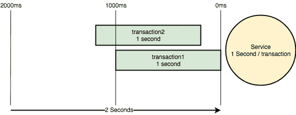
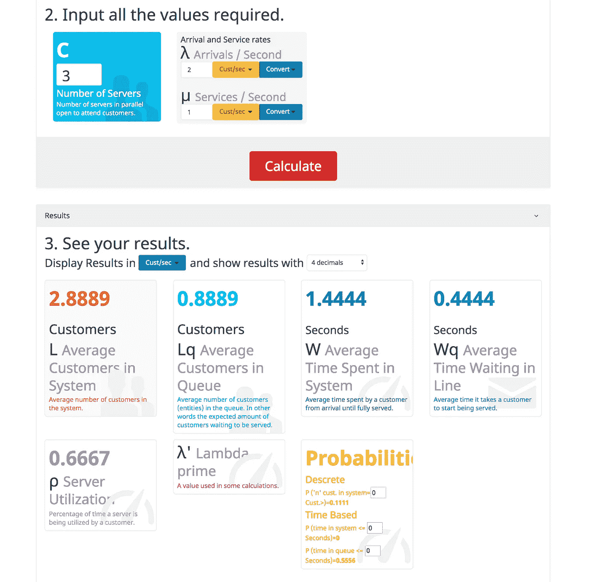
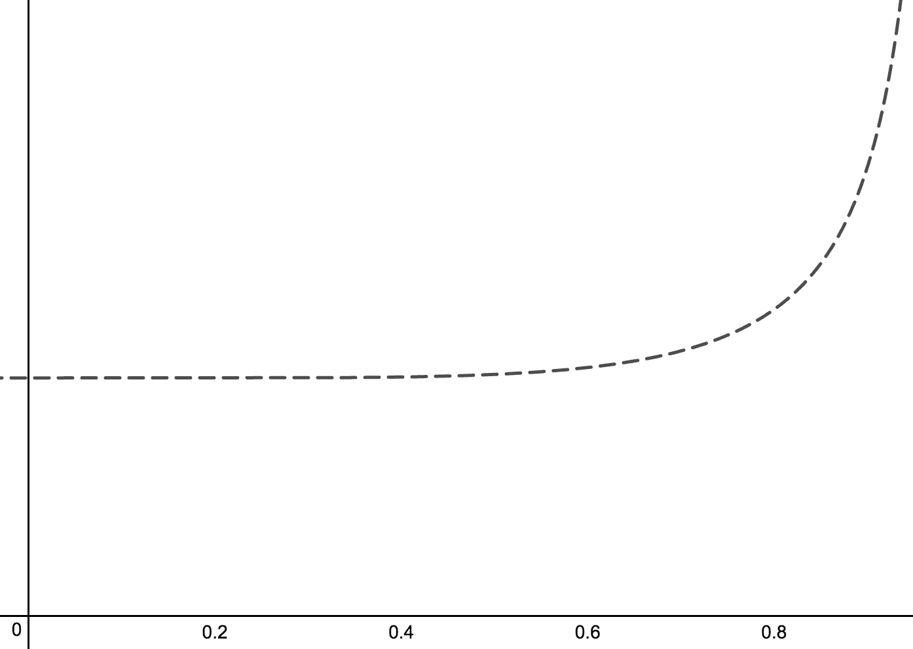
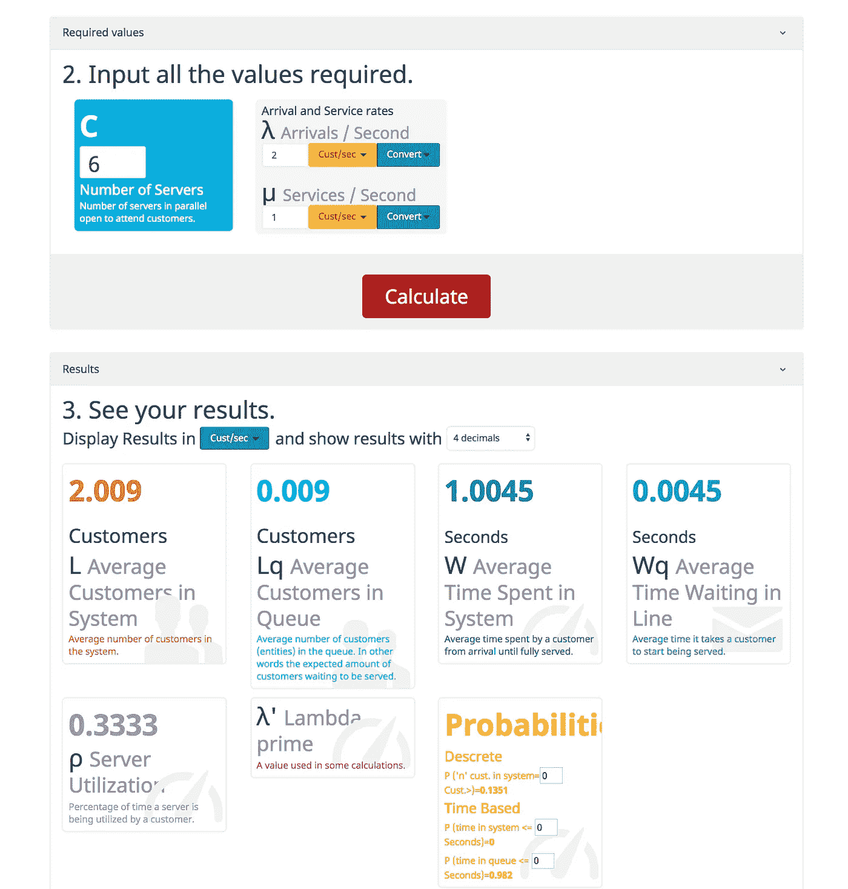
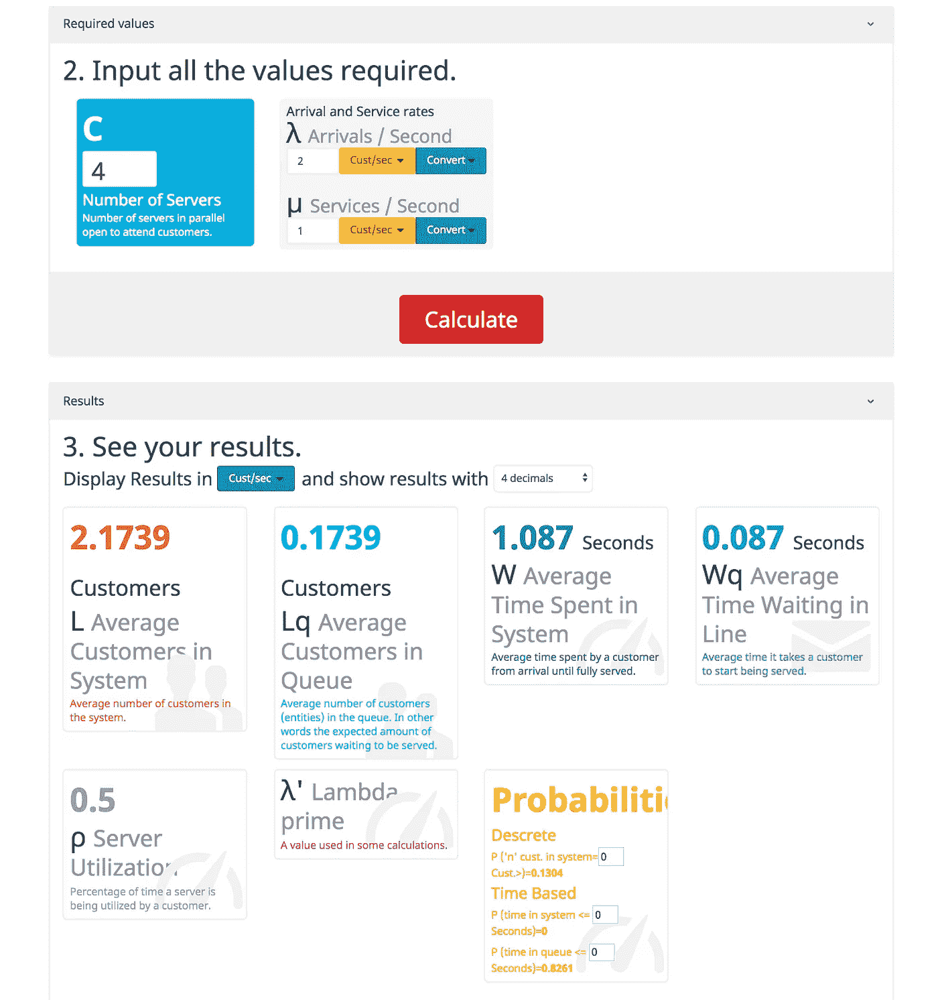
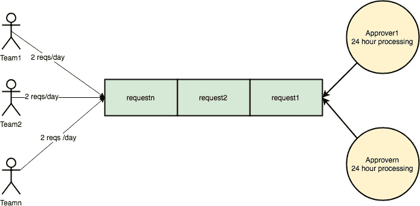
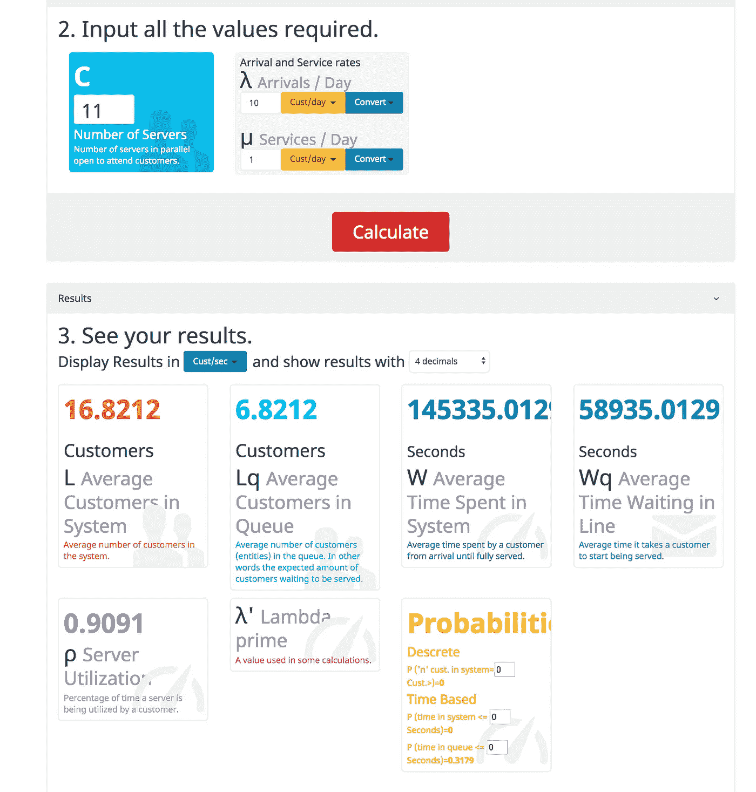

# 为什么容量规划需要排队论(没有复杂的数学)

> 原文：<https://medium.com/hackernoon/why-capacity-planning-needs-queueing-theory-without-the-hard-math-342a851e215c>

与严格基于速率的方法相比，使用排队论模拟来模拟容量规划可以更深入地了解系统性能和客户体验。本文详细说明了为什么排队论对于容量建模是必不可少的，并提供了两个使用排队论来建模容量的实例。第一个示例将为软件服务执行容量规划。第二个例子将一个组织过程建模为排队系统，以展示如何预测基于人的系统以及基于软件的系统的能力！我读过的许多关于排队论的文章都是数学内容。本文只需要基本的代数和一个排队论计算器。有很多[免费计算器可用](https://www.supositorio.com/rcalc/rcalclite.htm)；虽然数学仍然在引擎盖下，但没有必要理解它来使用排队论建模容量预测。

# 问题

假设一个服务在 1 秒钟内处理一个请求，每秒钟有 2 个请求。需要多少个服务实例来跟上负载并最小化处理时间(假设服务是完全可水平伸缩的)？直觉的答案是 2，但这只有在请求一个接一个地准时到达时才是正确的。为了说明这一点，考虑服务的单个实例的基本情况，以及每秒 1 的请求速率:

在现实世界中，请求的到达略有重叠，但是监控系统通常将它们聚合到每秒的速率，给人一种错误的印象，即所有的请求都在一条线上到达:

在上面的偏移到达中，transaction2 需要等待服务完成对 transaction1 的处理，然后才能开始处理它！transaction2 在系统中花费的总时间几乎是 2 秒(服务时间+等待时间)！排队论考虑了事务的偏移到达。

将我们的数据输入到一个排队论计算器 1 个请求/秒和 3 个服务显示了一些非常有趣的东西:

排队论计算能够模拟到达的随机分布。对于 3 种服务，系统中平均约有 0.9 个客户端！！这意味着每个请求必须等待另一个请求才能完成处理！！！每个请求平均延迟 1.4 秒！！！比预期多 40%！！

虽然这足以处理传入的负载(只要连接可以在某处排队(即 TCP 在服务器中通过[TCP backlog](https://stackoverflow.com/questions/36594400/what-is-backlog-in-tcp-connections)/[SOMAXCONN](https://linux.die.net/man/3/listen)进行排队)。即使有 66%的利用率，客户体验也会受到影响，因为他们花费更多的时间等待服务实例变得可用。这导致成本/延迟方面的折衷:

这张照片中的 x 轴是利用率百分比，y 轴是延迟。利用率为 100%时，成本效益最高，但服务将完全饱和，导致客户端请求排队。事实上，我个人认为这是 80/20 ( [帕累托原则](https://www.briantracy.com/blog/personal-success/how-to-use-the-80-20-rule-pareto-principle/))背后的直觉，因为性能在 80%的利用率时开始严重下降，这意味着攻击 20%的利用率是大多数成功/结果的原因。利用率和延迟之间的权衡是一个经过充分研究的领域，并使用[利特尔法则和通用可扩展性模型进行建模。虽然这非常有趣和有用，但超出了本文的范围。](https://math.stackexchange.com/questions/1979655/littles-law-queueing-theory-and-the-universal-scalability-law)

需要多少个实例才能提供接近 1 秒的完整事务时间(服务+等待)的良好客户端体验？**需要 6 个实例**来实现 1004 毫秒的平均客户等待时间:

与之相比，4 个实例在系统中花费的平均时间为 1087 毫秒(服务时间+等待时间):

基于速率的建模没有考虑这一点。在基于速率的建模方法下，n + 1 将建议使用 3 个服务，这将导致客户端的显著延迟。

# 能力规划组织系统

真正令人惊奇的是，排队论是一个抽象的模型，它不需要软件系统来工作。为了说明这一点，我们将把一个组织过程建模为一个排队系统，并在其上执行容量规划。

假设一家公司有一个手动更改批准步骤。这就要求每一个进入特定代码环境的 PR 都要经过认证批准人的手动批准。每次审批从开始(忽略周末)到标记为完成(24 小时服务时间)需要审批者大约 24 小时。这可能是因为审批者有自己需要关注的项目队列。接下来有 5 个团队，每个团队每个工作日产生大约 2 个需要批准的功能(2* 5 = 10 个请求/天):

将等待时间控制在 3 天以内需要多少审批人？通过将这些值直接代入排队论计算器，我们可以看到 11 个批准者提供了(145335 秒/ 60 秒/分钟/ 60 分钟/小时/ 24 小时/天)= 1.7 天的等待时间。通过对到达时间进行建模，排队理论能够洞察客户在系统中花费的总时间，这在严格基于速率的容量规划方法中是不可用的。

队列出现在大量基于人的系统和流程中:像电影院的物理线、快餐得来速、任何餐馆的任何线、JIRA、CI 管道、CD 管道、拉式请求审阅者、会议室调度、物理制造管道、呼叫中心容量，任何涉及选择适当数量的人来服务来自单个(或多个)工作的传入请求的事情。

# 结论

我希望这篇文章解释了为什么排队理论对于容量规划是必不可少的。它提供了对系统的观察，通过考虑到达分布，有助于对完整的客户端体验进行建模。虽然排队论背后的数学很复杂(至少对我来说)，但有许多免费的计算器可以让每个人都可以使用。最后，排队论不仅仅适用于软件系统。许多业务流程和系统可以建模为排队系统，从而能够使用排队论对其进行分析。我很感谢你读这篇文章！！

## 参考

*   [https://www.supositorio.com/rcalc/rcalclite.htm](https://www.supositorio.com/rcalc/rcalclite.htm)
*   [https://math . stack exchange . com/questions/1979655/Littles-law-queueing-theory-and-the-universal-scalability-law](https://math.stackexchange.com/questions/1979655/littles-law-queueing-theory-and-the-universal-scalability-law)
*   https://www.vividcortex.com/resources/queueing-theory[(与他们没有任何关系的巨大资源)](https://www.vividcortex.com/resources/queueing-theory)