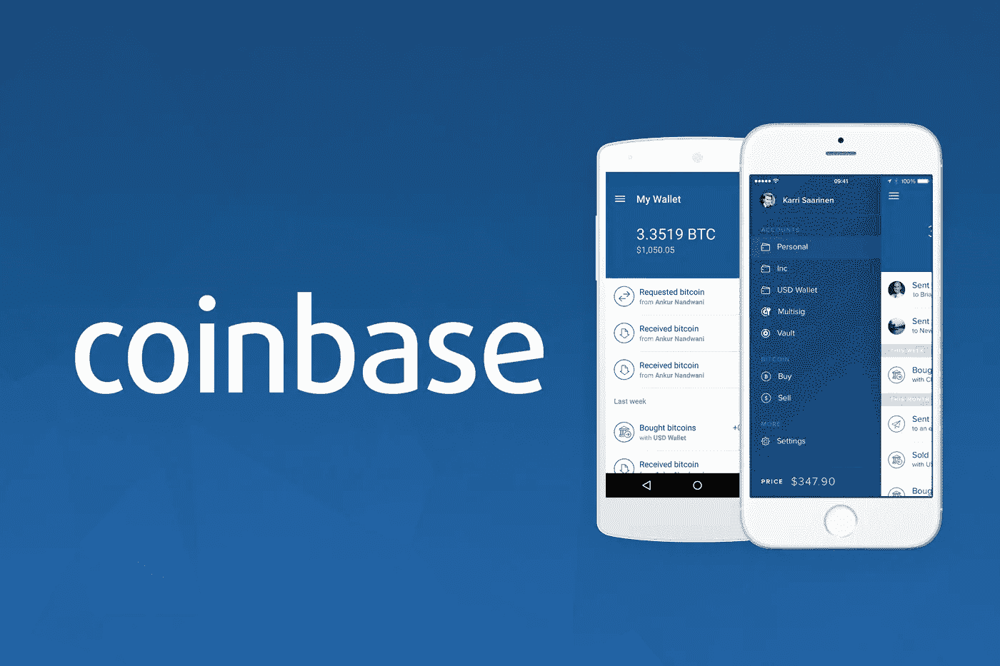
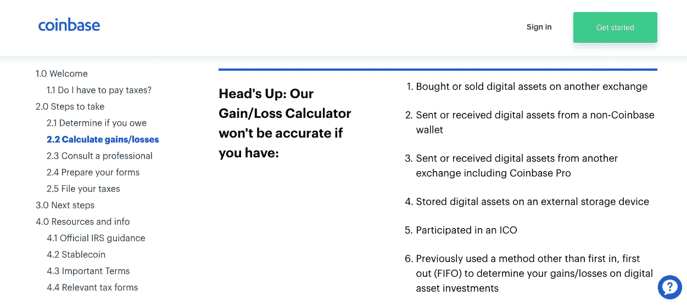

# 比特币基地难题:向用户提供准确的税务信息

> 原文：<https://medium.com/hackernoon/why-coinbase-cant-provide-accurate-tax-information-to-millions-of-its-users-ce99a92ab856>

比特币基地已经发展成为世界上最大、使用最广泛的加密货币交易所之一。截至本文撰写时，**在其平台上号称拥有超过 2500 万用户。尽管这一统计数据令人印象深刻，但当涉及到比特币基地税收时，该交易所无法向其数百万用户提供准确的文件，这有点令人震惊。这篇文章分析了为什么比特币基地的税收如此成问题，并提供了一个解决问题的方法。**

# **加密货币交易所**

**像比特币基地这样的加密货币交易所让日常消费者可以很容易地买卖加密货币。由于这些交易所运作的技术性质([区块链](https://hackernoon.com/tagged/blockchain))，用户能够将[比特币](https://hackernoon.com/tagged/bitcoin)和其他加密货币发送到他们自己网络之外的钱包地址。这种情况的一个例子看起来就像你通过比特币基地购买比特币，然后将它发送到币安的钱包地址，以在**币安上购买比特币基地不提供的新硬币和资产。****

****能够将加密货币发送到其他位置和其他钱包地址是整个加密前提的核心。然而，这一核心原则也是大规模比特币基地税收问题背后的罪魁祸首。****

# ****美国国税局如何对待加密货币的税收目的的快速概述****

****国税局出于税收目的将加密货币视为 [**财产**](https://www.cryptotrader.tax/blog/the-traders-guide-to-cryptocurrency-taxes) 。就像股票、债券、房地产等其他形式的财产一样，当你以高于购买价格的价格出售加密货币时，你就要承担纳税义务。****

****从这个意义上说，加密货币交易看起来类似于以税收为目的的股票交易。****

****例如，如果你在 2018 年 4 月以 1000 美元购买了 0.1 比特币，然后在两个月后以 2000 美元出售，你就有 1000 美元的资本利得。你在纳税申报单上申报这一收益，根据你所属的税级，你将为这一收益缴纳一定比例的税。税率的波动基于你的税收等级，也取决于它是短期收益还是长期收益。****

****另一方面，如果你以低于购买价格的价格出售了你的加密货币，你可以注销资本 [**损失，以节省税收**](https://www.cryptotrader.tax/blog/how-to-handle-your-bitcoin-and-crypto-losses-for-tax-purposes) 。****

# ****为什么比特币基地或其他交易所不能向我提供所需的税务报告？****

****要完全理解这个问题，你需要理解资本损益是如何计算的。要计算你的收益/损失，你只需运用这个公式:****

*****公允市场价值—成本基础=资本利得/损失*****

# ****什么是成本基础？****

****[**成本基础**](https://www.investopedia.com/terms/c/costbasis.asp) 是一项资产在纳税时的原值。在加密的世界里，你的成本基础本质上是你获得硬币的成本。以我们在比特币基地的例子为例，如果你在比特币基地花 1000 美元买了 0.1 个比特币，那么这个比特币的成本基础是 1000 美元。****

# ****什么是公平市场价值？****

****[**公允市场价值**](https://www.investopedia.com/terms/f/fairmarketvalue.asp) 就是一项资产在公开市场上的售价。同样，对于加密货币，公平市场价值是指在出售时硬币的美元价值。因此，如果我在比特币基地以 2000 美元的价格出售同样的比特币，这将是我的公平市场价值。****

****使用公式，你可以看到，在这种情况下，你有 1000 美元的资本收益。****

****2000 美元—1000 美元= 1000 美元收益****

# ****比特币基地税收问题****

****因此，这里有一个巨大的问题:因为你可以在任何时候将加密货币从其他平台发送到比特币基地，比特币基地不可能知道你是如何、何时、何地或以什么代价获得你发送的加密货币的。比特币基地只看到它出现在你的钱包里。****

****这意味着，无论何时你将加密资产从比特币基地转移到比特币基地，比特币基地都会完全失去向你提供准确税务信息的能力。这是因为它没有办法确定你在某种加密货币中的成本基础是什么，而这种加密货币是计算你资本损益的重要工具。****

****如下图所示，比特币基地向他们的用户解释说，如果你做了以下任何一件事，他们生成的税务报告都不会准确:****

1.  ****在另一个交易所买卖数字资产****
2.  ****从非比特币基地钱包发送或接收数字资产****
3.  ****从另一个交易所发送或接收数字资产，****
4.  ****将数字资产存储在外部存储设备上，或参与 ICO。****

********

****这是一个很大的例外，它可能会导致超过一半的比特币基地用户在准确报税时陷入困境。****

# ****更大的问题****

****你可能已经猜到了，这不仅仅影响到比特币基地。所有允许用户从其他平台(实际上是所有平台)发送和接收加密货币的加密货币交易所都面临同样的问题。****

****这意味着数百万加密货币用户无法依赖其交易所为他们提供准确的税务报告。交易所根本不可能这样做。****

****也许你已经看到了加密货币交易所用户在互联网上的所有疯狂帖子，因为他们试图从比特币基地和其他交易所生成税务报告，而这些报告完全不准确。****

# ****解决方案****

****该解决方案依赖于聚合您的所有加密货币数据，这些数据构成了您的购买、销售、交易、空投、分叉、开采的硬币、交换、互换和接收的加密货币，以构建包含所有必要数据的准确的税务档案。****

****这正是我们在 CryptoTrader.Tax 建立的****

****[**密码商。税务**](https://www.cryptotrader.tax/) 就是为了解决这个税务问题而为加密货币交易者打造的工具。它允许加密货币用户通过与交易所集成来聚合他们所有的历史交易数据，并使用户可以轻松地将一切纳入一个平台。一旦历史数据进入系统，税务引擎将自动生成所有必要的税务报告，供加密货币交易商像 8949 一样提交 [**。**](https://www.cryptotrader.tax/cryptocurrency-tax-reports)****

****如今，成千上万的用户使用 CryptoTrader。税务安全地自动构建出他们所需的 [**加密货币税务报表**](https://www.cryptotrader.tax/cryptocurrency-tax-reports) 。用户可以将这些生成的报告交给他们自己的税务专家，也可以简单地将它们上传到税务软件中，如 [**TurboTax**](https://turbotax.intuit.com/lp/ty18/online/temp_1.htm?znN=fln&znA=fi-dyn&ptr=cryptotrader&znTL=c4kWcKC1w&znTR=c1rzUtjvq&znC3=c4CNdkWIA&priorityCode=5708400000) 。****

****截至 2018 年 1 月，密码交易商。税务团队与 Intuit 的 TurboTax 合作，为交易者提供无缝、快速的申报流程。****

# ****概括起来****

****对数百万用户来说，比特币基地税是不准确的。如果你是许多面临这个问题的人之一，那么利用 CryptoTrader 等税收聚合工具可能是明智的。税收汇总一切并保持合规。****

******本文仅供参考，不应被理解为税务或投资建议。请告诉你自己的* [***加密税务专家***](https://www.cryptotrader.tax/crypto-tax-professionals) *、注册会计师或税务律师你应该如何对待数字货币的征税。*****

*****最初发布于*[*www . cryptotrader . tax*](https://www.cryptotrader.tax/blog/coinbase-taxes)*。*****