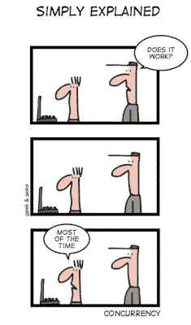

# 为什么并发很难？

> 原文：<https://medium.com/hackernoon/why-concurrency-is-hard-a45295e96114>

几周前，我受邀在当地一所大学谈论并发性。这篇文章总结了我在那里介绍的内容。

我们都是在大学期间或者通过其他方式学习并行/并发的。任何学习如何编程的人都不可避免地会阅读/学习一些基本概念，

*   线程、线程组、线程状态
*   竞争条件、互斥、死锁、饥饿
*   锁、障碍、线程局部变量、原子变量等等

**尽管并发仍然是主流，但我们发现它很难处理。为什么？**

# **一些观察:**

*   在关于并发性的介绍性材料和真实世界的并发/分布式应用程序之间有很大的差距。
*   我们大多数人最终都没有遵循最佳实践。
*   运用课本、入门内容(或从网上剪切粘贴)来解决问题。

# **那么最终结果会是什么呢？**

*   大量的技术债务。
*   应用程序性能/稳定性差。
*   没人懂密码！→许多不眠之夜/诅咒！

# **那么方法/解决方案是什么？**

由于我过去的经历，我开始深入研究这个问题，显然我不是唯一一个遭受痛苦的人。互联网上有很多关于如何解决这个问题的文献。这里有一个总结列表，我认为记住它是有帮助的:

规则#1:全局可变状态是坏的！(有或没有并发)

Ref: [https://www.reddit.com/r/AskReddit/comments/90ogan/whats_the_least_ethical_thing_youve_done_in_your/](https://www.reddit.com/r/AskReddit/comments/90ogan/whats_the_least_ethical_thing_youve_done_in_your/)

> **注意:**如果任何东西的状态随时间变化，那么它就是**可变的**，否则就是不可变的。
> 
> 例如全局静态变量、具有公共实例变量的静态类、单例对象、环境变量、配置对象、集群应用中共享的数据/状态的数量。

随着应用程序的规模和复杂性的增长(想象一下程序中有多个移动的部分，并且程序在集群环境中运行)，拥有大量的全局可变状态使得不可能预测程序在给定时间的下一个状态，尤其是当您处于故障排除模式时。更糟糕的是，你将无法控制状态变化。

现在，我不会成为一个理想主义者，说我们应该有一个零全球状态！因为不实用。但是有理由说我们需要把它保持在最低限度。

规则 2:使用应用程序框架——坚持它的编程模型。

我们写的大部分代码(=~ 90%？)是关于移动数据，例如，[获取数据→做某事→在 GUI 中显示或放入存储]。这意味着我们不处理，事实上也不必直接处理并发性。除非我们正在编写一些特殊用途的代码，比如编写我们自己的框架/服务器运行时。

每种编程语言和周围的生态系统都提供了更高级别的并发控制结构，因此我们大多数人不需要手动创建线程(同步块/锁等)。).这些范例中的大多数提供了简单的、基于组件的编程模型(例如，J2EE/Spring 中的 Beans、Servlets、控制器),允许应用程序员关注业务逻辑而不是样板代码。

因此，每当我们想要引入一个线程/同步块的时候，后退一步，合理地解释一下这个需求总是一个好主意。

**规则 3 —最佳实践**

这些中的大部分是显而易见的，适用于更广泛的软件工程。我的意思不是提供一个详尽的清单。但是请评论，如果我错过了什么需要在这里！

*   **减少全局变量/数据的使用**:使用正确的作用域。如果应用程序以这种模式运行，这需要发生在应用程序级别以及整个集群中。这包括正确定义应用程序中的组件/层，以及如何在每个相邻层之间交换数据/状态。
*   **最小化锁定范围**:让我们不要滥用同步，我遇到了太多这样的情况，我们倾向于默认使用同步来解决与并发相关的问题。同步越多，性能下降的可能性就越大。
*   线程池:这是一个显而易见的问题。创建线程需要大量的样板工作(和运行时开销)。如果有人想做，他/她生活在过去，试图重新发明轮子。
*   **使用更高层次的结构:**我们中的一些人可能不同意，但是我遇到的大多数数据共享需求都映射到消费者-生产者模式(及其变体)。任何编程语言都应该通过 is 并发包来支持这一点。为什么不使用它(例如在 Java 中是*Java . util . concurrent . blocking queue*的子类)。还有更复杂的替代方案可供选择，比如 LMax Disruptor(Java 版)、反应式编程(比如 RxJava、Akka、Spring Reactor)。
*   **线程架构:**并发不是我们以后要解决/设计的一个方面。思考以下问题:

> 数据访问模式(例如大量计算/大量 IO)
> 部署(例如虚拟机环境、容器、工业计算机)硬件/资源约束
> 错误处理/跟踪/调试。

# **结论**

*   当我们缺乏“工作知识”并且没有遵循最佳实践时，处理并发性就变得很困难。
*   应用程序中过多的全局可变状态是有问题的。
*   比起裸机，我更喜欢使用更高级别的并发控制结构(/ framework)。
*   预先选择/设计线程架构非常重要。

**幻灯片组:**

[https://www . slide share . net/rami thj/concurrency-why-its-hard-126939361](https://www.slideshare.net/ramithj/concurrency-why-its-hard-126939361)

# **参考文献:**

*   [https://smart bear . com/blog/test-and-monitor/why-Johnny-cant-write-threaded-programs/](https://smartbear.com/blog/test-and-monitor/why-johnny-cant-write-multithreaded-programs/)
*   [https://towards data science . com/is-concurrency-really-inclusion-the-performance-8cd 06 DD 762 f 6](https://towardsdatascience.com/is-concurrency-really-increases-the-performance-8cd06dd762f6)
*   [https://www . quora . com/What-s-some-some-good-and-bad-use-cases-for-concurrency-models-like-threading-actors-and-STM-Software-Transactional-Memory-When-I-should-choose-one-over-the-other](https://www.quora.com/What-are-some-good-and-bad-use-cases-for-concurrency-models-like-threading-actors-and-STM-Software-Transactional-Memory-When-should-I-choose-one-over-the-other)
*   [https://Joe arms . github . io/published/2016-01-26-The-independent-Side-Effects-of-a-Bad-Concurrency-model . html](https://joearms.github.io/published/2016-01-26-The-Unintentional-Side-Effects-of-a-Bad-Concurrency-Model.html)
*   并发——好的、坏的、丑陋的—[https://www.youtube.com/watch?v=OJfS7K-Vkgk](https://www.youtube.com/watch?v=OJfS7K-Vkgk)
*   [https://Java re visited . blogspot . com/2015/05/top-10-Java-multi threading-and . html](https://javarevisited.blogspot.com/2015/05/top-10-java-multithreading-and.html)
*   [https://www.youtube.com/watch?v=OJfS7K-Vkgk](https://www.youtube.com/watch?v=OJfS7K-Vkgk)