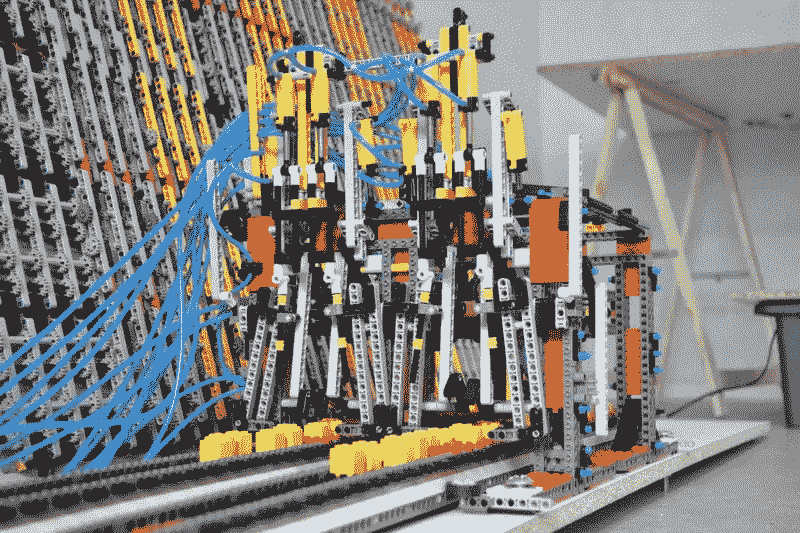

# 为什么开发区块链很难—第 1 部分:发布交易

> 原文：<https://medium.com/hackernoon/why-developing-for-the-blockchain-is-hard-part-1-posting-transactions-dde21c025c65>

我们在 [Alacris.io](https://alacris.io) 希望应用程序开发人员能够将他们的时间集中在他们应用程序的高层次设计上，即多方之间的经济互动。我们想让他们不必处理复杂的问题，比如过账交易。

等等，有人会说:过账交易复杂？不是已经有一个函数可以调用它了吗？好吧，是也不是。已经有一个功能对于简单的手动支付足够好了；但是这个函数失败得很惨，完全不适合用于对智能契约支持的分布式应用程序很重要的更复杂的情况。

When the simplest device (a Turing Machine) is already extremely complex…

# 缺少过帐交易的现有功能

当然，你会在 Ethereum JSON-RPC API，或者 Go、Javascript、Python、Rust 或你喜欢的语言的等效库中找到创建和提交事务的函数。但是调用这些函数中的一个并不能保证事务能够完成。如果您的应用程序在交互过程中崩溃了怎么办？如果你的以太坊节点客户端崩溃了怎么办？如果您是网络中断的受害者，该怎么办？如果你没有使用足够高的气限，或者使用足够高的气价，那该怎么办？如果您的交易输给了您发布的另一个交易，或者输给了其他人使用相同合同发布的交易，该怎么办？如果你的交易进入了一个区块，但是那个区块被一个更重的大叔逆转了怎么办？如果上述任何一种情况发生，不是由于不幸的事故，而是由于敌人的蓄意攻击，该怎么办？

在所有这些情况下，简单的答案是“在 10 分钟、30 分钟或 60 分钟后，检查交易是否通过，如果没有，再试一次。”只要你只是一个发送付款的人，并且不着急，这可能是一个足够好的答案。你所需要的只是你的“钱包”警告你交易失败，并建议你按下按钮，用更新的参数再试一次。无论如何，另一方的商家或贸易伙伴通常会耐心地等待付款通过，然后再做任何事情。所以现有的功能足以实现一个钱包。

现在，要编写一个不仅仅是支付钱包的应用程序，你需要的不止这些。在一个典型的“智能合约”中，一方或多方都要缴纳一大笔保证金，如果他们不能在严格的期限内完成合同承诺的交易，他们将会遭受损失。你的“交易后”功能在这样一个智能合同中足够好吗？如果它在 99%的情况下都有效，那就意味着每一百次就会有人失去他们的大额债券。这对你来说够好了吗？如果这个函数在 99.9999%的时间里都能工作，它仍然会在一百万次调用中失败一次。如果它每年被使用 10 亿次，这仍然是相当多的不满意的用户，每个人都损失了大量的钱。然而，99.9999%“六个九”的可靠性在实践中已经被认为是不容易实现的。你真的能让这个功能变得那么可靠，甚至更好吗？你能承受几个 9 的可靠性？又有多少是你不能不拥有的呢？当你的功能最终失败，因为世界与你作对，然后呢？请记住，在编写函数时，您不仅仅是在与偶然的失败几率作斗争:您还在与坏人故意阻挠您的企图作斗争，这些坏人会与您签订合同，这样他们就可以阻止您发布交易并收取您的部分保证金作为赔偿。即使他们不能从使你失败中获得赔偿，敌人和破坏者可能希望看到你失败，即使他们不能直接受益；精心策划的歹徒可能会威胁你，让你无法将债券作为人质，敲诈你，勒索你。在这种敌对的环境中，你的功能还会像你需要的那样可靠吗？

# 一个合适的交易后 API 会做什么

除了简单的钱包之外，现有的“交易后”功能根本不是分布式应用程序可用的功能 API。函数式 API 的全部目的是使编写调用 API 的自动化程序成为可能，让它发挥自己的魔力，而不必处理抽象层次以下的细节。一个适当的“交易后”功能将确保交易将通过，尽管所有潜在的问题都在程序的控制范围内:它将包括一个良好的算法模型，以跟踪网络中交易的进展。它将处理数据的持久性，这样应用程序在崩溃时也能存活。它将在多个数据中心维护多个应用程序副本，这样应用程序就不会“仅仅”被实施 DDoS 的敌人所阻挠。如果需要，它将通过虚拟电路和/或混合网络路由所有相关的通信，这样敌人就不能轻易地找到使用合同的机器并攻击它。它会自动重新计算随机数，以适应比赛条件。它将使用一些基于模型的明智策略来观察网络，并动态地调整使用什么样的天然气价格，以便通过参与交易空间的合适拍卖来抵抗大宗购买攻击(大宗购买攻击不仅仅是理论上的攻击，而是过去实际发生的事情:考虑 Fomo3D 合同的情况: [1](/coinmonks/how-the-winner-got-fomo3d-prize-a-detailed-explanation-b30a69b7813f) 、 [2](/coinmonks/the-buy-a-block-attack-c0ce845475d7) 、 [3](https://motherboard.vice.com/en_us/article/7xq38d/fomo3d-winner-clogged-ethereum-blockchain) )。总而言之，一个合适的“提交交易”功能将耐心地培育一批期望的交易，直到它们中的每一个最终以合适的顺序被提交并在区块链上被确认，一次且仅一次。

如果程序控制之外的一些问题仍然突然出现并阻止交易被发布，该怎么办？那么“交易后”功能将在为时已晚之前发送适当的警报。调用该函数的程序可以选择处理其中的一些警报；但是最终，不管什么警报没有被处理，都会被某个随叫随到的人看到。区块链操作系统将在这一点上接管角色，因为应用程序开发人员甚至无法访问处理这些复杂问题所需的整个上下文。该应用程序是否部署在手机上？要报警的用户是手机所有者，使用手机报警。应用程序是否部署在跨越不同大陆的三个数据中心的冗余网络上？要报警的用户可以是随叫随到的专业系统可靠性工程师。用户可能正在使用一个在编写应用程序时并不存在的专有警报系统，但是应用程序将会间接利用它，因为警报是操作系统提供的抽象的一部分，而不是应用程序本身的特性。使用什么样的警报机制取决于应用程序的部署配置。这不是应用程序开发人员的责任，他们不仅不能知道所有现有的部署情况，而且根据定义也不能预测将来才会出现的部署情况。让应用程序开发人员访问部署的细节并处理紧急情况实际上是一个很大的安全问题，违背了软件安全的所有良好实践。

现在，当应用程序失败时怎么办？随叫随到的人会从那里接手。除非你是一家大公司或有钱人，能提供软件操作工程师作为技术支持，否则这个随叫随到的人就是你。然后，*一个更好*功能 API 将使待命人员更容易评估情况并采取适当的行动:

*   在重试之前插回一些电缆，使用备用网络连接重试，
*   打电话给将通过不同网络为他发布交易的朋友，
*   使用更多天然气或更高天然气价格的不同参数，
*   放弃交易并失去债券，因为过账交易的成本终究会超过债券的价值，
*   仍然发布交易，并且损失比交易价值更多的汽油，因为发布失败会奖励坏人，或者会导致其他用户的信任和未来业务的损失，
*   使用智能合同中预见的一些替代执行路径或缓解策略，
*   接受对方的和解提议，而不是让聪明的法官做出不利于你的裁决，等等。

许多故障和恢复模式都是可能的，通常，痛苦地处理涉及超出所述函数范围的全局状态的恢复策略不是调用函数的责任。相反，区块链操作系统将从调用程序的规则结构中自动推导出这些监控交互。

然而，在采取任何行动之前，人类必须能够理解正在发生什么，什么交易被阻止，什么价值处于危险之中。因此，操作系统向人们提供检查调用程序结构的能力是至关重要的。用户界面应该使用户能够检查被中断程序的当前状态。这就是为什么程序通常不能用 Python、Go、Javascript 或任何此类“blub”语言编写为“仅仅”简单的函数调用的原因:程序必须用合适的领域特定语言(DSL)编写，由能够访问整个程序结构的元程序编译，而不仅仅是本地调用(尽管程序可以从以 blub 语言编写的元程序、以 Google TensorFlow 的风格或从以 blub 语言为目标的元程序构建)。用合适的 DSL 编写分布式应用程序还意味着这些应用程序可以模块化，如果编写得当，公共模块可以重用并组合成更大的应用程序。相比之下，将这些应用程序手工编写成过程化语言会导致所有的抽象泄漏，并使最终的程序不适合模块化组合。

# 走向区块链操作系统

总之，像“提交事务”这样看似简单的事情证明了分布式应用程序不应该使用现有的 API 编写，也不应该使用任何现有语言中表示为函数调用的 API。相反，它应该用为编写此类应用程序而设计的特定领域语言编写，运行在“区块链操作系统”之上，不仅可以提供强大的抽象和实施安全实践，还可以帮助人类处理紧急情况，具体取决于他们的特定部署配置。提交交易只是分布式应用程序众多方面中的一个，每个方面都必须正确处理。在 Alacris，我们认为这些方面最好由基础设施专家实施一次，然后在所有应用程序之间共享，而不是由每个应用程序开发人员脱离其常规角色并可能脱离其技能实施多次。这就是为什么我们在 [Alacris.io](https://alacris.io/) 正在构建一个区块链操作系统，它将为应用程序开发人员管理这些方面。

*本文是正在进行的题为“为什么区块链很难”的系列文章的第一篇每三周会发布一篇新文章。请关注我们的下一篇文章“计算合适的抵押品”*