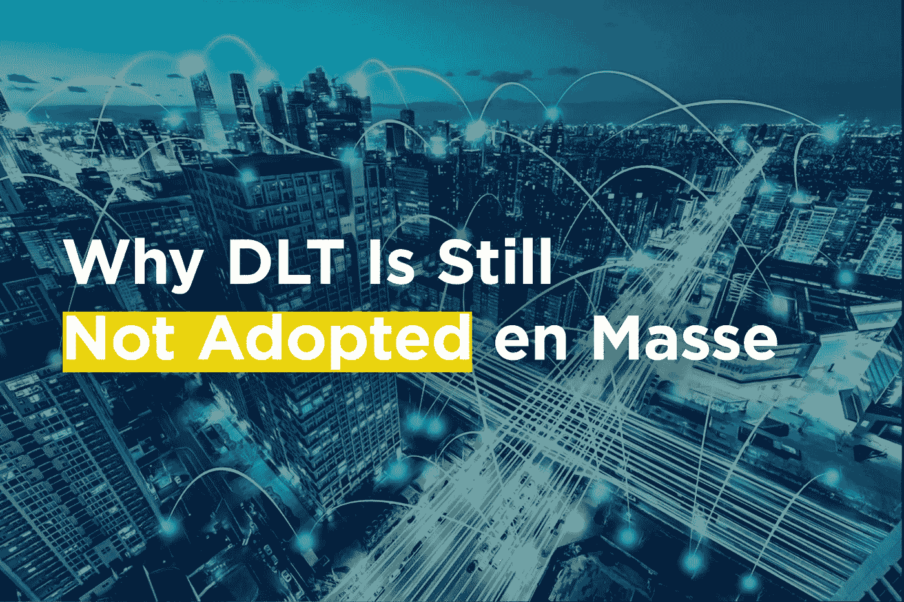

# 为什么 DLT 仍然没有被大规模采用

> 原文：<https://medium.com/hackernoon/why-dlt-is-still-not-adopted-en-masse-5617e28794ce>

## 第 3 层开发是区块链的下一步

区块链不兼容促使了[“第三层”的想法。](/geoprotocol/the-need-for-layer-3-on-the-internet-of-value-2a62f8e93160)区块链[技术](https://hackernoon.com/tagged/technology)是近年来被过度炒作的技术之一。至少可以说，它有严重的初期问题。在展现出能够彻底改变自上而下的关系模式的前景之后，现实世界中可实施的去中心化解决方案还有很长的路要走。由于吞吐量低和/或缺乏与其他区块链的兼容性，它们要么没有完全分散，要么可扩展性差。因此，真的没有生态系统集体采用它。在这篇文章中，我们将简要介绍现有区块链的主要痛点以及旨在缓解这些痛点的解决方案。

# 分散化与可伸缩性:非此即彼的故事

最令人失望的是，你不能同时获得区块链的所有优势。你必须选择其中之一。这种选择的必要性被称为 DCS 定理，该定理指出，在“去中心化——共识和可伸缩性”的三角形中，你只能实现两个选项

由于区块链的关键特征之一是去中心化，所以每个节点保留网络状态的完整副本。因此，区块链只能处理有限数量的交易。因此，能够处理负载的节点数量可以减少到最低限度，一切都恢复到原来的集中化。

如果没有 DCS 定理的两个首要品质——分权和共识——这个系统就失去了它最初的优势，并且不再服务于真正的分权和平等的目的。你越关注这两个目标，将系统应用到需要速度和可伸缩性的全球市场就越复杂。

虽然可扩展性问题已经由 2018 年风靡一时的第 2 层解决方案解决，但这不是本文的主要重点。

但是首先，让我们来看看它们都是什么。第 2 层解决方案是在由状态渠道或侧链代表的基本区块链之上的链外上层结构，它允许我们改变在交易对手之间达成共识的机制。基础层是为最敏感和安全性要求最高的事务以及来自侧链的锚定数据而保留的。

国家渠道的概念重新构想了交易对手之间达成共识的机制——它发生在网络的本地，而不是全球。为了利用国家通道，您必须创建一个支付通道，该通道的节点连接到一个更大的网络。交易对手之间建立的支付线允许他们交易任意多次。已执行事务的状态被传输到底层的区块链，因此被称为“状态通道”交易对手不必相互信任，因为他们的互动是以智能合约的形式指导和执行的。您可以打开多个状态通道，以便区块链的缩放不受限制。

最著名的第二层实现是比特币的液态和 RSK 侧链，以太坊的等离子体，以及 Lightning Network、Raiden Network 和 Celer Network 等项目。他们的要点是增加吞吐量，确保由高安全性存储支持的灵活性，并在网络的基础层传递价值。

如果我们转向 Lightning Network 的第 2 层的特定实现，该想法归结为通过在底层区块链中包括特殊的资金交易来打开两个用户之间的支付通道的能力。没有一个参与者可以任意取钱，因为双方都签署了对方的交易。

# 缺乏互操作性

另一个独立但相关的问题是缺乏互操作性，这是由单独开发的技术引起的，在实践中，这意味着不可能将零散的区块链生态系统结合起来自由交换价值观。

世界上有大量的不兼容问题没有从源头上消除。有不同类型的插座，右手和左手交通，或各种铁路轨距标准。我们中的许多人一生中至少乘过一次火车，跨越了不同道路标准的界限。铁轨之间仅几毫米的宽度差异就导致需要更换每节车厢下的车轮或将乘客转移到另一列火车上。在生产层面，不兼容的标准导致同一列车无法在西班牙和欧盟其他国家的线路上使用。这就需要厂商在个别定制技术节点的开发和测试上投入巨大。

区块链也是如此，它们都是用不同的语言编写的，并针对不同的任务进行配置。如果它们是可互操作的，我们将能够快速传递价值，而不依赖于集中的交换。但没有法律或协议强制开发商创建一个一刀切的网络。

没有一个与第二层相关的项目解决了这个问题，除了 Lighting Network 计划将它踢得更远。但是，在这个层面上解决互操作性的问题有可能吗？

> 支付系统和区块链之间的互操作性不足不是第 2 层解决方案的任务。确保独立生态系统的互操作性应该采取独立的生态位，即 [*第三层*](https://hackernoon.com/the-need-for-layer-3-on-the-internet-of-value-85ae3ab2a9ea) *。*

该项目着手推进[信任线](/geoprotocol/trustlines-are-the-new-iou-5a10fde5881a)的概念，它类似于闪电网络和雷电的双向通道。这种想法是基于那些参与特定交易的用户的本地共识，但以他们之间相互信任的形式而不是多重流动性的形式来实现。

这个系统是由不同区块链和数字支付平台上的用户网络推动的，这些用户相互信任，以签发和结算借条(我欠你的)。这意味着一个用户可以从另一个信任他的人那里借钱，然后发行一个令牌来承认这笔债务。参与者可以以连锁的形式创建一个相互信任的大型用户网络。这意味着两个互不信任的用户可以通过一个他们都有信任关系的公共中介进行交易。

另一个概念是 idea 复合渠道，它是由用户发行资产的[信用额度](/geoprotocol/trustlines-are-the-new-iou-5a10fde5881a)和加密货币锁定在链上 multisig 钱包中的经典国家渠道的组合。这将可伸缩性与对基础层[区块链](https://hackernoon.com/tagged/blockchain)或多重区块链的不信任结合在一起。

第三层技术的特性不仅允许为区块链，也允许为分散的跨链交换、支付系统、dApps 和物联网驱动的解决方案找到一种通用语言。第三层技术的全部意义在于，他们并不迷恋区块链，相反，他们帮助他们找到与传统金融系统的联系，从而加快分散技术的采用。这让我们能够将持有这些系统的不同价值结合成一个统一的价值互联网，各种类型的资产交换没有边界:加密货币、法定货币或几乎任何商品和服务的数字等价物。

# 结论

价值的交换可能通过分散的解决方案发生。然而，对区块链的痴迷和对权力下放的日益增长的承诺很难成为使其被大规模采纳的正确方式。提高吞吐量的现有区块链和辅助工具已不足以满足最终用户的需求，因为最终用户需要准备好通过 DLT 进行采购和资金转账。

可以肯定地说，专用区块链的互操作性及其与区块链和基于服务器的交换和支付系统的兼容性，将需要来自第 2 层、第 3 层以及更高层的开发人员的新解决方案。

## 遵循 GEO 协议:

[ [媒体](https://medium.com/geoprotocol/) | [推特](https://twitter.com/geo_protocol)|[GitHub](https://github.com/geo-protocol)|[Gitter](https://gitter.im/GEO_Protocol/)|[电报](https://t.me/geoprotocol)|[LinkedIn](https://www.linkedin.com/company/geoprotocol/)|[YouTube](https://www.youtube.com/channel/UC3jEvQvZAmCUXa7dCoX9_Lg/)]