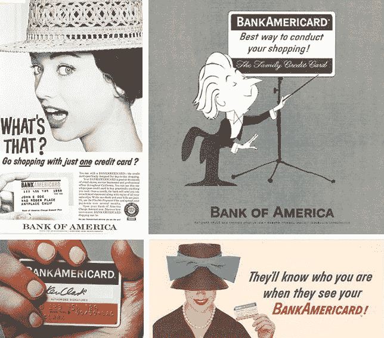

# 为什么 Crypto 里没人考虑发行？

> 原文：<https://medium.com/hackernoon/why-doesnt-anyone-in-crypto-think-about-distribution-3974e5bf7318>

加密货币是全球性的，可以使用。不需要注册，你可以开始与未经许可的区块链互动，在没有中间人或对手的情况下，将加密货币从用户账户转移到用户账户。然而，大多数加密货币依赖于网络效应商业模式，其中[加密货币](https://hackernoon.com/tagged/cryptocurrency)的好坏取决于使用和接受它的人。

尽管围绕加密货币有宣传和吸引力，但它尚未被大规模市场采用，很少有人在投机之外使用加密货币或功能性活动，如支付商品或服务。原因可能有两方面:

1.  项目或公司的产品是否适合市场？他们是否为特定的客户群解决了有意义的问题？
2.  公司和项目是否已经想出如何将产品分销给特定的客户群？

太多围绕加密货币开发产品的项目和公司还没有考虑好如何分发他们的产品。他们不能确保有意义的网络效应在想要相互交易的消费者之间发生。

**空投缺乏网络效应** 一种被称为“空投”的流行分发策略在过去被许多加密项目和公司采用。由于加密货币是无许可的，任何人都可以在未经许可的情况下向任何加密账户持有人发送加密货币。空投向加密账户持有者分发加密货币，希望在他们刚刚获得的加密货币中建立既得利益。

这种策略基本上是不成功的。空投假定产品市场适合一种超越投机的加密货币。这种情况很少发生，因此在市场上产生了出售新获得的加密货币的压力。此外，迄今为止，空投策略的分布范围很广，在货币交易者中几乎没有产生网络效应。

**加密需要“弗雷斯诺空投”而不是** 而不是广泛的分发策略，如空投，加密项目和公司应该向美国银行学习。该银行发行了第一张信用卡(现名为 Visa ),启动了他们的信用卡网络。为了发挥作用，该卡需要在消费者和商家之间建立强大的网络效应，他们都必须接受和使用它。此外，银行需要将该卡与当时流行的支付方式区分开来:支票和现金。

20 世纪 50 年代末，美国银行通过与数百家弗雷斯诺加州商户签约，开始了信用卡的本地化发行。然后，他们在几天时间里向弗雷斯诺居民的邮箱投放了 60，000 张信用卡。每张卡都有 500 美元的信用额度，这使得它比现金更好，因为它允许你轻松地花掉你没有的钱。:)这一革命性的分销计划创造了强大的网络效应，成为我们今天所知的美国银行信用卡网络的催化剂。这一出色的分销策略后来被称为“弗雷斯诺空投”

**脸书的“哈佛滴”** 脸书也通过在哈佛大学推出其社交网络开始了网络效应。然后，它通过限制注册用户使用“.”扩展到其他大学。edu”的地址。这些跨大学的本地化发布实现了强大、高质量的网络效应，使脸书迅速超越了现有的 Myspace，因为它提供了更高质量的连接和内容。

密码行业可以从这些例子中学习——既接受他们的成功，又避免他们的陷阱。虽然加密提供了广泛的吸引力和访问，但行业应该更强烈地优先考虑向较小的客户群和现有提供商服务不足的用例分发。与美国银行卡在其弗雷斯诺投放方法中专注于一个小地理区域的方式类似，加密项目和企业之间更专注的分发策略将有助于加密货币发展强大的网络效应，然后该行业可以将其带给更广泛、更全球化的受众。

阿什什