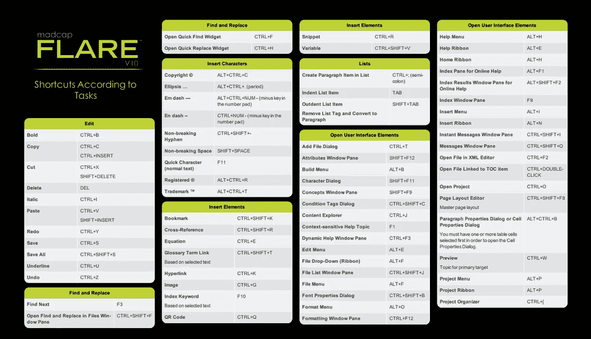

# 为什么“免费”不是帮助创作工具的答案

> 原文：<https://medium.com/hackernoon/why-free-isnt-your-answer-to-help-authoring-tools-512bd86015b1>

*Originally published by Catherine Heath at* [*document360.io*](https://document360.io/blog/why-free-isnt-your-answer-to-help-authoring-tools/)

投资于您的文档现在是必不可少的。39%的千禧一代会在联系支持人员寻求帮助之前[检查公司的文档](https://www.salesforce.com/hub/service/self-service-portals/)，自助服务现在是您的支持策略的一个预期部分。帮助创作工具(HATs)对任何企业来说都是一个有用的补充——无论您有一个技术作者团队，还是其他员工参与其中，对于想要改进产品或遵守法规的团队来说，制作文档仍然是必不可少的。

HATs 通常用于帮助您生成大量由技术写作团队集中管理的文档。

一些常见的帮助创作工具是行业标准，如 Madcap Flare 或 Adobe RoboHelp，它们使您能够跨一系列印刷和数字平台单一来源文档。现在有一些相对较新的产品，如我们自己的 SaaS 知识库软件 Document360，您可以使用它快速创建客户易于使用的现代文档网站。

不幸的是，由于一些帽子可能相当昂贵，所以很容易为你的业务寻找免费的选择。这些选项包括免费但专有的自托管解决方案、免费 SaaS(软件即服务)以及免费开源软件。如果你的主网站已经由 WordPress 托管，你也可以使用一些 WordPress 插件来添加知识库。

在本帖中，我们将详细讨论为什么免费的帮助创作工具可能不是您企业的最佳解决方案。

# 开源帮助创作工具有局限性

你可能听说过开源软件的好处，因为它是免费的，而且你可以获得实际的软件代码。在某些情况下，这对公司来说非常有吸引力——尤其是如果你想将代码集成到你自己的软件产品中。

另一方面，免费工具不能给你与付费软件解决方案相同的功能和支持——自然，你会得到你所支付的。自由软件通常开发一次，然后向公众发布，而不会收到大多数付费工具背后正在进行的开发。

[Sphinx](http://www.sphinx-doc.org/en/master/) 是一个具有活跃社区的开源帮助创作工具的例子。它可以生成 HTML 文件、Windows HTML 帮助文件和 PDF 文件(通过 Latex ),并且非常受 Python 社区的欢迎，因为 Sphinx 是为编写 Python 编程文档而开发的。Sphinx 没有陡峭的学习曲线，您可以制作看起来非常专业的文档。您使用纯文本标记格式编写文档， [reStructuredText](http://docutils.sourceforge.net/rst.html) 。

普通人习惯于大多数软件解决方案中常见的 WYSIWYG 文本和内容编辑模式，使用纯文本标记格式可能需要一些时间来学习。开源解决方案在某些情况下是好的，但你可能不会得到付费 SaaS 工具的现代、直观的所见即所得界面。

往往前端设计方面也是开源软件所欠缺的。关注点通常是技术上的健壮性，因为产品通常是由开发者单独开发的。开源软件通常面向比普通用户更多的技术用户，他们在日常工作流程中使用命令行这样的工具会很舒服。

开源软件也不完全是大多数人理解的“自由”。代码通常是免费的，但是工具背后的软件组织不会为你托管你的文件或者给你一个域名。你仍然需要支付托管费用，以及在自己的服务器上维护文档所需的任何其他服务或硬件费用。

# 自由软件通常过于技术化

对于自由软件，你可能无法在软件的编辑器中工作(因为它缺少编辑器)。您需要使用外部工具来创建文档。版本控制可能很困难，除非您使用 Git 或 Mercurial 这样的软件工作流工具，这是您的团队成员需要学习的另一个工具。

您的内部软件用户将需要具备更高级的技术能力，以及使用编程和命令行等工具的经验，而这对于编写您的文档的员工来说可能不是合适的技能组合。

一个备选方案是 [Gitbook](https://www.gitbook.com/?t=2) ，这是一个与 Github 集成的开源工具，通常用于软件文档。他们有一个免费的小团队版本，它包括一个所见即所得的界面，你只需点击几下就可以进入。它对非营利和开源团队也是免费的，所以如果你符合他们的类别，这个软件可能是你的组织的一个好选择。

总的来说，由于它们的 UX 限制，你可能会看到这些类型的工具需要更长的上市时间。如果你是一个倾向于技术的人，希望拥有一些文档，而不是一个销售产品的企业，那么它们会更好。

# 避免使用免费增值版的帮助创作工具

你可能还是想看看一些有更简单用户界面的免费工具——即有免费增值层的商业解决方案。对于许多企业来说，省钱可能是一个很有吸引力的前景，尤其是在经济困难时期，或者你不确定长期选择什么工具的时候。例如，HelpNDoc 对个人用户是免费的，只要你不将该软件用于商业目的，否则你需要升级到他们的付费订阅计划之一。

你也可以从 WordPress 插件库中使用一些免费的 WordPress 知识库插件。WordPress 是许多企业用于 CMS 和前端站点的开源网站发布平台，它也可以吸引人们留在同一个生态系统中。

使用免费的 WordPress 插件不如付费购买一个真正的帮助创作工具来得专业。客户希望公司为他们的文档提供一个现代化的用户界面。有了 WordPress 插件，你的知识库也将成为你的主网站主题的一个附件，你将在如何组织你的内容方面受到很大的限制。

# 付费帮助创作工具更适合商业

付费 SaaS 解决方案是许多想要最好产品并对长期投资感兴趣的公司的前进之路。尽管您支付了 SaaS 套餐，但您获得的服务包括实际软件、产品支持、软件托管和产品开发。你不只是为软件代码付费，这是大多数免费解决方案所能提供的。

像 Document360 这样的付费帮助创作工具的最终优势是您可以通过此类计划获得优质的软件支持。软件即服务的工作方式类似于外包部分 IT 部门，因此您可以获得灵活的服务，这些服务可以随着业务的发展而伸缩。SaaS 提供商支持您公司的员工使用最符合您需求的软件，这意味着您不必雇用更多员工来受益于最新技术。

像 Document360 这样的 SaaS 工具仍然是负担得起的，因为你只需为你使用的账户数量付费。它没有像 Madcap Flare 或 Adobe RoboHelp 等其他产品那样广泛的功能，因为它不仅仅针对企业市场。

# 交给你了！

免费的帮助创作工具对于那些正在开发自己的产品，并且不想花太多钱购买更多软件的人来说是一个可行的解决方案。开源解决方案通常面向那些习惯于定制自己的工作流程，并且不期望所见即所得界面的开发人员。避免支付同样多的前期费用是有吸引力的，但是当你的网站吸引了大量的流量时，支付虚拟主机的费用会变得非常昂贵。

自由软件解决方案对于那些需要扩大规模并要求供应商提供专业服务水平的公司来说并不是一个好的选择。像 [Madcap Flare](https://document360.io/blog/is-madcap-flare-help-authoring-tool-worth-its-price/) 和 RoboHelp 这样的帮助创作工具对一般公司来说相当昂贵，因为它们提供了广泛的功能，但也有更多负担得起的选择。

*原载于 2019 年 3 月 13 日*[*document 360 . io*](https://document360.io/blog/why-free-isnt-your-answer-to-help-authoring-tools/)*。*