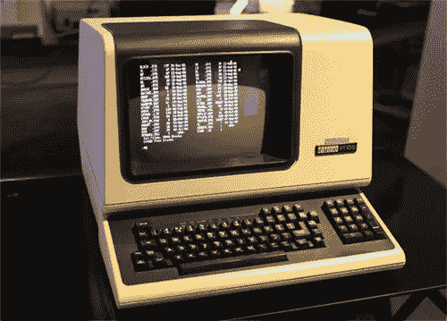
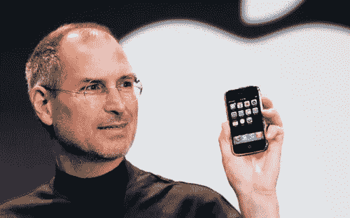
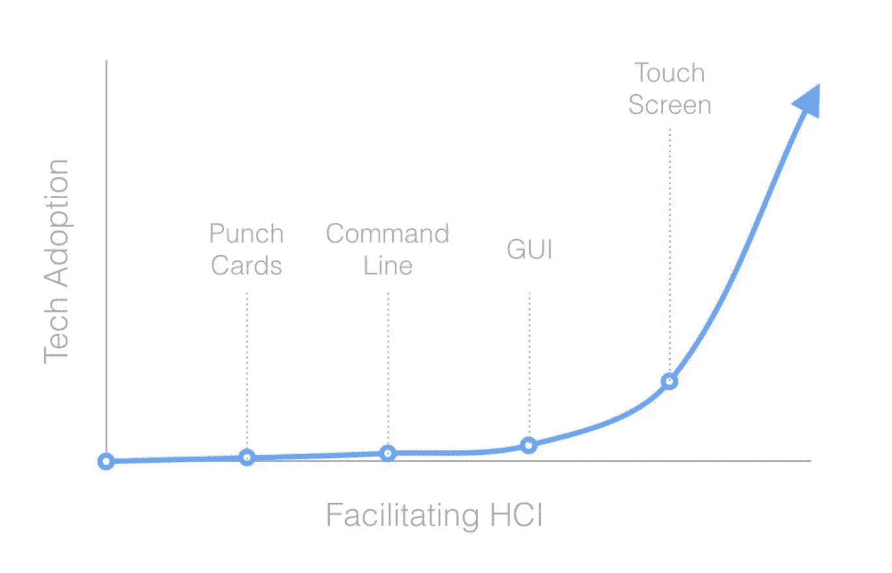
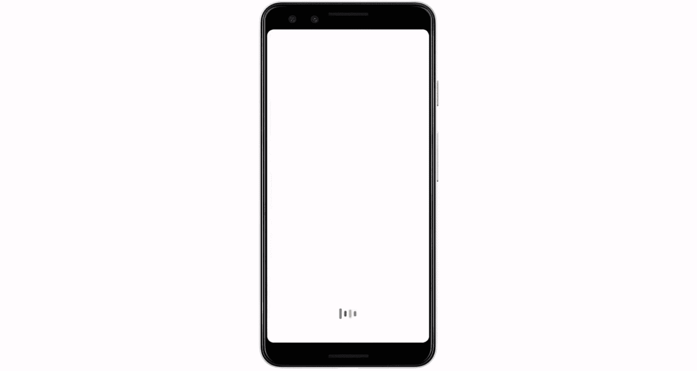

# Google Duplex 如何让用户界面设计过时

> 原文：<https://medium.com/hackernoon/why-google-duplex-might-make-my-design-job-redundant-311cd47b5120>

## 为什么 Google Duplex 对 UI 设计师来说很重要。

去年，谷歌用 Duplex 震惊了世界，这是一个可以为你打电话的人工智能助手。这个演示像病毒一样传播开来，引发了许多[伦理](https://techcrunch.com/2018/05/10/duplex-shows-google-failing-at-ethical-and-creative-ai-design/)和[哲学](/@LanceUlanoff/did-google-duplex-just-pass-the-turing-test-ffcfe6868b02)问题。

上个月，谷歌宣布了 Duplex 的更新:它现在可以为你使用网站。

这个声明可能不像去年那样有争议，但我相信它是迈向用户界面未来的变革性的一步。要理解为什么，让我们快速回顾一下 HCI 的历史。

# 从命令行界面到人工智能

自从计算机被发明以来，它就变得很奇怪，很难使用。技术的历史是一场让它们更人性化的持续战斗。

早期的计算机是一场噩梦。它们基于硬件的输入意味着你可以通过[转动一个沉重的金属手柄](https://youtu.be/0anIyVGeWOI?t=84)，给它们打孔[穿孔卡](https://en.wikipedia.org/wiki/Punched_card)，或者通过[移动物理开关和围绕](https://en.wikipedia.org/wiki/Bombe)的电缆来操作它们。这既乏味又缓慢。

The VT100 video terminal.

50 年代我们过渡到了 [**命令行界面**](https://en.wikipedia.org/wiki/Command-line_interface) **。这是使计算机更人性化的第一步，因为我们现在可以用语言操作它们:通过给它们写信。**

然而，计算机只能理解它们的语言:代码。尽管几十年来一直试图简化编程语言，但时至今日，学习编码对大多数人来说仍然遥不可及。

Apple’s Macintosh popularized the GUI

在 80 年代，我们用 [**图形用户界面**](https://en.wikipedia.org/wiki/History_of_the_graphical_user_interface) (GUI)和鼠标解决了这个问题。这使得人们可以不用编码就能使用计算机，并且将计算机带给了更多的用户。

尽管更容易使用，GUI 和鼠标并不完全直观。有些人仍然在与它们作斗争。为了让这些人正确使用电脑，我们需要在创新方面再有一次飞跃。

*Steve Jobs introducing the first iPhone.*

这一飞跃就是智能手机。更准确地说，是**触摸屏，**让我们可以用我们与生俱来的东西来使用电脑:我们的手指。

我相信触摸屏深深触动了人类的心弦。一岁的孩子会用智能手机就是最好的证明。

*Technology becomes more widespread as it becomes easier to use.*

从命令行界面到 GUI 和触摸屏，技术的历史一直是让计算机更直观的旅程——更接近我们人类的体验。

在这一过程中的每一步，我们都让更多的人可以使用电脑。虽然第一台电脑只能由少数专家使用，但今天，一岁大的儿童就可以轻松使用智能手机。这证明了我们取得的进步。

# AI 是新的用户界面

[正如我之前说过的](/swlh/no-ui-is-the-new-ui-ab3f7ecec6b3)，我相信人工智能是让计算机人性化的旅程的下一步。网络双工就是一个完美的例子。

[在演示](https://www.youtube.com/watch?v=Ta7M-KMPY4U)中，助手导航一个汽车租赁网站。它会填写表格，并根据您的过去历史为您做出选择。

*Duplex for Web uses AI to interact with websites.*

作为一名设计师，我花了几年时间学习如何让网站变得令人愉快和易于使用。看着人工智能瞬间填表感觉怪怪的。我情不自禁地想到了实现它所做的所有工作，只是为了让用户看一眼。

在某种程度上，双工使网站变得多余。像我这样的设计师现在面临的可能性是，我们可以通过完全删除它来优化体验，让人工智能与服务器交互。当然，该表单提供了关于所做决策的视觉反馈，但这也可以在助手中完成——这可能会使当前的设计角色结构变得多余。

有了网络双工，网站、菜单、表单和其他用户界面元素正在成为一个障碍——在你和你想要达到的目标之间有一堆缓慢而不必要的障碍。当你可以用简单的英语准确地告诉计算机你想要什么的时候，为什么还要花时间去浏览它们呢？

In a way, AI assistants are the new command line interfaces. Only now, the language is English instead of code.

命令行界面的主要问题之一是可发现性。使用它的人很难知道他们能做什么。这是当今聊天机器人的主要问题。GUI 通过直观地显示文件、文件夹和可能的操作解决了这个问题。

网络双工结合了两者的优点。表格以可视化的方式向你展示你能做什么，你可以用通俗易懂的英语告诉计算机你想要什么。这是两全其美。

# 结论

用户界面的目的是告诉计算机做什么。人工智能允许我们以更人性化的方式来做这件事。计算机视觉、T2、语音处理和 T4、自然语言处理方面的进步现在使计算机能够看、听、理解我们，甚至和我们说话。在这个世界里，AI 会慢慢成为新的操作系统。

就像几十年前的穿孔卡和命令行界面一样，GUI 最终会变得多余。设计师将不得不适应这种变化。网络双工是这一趋势的早期例子。它让我们一瞥用户界面的未来会是什么样子。

最终，AI 不会杀死 GUI，但是[之后发生的事情会杀死](https://en.wikipedia.org/wiki/Brain%E2%80%93computer_interface)。然而，这是另一篇文章的主题。

# 如果你喜欢或从中学到了什么，请点击👏鼓掌按钮。这有助于把这篇课文带给更多的人。

**亲提示:**最多可以拍 50 次:)

*我不隶属于复式项目。这些是我的观点，并不代表我雇主的观点。*

*本文首发于* [*下期网 06/29/19*](https://thenextweb.com/podium/2019/06/29/google-duplex-gui-ai-design/) *。*