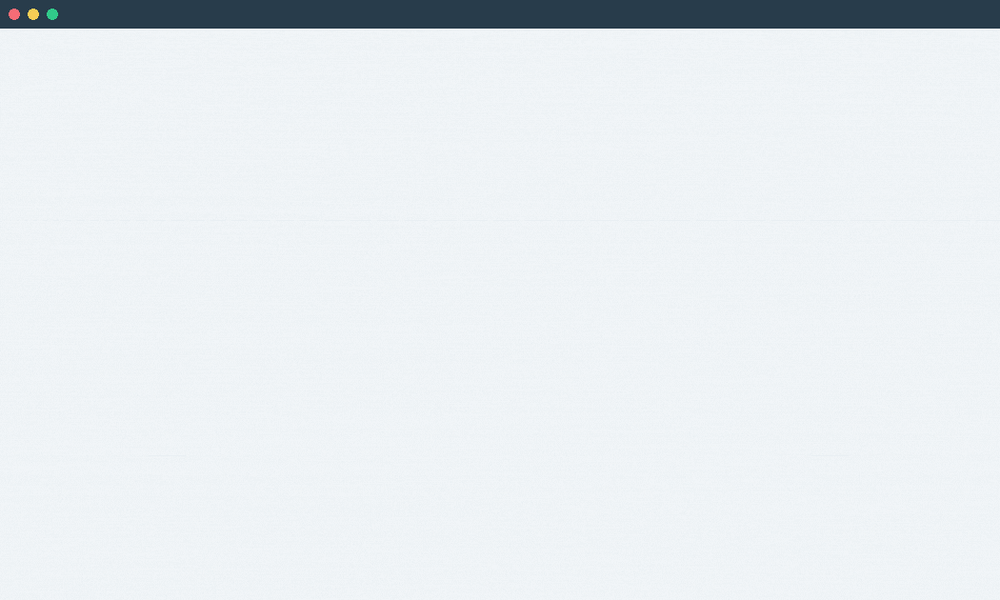

# 我为什么加入抛物线

> 原文：<https://medium.com/hackernoon/why-i-joined-parabola-b4ffd179638f>

几个月前，我开始找工作。除了通常的试金石，考虑产品、团队、角色等。我增加了一些复杂性。我想继续我的教育工作。

去年，我的研究兴趣把我带到了智利，在那里我作为富布赖特学者在公立高中教授计算机科学。我的研究问题很简单——基于技能的教育应该是什么样的？

回到旧金山后，我失望地发现，并没有多少教育科技公司给了我灵感。

输入[抛物线](https://parabola.io/)。从表面上看，这个产品可能与教育没有太大关系，但我看到了一个机会。抛物线为知识工作者提供了工程师的能力——一种创建脚本来分析数据的可视化方式。

这种事情经常发生。您的数据存放在几个不同的地方 Salesforce 中的销售线索数据、Dropbox 中的绩效数据以及 Google sheets 中的少量其他属性。您希望对它们进行一些分析，然后将结果转移到其他地方。“很有可能，您会希望在每个月底进行相同的分析。

通常，你面临两种选择。你可以很快地一遍又一遍地做同样的事情。也许允许自己涉足 Spotify 的罪恶快乐的一面，以度过最后一段时间。你唯一的另一个好的选择是麻烦一个工程师，让他们相信这是值得的。

抛物线提供了手工工作和完全工程解决方案之间的桥梁。抛物线没有重复流程或分配[工程](https://hackernoon.com/tagged/engineering) g 资源，而是提供了一种“提升情绪”的 Spotify 播放列表所没有的补救措施。

How to build flows with Parabola

通过创建一个“流”，即你可以对数据执行的一系列操作，你可以自动化掉许多你一直在重复的工作。抛物线提出的范例是:建立一次数据管道，这样你就可以随时运行它，从而消除重复工作的单调乏味

## 我认为抛物线是一种教育工具，一种使工程设计模式变得容易理解的工具

虽然抛物线用户不是在写代码，但他们是在[学习](https://hackernoon.com/tagged/learning)像工程师一样思考。创建抛物线流需要许多[设计](https://hackernoon.com/tagged/design)模式，这些模式允许工程师构建健壮的系统。

在抛物线中创建数据管道是一门研究如何设计、构建和测试系统的课程。我喜欢开发一个能加深用户知识库的产品，而不是回避将强大的工具放在用户手中的挑战。

## 但更重要的是，抛物线作为一个沙箱，用户通过实验学习这些设计模式

在我在智利进行研究项目的过程中，我迷上了学习的[建构主义理论](https://en.wikipedia.org/wiki/Constructionism_%28learning_theory%29)，该理论认为人们通过实验和玩耍学习最有效。在我的工作室里，学生们用麻省理工学院开发的“沙盒式”教育工具制作了他们的第一个视频游戏。

尽管对用户或学生来说，把事情分成小块很有诱惑力，但我们经常过度简化复杂的概念。我发现老师总是低估学生独立思考的能力。在我的编程工作室中，我看到了实验作为一种教学方法的力量。我看到了学生们在配备了合适的工具后可以做些什么。

回到抛物线。我喜欢给予人们设计解决方案的能力的想法。但我喜欢这个策略:*相信人们会自己发现问题。*

而这正是我看到抛物线用户在做的事情。看到以前非技术用户在抛物线中为自己构建的流的复杂性，令人振奋。

这个团队花了很多心思来打造一款你可以随意摆弄的产品。该界面旨在使强大的操作在概念上易于理解。

尽管 Excel 从来不是为它今天所用的疯狂的东西而设计的，抛物线却是。结果，抛物线用户正在[直观地学习](https://hackernoon.com/tagged/learning)编程概念。抛物线用户正在自己创造完全工程化的解决方案。作为一名教育工作者，这让我非常兴奋。