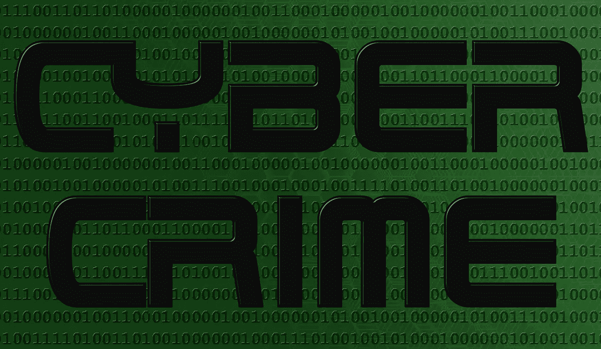

# 为什么网络犯罪在繁荣的斯堪的纳维亚如此盛行？

> 原文：<https://medium.com/hackernoon/why-is-cybercrime-so-prevalent-in-prosperous-scandinavia-f5a64bc3d05f>

## 尽管斯堪的纳维亚有着乌托邦式的名声，但它是一个数据泄露和恶意软件肆虐的网络战场。

除了地理、历史和文化联系，斯堪的纳维亚国家另一个值得注意的共同特征是其经济和公民日常活动无处不在的数字化。

该地区号称拥有 T2 最高的互联网渗透率，达到 97%。此外，瑞典和挪威[的平均连接速度分别位列世界第二和第三](https://www.fastmetrics.com/internet-connection-speed-by-country.php)。光纤和 LTE 基础设施的大规模部署确保了即使是生活在偏远岛屿上的人们也可以不受限制地使用顶级技术。

如果你把两个和两个放在一起，你会得到一个有吸引力的恶意行为者的潜在目标。处于网络罪犯的聚光灯下是技术进步和福利的一个主要但不可避免的另一面。斯堪的纳维亚人和企业严重依赖大数据和连接性，这意味着在线对手有很多东西可以窃取、欺诈甚至勒索。

## **问题有多大？**

根据最近的[数据泄露调查](https://content.onevoice.co.uk/information-security-privacy-and-cybercrime-2018)，2017 年，21%的挪威企业遭遇了涉及病毒和恶意软件的事件。据报道，丹麦三分之二的公司在 2017 年遭到了网络攻击，其中超过 10%的入侵成功。在过去几年里，瑞典恶意数字袭击的范围变得如此之大，以至于网络安全[成为该国 2018 年国家安全政策的优先组成部分](https://www.computerweekly.com/news/450432739/Sweden-steps-up-cyber-defence-measures)。毫不奇怪，这种不利趋势正开始给斯堪的纳维亚企业和政府敲响警钟。

## **斯堪的纳维亚的网络犯罪趋势**

就恶意在线活动的[载体](https://www.nordea.com/en/press-and-news/news-and-press-releases/the-digital-hub/2017/2017-06-08-cybercrime-trends-avoid-the-phishing-hook.html)而言，该地区并不是同质的。在丹麦，不同形式的恶意软件主导着威胁格局。其中一个名为 Mazar 的样本通过短信中的陷阱链接在中国流传，这些链接到达安卓设备。当在船上时，罪犯窃听受害者的网上冲浪信息，并窃取敏感数据，包括密码和电子银行详细信息。

CEO 欺诈和投资诈骗是挪威在安全方面最大的担忧之一。受害者被引诱投资于一家新的创业公司或加密货币 ICO(首次发行硬币)，据称回报很高。筹集到资金后，骗子们消失得无影无踪。另一种常见的策略是冒充公司高管，侵入他们的电子邮件账户，然后欺骗员工将资金转移到一个流氓目的地。

网络钓鱼是瑞典网络安全领域的祸害。这种被称为“视觉”的特殊类型最近正准备崛起。行骗者可以冒充微软等知名公司的代表给用户打电话，并提供“技术支持协助”。他们要求目标用户允许远程连接到他们的计算机，只是为了窃取私人数据或安装病毒。

最重要的是，重大数据泄露是斯堪的纳维亚网络威胁生态系统的共同点。就受害者人数而言，这些事件规模巨大，后果可能是毁灭性的。

## **臭名昭著的事件**

以下是一些具有“北欧”风味的大规模入侵和恶意软件爆发的内幕，这些事件激励了斯堪的纳维亚国家加强其网络安全实践。

2018 年 1 月初，一个黑客团队[入侵了挪威一半以上人口的医疗记录](https://www.scmagazineuk.com/half-norways-population-medical-data-leaked/article/1473442)。对手的目标是一个名为 RHF 东南部健康的实体，该实体在 18 个县提供医疗服务，包括首都奥斯陆。该组织的权力涵盖约 300 万挪威人，该国总人口为 520 万公民。

当 IT 人员发现异常流量模式时，数据泄露已经全面展开，暴露了大量客户的个人信息。分析师声称，犯罪分子可能会利用这些数据，精心策划未来的成功欺诈，这些欺诈看起来非常可信。

2017 年 9 月，瑞典一起严重的[数据泄露事件](https://www.thelocal.se/20170918/multi-million-data-breach-and-fraud-trial-to-start-in-sweden)登上头条。据称，一群威胁分子诈骗了几十家企业、金融机构和个人 4000 万克朗(约合 500 万美元)。罪犯向潜在目标发送带有木马附件的网络钓鱼电子邮件，这些目标包括律师事务所、政府部门和四家银行。引人注目的受害者是该国领先的瑞典银行和瑞典监狱和缓刑服务局。

恶意的电子邮件附件包含混乱的代码，使黑客能够进入主机并向他们自己的账户付款，其中一些账户在香港和科索沃。事件发生后，8 名嫌疑人因违规被逮捕并面临审判。

早在 2011 年 12 月，一个自称“Appunity 团队”的黑客团伙入侵了挪威主要性服务网站 Hemmelig.com 的数据库。黑客行动主义者最终公开了 26000 名“客户”的名单。

对于一些挪威政治家、名人、商业领袖、军官和其他国家精英的代表来说，这形成了一个[的困境](https://www.tnp.no/norway/panorama/2589-a-new-sex-scandal-on-the-horizon)，他们在这个尴尬的在线市场上注册了账户。在对当地媒体的匿名评论中，攻击者说这项服务没有得到很好的保护，他们只花了几分钟就黑了。

一个名为“Noria”[的黑客组织侵入了安德斯·布雷维克·贝林的推特账户和两个电子邮件账户，这位臭名昭著的杀人狂在 2011 年 7 月杀害了 77 人。尽管社会对这次黑客攻击的反应总体上是赞同的，但它将关于这场悲剧的重要证据的有效性置于危险之中。同年 12 月，挪威执法机构追踪并](https://nakedsecurity.sophos.com/2011/08/09/hacking-gang-breaks-into-norwegian-killers-email-accounts/)[逮捕了该团伙 5 名 17 至 21 岁的成员](https://www.dagbladet.no/nyheter/hacker-17-pagrepet-i-eget-hjem-kastet-pa-glattcelle-og-avhort-uten-advokat/63450193)。

## **处罚没什么大不了的**

斯堪的纳维亚刑法在网络犯罪方面并不太严厉。在挪威(T1)和瑞典(T3)，大多数此类犯罪的处罚不超过两年监禁。在国际背景下，这还不是计算机犯罪最糟糕的情况。为了说明区别，美国计算机欺诈和滥用法案(CFAA)的规定对初犯的处罚是 5 年监禁，对再犯的处罚是 10-20 年监禁。

实际上，斯堪的纳维亚对网络犯罪的惩罚要轻得多。一名瑞典交通机构官员被罚半个月工资，因为疏忽[向外国第三方承包商泄露了数百万公民的个人数据](https://www.bleepingcomputer.com/news/security/biggest-data-leak-in-swedens-history-punished-with-half-a-months-paycheck/)。显然，法律对该地区的网络犯罪没有太大的约束力。

## **总结**

尽管从表面上看，斯堪的纳维亚的生活似乎平静而无忧无虑，但该地区是一个网络战场，数据泄露和恶意软件活动不时造成严重破坏。《龙纹身的女孩》这部电影的主角是一个被抛弃的电脑黑客，故事发生在瑞典可能不是偶然的。

由于现有的安全措施似乎不足以有效阻止疫情，政府正在制定战略计划，以使防御更加积极主动。与此同时，当涉及到恶意活动的警示信号时，如社会工程和基于垃圾邮件的恶意软件分发，用户和企业应保持警惕。使用[可靠的 VPN](https://vpnportalen.no/) 服务时，传输中的数据可以被加密和保护。此外，利用双因素身份认证来保护在线帐户绝对是值得的，因为它可以阻止黑客的踪迹。