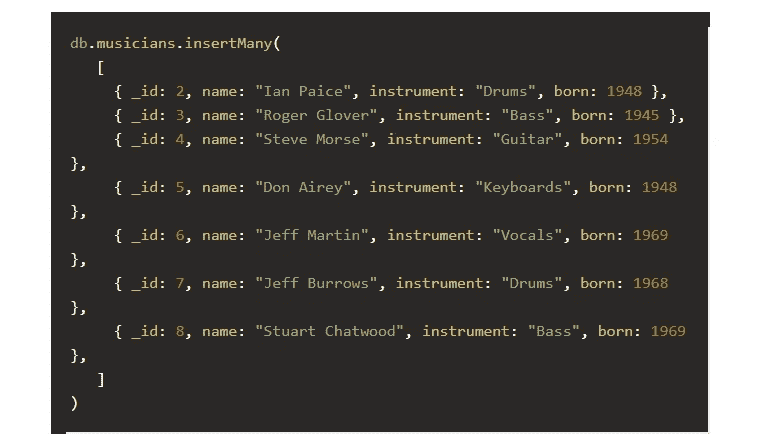

# 为什么 MEAN 是大规模电子商务项目的理想堆栈

> 原文：<https://medium.com/hackernoon/why-mean-is-an-ideal-stack-for-large-scale-ecommerce-projects-7432c006de83>

## 作为一名软件开发人员很难工作。你投入时间、金钱和努力学习一些技术，而一个新来的家伙用一些新的承诺偷走了所有的魅力。2013 年，瓦列里·卡尔波夫创造了“T2”一词，意思是“T3”。

今天，MEAN 已经成为传统开发方法的重大转变，并在新的 web 项目中提供了一些大规模的性能改进。仅仅在几年前，MEAN stack 还是一项幼稚的技术，现在它正在从 LAMP stack 的领地上挖走开发者。

有什么大惊小怪的？什么是流行的意思是它正通过风暴接管 web 开发的世界？谁在支持这项新技术？

嗯，很快就会知道一切。先详细了解一下这小子。

*免责声明:本内容无意从 LAMP 的领地挖走会员。这一切都是为了了解这种堆栈的优势，并了解为什么开发人员会考虑将其作为大规模开发的合适选择。*

# MEAN stack 到底是什么？

MEAN stack 是开发整个动态 web 项目所需的某些框架的完整集合。缩写扩展如下:

*   **MongoDB**:*For Database*:基于文档的数据库，使用 JSON*存储数据。
*   **Express.js** : *后端*:服务器端 JavaScript web 应用框架
*   **Angular.js:** *前端*:客户端 JavaScript web 应用框架
*   **Node.js** : *服务器端运行时环境*:JavaScript 服务器端运行时环境

如果你注意到名字，意味着 stack 是 JavaScript 的主干。从后端和前端到服务器端，都可以用同一种编程语言编写。让我们看看 MongoDB 与 JavaScript 的关系。

# MongoDB:两全其美

就 MongoDB 数据库而言，它是一个基于非关系文档的数据库系统。它将数据存储在 BSON 文档中。BSON 只不过是二进制编码格式的 JSON 文档的一种表示。

BSON 增加了更多的数据类型、有序字段以及不同语言的简单编码和解码。所以 BSON 是 JSON，JSON 当然是 JavaScript 确切地说是 JavaScript 对象符号。此外，因为 BSON 是二进制的，它使得查询快速、丰富和轻量级。

下面是一个用于在 MongoDB 数据库中插入多个文档的示例 JSON:

MongoDB 的美妙之处在于，您可以使用*回调*或*承诺*来实现异步执行。在上面的例子中，您可以在最后添加以下代码行来实现在 *insertMany* 对象中的异步执行:

# MongoDB 比 MySQL 好吗？

由于它是一个非关系和 NoSQL 数据库系统，它不需要像 MySQL 和其他关系数据库那样将数据存储在特定的行和列中。MongoDB 使用 BSON *键-值对*模型存储数据，不考虑结构。而 MySQL 被表示为表，并使用结构化查询语言。

尽管如此，MongoDB 仍然像任何 MySQL 数据库一样遵守现有的认证、索引和数据访问。因此，用 MongoDB 实时调整模式非常容易，而且不会破坏模式。动态模式使得查询和 web 应用程序比依赖 MySQL 的应用程序更快。

***请注意:Node.js 同时兼容 MySQL 和 NoSQL 数据库。开发者只是更喜欢使用 NoSQL 来获得额外的好处。***

# express . js:node . js 后端 web 开发框架

Express 只不过是 Node.js web 应用程序框架的一种最小且灵活的形式。它用于后端开发的 MEAN stack 中。然而，它提供了各种 web 和移动应用程序开发所需的强大功能。它是开源的，由 Node.js 基金会维护。

作为与服务器通信并处理来自应用程序所有部分的 HTTP 请求的后端框架，它根据请求管理资源分配。因为它基于 Node.js，所以它继承了 Node 的所有属性。例如:

*   它是异步的和事件驱动的
*   它的所有库都是非阻塞的。

它的服务器不会等待 API 的输出返回数据，而是直接转到下一个 API。它使用事件通知来响应服务器上一个 API 请求。这使得 Node.js 购物车和各种其他类型的应用程序非常快。

# Angular.js:一个动态 JavaScript UI 开发框架

AngularJS JavaScript 框架用于 UI 开发的 MEAN stack。可以使用

在 Google 和广大社区的大力支持下，Angular.js 是一项非常活跃的技术，它包含了最新的更新。使 Angular.js 在 web 开发中有用的是它的轻量级 DOM 操作。

大型项目需要大量的 JavaScript 来使 UI 更有吸引力和吸引力。然而，在代码中使用如此多的 JavaScript 只会使 UI 加载缓慢。Angular 带来了好处，它最大限度地减少了文件中 DOM 操作所需的新 JavaScript 代码。

在 HTML 文件中添加一个简单的代码片段，您可以将数据从 Angular 库中绑定到 HTML 控件，而无需在文件中手动添加新的 JavaScript 行。大概是这样的:

最好的部分是，与静态 web 表单不同，在静态 web 表单中，您需要首先填写表单并点击提交按钮来做出反应，Angular UI 对用户的输入做出动态反应，而不是刷新整个页面，而是只刷新部分组件。

例如，用户在购物车查看页面上查看购物车中的商品。现在，如果用户决定提高购物车中某个产品的质量，购物车评论页面必须刷新以更新新的商品数量。但是，使用 Angular.js，您不必刷新整个页面来更新一个[节点 js 电子商务购物车](https://shopygen.com/nodejs-marketplace-software/)中的数量。页面将自动刷新数量，而无需重新加载整个页面。

同样的属性也可以用来实现动态表单验证，用户可以实时得到无效输入的通知，而无需点击提交按钮。

***请注意:Angular.js 在服务器端和客户端都可以编译。也可以用来开发独立的原生桌面或移动应用***

# Node.js:后端运行时环境

我想在这里做一个简单的论证来支持 Node.js。

经过多年使用无状态 web 和无状态请求-响应模型的开发，Node.js 最终为 web 应用程序提供了实时和双向连接。现在，客户机和服务器都可以开始通信并直接交换数据。

Node.js 是在 Google chrome V8 引擎上开发的开源服务器运行时环境。它可以在各种平台上运行，比如 Windows、Linux、Mac 和 Unix。正如我们看到的，MEAN stack 在前端(Angular)、后端(Express)以及数据库(BSON)中使用 JavaScript。使用 Node.js，您也可以在服务器上使用 JavaScript。

# 在服务器上用 JavaScript 好吗？

Node.js 是一个异步编程环境。正如我解释的，基于 Node.js 的 Express.js 也遵循异步方法。正因为如此，Express.js 不需要等待 API 响应，可以简单地继续下一个请求。

Express 使用 Node.js 完成所有这些工作，这意味着 Node 也可以在服务器上实现相同的异步和事件驱动的非阻塞 I/O 模型。它最终使与服务器的通信快如闪电。

遵循这种方法和许多其他优势，Node js 已证明自己是构建解决方案的完美技术合作伙伴，例如:

*   I/O 不可避免的应用程序(PayPal)
*   媒体流应用(网飞)
*   数据密集型实时应用(优步)
*   基于 JSON APIs 的应用程序(Amazon，GroupOn)

Node.js 通过其在线节点包管理器(NPM)提供了一个资源丰富的轻量级库。它允许开发人员访问 NPM 来导入开源 Node.js 项目。人们可以简单地使用命令行界面从在线 NPM 获取所需的资源，用于版本控制、包安装、依赖性管理和更新管理。

利用 NPM，您可以重用存储库中的所有代码，并保持项目轻量级，尽管实现了复杂的功能。

所以是的！Node.js 在服务器上很好。毫无疑问，使用 node.js 最佳实践，Node js 电子商务可以变得非常快速和可伸缩。

MEAN stack 中的所有技术都有 Google 这样的巨头做后盾。它们都有一些活跃而熟练的开发人员组成的大型社区。它仍然是新的，并在不断发展。让我告诉你，MEAN 并不孤单，它现在已经进一步扩展，形成了更高级的堆栈，如 React.js 的 MERN，Vue.js 的 MEVN，Vanilla JS 的 MEN。