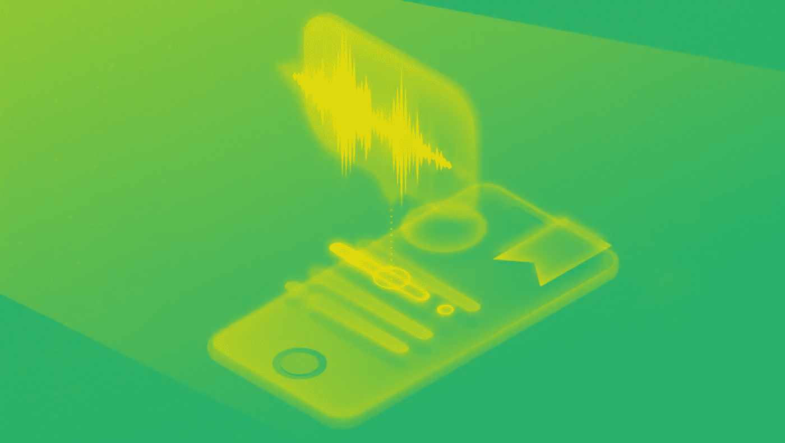

# 为什么现代出版商不能忽视语音技术

> 原文：<https://medium.com/hackernoon/why-modern-publishers-cannot-afford-to-ignore-voice-technology-691f6f15202d>

语音技术正在席卷许多行业，出版业也不例外。然而，在一个致力于彻底沉浸式阅读的行业，很容易理解为什么新技术不总是被迅速采用。事实证明，新技术有助于出版商和作者增加收入。当前的一个例子是有声读物，它被广泛认为是出版界增长最快的利基市场——[仅 2017 年有声读物销售额就达到 25 亿美元](https://goodereader.com/blog/audiobooks/global-audiobook-trends-and-statistics-for-2018)。今年的数据证实了这一趋势。根据[AAP 统计月报](https://newsroom.publishers.org/aap-statshot-publisher-revenue-increased-by-72-in-february-2019/),“下载音频”仍然是出版业增长最快的格式——与 2018 年同期相比，2019 年前两个月增长了 36.5%。

语音技术在过去十年里取得了巨大的进步。利用这种技术的人数正在大量增加；我们中的许多人依赖智能工具，如苹果的 Siri 或亚马逊的 Alexa，来提示我们的设备为我们执行快速、方便的任务，而无需按下按钮。这不是什么秘密:越来越多的人被智能家居设备和超先进技术的诱人前景所吸引。[到 2022 年，预计将有超过 2.4 亿美国家庭安装智能家居设备，而智能音箱可能会占这一数字的近 70%。当出版商退后一步，意识到这些设备都提供了曝光和销售的机会时，情况看起来格外有趣。](https://www.forrester.com/report/Forrester+Data+Smart+Home+Devices+Forecast+2017+To+2022+US/-/E-RES140374)

然而，到目前为止，语音技术未能为出版业提供应有的服务。

# 顶级语音助手只能识别与《纽约时报》畅销书相关的 43%的基本查询

如果你是一名出版商，你是否利用了语音技术为你和你的作者提供的一切？一位 WNIP 撰稿人利用《纽约时报》畅销书排行榜上的 15 本小说和非小说书籍进行了一项实验。他们向一些流行的语音助手(如 Alexa 和 Siri)查询基本信息和任务——他们询问每本书的标题，声明他们想听每本书，等等。结果令人吃惊:顶级语音搜索工具只能识别大约 43%的畅销书关键词，包括“我想读 Y 作者写的 X 书”和“我想听 Y 作者写的 X 书”。

随着[6600 万台设备](https://hbr.org/2019/04/your-company-needs-a-strategy-for-voice-technology-2)已经进入美国家庭和企业，许多读者正在使用他们的语音助手来查找和购买图书——如果你的图书不被这些平台识别，你就错过了与这些读者联系的机会。在许多情况下，这可能意味着你失去了很大一部分销售额，如果你可以随时获得的话。你希望人们能够找到你的书，这不仅仅指畅销书，还包括书目和有声读物。

# 出版商如何从语音技术中获益

一些公司已经开始利用语音技术来推动销售，并向消费者介绍他们不会购买的书籍。例如，[西蒙&舒斯特发布了他们自己的 Alexa skill](https://www.publishersweekly.com/pw/by-topic/digital/Apps/article/77224-stephen-king-library-debuts-for-smart-speakers.html) ，被称为“斯蒂芬·金图书馆”，旨在测试读者的喜好，然后向他们提供建议，接下来应该选哪本斯蒂芬·金的书。

某些出版商已经采取措施，让他们的语音技术产品更具创造性。Novel Effect 是一家与 Alexa 加速器计划合作的公司，[推出了一项 Alexa skill](https://www.forbes.com/sites/adamrowe1/2018/05/22/storytelling-app-novel-effect-3m-series-a/#1a29a894120d) ，旨在用各种音频场景来补充现场阅读。这项技术可以使教育出版商受益，因为这项技术不仅将听众带入他们正在听到的故事或他们正在学习的信息，而且已被证明可以提高课堂上的阅读记忆和理解能力。声音景观还可以吸引更多的商业出版商，他们需要应对这样一个事实，即年轻消费者渴望在他们的移动设备上获得不仅仅是基于文本的体验。

音频游戏正在成为套餐的一部分。例如，Westworld 已经有了自己的音频游戏，感兴趣的粉丝可以通过 Alexa 玩。这些游戏有助于增加宣传，激发人们对新故事和熟悉故事的兴趣——它们是增加畅销书内容的好方法。

# 现在是当家作主的时候了

语音技术发展很快，但是许多出版公司还没有[获得他们能够控制的方面的所有权。现在是利用这一点的最佳时机，创造能引起读者兴趣的内容，鼓励他们来看看你的书。](https://whatsnewinpublishing.com/2018/05/voice-interfaces-complete-publishers-guide-2/)

幸运的是，出版商可以采取一些措施来增加成功的机会，并把事情掌握在自己手中。这个过程的开始可能很简单，比如对各种语音助手进行独立审计，以及解决与科技公司的问题，但更有动力的团队对世界了如指掌。

*   **审核您的目录的语音优先合规性**
    这种方法可以简单地开始，并随着时间的推移变得更加精细和有针对性。确保所有的标题都有基本的元数据是一个很好的起点。一旦确定了问题，出版商就有责任与任何一家科技公司的语音助手制造麻烦的语音团队进行沟通。发布者可以报告问题，请求修改，并获得关于如何在发布者端解决问题的指导。接下来，可以添加更高级的元数据，如关键字和奖项。
*   **根据已读书目推荐书目**
    创建一个应用程序，让读者搜索“像[你当前的畅销书或新书]这样的书籍。”提供基于流行搜索和选择的列表。
*   创建常见问题的答案，并使它们成为语音识别程序的一部分
    “谁写了[X]？”“你的作者写了什么书？”许多人使用语音识别设备来快速获得问题的答案。通过确保他们是该计划的一部分，你增加了你的书和作者被语音搜索平台认可的几率。
*   **深化阅读体验**
    你可能已经在这些平台上提供有声读物了。然而，为了充分利用语音技术，你需要超越单纯的有声读物。考虑一下听觉组件如何增加阅读体验，这是否意味着你在读者欣赏实体书时提供了配乐，或者提供了只能通过设备获得的额外内容。
*   **与读者的日常生活联系起来**
    通过将你的应用程序与语音辅助设备相结合，你可以让你的书成为读者日常生活的一部分。你的读者是从励志或精神读物开始他们的早晨吗？他们是想一边享用咖啡，一边查看新闻，还是想获得当天的报价？随着你成为读者日常生活的一部分，你也增加了他们未来继续购买你的书籍和资料的可能性——特别是如果你在一本书接近尾声时推荐下一本书的话。
*   **优化你的“声音”营销策略**
    你可以使用几个关键策略来改变你的营销工作，包括改变你的搜索关键词来满足这些需求。请记住:
    -语音搜索通常比文本搜索更长。
    -重要的是用自然的句子结构来计划提问。
    -针对谷歌的特色片段进行优化是让你的内容受到关注的好方法。

如果出版商现在就获得语音应用和创意的所有权，他们就可以通过新技术走在销售增长曲线的前面，而不是不得不在路上追赶。你的出版公司将成为这些设备上标准程序的一部分，你的读者也更有可能直接向你寻求信息。

# 结论

人们很容易认为重大技术改进是大型科技巨头的领域，但事实是，出版商今天可以做很多事情来收获语音技术的好处。这个过程可能并不简单，但一点前瞻性思维和创新将大有裨益。如果你发现将语音技术整合到你的商业模式中的前景有点令人生畏，那就找一个值得信赖的技术合作伙伴，带你完成这个过程。无论是提供建议的 Alexa 技能还是增强音频体验的应用程序，语音技术都为出版业带来了无数新的令人难以置信的功能，有助于提高读者的兴趣，增加他们花在文学上的时间。

由 [**马克斯**](https://www.linkedin.com/in/mkalmykov/) ，
副总裁，媒体&娱乐[数据艺术](https://www.dataart.com/industry/media-and-entertainment?utm_source=hackernoon.com&utm_medium=referral&utm_content=mkalmykov&utm_campaign=m-regular)