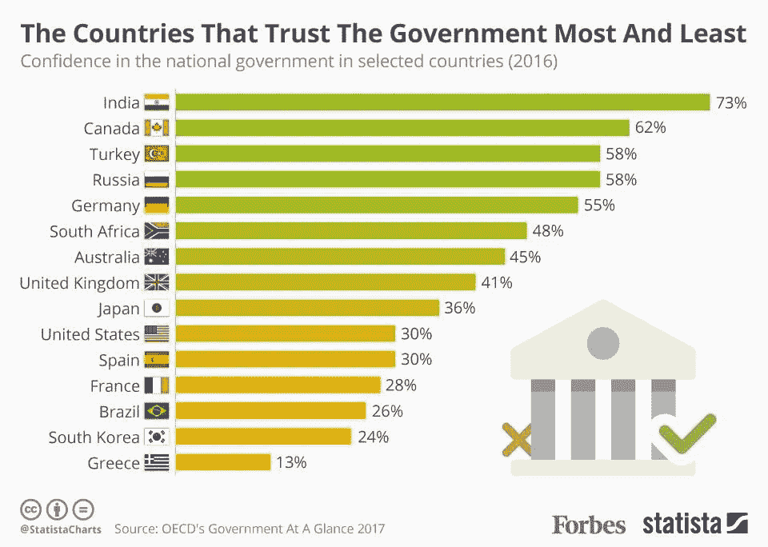

# 为什么人们还没有准备好接受比特币？

> 原文：<https://medium.com/hackernoon/why-people-are-not-ready-for-bitcoin-d3adef2b2907>

比特币还远未被大规模采用。

Photo by [Niels Steeman](https://unsplash.com/@nielssteeman?utm_source=medium&utm_medium=referral) on [Unsplash](https://unsplash.com?utm_source=medium&utm_medium=referral)

如果我们问“为什么”，我们会得到同样的答案:可扩展性、费用、机构安全性、可用性。这些主要是技术问题，随着时间的推移可以解决。但如果我们深究一下，就会发现比起“社会”，它们根本不是问题。

像任何旨在带来新事物的想法一样，比特币有许多社会和哲学难题:代码信任、[身份](/s/story/what-is-it-like-to-be-a-bitcoin-56109f3e6753)、没有领导者、没有单点故障。原因是比特币以去中心化的思想为基础，这对于一些人来说可能是不寻常的，尤其是在金融领域。

在一个真正去中心化的世界里，你按照“丛林法则”生活——每个人都为自己。你不应该信任或依赖别人，你没有人抱怨有人冒犯了你，只有你对你的生活和你的错误负责。如果你想在丛林中生活，你必须变得聪明，强壮，敏捷，在丛林中有良好的方向感。如果你想和某个不知名的野兽做朋友，做好准备，在危机时刻它会夺走你的一切。现代人能够在如此极端的条件下生存吗？

人类生活在一个建立在信任和指控基础上的勇敢的中央集权的世界里。我们把资金托付给银行，我们使用国家垄断的资金，当有人伤害我们时，我们诉诸法院或其他仲裁人。我们不必什么都懂，因为有一个基础设施替我们思考一些事情。我们习惯了，我们习惯了推卸责任。

**我不是说这是好是坏。这只是我们的方法。**而这也是乌托邦式的去中心化比特币能够保持神话生物的主要原因之一。这样的比特币不可能存在于一个思维集中、对信任需求强烈的社会。

这种人类行为符合时代精神和当今的准则。历史表明，许多人接受既定的游戏规则。只有少数几个提供改进或更进步的东西，随着时间的推移获得新的动力。然后循环重复。

让我们更详细地看看这一点。

# 钱死了，钱万岁！

1973 年 3 月，布雷顿森林体系实际上已不复存在，但 1976 年《牙买加协定》正式批准了布雷顿森林体系的终结。金本位被废除，我们进入了法定货币时代。我们习惯了这种货币体系，我们中的许多人不太了解替代方案。

现代经济学家大多遵循现有的经济理论，要么是因为缺乏对新思想发展的激励，要么是因为央行不能容忍异议。当问题出现时，政治经济学家通常会提供一些小的“改进”。例如，2007-2008 年金融危机后的量化宽松(QE)增加了国家的债务负担。

一个普通人越来越沉迷于消费主义，对他来说，货币使用的便利性更重要，而不是他们的根本基础。现金、信用卡、贝宝和其他服务——所有这些都取决于在特定时刻什么最方便。很多人不在乎钱是以什么为后盾的，因为随时都可以换成有价值的商品。结果，对当前货币体系的虚幻信心就形成了。

人们的认知是如此扭曲，以至于我们很难认识到整个货币体系仅仅依赖于对未来(债务)的信任和信念。这就是为什么听到“比特币没有任何东西做支撑”很好笑。我们下意识地认为法定货币是不变的，我们自己把货币管理权交给了中央银行。这类似于人类如何拥抱君主制和君主的统治权。

# 当涉及到钱的时候，人们的记性很差

没有那么多人监控自己的日常开销，因为我们一天要为某样东西支付好几次。我们几乎不会注意到温和的通货膨胀，只有当我们需要的商品价格“突然”变高时，我们才会注意到。我们几乎忘记了意大利里拉、德国马克、西班牙比塞塔，尽管它们仅在 18 年前存在。他们都被日常生活中使用的欧元所取代，仅仅 20 年，但是一些人已经有了欧元一直存在的感觉。

甚至危机局势也迅速成为过去的回声。20 世纪 90 年代是贬值的时代——英镑、俄罗斯卢布、意大利里拉和许多其他货币都经历了艰难时期。不久前，土耳其里拉已经连续 22 年下跌[40-80%](https://en.wikipedia.org/wiki/Revaluation_of_the_Turkish_Lira)。在过去的 40 年里，阿根廷已经拖欠了 T4 4 次债务，而且很有可能再次违约。2007-2008 年金融危机后，大多数东欧国家已经将本国货币贬值了 1 . 5 倍。

如果我们谈论传统上最近的故事，这足以记住印度的故事。2016 年，印度总理纳伦德拉·莫迪自发宣布所有 500 和 1000 卢比纸币[不再有效](https://hackernoon.com/what-will-it-take-for-worldwide-bitcoin-adoption-5b17943c174c)。这相当于流通的印度卢比现钞的 86%。

*Centralization is… one decision that can affect the lives of millions of people*

人们认为这将有助于克服腐败，让人们在短时间内缴纳税款，因为只有大约 2%的 T2 公民缴纳税款。但是印度面临着全国的愤怒，巨大的队伍和银行的绝对混乱，因为公民们争先恐后地兑换他们突然作废的钱。街头小贩通常无法出售他们的商品，因为 98%的付款都是现金支付。富人继续逃税，并开始购买钻石来存钱。

不到一年后，这个实验被认为是不成功的，99%的被禁钞票又回到了流通领域。

尽管有所有这些例子，许多人仍然支持法定货币，并顽固地忽视了永恒贬值和意想不到的政治决定的整个故事。甚至今天委内瑞拉的危机也会很快被遗忘，还有关于津巴布韦 100 万亿美元纸币的笑话。

人们几乎忍受不了从危机局势中得出的结论，并继续靠惯性生活，稍微改变他们的现实。这个故事之后，印度人对政府的信心发生了多大的变化？*微不足道的*。印度人仍然是最信任政府的国家。

*72% in 2017 (after the experiment), 68% in 2018*

人们要么看不到替代品，要么不考虑它们是否值得关注。而原因是，有时候我们不想做决定，想办法在未来保护自己，太难了；我们更容易在出现问题的时候去信任和责怪别人，然后像什么都没发生一样生活。

# 集权感

我们太专注于自己的世界，以至于有些人类价值观对我们来说是不可想象的。在看过扬·阿瑟斯-伯特兰的电影《人类》后，你开始明白人们对现实的感知是多么的不同。有人没有胳膊，没有腿；有人双目失明，服无期徒刑；不能无所畏惧地走在街上，不能选择该相信什么，不能与其他人交流；有些人生活在恶劣的环境中，有些人生活在金钱变成一纸空文的经济中。所有这些人都有不同的价值观、目标、欲望，如果你没有面对熟悉的事物，那你是幸运的。因此，一个对现实有着完全不同感知的人，如何告诉另一个人他“真正”需要什么？

Daniel Jeffries 在他关于加密货币最令人兴奋的特性[的文章中描述了为什么对中央机构和货币的态度取决于感知:](https://hackernoon.com/why-everyone-missed-the-most-mind-blowing-feature-of-cryptocurrency-860c3f25f1fb)

> “想象一下你现在生活在叙利亚。
> 
> 你的中央基础设施被摧毁，就像你的钱一样。你不想打仗，但你对此无能为力。现在你的房子没了，你的朋友和家人都死了，你的银行被炸了，你被驱逐，漂泊，无家可归，身无分文。更糟的是，没人要你。世界已经从开放边界转变为到处建墙。你在任何地方都不受欢迎，你不能呆在你现在的地方*和*你破产了。
> 
> 但是，如果你的钱还在那里，记录在区块链上，等着你下载和恢复一个确定性钱包，并给它正确的密码来恢复它呢？
> 
> 重新开始你的生活会容易多少？"

当局和许多富裕的人生活在一个“正常的”中央集权的世界里，在那里大多数事情都正常运转，其中一个主要问题是贷款利率。富裕国家的政府可能认为没有理由支持在这种情况下有用的技术，因为他们确信这永远不会发生在他们身上。他们看到的是与他们的认知和体系接近的东西:洗钱、逃税、恐怖主义融资等等。因此，对他们来说，加密货币监管不是保护系统免受可能崩溃的问题，而是保护系统免受习惯性问题的问题。

为了让一个来自“正常”中央集权世界的人关注加密货币，他们必须给他经济收益或更好的转账选择。如果他认为他们不给，这项技术对他来说就变得毫无用处。

# 危机情况可以改变人们的看法

但并不是每个人都生活在一个“正常”的中央集权世界。大多数第一世界的公民不知道世界上有多少国家没有安全的银行基础设施，不信任任何仲裁者，尤其是政府。在这些国家，普遍存在的是恐惧和冷漠，而不是信任。反过来，恐惧让一个人靠“弱肉强食”生活。

这就是加密货币受到以下国家公民支持的原因:

*   委内瑞拉的恶性通货膨胀；
*   面临新一波贬值的土耳其和南非；
*   金融控制严格的中国；
*   印度，2016 年的故事之后。

他们有越过长城的客观原因。通常是少数人，其余的人只是接受后果。但是，这仍然意味着加密货币可以作为一种选择。

这很奇怪，因为“第一张”欧洲纸币也是危机形势下的产物。在 1574 年西班牙围攻莱顿期间，被围困城市的公民既没有银子也没有皮革，皮革有时被用来代替货币。所以，他们决定用纸做一种临时的货币替代品。

[***Leiden’s paper coin***](https://www.coinworld.com/news/paper-money/2018/10/paper-coins-survivors-of-eighty-years-war-siege.all.html)

莱顿事件后，瑞典和美国试图引入法定货币，但它们很快贬值到发行纸币的价值。因为人们不信任法定货币。

例如，1695 年挪威商人托尔·莫伦经政府批准发行了纸币。但该国的居民没有看到他们的优势，几乎没有收到面额，让他们在银行兑换一个硬硬币。

对于长期使用黄金和白银的人来说，纸币可能是一个令人费解的东西，因为货币的一些基本基础对人们来说很重要。一张纸怎么可能等同于一枚银币？为什么这张“钞票”值 10 个硬币，还有 2 个硬币？因为是这么写的？

对新货币的信心逐渐形成，直到它变成无条件的接受。

# 对一场革命无处不在的信仰已经是这场革命的开始

当局已经接受了货币体系的大部分变革，人们也已经适应了这些创新。法定货币、黄金、银币——所有这些都是以一种进化的方式出现的，并因当局而非人民的意愿而变得无处不在。

加密货币的想法是革命性的(就目前而言)，因为变化始于社会，而政府正在适应创新。革命精神仍然是秘密社区固有的。一部分密码爱好者反对国家监管，这看起来有一定道理，因为该系统已经多次失败。

这意味着今天的比特币只有两种方式可以大规模采用——进化或革命。或者，当局将承认比特币是一种新的货币形式，将发展这种想法，并利用区块链创造一种新的货币体系。或者会出现某种经济崩溃，最终让人们不相信当前货币体系的可靠性，然后权威就会改变。

但是不管选择什么，对你来说都有坏消息。**我们将驯服今天的比特币版本。只是因为我们不知道另一条路。**

想象一下，法定货币完全失效了。

世界正面临一场新的经济危机，这场危机比大萧条、1973 年的石油危机和 2007-2008 年的金融危机更具破坏性。人们正在失去工作，银行和公司正在关闭，恐慌无处不在。人们试图了解它是如何发生的，谁该受到责备，接下来会发生什么。他们变得政治化、迷信和恐惧。政府和央行失去了信誉。为了生存，你试图寻找国家资金的替代品。

欢迎来到丛林。

**但问题是:下一步是什么？**如果没有集中管理和相互信任，人们会根据不同需求分配金钱吗？我们会通过投票或竞争在动态变化的系统中不断形成灵活的规则吗？考虑到每个人都有自己的经验、知识和对正义的理解，这种情况会发生吗？这种绝对的民主不会成为群体本能在决策中的普遍体现，对吗？

人们可以习惯一切，我们不应该排除这样的结果，但它看起来太乌托邦了。在变化和危机情况下，人们倾向于自我组织和合作，但一个集中思维的人能在短时间内变成分散思维的人吗？

这不太可能，只记得[刀](/swlh/the-story-of-the-dao-its-history-and-consequences-71e6a8a551ee)的故事。我们还是想寻找罪魁祸首，推卸责任。因此，**我们将简单地创建新的机构**。他们不会去任何地方，即使在一个社会共识是核心的世界。

# 另一个混血儿

这场加密革命最终会结束，然后无论这场革命的结果如何，我们都会回到保守主义。即使比特币和其他加密货币击败了法定货币，你也不应该指望我们会大大改变我们的方法。法国大革命的结果是第一个法兰西帝国，十月革命的结果是苏联。互联网本应克服中央集权，但却成了监控的核心工具。

我们已经用所有这些加密货币交易所和多币钱包扭曲了比特币的概念，因为比特币不需要机构。那就是我们需要这些机构与比特币互动，就像我们习惯的那样。如果继续朝这个方向走，今天的比特币版本可能会成为它最初苦苦挣扎的东西。

我认为人类会接受基于不信任因素的货币，尽管这可能需要很长时间。比特币的想法不会[被驯化](/s/story/the-domestication-of-cryptocurrency-acc832a0ad1c)，但是一些比特币的实现会被驯服，目前也是。

是的，今天的比特币版本作为加密货币可能会成功，但作为不信任的想法，它很可能会失败。我们还没有为比特币做好准备，也许机器人会帮助我们重新发明它，未来的版本将变得真正去中心化。

就目前而言……我们将得到另一个新概念和旧的集中思维的混合体——比特币，这是我们应得的。