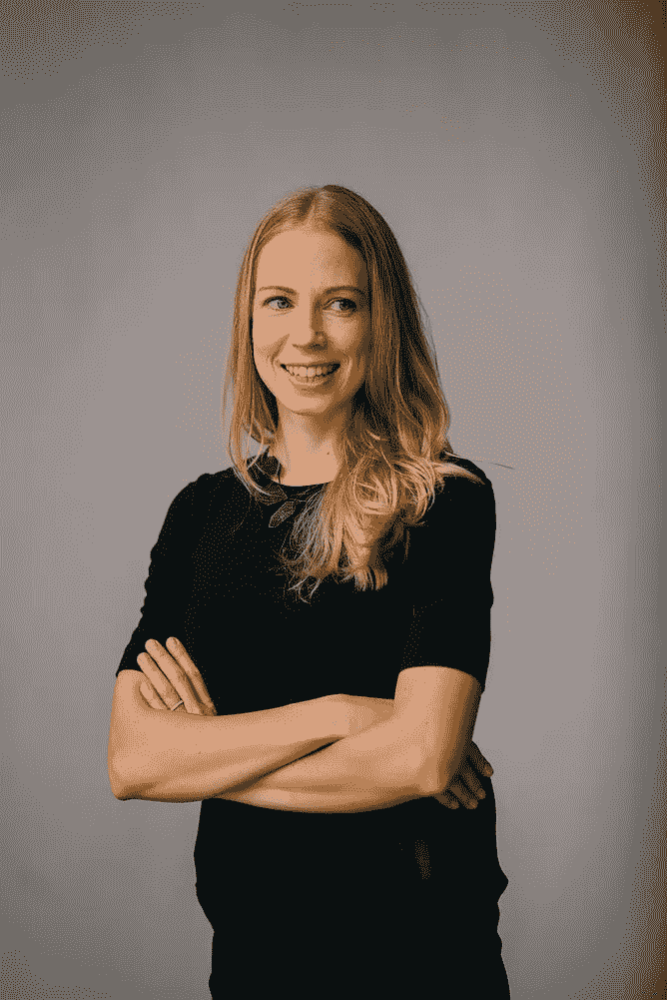
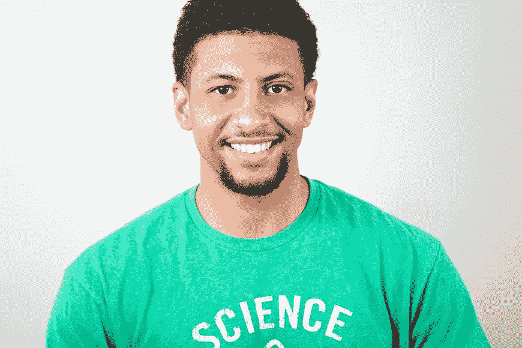

# 为什么“软”技能实际上是硬技能

> 原文：<https://medium.com/hackernoon/why-soft-skills-are-actually-hard-af-3-fastest-hacks-to-improve-b02c910f2c7d>

## **3 个最快改进的技巧**

在过去的几周里，我对“软技能”及其目前在工作场所被讨论的方式非常恼火。这些技能是可以衡量的，它们比我们想象的更复杂，每个企业/组织/行业都需要开始关注它们。

为了帮助开始这场对话，我将像 Sarah 一样分解软技能，并希望提供见解来帮助我们磨练和提高这些极具挑战性的技能。

先说“硬”和“软”技能是怎么定义的。GCFLearnFree.org 的[有一个不到 2 分钟的惊人视频，并附有故障:](https://www.youtube.com/channel/UCeYUHG6o0YguM-g23htdsSw)

因此，虽然“硬”技能可以分解为主要的技术能力和经验，但我们可以看到像沟通、团队合作和适应能力这样的“软”技能可能更难评估和学习。

我觉得奇怪的是，企业和有经验的领导很少强调“软”技能。我也不喜欢它们被称为“软的”，就像它们有可塑性或没有那么强一样。因此，在这篇文章的持续时间里，我将把它们称为**以人为中心的技能，**，我认为这更能描述它们实际上帮助我们做的事情:与他人联系。此外，虽然普遍的理论是这些技能很难学习，甚至更难跟踪，但我就是不相信——我很快会解释为什么。

## **Hack 1:** 开始**衡量以人为中心的技能**

我十几岁在英国上中学时的一个记忆是，我们的老师如何花时间写关于我们进步的深思熟虑和诚实的年度报告，并根据我们的合作、行为和思维方式给我们评分……除了我们的工作！直到我在加州洛斯阿尔托斯开始读高中，我才第一次接触到赤裸裸的衡量标准和平均绩点(GPA)。在我的大学和职业生涯中，我的表现一直是用定量数据而不是定性数据来跟踪的，缺乏核心的行为，以人为中心的成分。

我最近与一位潜在客户讨论了这种认识，我们谈到了公司对良好行为和做一个全面正派的人的奖励(或缺乏奖励)。

当你年轻的时候，你偷了另一个同学的东西，或者对另一个人很刻薄，你因此受到了惩罚。很明显，年龄并不能保证我们学到了这些教训。我在不止一个工作场所遇到过有人在处理错过的截止日期或内部冲突时变得过于激进。爆炸性的情绪爆发可能会令人疲惫不堪——尤其是作为一名经理，因为你不仅仅是指出一个项目或任务的失误，而是不得不“管教”你的员工。这对我来说尤其困难，因为我不是那种在同事面前小心翼翼的人。我不知道所有这一切是否源于建设人们可以安全谈论失败和容忍不同意见的文化的不足，但我相信这些是相关的。

我经常听到同事鼓励自己的孩子尊重他人，然后转身在职场上展示截然不同的价值观。我们如何在生活中，当然也是在工作场所中贯彻同样的价值观？

**根据这篇由** [**卡尔·汤普森**](https://revisesociology.com/2016/08/16/percentage-life-work/) **撰写的博客，员工一生中在工作上花费的时间高达 92000 多个小时。虽然我们的朋友和家人是我们生活中最重要的人，但实际上我们大部分时间都和同事在一起。我们每天早上看到的人，每次会议坐在我们旁边的人，以及在我们离开办公室的路上挥手致意(或回避)的人，都是那些承受着我们以人为中心的技能的能力(或缺乏能力)的人。**

我的职业联系人是我的工作家庭。他们是我的支持系统的一部分，我们互相帮助度过生活中发生的事情和工作中的困难。他们是我职业成长的支柱，也是我的签到系统。作为一名管理者或成长中的领导者，身处安全的空间是至关重要的，在这里你可能会犯错误，并朝着更好的方向改变。我不再是几年前的那个领袖，也不渴望在未来 5 年成为那个领袖。我想变得更好，提高自己。

**所以回到手头的任务。像一个优秀的经理一样，我鼓励我们发挥创造力。**

纽约技术援助中心的专家 Dick Jones 最近分享了一篇关于衡量软技能的五种方法的博客。我喜欢他的方法有几个原因:

1.  他关注员工的行为，并从年度员工评估中分离出日常评估
2.  他强调了合作、创造力和毅力的重要性
3.  他实际上是在尝试测量以人为中心的技能组合

在研究这篇文章时，我努力寻找一系列如何衡量以人为中心的技能的例子。我看到了各种各样的方法来促进组织间的积极合作和团结意识——比如给彼此做得好的工作以“荣誉”。我喜欢推荐的想法，因为这是一种真实的方式来讲述某人的故事，并与那个人建立更深的关系。毕竟，你永远不知道将来什么时候你可能需要他们的帮助或专业知识。

我喜欢用一种开放的会议形式来衡量以人为本的技能，鼓励我们的团队在团队面前感谢帮助他们的人。我完全承认这是从青少年比赛中借鉴来的想法，但我认为这是让人们相互表达感激的有效方式。这种温暖、模糊的感觉超越了简单的寒暄，可以在团队中传播。从经理的角度来看，追踪那些被感谢的人(和提出感谢的人)的名字会很有意义。

**我希望看到人们接受更多的职业发展机会，并选择职业/个人发展。**如果人们愿意探索所有不同的领导风格，结果将是一种学习和支持的文化。我总是喜欢有挑战我的学习伙伴，并且在困难的时候我可以依靠他们来支持我。让人们积极寻找激发他们好奇心或释放他们激情的东西是一种值得奖励的重要行为。我们想鼓励人们好奇。

**我也想在这里强调问责制和透明度。**如果我们努力将这些品质融入我们的团队工作流程，就会清楚地看到谁在尽自己的职责，谁在工作中取得成功，谁在工作中帮助他人。当谈到团队合作时，我最讨厌的事情之一就是一两个成员经常肩负起帮助那些总是不能(或不愿意)完成任务的人的重担。我认为所有这些步骤都会提升那些优秀的团队成员，对他们的工作充满热情，并为公司文化增添价值。

## **黑 2:** 认真对待他们。**以人为中心的行为很复杂。**

Darcy Eikenberg，红角革命的 PCC，在一篇名为[的博客](https://www.forbes.com/sites/forbescoachescouncil/2018/07/12/why-soft-skills-are-harder-than-they-look/)“软技能比它们看起来要难”中说，“事实上，软技能正迅速成为我们组织中招聘和发展的困难技能。正是他们将我们的日常工作变成了实实在在的美元。”

**那么，如果软技能能够影响公司的底线，为什么以前没有受到重视呢？**因为他们是难以置信的个人(*你听过多少次商业不是个人的*)，而辅导人需要时间、意图和思想。

仅仅把公司价值观放在幻灯片上并告诉人们要坚持这些价值观是不够的；**一个真正以人为中心的公司有助于培养员工的这些价值观和模式，对他们来说体现组织使命意味着什么。**

谷歌对一个伟大团队的有效特质进行了为期两年的研究，对他们的员工进行了 200 多次采访，并检查了 180 多个活跃的谷歌团队的 250 多种属性。最终，他们在[评估中确定了这 5 个关键要素](https://rework.withgoogle.com/blog/five-keys-to-a-successful-google-team/):

1.  **心理安全:**我们能在这个团队里冒险而不感到不安全或尴尬吗？
2.  可靠性:我们能指望对方按时完成高质量的工作吗？
3.  **结构&清晰:**我们团队的目标、角色和执行计划是否清晰？
4.  **工作的意义:**我们是在做对我们每个人都很重要的事情吗？
5.  工作的影响:我们是否从根本上相信我们正在做的工作很重要？

**第一点/最常见的一点是否让你感到惊讶？阅读这 5 点，其中有多少与沟通、信任、同理心和目标方面的软技能有关？**

我们必须在任何工作场所和任何行业解决这些问题。事实上，这甚至可以适用于我们自己与家人和朋友的生活。为健康的对话创造空间，练习积极倾听，真正理解对方是很重要的。

从我自己的经验来看，我肯定会说冒险是重要的。此外，在我管理的团队中，我强烈鼓励想法分享。我没有答案，但我知道，通过集体努力，可以取得比个人意志更大的成就。此外，与一群专注于一个共同目标并在实现目标的过程中发挥自己优势的人一起工作确实有些特别。

回顾过去，我也可以看到我是如何努力为批评留出空间的。我积极征求与我一起工作的人对我如何提高管理水平的反馈，并努力确保我们的谈话是诚实和坦诚的。我从这些经历中成长，我的员工注意到了我习惯的不同，这有助于我们以更深的方式建立联系。在任何团队中，我们都必须掌控自己的角色。

因此，花一秒钟停下来，问问你自己，你是否重视上述要素，并反思团队项目不起作用的时候…有没有任何以人为中心的技能可能有助于解决这个问题？

## **黑客 3:** 明白成功的领导者都是软的

我听说过无数关于公司如何只重视能力、经验和智力，而把其他以人为中心的技能视为毫无意义的争论。以人为中心的技能要求一个人在情感上成熟，而这不可能发生在朝九晚五的框架中，这涉及到在生活中寻找快乐并积极实现你的目标的日常实践。

**不关心他人的领袖时代已经结束。这是为数不多的几座我准备死在上面的山丘之一。事实上，我很惊讶这些冷酷无情的人会在第一时间登上顶峰，并为后来者树立了先例。那个时代已经过去了。没有这些“软技能”作为核心优势，任何有抱负的领导者都不会被允许继续担任他们的角色*。***

我所见过的那些在领导岗位上成长并表现出色的人，不仅能胜任自己的角色，而且拥有巨大的同情心。我最近在*名利场* 上读到一篇关于雪莉·桑德伯格的[文章，除了质疑她的领导力之外，这篇文章还提出了一个关键观点，即商学院培养不出具有强烈道德理想的领导者:](https://www.vanityfair.com/news/2018/11/sheryl-sandberg-harvard-business-school-leadership)

> “事实是，与桑德伯格成长的许多 MBA 领域一样，哈佛商学院一直不太关心道德领导力，而更关心职业发展和财务表现。”

再说一次，不管桑德伯格拥有什么样的学位，也不管她过去做出过什么样的商业决策，她的领导能力都受到了审视。这篇文章强调了她是一个非常聪明的经理，并且在她的职位上干得很出色，但是一个领导者会采取行动反对出售会员数据。我们必须清楚，如果我们希望我们的世界成为一个更美好的地方，为所有人提供平等和公平的机会，我们必须有道德健全、有同情心、可信的领导者，而不是仅仅因为销售收入的价值而被提升的企业高管。我们不能继续走传统的道路，那只会导致更深的社会和经济分歧。

罗杰·迪恩·邓肯在他的文章《[变得真实:这是唯一有效的领导方式》](https://www.forbes.com/sites/rodgerdeanduncan/2018/08/10/get-real-its-the-only-kind-of-leadership-that-works/#33c5d8174452)中分享了真实的领导方式不仅是一种趋势，尽管它越来越受欢迎，它也是领导者的唯一方式。他再次强调了领导者培养软技能的重要性:

> “单词*的真实性*和*的作者*来自同一个希腊单词。成为一名真正的领导者需要日复一日的专注和对自我发现的终生承诺。许多高管培训项目似乎更强调个性而非性格。人们经常被教导如何行动，而不是如何做人。这种魅力学校的方法只能产生表面的短期效果。只要有足够的压力，所有的旧模式通常都会回归。”

无情的 CEO 凌驾于无助的员工之上的时代已经一去不复返了。

今天的员工、经理和领导者需要认识到以人为中心的技能(又名“软技能”)的力量，并关注以下几点:

1.  你*可以*衡量你的软技能，我们应该坚持自己去衡量它们
2.  它们很复杂，应该更认真地对待。他们也需要时间来评估个人成长。现在为克服这一障碍所做的努力将在未来使我们受益
3.  不管你的训练给了你什么技能，你都需要它们。在未来，我们应该会看到一个激进的转变，向更真实的领导者转变

在这一点上，实验公民正在研究和开发一个令人兴奋的新的领导力培训系列研讨会，我们希望有 ***你*** 参加！如果你有兴趣成为我们 2019 年试点计划的一部分，请联系:sarah@experimentalcivics.io