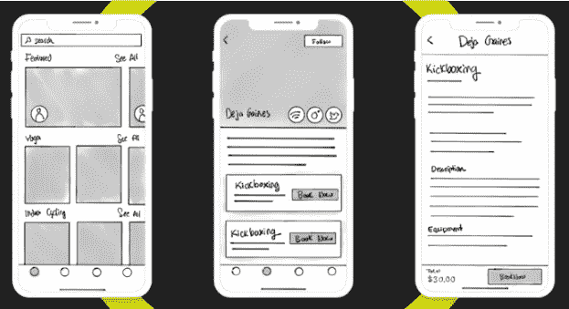
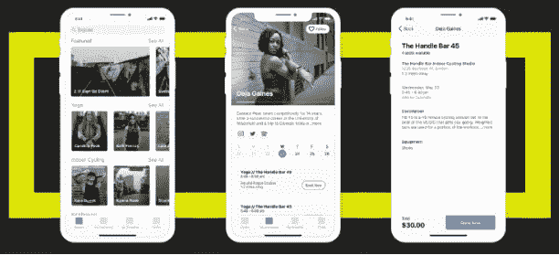
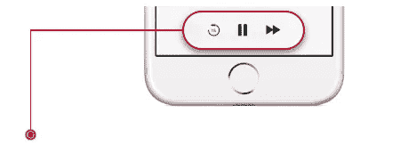
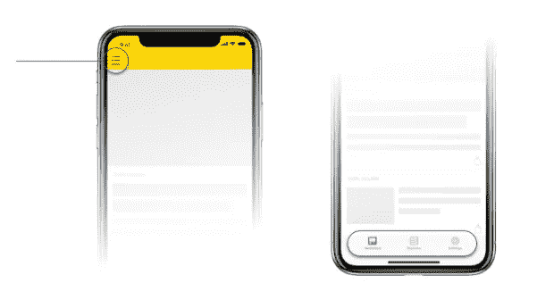

# 应用程序开发的启动蓝图方法

> 原文：<https://medium.com/hackernoon/why-the-blueprint-approach-to-app-development-is-ideal-for-startups-5fbb1810e932>

## 在你开始开发新产品之前，有一个计划是很重要的。这对于手机应用和市场上的其他产品都是如此。MindSea 的特殊方法被称为移动应用蓝图，它已经帮助许多 B2B 客户构建了他们公司的应用。

[移动应用蓝图](https://content.mindsea.com/blueprint)是我们团队制定完整、详细、可行的应用开发战略的方法。在 Mindsea，我们多年来一直使用这种方法，并以这种方式开发了 60 多个移动应用程序。这是一个屡试不爽的方法。

那么，为什么你应该使用蓝图方法，它如何能给你的创业带来好处呢？

在这篇文章中，我将介绍如何使用蓝图来:

1.  从优势位置着手构建应用程序
2.  更好地告知您的移动设计方向
3.  让你的投资者惊叹

# 为什么使用蓝图方法？

一个成功的移动应用需要详细的规划——就像任何其他复杂的项目一样。

福特汽车是通过焊接随机的金属碎片来制造汽车的吗？

埃隆·马斯克建造宇宙飞船是通过把几个引擎扔在一起并希望它们能飞起来吗？

希尔顿酒店是用铅笔草图建造的吗？

当然不是！他们依靠深思熟虑的、周密的计划来实现他们的创作。为什么你的应用应该有所不同？

**你将宝贵的资源投入到你的应用中，所以你要确保第一次就做对了。**

一个详细的移动应用战略可以让你在进入开发阶段之前完全设想和设计你的应用。这个路线图指导你的团队前进，这样他们就不会构建一个没有市场、没有兴趣或者根本不起作用的产品。

你想为自己的成功做好准备，做出明智的决定。你要让你的团队做好准备，这样他们就不会浪费时间和精力，而这些时间和精力本可以更好地用在你业务的其他领域。

移动应用蓝图允许你从你的目标用户到能帮助你实现它的投资者规划出你的整个构建。方法如下:

# 从优势位置着手构建应用程序

我们通过与客户举行为期半天的协作研讨会，开始移动应用蓝图流程。我们早早地投入艰苦的工作，这样我们就可以在以后享受收获。

# 阐明你的目标和优先事项

在你开始构建之前，你必须能够提供你的应用程序是谁，什么，何时，何地，以及为什么；不然你的产品真的没有基础。

你在建造什么？谁是你的观众？为什么这个项目很重要？

你需要知道你想解决什么问题，为谁解决。你还需要知道你的企业希望从这款应用中获得什么。

问问你自己:

*   该应用程序是否是您现有服务的附加组件，可以让您的客户更轻松地在旅途中完成任务？
*   这款应用是新的收入来源吗？
*   app 是全新项目还是重新设计？

在你写一行代码之前，这些都是需要回答的重要问题。

Postmedia 找到我们,寻求重新设计——不仅仅是一款应用，而是 18 款应用的整个目录。

以下是我们重新设计的全套应用程序，按出版物类别分组:

我们很高兴重新设想品牌的外观和感觉，但这个项目并没有变得更容易，因为我们有现有的应用程序来工作。

我们不是为一类用户重新设计一款应用。这些应用程序必须保持统一的外观，同时保持各自的特色，一气呵成。这就是为什么事先明确 Postmedia 的意图给了我们这个项目所需要的整体视角。这确保了在我们开始重新设计之前，我们的方法是统一的，并真正帮助指导我们所有应用程序的方向。

在开始开发应用程序之前，了解客户的目标和优先事项是非常重要的。

# 确定你的目标用户

任何产品构建最重要的部分——汽车、酒店或移动应用程序——是**知道你在为谁构建它。**

我怎么强调都不为过。

你不能开发一个应用程序，然后决定谁会使用它。你在制作的早期阶段描绘出的目标人物角色会影响设计和开发，而不是相反。

你必须知道你的用户的痛点，以便确认对你的解决方案的需求。然后，您可以设计和构建具有符合用户需求的功能的产品。

移动应用蓝图的第一步的目标是引导你的焦点，确认你的目标，并创建一个你可以向前推进的可靠计划。

# 更好地告知您的移动设计方向

如上所述，将你的应用设计建立在真实用户的基础上是很重要的。这意味着你必须做适当的计划和研究来获得你需要的数据。

以下是移动应用程序设计的最佳方法。

# 描绘出细节

在设计你的应用时，你必须同样关注用户体验(比如导航)和风格细节(包括颜色和图形)，因为这两者都有助于应用的整体功能和可用性。这就是为什么我们建议在你开始开发之前，从用户打开应用程序的那一刻到他们完成他们想要的任务的那一刻，布局整个设计。

当我们设计一个应用程序时，我们通常从一个粗略的铅笔草图开始，如这里的 [COEO 应用程序](https://mindsea.com/case-study/coeo/)所示:

我们这样做是为了在获得更多细节和技术信息之前，将应用程序的总体布局可视化。

从那里，我们创建线框和原型。以下是 COEO 的线框:

这些图片是从最初的草图演变而来的，我们用下一步来完善应用程序的导航和流程，并与我们的用户一起测试。这一切都发生在我们编写任何代码之前。

原型帮助我们清楚地定义用户旅程。

我们想知道我们的用户将如何使用我们的应用程序，并立即解决 UX 的任何问题。

# 测试你的假设

规划你的应用时，收集真实的用户反馈是关键。

用户研究本质上主要是定性的，可以通过调查、问卷、评论、访谈、焦点小组、有节制的用户测试、无节制的用户测试等方式进行。

无论你在测试什么目标(你必须有一个目标)，这里有一些你可能需要注意的事情:

*   用户目前如何使用你的应用(如果有的话)？他们喜欢(和不喜欢)它的什么？
*   用户使用竞争对手的应用吗？如果是，他们当初为什么选择那个应用？他们为什么继续使用它？
*   你的用户能容易地浏览原型吗？
*   流程直观吗？

对于[达拉斯早间新闻](https://mindsea.com/case-study/sportsday-talk/)，用户评论让我们增加了暂停和倒带直播的功能。

对于 Postmedia，我们测试并确认了我们的决定，即在应用程序的主要导航中使用标签，而不是更常见的汉堡菜单。

如果没有花时间与我们的最终用户核实，这些小细节很容易被忽略。

无论你是在寻找关于特性和功能、风格和设计的反馈，还是你的应用与竞争对手的相比如何，你都有很多方法可以进行用户研究。

选择最适合您测试的格式。

# 引导你的开发者朝着正确的方向前进

制定设计细节如此重要的另一个原因是，这样你的开发人员就知道最终目标是什么。

你希望你的模型是如此彻底，以至于你的设计团队有信心把它们交给任何一个开发者。开发者依靠你的设计准则将 pixels 变成一个真正的、功能性的应用。

在敏捷开发过程中，总会有对原始设计的迭代和更改。预先有一个计划良好的设计可以让这些变化快速发生，这样开发团队就不会因为试图破译不清楚的模型而变慢。

# 让你的投资者惊叹

有时候，为了构建你的应用，你可能需要有能力提供帮助的人的帮助:投资者。有了详细的战略，是时候推销了。

# 拥有向投资者进行完美推介所需的一切

在 MindSea，我们确保客户在移动应用蓝图流程的最后一天离开我们的办公室，带着他们需要的一切来回答潜在投资者的棘手问题。

一个全面的战略将为你提供重要的信息，如你的应用程序的构建成本和上市时间，详细的技术和设计文档，以及将所有这些联系在一起的演示文稿。

# 为什么 Blueprint 是构建应用程序的完美方法？

因为它有条不紊——而且有效。这个蓝图已经被一次又一次地尝试、测试和证明。

假设审批或组织协作会议没有延迟，移动应用蓝图流程需要 3 到 4 周才能完成。虽然速度很快，但是这种方法的真正好处是减少了由于缺乏计划而导致的混乱、资源浪费和其他灾难的可能性。

如果你外包你的应用程序，你要确保你的团队有一个清晰、标准的流程。如果你有一个内部开发团队，你希望他们以同样的方式思考。

如上所述，我们已经为几十个客户的应用创建了一个移动应用蓝图。这些应用中的许多已经进入了苹果应用商店和谷歌 Play 商店的特色版块。因此，如果您想今天就开始规划您的应用程序，[联系](http://content.mindsea.com/schedule-your-free-meeting-with-our-product-strategist) —我们很乐意与您交谈！

[*本文由 Reuben Hall 于 2019 年 5 月 2 日在 Clutch 上首发。*](https://clutch.co/app-developers/resources/why-blueprint-approach-app-development-ideal-for-startups)