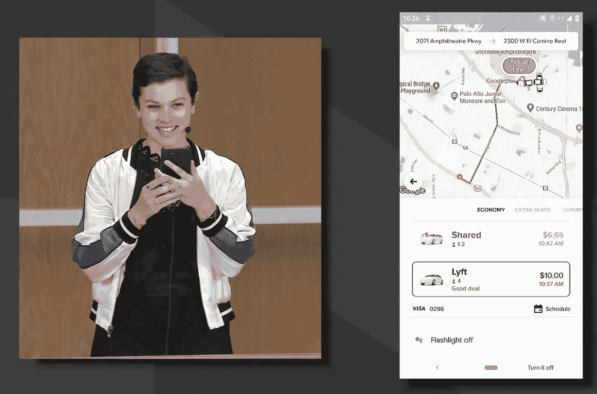

# 为什么下一代谷歌助手会改变谷歌的游戏规则

> 原文：<https://medium.com/hackernoon/why-the-next-generation-google-assistant-could-be-a-game-changer-for-google-e770fa5498d7>

将语音生态系统货币化的企业将引领语音优先经济。在 5 月 7 日至 9 日举行的谷歌 I/O 开发者大会上，谷歌展示了其与亚马逊的[竞争中的一项重大进展:推出一款速度更快的谷歌助手，Gartner 研究总监 Werner Goertz 称之为“](https://hackernoon.com/why-amazon-and-google-are-fighting-to-lead-the-voice-first-economy-919917891f07)[游戏改变](https://www.wired.com/story/google-made-truly-usable-voice-assistant/)”。随着人们继续使用语音界面完成日常任务，一个对语音命令反应更有效的谷歌助手肯定会使谷歌成为一个更有吸引力的实用工具。提供实用工具仍然是谷歌作为一个品牌的主要优势。唯一的问题是，谷歌是否会足够迅速地通过广泛提供下一代谷歌助手来利用其优势。

# 谷歌推出设备语音识别

谷歌[宣布](https://www.blog.google/products/assistant/next-generation-google-assistant-io/)谷歌的语音助手 Google Assistant 在设备上的机器学习速度越来越快。换句话说，使用 Android 的谷歌设备将直接通过设备提供语音界面，而不是依赖云。

这个消息可能会让那些认为他们与语音助手的对话只能在他们的设备上进行的人感到惊讶。在现实中，管理谷歌助手的软件实际上驻留在云上。同样，当你在 iPhone 上使用苹果 Siri 语音助手时，苹果[依赖云端](https://machinelearning.apple.com/2017/10/01/hey-siri.html)。[当你在 Echo 智能音箱上使用亚马逊的 Alexa 语音助手时，亚马逊](https://www.cnet.com/news/appliance-science-alexa-how-does-alexa-work-the-science-of-amazons-echo/)也是如此。谷歌表示，通过将语音助手软件从云端转移到你的手机上，谷歌助手对语音请求的响应速度将提高 10 倍。[据](https://www.blog.google/products/assistant/next-generation-google-assistant-io/)谷歌产品开发副总裁曼努埃尔·布朗斯坦称，谷歌助理:

> 运行在设备上，下一代助手可以在您提出请求时处理和理解您的请求，并以快 10 倍的速度提供答案。您可以跨应用程序进行多任务处理，因此创建日历邀请、查找并与朋友共享照片或口述电子邮件的速度比以往任何时候都快。通过[继续对话](https://www.blog.google/products/assistant/chatting-your-google-assistant-just-got-easier/)，你可以连续发出几个请求，而不必每次都说“嘿，谷歌”。

他还写道，“这一突破使我们能够创建下一代助手，以近乎零延迟的方式处理设备上的语音，即使在没有网络连接的情况下，转录也能实时进行。”

下一代谷歌助手将于 2019 年晚些时候在谷歌 Pixel 手机上推出。谷歌尚未宣布 Pixel 以外的产品。既然谷歌已经推出了改进的产品，谷歌需要迅速采取行动，在谷歌拥有先发优势的同时，让谷歌助手在安卓世界更加普及。

# 为什么更快的谷歌助手很重要

让语音变得更快、反应更灵敏对谷歌成为领导者至关重要。几年前，谷歌成为整个搜索类别的同义词，因为谷歌搜索引擎提供了(现在仍然提供)一种实用工具。用户可以输入命令，很快得到有用的、相当准确的答案。快进到 2019 年。谷歌[仍然主导着传统搜索](https://netmarketshare.com/search-engine-market-share.aspx?options=%7B%22filter%22%3A%7B%22%24and%22%3A%5B%7B%22deviceType%22%3A%7B%22%24in%22%3A%5B%22Desktop%2Flaptop%22%5D%7D%7D%5D%7D%2C%22dateLabel%22%3A%22Trend%22%2C%22attributes%22%3A%22share%22%2C%22group%22%3A%22searchEngine%22%2C%22sort%22%3A%7B%22share%22%3A-1%7D%2C%22id%22%3A%22searchEnginesDesktop%22%2C%22dateInterval%22%3A%22Monthly%22%2C%22dateStart%22%3A%222018-05%22%2C%22dateEnd%22%3A%222019-04%22%2C%22segments%22%3A%22-1000%22%7D)。但谷歌并没有像传统搜索那样引领语音优先体验。例如，在美国，亚马逊[拥有声控智能音箱](https://www.emarketer.com/content/amazon-echo-share-will-drop-below-two-thirds-in-2019)63%的市场份额(尽管其份额正在下降)。在全球范围内，亚马逊和谷歌在这一领域与 T4 并驾齐驱。

谷歌有强大的动力超越亚马逊:语音助手的使用预计将增加两倍，从 25 亿数字语音助手增加到 2023 年的 80 亿。使用设备上的语音:

# 谷歌可以让语音更可靠

谷歌助手[已经被](https://www.forbes.com/sites/johnkoetsier/2018/04/24/ai-assistants-ranked-googles-smartest-alexas-catching-up-cortana-surprises-siri-falls-behind/#4d5073d6492a)评为[比 Alexa 更可靠的助手](https://www.searchenginejournal.com/google-assistant-is-more-accurate-than-alexa-siri-and-cortana/263343/)基于响应的准确性。通过提高谷歌助手的速度，谷歌使其语音技术更加可靠，从而增强了它的实力。在 Google I/O 大会上，Google 生动地展示了语音技术在更快的 Google Assistant 上是多么有用:

正如安迪·鲍克夏尔在《数字趋势》中指出的，“速度就是一切，因为它带来了便利。没有它，只有沮丧。现在可以用听写回复消息，但是要先经过一系列步骤，Assistant 也不一定能帮上忙。如果软件足够准确且反应灵敏，使用语音会更快。谷歌助手 2.0 看起来将实现这一目标，除了基本的、经常重复的任务之外，使用我们的手机可能会成为一个更快、更少占用屏幕的过程。”

速度和可靠性带来信任。随着消费者看到语音有多么有用，他们将超越目前使用语音做简单事情的状态，如检查天气，并继续做更复杂的任务，如购物，企业渴望这一天的到来。

# 谷歌可以让语音成为更好的移动体验

谷歌助手[在 10 亿台设备](https://www.theverge.com/2019/1/7/18169939/google-assistant-billion-devices-feature-phones-ces-2019)上可用，高于 2018 年 5 月的 5 亿台。为什么？一大原因:搭载谷歌 Android 操作系统的手机默认使用谷歌助手。Android 充当了特洛伊木马，让谷歌助手在手机上活了下来。正如曼努埃尔·布朗斯坦[告诉《The Verge》的那样，“现在最大的足迹是在手机上。在安卓设备上，我们的市场份额非常非常大。”在手机语音领域，亚马逊无法与谷歌匹敌，谷歌真正的对手是苹果。](https://www.theverge.com/2019/1/7/18169939/google-assistant-billion-devices-feature-phones-ces-2019)

现在，移动性不仅仅意味着使用我们的手机，[亚马逊、苹果和谷歌努力将语音助手嵌入汽车就是明证](https://www.vox.com/2019/1/15/18182465/voice-assistant-alexa-siri-home-car-future)。为此，在 I/O 上，谷歌还推出了驾驶模式，这使得任何使用谷歌助手的安卓手机对驾驶都更有价值。正如谷歌[宣布](https://www.blog.google/products/assistant/next-generation-google-assistant-io/)，

> 在车上，助手提供了一种无需手动的方式，让您在旅途中也能完成工作。今年早些时候，我们在谷歌地图中引入了导航助手，在接下来的几周内，当你使用 Waze 开车时，你将能够通过助手使用你的语音获得帮助。
> 
> 今天，我们将通过助手的新驾驶模式来预览我们移动驾驶体验的下一次演变。我们希望确保驾驶员能够只通过语音来完成他们需要的一切，因此我们设计了一个语音转发仪表板，将您最相关的活动(如导航、消息传递、通话和媒体)放在前面和中间。它包括为你量身定制的建议，所以如果你在日历上预订了晚餐，你会看到餐馆的方向。或者，如果你在家开始了播客，你可以从你离开汽车的地方继续。如果有电话打进来，助理会告诉你是谁打来的，并问你是否想接听，这样你就可以只用声音来接听或拒绝。当你的手机连接到汽车的蓝牙时，助手的驾驶模式将自动启动，或者只需说:“嘿，谷歌，让我们开车，”即可开始。驾驶模式将于今年夏天在装有谷歌助手的安卓手机上推出。

现在，考虑一个更快的谷歌助手如何在你驾驶时帮助你，并使用你的声音作为寻路、预订餐厅和交流的设备。很容易看出，当你开车时，更快的回复更重要，尤其是当你开车经过一个不熟悉的地区或路线复杂的城市时。

# “超级强大，但无法使用”

如上所述，速度更快的谷歌助手将首先在谷歌的新 Pixel 手机上推出，据报道，这是美国增长最快的智能手机。到目前为止，谷歌还没有说什么时候像素以外的广泛可用性会发生。但是谷歌需要在任何安卓设备上安装速度更快的谷歌助手，才能带来真正的改变。作为雅虎！新闻在最近的一个标题中挖苦道，“[新的谷歌助手非常强大，但是不能用](https://in.news.yahoo.com/google-assistant-insanely-powerful-cant-070017518.html)”很难相信谷歌会将谷歌助手限制在 Pixel 手机上。谷歌承担不起这样的代价。对于谷歌来说，机会太大，风险太高，不能保守行事。

# 奖品

让 Google Assistant 变得更智能对 Google 有什么金钱上的回报？[正如我今年早些时候讨论过的](https://hackernoon.com/why-amazon-and-google-are-fighting-to-lead-the-voice-first-economy-919917891f07)，作为语音业务的支柱，保护了公司的在线广告业务[，该业务占谷歌收入的 70%以上](https://www.statista.com/statistics/266249/advertising-revenue-of-google/)。谷歌需要[不断给人们提供使用谷歌搜索引擎、谷歌地图和谷歌浏览器等产品的理由。这就是为什么在 2018 年，](https://searchengineland.com/search-changes-google-changes-247228)[谷歌推出了 Google Duplex](https://thenextweb.com/apps/2018/11/22/googles-ai-powered-duplex-calling-service-arrives-on-pixel-phones-in-the-us/) ，这是一个人工智能机器人，它模仿人类的声音来预订房间和执行其他业务任务。( [Google Duplex](https://www.androidauthority.com/what-is-google-duplex-869476/) 在 Pixel 手机上推出，[现在可以在网上使用](https://venturebeat.com/2019/05/11/googles-voice-strategy-is-ubiquitous-and-comprehensive/)。)通过让人们留在谷歌的生态系统上，谷歌可以继续向广告商输送受众，并从受众行为中学习。

随着[亚马逊自己的广告产品起飞](https://hackernoon.com/how-advertising-helps-amazon-change-the-world-73b366f104d9)，随着[亚马逊从谷歌那里窃取消费者搜索流量](https://www.retaildive.com/news/amazon-now-dominates-google-in-product-search/531822/)，谷歌面临着巨大的压力，要保护和扩大其在家庭和移动中的影响力。当我们走向语音优先的世界时，谷歌走得够快吗？

[*我在推特@davidjdeal*](https://twitter.com/davidjdeal)