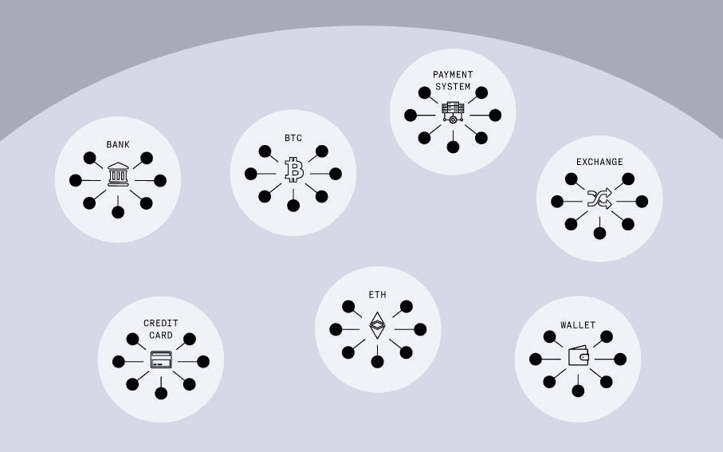
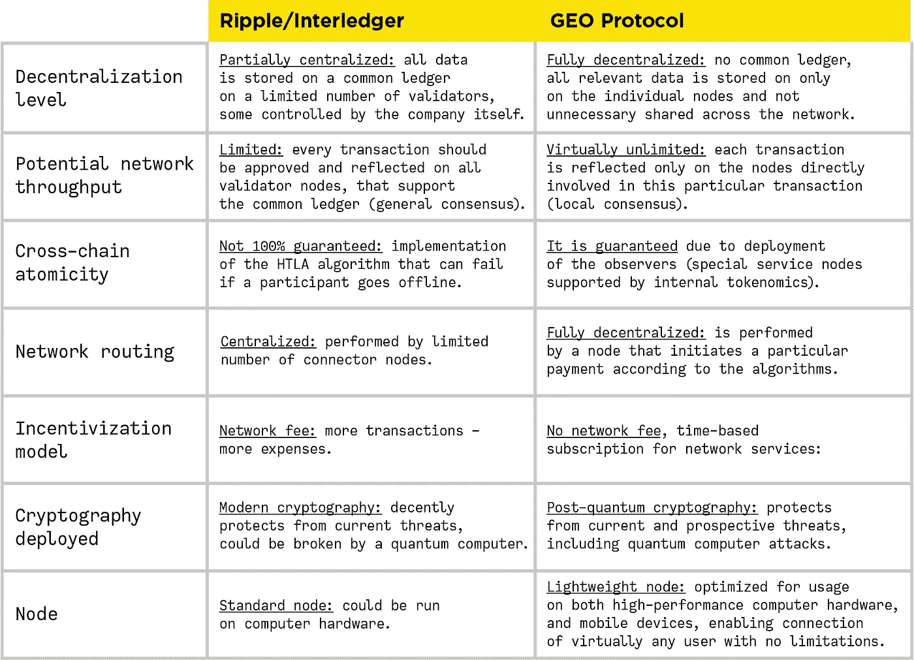
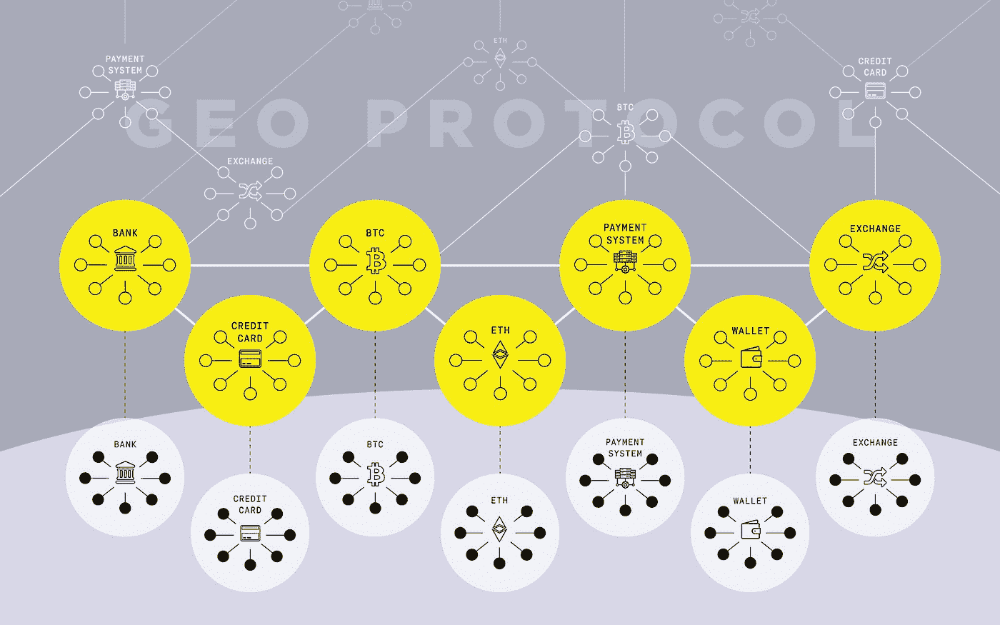

# 为什么仍然没有成熟的价值互联网？

> 原文：<https://medium.com/hackernoon/why-there-is-still-no-full-fledged-internet-of-value-eecc58889a56>

## 尽管出现了新技术(信息——数据传输——和金融——区块链和加密货币),但现代金融世界的特征仍然是创造、存储、传输和交换价值的孤立网络。但是，为什么我们已经进入了快速、简单、有效和廉价的信息交换(互联网)时代，却仍然没有进入价值互联网时代？问题是什么，有没有什么新技术可以解决这个问题？

在过去的二十年里，我们目睹了信息处理和传输技术的爆炸性发展，这些技术彻底改变了人类生活的许多方面，包括经济以及我们的日常生活。然而，与此同时，用于转移价值的技术在很大程度上仍停留在上个世纪中叶的水平。

这种技术和社会的偏斜不可能永远存在。继信息互联网之后，货币互联网一定会实现。或者从更广泛的意义上说，价值互联网，在这里，价值的转移将像今天的信息转移一样迅速、容易和廉价。此外，整个全球经济作为一个整体，特别是它的每个参与者，将能够感受到这个领域的网络效应的结果。

但是，还有什么阻碍着这一无疑是革命性的创新呢？毕竟，它似乎没有任何限制:信息的高度发展和渗透，[网络](https://hackernoon.com/tagged/network)，以及移动技术；大部分货币供应已经数字化的事实(非现金货币)；世界经济的全球化——所有这些都会自动导致价值互联网的出现。然而，我们仍然只看到它最胆小的雏形。

当然，这些问题本质上主要是组织和意识形态方面的:金融市场参与者并不急于克服惯性，改变既定的经营方式和工作模式等等。

然而，价值互联网仍然只是一个概念的另一个令人信服的原因是，到目前为止，还没有任何技术可以让它付诸实践。

即使是像[区块链](https://hackernoon.com/tagged/blockchain)和加密货币这样的创新的出现和进一步发展，也没有在这方面产生预期的结果，这些创新是为了解决这个问题。没有发生这种情况的原因如下:区块链只是价值和(或)资产登记处的另一种替代实施方式，与其他登记处(例如银行登记处、交易所或支付系统)一样，与其他价值登记处的联系很差或根本没有联系。

当然，区块链和加密货币完美地解决了支付系统中的信任问题。由于使用了区块链，基于这种技术的支付系统和其他价值和资产登记册可以摆脱其他参与者必须信任的中间人或仲裁人的必要性，从而使这种系统变得不可信。但是这并没有解决这些系统与其他系统的交互和集成问题，即使是那些建立在类似技术上的系统。

从这个意义上说，基于区块链的生态系统与传统的支付生态系统没有太大区别。即使是最受欢迎的区块链也默认彼此完全不兼容。此外，它们中的大多数都有可扩展性问题，即交易速度和成本方面的自然技术限制。尽管积极开发旨在克服这些限制的第 2 层解决方案，但这些解决方案仍然没有解决即使在加密货币市场内的互操作性问题，更不用说该市场与传统金融世界的集成了。

*今天，现有的本地价值网络是孤立的，很少或没有互操作性。*

因此，今天我们有许多异质的生态系统(价值转移和交换的本地网络)，它们彼此之间没有(或者至少没有充分地)互动。这几乎就像如果没有全球互联网(网络的网络)，我们只有一堆不相连或松散耦合的局域网(信息传输和交换的局域网)。

我们现在在没有价值互联网的金融领域有完全相同的情况:我们有许多个人银行，我们有支付系统，我们有股票交易所(传统和加密)，我们有电子钱包提供商，等等。我们甚至有几个基于区块链的加密货币，和其他价值登记。换句话说，我们有很多用于价值转移的本地网络。但是它们都连接不良或者相互之间的交互很弱。

在孤岛式网络的世界里，竞争精神常常胜过合作动机。然而，任何特定网络的成功很快就会达到极限，除非该网络学会如何从全球生态系统的整合中受益。

**创建价值转移网络的通用生态系统**

那么，我们如何才能解决[创建全球价值转移和交换网络](https://hackernoon.com/how-off-chain-solutions-can-become-a-tcp-ip-for-the-internet-of-money-17a58922d93b)的问题呢？

不同的价值转移网络需要一个通用的解决方案，该解决方案提供了互操作的技术机会，以降低成本并在不牺牲速度或安全的情况下适应不断增长的交易数量。这种解决方案应该是开源的、支持多等价、轻量级的、具有高生产率和吞吐量，即，它实际上应该成为价值互联网的网络传输协议。

今天，至少有两种技术解决方案旨在通过开发适当的技术来实现这一点，这种技术有可能成为资产转移的等价物，相当于普通互联网的 TCP/IP。这些解决方案是 Ripple 的附属技术 Interledger 和 [GEO 协议](https://geoprotocol.io)。让我们简要比较和分析这两种协议解决方案，重点关注它们的不同之处:

正如我们所看到的，GEO 协议有许多优点，可以增加更好的网络效果。所有这些都使得 GEO 有可能成为未来价值互联网通用协议的一个非常有前途的候选者。

*GEO 协议将各种孤立的价值网络互联成全球价值互联网*