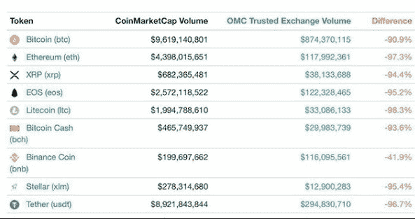
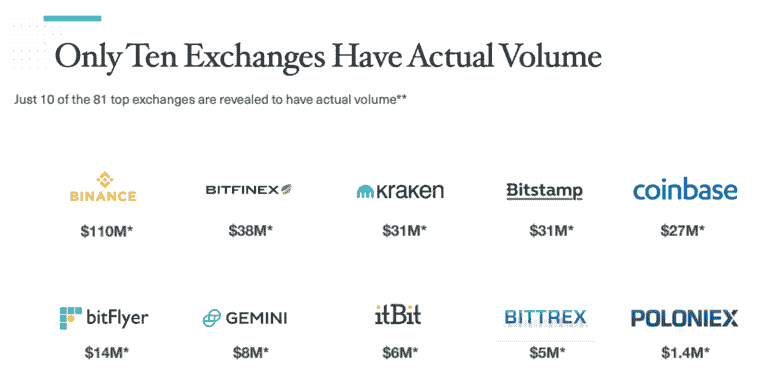

# 为什么揭露虚假量对市场增长至关重要

> 原文：<https://medium.com/hackernoon/why-unveiling-fake-volume-is-essential-for-market-growth-f20279b1ad8b>

过去几天，随着公众最终意识到交易所的大部分流动性实际上并不存在，市场受到了抨击。这已被视为加密货币增长和采用的负面因素，但我猜有人忘了告诉比特币的价格行动！

作为入门，Bitwise Asset Management 向美国证券交易委员会(SEC)做了一次演示，向官员们展示了加密量是如何被操纵的。虽然我不同意他们的投资理念或金融产品，但 Bitwise 的介绍很好地总结了这一点，包含了每个人都需要看到的有用数据。

也许这被错误地理解了。也许这实际上对加密货币非常有利。世界上大多数人将加密货币视为“假互联网货币”。由于这样的报道，这种看法在短期内可能会恶化——因为这些人甚至在关注。但是这对长期发展意味着什么呢？

简单看一下交易量是如何伪造的，就会发现一种叫做“洗盘交易”的操纵策略。清洗交易是众所周知的罪恶，尤其是在加密领域。它是指单个账户或实体在交易所同时发出买入和卖出指令。他们出售他们的加密货币(出现轻微的市场低迷)，然后回购(以较低的价格；产生微小的浪涌)。这个数量不应该被考虑，因为它不代表真实的需求，供应或交易。它只是简单地在同一时间出售和回购密码，以创造流动性的假象。

# 透明度——言行一致

每个参与区块链或分布式技术的人都把透明度和阻止腐败作为他们的主要话题。当我们的市场不透明时，我们怎么能提倡透明呢？我们应该更加关注描绘技术和市场的真实面目，而不是我们想要的样子。这很可能是对加密货币交易和机构投资的一个启示。大多数机构在市场上的存在很小，但没有什么意义。某些机构可能会利用它作为一个巧妙的小平台，来操纵流动性并获取一些利润。但要让有意义的资本流入比特币及其同行，我们需要看清这个市场的真实面目，并努力加强它。

很可能高盛、摩根士丹利和所有其他大银行和公司都意识到了加密货币的虚假流动性。对他们来说，市场的成熟胜过技术的发展。他们更感兴趣的是投资回报，而不是如何从根本上改变世界。但老实说，大多数加密货币投资者也是如此。

不幸的是，到目前为止，这个行业一直非常虚伪。密码爱好者称银行业卡特尔缺乏透明度，而密码市场本身却没有透明度。当然，当我们谈论透明度时，是指交易和网络。因此，加密技术在金融市场方面增加的透明度将极大地提高可信度。

# 长期影响

我们应该着眼于这件事的长远影响，而不是着眼于现在。这一发现意味着整个行业现在将克服“假量”。现在这个问题不仅仅是众所周知的，而且是公开的，我们将会看到许多解决方案的出现。第一个是分析公司 Messari。梅萨里决定发布一个“前 10 大”指数，显示前 10 大交易所的真实交易量。许多这样的解决方案将会出现，让人们对市场有一个更务实的看法。

像维塔利克·布特林和杰克逊·帕尔默(以及其他一些人)这样有影响力的人已经公开谈到了市场的负面影响。他们的愿景是在技术上投入时间和精力，因为市场还太年轻。Vitalik 甚至告诉人们只将一小部分资本投资于加密货币，并做好损失的准备，因为市场高度波动，任何事情都可能发生。他的观点真实地反映了事实。加密货币的高配置是大多数加密货币对冲基金失败的原因。缺乏经验且极度活跃的基金经理从公共股票和私人投资直接跳到加密货币，因为他们持有一些比特币赚了 10 倍，并且可以解释区块链做什么。动力学要复杂得多。加密货币的基本面与传统投资的基本面不可比。比特币没有运营利润，没有可以随意调整的商业模式，也没有降低成本的潜力。加密中最接近基本面的东西可以归结为两件事:新闻和情绪。

我看到的基本结果是净积极的。我们失去了一些短期信誉，但我们获得了正确方向上的长期牵引力。不可能让所有人都满意，不妨走伦理路线。这条道德路线也是未来的最佳选择。

# 为什么这个不早点出来？

坦率地说，没人在乎。是的，我们知道这正在发生，但我们不知道其程度。表面上看起来正常的交易量激增实际上是洗盘交易。要了解什么是正常的，什么是被操纵的，需要一定量的研究成交量曲线以及买卖墙。

比特币的大部分波动来自于不知情的散户交易者，他们认为自己找到了金鸭，他们根据交易量的走向进行交易，交易量会向相反的方向放大。几乎每次我们看到比特币飙升(随后是大幅下跌)时，都会发生这种情况。但除了谈论操纵，没有人认为这是一个严重的问题，只要他们能够乘风破浪，锁定可观的收益。

大多数交易者确信 6000 美元是下跌的极限。这来自“采矿谬误”，即矿商不会让比特币跌破有利可图的水平。这是完全不真实的，因为股票持续跌破发行资本金额或内在价值。黄金也跌破了开采成本，那么是什么让人们认为比特币对此免疫呢？如果说有什么不同的话，那就是考虑到每个人都声称知道存在的猖獗操纵，比特币更容易受到影响。快速研究之前的牛市及其随后的修正告诉我们，比特币通常会达到之前牛市的顶峰。在这种情况下，该水平约为 950 美元。你可能会认为这是一件疯狂的事情，但如果你排除了它，你就关闭了你的头脑，不去想可能发生的无限可能性。

直到最近，当比特币价格减半(6000 至 3000 美元)时，人们才开始合理地关心操纵和交易量的下降，因为他们损失了一大笔钱。但如果像 Bitwise 这样的大型实体没有发布正式报告，这些人仍然不会在意。

# 结论

鉴于当前银行体系的紧密联系和相互依存的行动，我经常称之为“银行业卡特尔”。但老实说，比特币中有一个“鲸鱼卡特尔”控制着市场。这只能通过实现高水平的实际流动性和交易量来克服，以缩小这些鲸鱼在市场中的控制力。我笼统地指定比特币，是因为我们不知道其他 altcoins 是否有同样的鲸鱼运动。到目前为止，替代比特币只是跟踪了比特币的价格情绪，因此这可能只是一个复制而非操纵的案例。正如安德烈亚斯·安东诺普洛斯所说，“比特币的采用率很低，因为它不稳定；比特币波动性高是因为采用率低”。这本质上是一个悖论，需要巨大的增长动力。这种增长动力很可能是比特币网络之外的一种力量，就像我们在委内瑞拉看到的那样。

透明度是前进的关键。我们需要越来越多的透明度，以便按照我们提倡的原则生活。这可能是比特币的短期低谷，但这将帮助我们有机增长，而不是通过虚假的交易量和受控的价格波动。比特币肯定没有死。每一次黑客攻击，比特币网络都会获得更大的弹性。一旦这一特征在市场上被复制，没有人会说比特币是一个不成熟的市场。

# 来源

[逐位和纽约证券交易所 Arca 报告](https://staging.busy.org/exit?url=https%3A%2F%2Fwww.sec.gov%2Fcomments%2Fsr-nysearca-2019-01%2Fsrnysearca201901-5164833-183434.pdf)
图片——OMC 和 CoinDesk

**- AB**