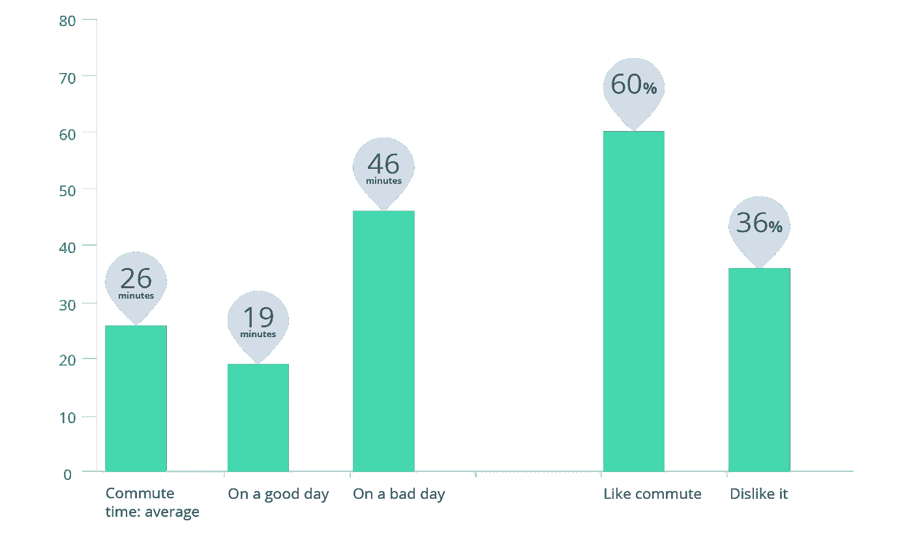
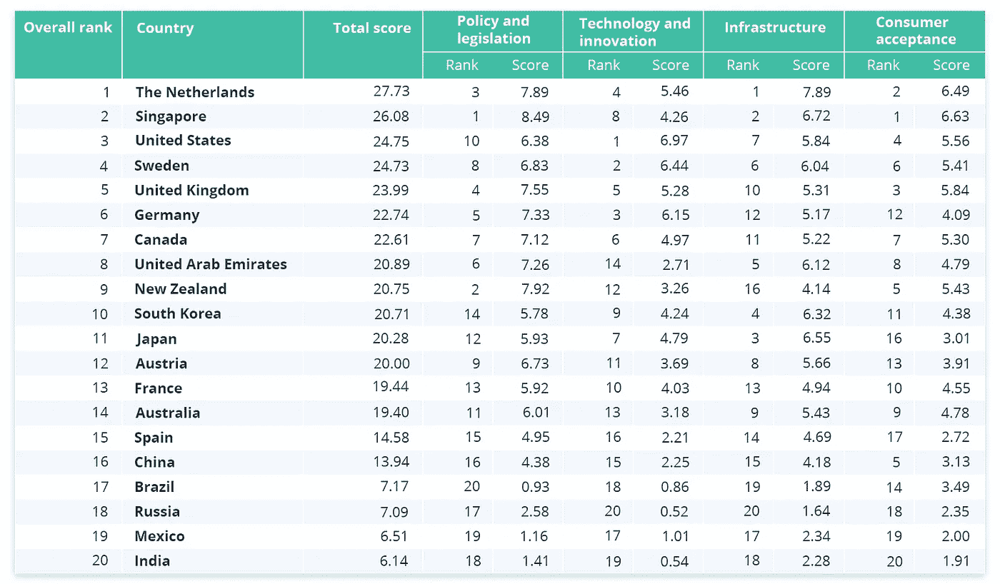
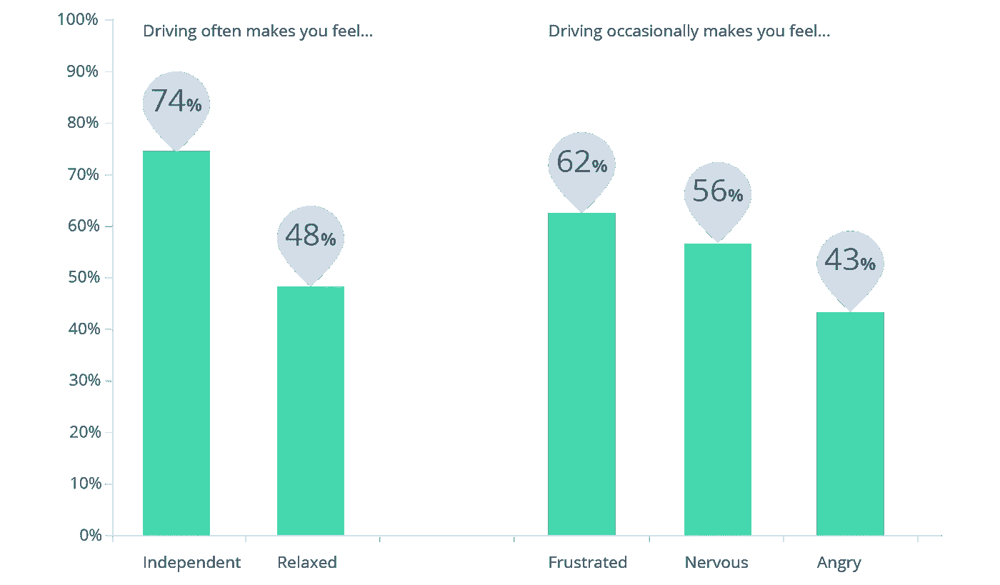
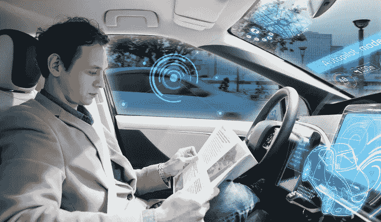

# 为什么《连线》杂志对未来交通的预测是错误的

> 原文：<https://medium.com/hackernoon/why-wired-is-wrong-about-the-future-of-transportation-2d2f8a246111>

## 骑自行车走向成功真的是未来吗？为什么不放手，让汽车带你到达顶峰？

《连线》杂志告诉我们，相信一项拥有 100 年历史的[技术](https://hackernoon.com/tagged/technology)，它在安全性和舒适性方面没有太大变化，这是一条正确的道路。他们说这是一个健康的选择。当然，你确实减少了道路上的污染和拥挤。

但是自行车是“最后一英里的个人移动[选择]”，正如[连线文章](https://www.wired.com/story/vehicle-future-bike/)所说。最后一英里之前的几十英里呢？你想舒适地骑行，免受不断变化的天气影响，并在上班前做一些紧急任务吗？这就是自动驾驶汽车作为[未来](https://hackernoon.com/tagged/future)交通技术发挥作用的地方。

# 距离和文化就是一切

CNN Travel 最近发表了一篇大肆宣传的文章，内容是关于荷兰付钱让人们骑自行车。根据这项研究，他们的政府得出结论，超过四分之一的荷兰人是骑自行车出行的。这似乎是一种休闲现象，由相对较短的距离和丰富的自行车高速公路支持。事实上，只有 25%的此类旅行是与工作相关的，并且距离不到 5 英里。出汗是远远不够的，尤其是在电动自行车上。

这种旅行确实可以被视为“最后一英里旅行”，步行将花费太长时间，从车库里取出一辆车没有多大意义。尽管对自行车有着如此根深蒂固的热爱，荷兰还是决定奖励骑自行车的人每英里 34 美分的税收抵免。很奇怪，不是吗？

嗯，他们说自行车对你有好处，我明白，但自行车革命有其局限性，美国人就是一个证明。据美国广播公司新闻报道，普通美国人开车 16 英里去上班，每天至少要花一个小时。这与荷兰形成了鲜明的对比，那里一半的人口上班的路程不到 10 英里。

美国有超过 330 万人从事大规模通勤(单程旅行超过 50 英里)，坐在自行车上淋雨或晒太阳不是最好的选择。只有五分之一的通勤者希望搬到离工作地点更近的地方。最重要的是，这些司机中有 60%喜欢通勤上班，因为他们认为这是个人反思的时间，没有人打扰他们。

[*来源:美国广播公司新闻/时代杂志/华盛顿邮报民调*](https://abcnews.go.com/images/Politics/973a2Traffic.pdf)

所以，人们确实喜欢他们的车。60%是一个非常好的满意度水平，如果他们能够在驾驶时工作、学习或从事自己的爱好，这个满意度水平还可以进一步提高。这就是自动驾驶汽车可以发挥作用的地方。想象一下把注意力放在别的事情上，而不是盯着挡风玻璃。你的双手是自由的，汽车会自动带你在公路上行驶。

# 准备拥抱自动驾驶汽车

到现在为止，你可能认为以上的例子形成了鲜明的对比，但事实并非如此。毕马威最近的自动驾驶汽车就绪指数(AVRI)报告指出，荷兰和美国是世界上准备全面采用自动驾驶汽车的前三个国家。

*来源:* [*毕马威—自动驾驶汽车就绪指数*](https://assets.kpmg.com/content/dam/kpmg/nl/pdf/2018/sector/automotive/autonomous-vehicles-readiness-index.pdf)

他们领先于许多其他国家数年，无视他们以完全不同的方式对待日常通勤(自行车与汽车)这一事实。自动驾驶汽车引起这些国家政府关注的一个关键原因是，这种汽车可以以高达 5 倍的速度安全行驶，并允许分散的社区联合起来。

# 无人驾驶汽车革命的好处

在不太遥远的将来，人们可能会在离家数百英里的地方工作，而且已经有许多人这样做了。由于像自动驾驶这样的未来交通思想，你上班的路程仍然可以用不到一个小时。这意味着许多公司现在可以受益并雇用以前不想流动的专业人员，他们现在可以很容易地到达新的工作地点。

在情感方面，开车上班让人感觉更加独立和放松。随着你在车里的时间越来越多，人们肯定会感到更加快乐，因为他们可以利用汽车的便利做更多的事情。

而且，如果你不是每天开车上班，自动驾驶汽车会以不同的方式冲击你。62%不经常开车的人对他们的驾驶技术感到沮丧，56%的人感到紧张，几乎一半的人感到愤怒。自主交通将改变他们的未来，因为他们可以坐下来放松，看着大自然经过。这是不可能做到的，当蹬自行车或牢牢抓住电动自行车的车把。长距离骑自行车会导致早上不必要的紧张和晚上的疲劳。

[*来源:美国广播公司新闻/时代杂志/华盛顿邮报民调*](https://abcnews.go.com/images/Politics/973a2Traffic.pdf)

但是你所在地区的交通可能很糟糕，骑自行车似乎是个不错的解决方案。事实上，美国有 5000 万成年人每天都被困在路上，没有更好的事情可做。在通勤者中，近三分之一的人至少每周都会遭遇交通堵塞。

有了自动驾驶汽车，你就不必妥协，因为这种无人驾驶汽车遵循道路规则，不会像人类一样犯错。这两个是所有导致交通堵塞和生命损失的车祸的主要原因。将它们排除在方程式之外将缓解自动运输系统的交通，并使到达任何你想去的地方更加安全和快速。

最后，能够在车里多工作两个小时，平均来说，会给你的一个月增加整整一周的工作时间。这意味着你可以在给定的时间内完成更多的工作。这将为任何国家的经济和 GDP 提供巨大的推动力。或者你可以干脆早点下班，花些时间陪陪家人。这将提升你的幸福水平和总体幸福感。因此，十年内，自动驾驶的经济影响将为美国经济增加 1 万亿美元。

最重要的是，自动驾驶汽车不仅是未来的汽车，而且这个未来并不遥远。我相信在未来 5 年内，我们将会看到这项技术的实质性发展。它将成为中产阶级可以使用的交通工具，并通过专业的汽车共享服务为所有人提供高速舒适的通勤。