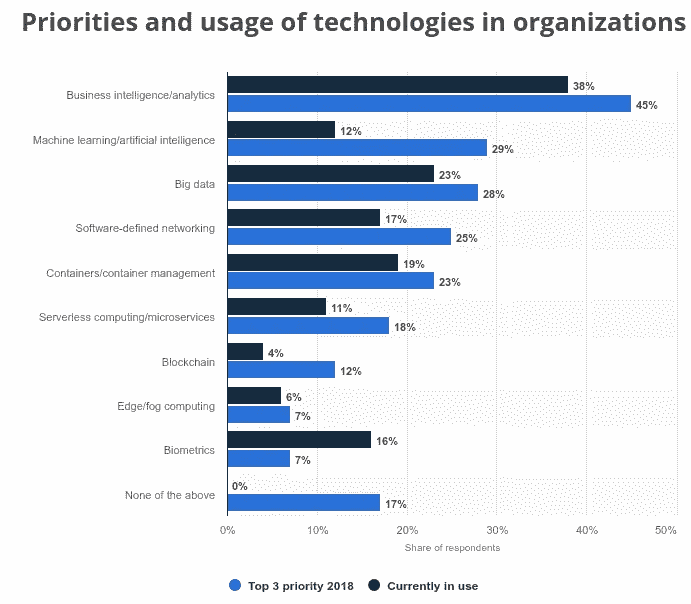
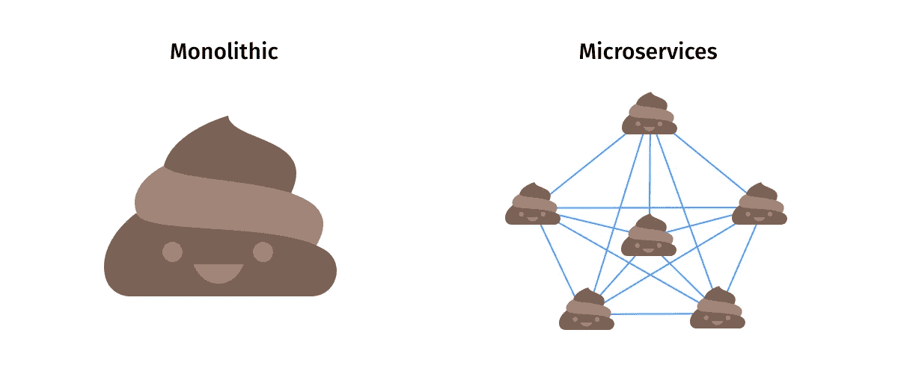
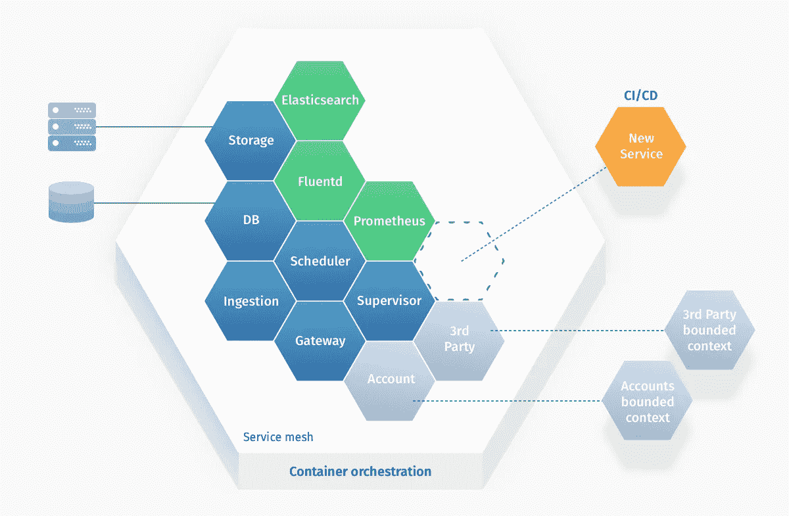

# 为什么您不应该转向微服务

> 原文：<https://medium.com/hackernoon/why-you-should-not-switch-to-microservices-6f0bcd98ab68>

## 你的产品应该从一开始就构建成一个整体还是由微服务组成？什么时候是采用微服务的合适时机？你为什么需要后退？

微服务是最近兴起的一个术语，许多企业都在考虑迁移到这个软件架构。对于[从单一应用转向微服务或无服务器计算](https://itsvit.com/blog/the-monolith-microservices-and-serverless-computing-pros-and-cons/)的好处和必要性，有多种观点。使用微服务可以为金融、零售、咨询、银行、营销、数据分析和其他行业的工作流带来效率。

该统计图表显示，截至 2017 年，微服务或无服务器计算已经在**11%的生产部署**中积极使用，而**超过 18%的受访者**将采用这项技术列为 2018 年的首要任务。

然而，人们可以很容易地找到幻想破灭的爱好者的故事，他们发现微服务不是简化他们的 IT 运营的神奇技巧，但是使用这种架构往往会使他们的软件交付例程过于复杂。也有声音点强调[微服务在设计不良时比单片](https://oprea.rocks/blog/microservices-are-bad-so-are-monoliths/)更差。它甚至通过一个简单的，如果不是很礼貌的图片来说明:

简而言之，如果一个产品或服务设计得很差，将其分解为微服务不会提高质量。如此说来，我们来思考一下[什么时候应该转微服务，什么时候不应该](https://nickjanetakis.com/blog/microservices-are-something-you-grow-into-not-begin-with)做。

# 何时使用微服务

要正确使用微服务，你必须了解什么是微服务。

> ***微服务是软件架构的方法，其中产品被拆分成解耦的组件，这些组件通过 API 相互交互，确保产品性能的连续性*** *。*

有几个要点需要记住:

*   虽然这些模块在操作上是分离的，但是它们仍然有一些重叠的功能和代码
*   除了执行其核心功能，微服务还必须支持通过 API 与其他模块的连接
*   虽然微服务可以单独开发，但是在发布之前必须测试它们之间的相互依赖关系。例如，如果微服务 1 中的某些功能使用微服务 2 中某个版本的库，并且该库已更新，则您必须相应地更新微服务 1 代码。

这将我们带到列表的第一点——尽管技术上是分离的，但微服务仍然是相互依赖的，或者您必须在每个微服务中复制一些功能来降低相互依赖的程度。

也就是说，**企业通常会考虑为已经生产了相当长时间的产品采用微服务**,这种产品变得过于庞大，无法作为一个整体进行更新和维护。通过将它拆分为分离的微服务，开发人员希望:

*   提高系统弹性，因为产品的任何部分都可以单独重启
*   降低开发的复杂性，因为许多功能可以被隔离，以减少必须交互的数量
*   缩短新功能的上市时间，因为开发较小模块的新版本比更新整个产品更快。

因此，当业务在其运营中发展到一定程度的复杂性时，理解这些优势并接受投入精力实施微服务的需要**，简单的纵向或横向扩展不再有效。**

然而，人们容易忘记的是[通过分割一个整体，你增加了它的操作复杂程度](https://www.infoq.com/news/2018/07/segment-microservices)。这意味着您需要单独的测试代码库，同步发布以确保生产环境监控的操作稳定性和复杂性。

那么什么时候是为你的软件采用微服务架构的合适时机呢？坦率地说— **从 MVP 开发的开始**。在这种情况下，您将能够提前计划并相应地构建基础设施和 CI/CD 管道。唯一的问题是，您的 IT 团队是否拥有设计、实施和维护这样一个系统所需的专业知识？

# 微服务的工作解决方案

运行微服务的精心设计的解决方案必须能够自动处理扩展和负载平衡，必须能够对每项服务进行单独备份并在不影响系统其余部分性能的情况下恢复它们，必须在设计上做到安全，以排除外部恶意篡改的可能性……它还必须使产品开发流程尽可能简单，并使大多数流程实现自动化。

这些要点可能看起来很明显(谢谢，队长！)，但是完全实现它们需要专业知识，而这在开发 monolith 应用程序的团队中通常是不具备的。不幸的是，在这项任务中一头扎进去会导致可怕的结果，所以**你最好不要转向微服务，除非你的团队有 100%的成功经验**。

一个显而易见的选择是雇佣一个可靠的 IT 咨询公司来审计现有的基础设施、工具和流程，并提出重建软件生态系统和产品架构的最佳方法。点击链接，了解 IT svit 如何为我们的长期合作伙伴 [Skillbyte](https://itsvit.com/cases/cloud-cms-showcase-setup-devops/) 处理这样的任务。

# 关于何时使用微服务的结论

总结一下:在尝试将产品分成微服务之前，企业必须在规模和运营专业知识方面有所增长。即便如此，最好还是与一个可靠的[托管服务提供商](https://clutch.co/it-services/msp)合作，他们有很多这方面的成功经验。对于[初创公司](https://itsvit.com/startups/)来说，另一种选择是从一开始就选择微服务，通过雇佣承包商来设计所需的 IT 基础设施，并构建您的产品以最高效率利用它。

IT Svit 在从一开始构建微服务和将现有产品拆分为微服务方面都有丰富的经验。我们还设计、实施和卸载所需的基础设施，因此，如果您需要将微服务引入到您的运营中— [我们随时准备提供帮助](https://itsvit.com/contacts/)！

*原载于 2019 年 1 月 3 日*[*itsvit.com*](https://itsvit.com/blog/not-switch-microservices/)*。*