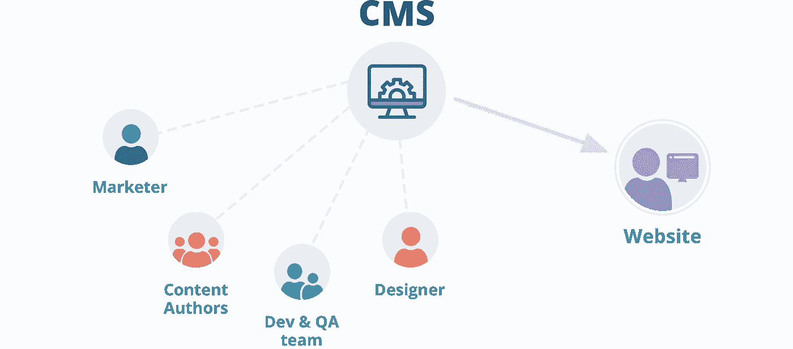

# 为什么你的网站需要一个内容管理系统

> 原文：<https://medium.com/hackernoon/why-your-website-needs-a-content-management-system-718685fb81c5>

如今，对于许多公司来说，内容是一种战略性的业务资产，因此管理内容(创建、发布、更新)至关重要。内容管理系统(CMS)节省了内容创建和交付过程中所有利益相关者的成本和时间。在本文中，我们将简要介绍内容管理和交付流程，并解释为什么没有内容管理系统，公司网站将难以生存。什么是 CMS？市场上有哪些选择？CMS 利弊？使用该系统对业务有什么影响？见下文！

# 内容的历史。从洞穴绘画到商业资产

最早的内容出现在人类发明书写系统之后——大约公元前 4000 年。然后内容进化了——等等等等(这不是维基百科的文章)——从纸莎草纸到动态互动网站。如今，内容是一些组织及其网站最重要的商业资产:想想《纽约时报》或 Coursera。与此同时，对于其他类型的网站来说，内容是附带的，但仍然是必要的组成部分:想想 BestBuy 的电子设备用户指南或 GitHub 的图书馆描述。

在你的公司首次出现在网络空间之前，你应该定义

*   描述它的**内容**(关于我们、使命和愿景、服务条款)
*   它可能为目标受众制作的外发**内容的类型**(博客文章、案例研究、营销材料)及其目的。

网站上显示的内容取决于你的垂直业务、需求和目标。在任何情况下，它都是为特定的目的而创建的。定义一下。考虑到您业务的潜在增长，以可扩展的方式完成这项工作。

# 内容管理和交付的二分法

与原始数据不同，内容是编辑过程的结果—信息的积累、创作和编辑、准备发布、审阅、批准、发布、版本控制、重新发布……所有这些都是反复进行的。根据你的关注点和组织规模，可能会有一个专门的编辑团队或者只有一个像湿婆一样的人来管理整个过程。

认真对待在线内容的公司通常会遵循特定的框架来处理两个相互关联的顺序流程:a)内容创建和管理；b)内容交付。这就是内容管理系统派上用场的地方。

# CMS:定义、组件和类型

一个**内容管理系统(CMS)** 是一个软件——通常是多用户的，托管在本地或云中——在一定程度上自动化编辑过程和内容交付。它允许编辑创建新内容，存储和编辑现有内容，执行任何编辑活动，并最终通过网站提供。

简而言之，CMS 将内容作者从网络出版的技术复杂性中解放出来。你不需要精通 HTML 或浏览器的软件工程师来发布一篇新的博客文章。

# 内容管理系统的组件

尽管大多数 CMS 的特性和功能各不相同，但从逻辑上讲，它们都具有以下组件:

*   后端，实现发布机制，模块和插件，模板化布局，角色和网站管理员管理的权限。
*   内容的数据库和文件系统存储。
*   编辑器的用户界面，有时称为 CRUD(创建、读取、更新、删除)。大多数 CMS 都有一个富文本(WYSIWYG)或 HTML 编辑器或一些其他界面元素，允许在准备发布页面时格式化文本和图像。
*   前端，最终通过网站页面显示给最终用户，例如公司博客或“关于我们”页面。

# 内容管理系统的类型

就像任何软件一样，内容管理系统因技术堆栈、安装模式(本地托管或云托管)、许可条款和价格(商业和付费或开源和免费)而异。根据许可条款，商业内容管理系统在功能集或内容量方面的价格各不相同，并为单个或多个用户、一个或多个网站提供服务……您可以选择流行的端到端解决方案，也可以选择从头开始构建的全新内容管理系统。

比较不同的 CMS 选项并为网站推荐最佳 CMS 超出了本文的范围。这里只是一个提示:选择一个 CMS 来满足您当前和潜在的业务需求。

> 就像你的内容，内容管理是针对特定的市场或使用场景。

在 [Logicify](http://logicify.com) ，我们选择了 django CMS，这是一个基于 django 框架的现代灵活的 CMS，属于 Python 生态系统。它是开源的，由社区运营。有了它，我们可以管理我们的营销网站，包括博客和投资组合部分，以及内部门户网站。我们自行部署了该系统，并用定制插件扩展了它的基本功能。我们计划在下一篇文章中分享我们使用该系统的经验。敬请期待！

# CMS 对你的网站的商业意义

所以新闻网站需要 CMS 的原因是显而易见的(因为热点内容是其战略资产和竞争优势)。如果没有专门的内容处理系统，最有价值的内容由用户自己生成的社区论坛也很难生存。但是为什么电子商务或商业网站需要 CMS 呢？哪些内容可以在这样的网页上管理？

实际上，任何网站(好吧，让我们排除种子和文件共享平台)都有应该被管理的内容(存储、编辑、发布、更新)。这可能是集客营销材料、教育材料、登录页面。这些包括但不限于条款和条件、常见问题页面、关于我们或我们的故事页面。团队和职业页面。投资组合。博客！即使这听起来并不意味着你现在就需要这些页面中的任何一个，但将来你可能会需要。记住:永远要考虑可伸缩性。人们在网上寻找他们问题的解决方案，所以如果你做了一篇关于你的解决方案的好文章，你几乎就把它卖给了他们。

关于 CMS 最明显的*优势已经写了很多，这里就简单列举一下:*

*   *几乎所有的内容管理系统都会组织并至少部分地自动化内容创建和发布过程。因此，它无疑减少了管理内容的时间。因此，节省了资金并提高了编辑效率(“内容吞吐量”)。*
*   *开发网站的人(工程师团队)和为网站创建内容的人(编辑团队)有不同的技能，实际上，还有不同的思维方式。有了 CMS，**每个人都做他/她负责的事情**:开发人员配置和管理系统，内容人员——为最终用户发布和更新页面。*
*   *CMS 让你完全控制内容。你可以把所有的片段和它们的版本存储在一个地方，并且可以完全自由地重用、编辑、聚合它们等等。*
*   *大多数 CMS 面向多个用户，这意味着它们允许**管理角色和权限**。您可以为任何负责的利益相关者提供不同级别的访问权限。*

*我们深入研究了一下，收集了一些经常被忽视或忽略的 CMS ***见解*** 。*

*   *CMS 利用**所有媒体中一致的在线品牌**。有了现代内容管理系统，你不仅可以在网站上发布任何吸引目标受众的内容，还可以创建多渠道营销活动:社交媒体帖子、RSS、传单、动态内容……所有内容都可以包括漂亮的视觉效果和定制布局，融入你独特的品牌风格指南。你还可以利用内容调度功能(在一些 CMS 中提供了开箱即用的功能，比如 [django CMS](https://www.django-cms.org/en/) )在高峰时段发布内容，从而获得更大的影响力。*
*   *大多数 CMS 与社交媒体无缝整合。他们会自动将你的文章格式化为推文/脸书或 LinkedIn feed 更新，并在你的公司账户下发布。
    一些内容管理系统使用开放图形标签来优化脸书上共享内容的显示。如果你添加了“分享”按钮，用户就可以在他们的社交媒体账户下转发你的网站内容，这就有机地扩大了你的受众。*
*   *有了 CMS，你可以探索**广告的新视野**。考虑添加一个博客，在那里你可以发布用户成功的故事或者你的产品/服务的原生广告。一些电子商务网站甚至将他们实际的在线商店与 CMS 结合起来(例如，使用 Drupal 或 Magento 平台)。*
*   *一些 CMS 让内容**移动设备变得友好**而不需要你额外的努力。例如，django CMS 很容易与 [Bootstrap](https://getbootstrap.com/) 配对，以使内容适合任何视窗大小。如果您的 CMS 模板中有整洁的响应标记，您就不需要为桌面和移动设备创建单独的版本。*
*   *一些 CMS 提供现成的搜索引擎优化特性，包括有意义的 slugs(页面 URL)、meta 标签和关键字、适当的页面结构等。这些因素增加了你的[网站的可访问性](https://www.logicify.com/en/blog/accessibility-in-web-development-how-ecommerce-and-business-websites-benefit-from-it/)，并使搜索引擎抓取你的内容变得容易。更好的可访问性+更高的谷歌排名=更大的知名度和更多的网站访问者。大多数内容管理系统都提供网站地图，这可以改善你网站页面的布局。这样，你的网站看起来对谷歌爬虫更“有吸引力”，所以你会得到更高的排名。
    由于网页排列整齐，你可以通过谷歌分析报告跟踪网站上的客户旅程和行为，确定最受欢迎和最不受欢迎的网站页面，找出用户反弹的原因等等。*
*   *包括 django CMS 在内的一些 CMS 可以让你的网站更具互动性，如果你在你的内容中加入定制反馈、订阅和跟进表格的话。一旦用户在您的网站上提交表单，您就会收到通知，进一步处理查询并回复用户的电子邮件地址。*
*   *有了 CMS，**扩大规模就更容易了**。如果您的营销活动或感恩节销售导致突然的流量激增，专有解决方案可能很难处理这种负载。现代 CMS 平台，尤其是大型企业平台，是云托管的，因此即使是传入的流量高峰也更容易处理。*

*不列举几个 CMS 的*缺点，我们就不客观了:**

*   **CMS 的实现和维护需要成本、时间和技能(通常远远超出内容编辑的技能范围)。根据您的公司规模、选择的 CMS 和您在 it 方面的实际需求，您可以选择内部开发团队或雇佣开发人员进行一次性工作(CMS 实施、设置、定制)。**
*   **内容作者很可能需要掌握使用 CMS 的新技能。特殊的专业知识是通过时间积累起来的，培训也是有成本的。**
*   **不管你愿不愿意，你的编辑团队将不得不 a)遵循 CMS 中的内容创建程序，b)根据 CMS 的限制调整他们的活动。**

**在这个过程中也可能出现一些 CMS 特有的缺点。**

# **结论**

**如今，企业的好坏取决于为其提供动力的软件。无论你的公司经营什么类型的网站，它都会从内容管理系统中受益，尤其是如果你想的是可扩展的和长期的。一个现代化的 CMS 将帮助您在内部微调内容创建和发布过程，并获得许多积极的业务影响，包括节省时间和金钱。**

***原载于 2019 年 3 月 26 日 www.logicify.com/en/blog*[。](https://www.logicify.com/en/blog/why-your-website-needs-a-content-management-system/?edit)****