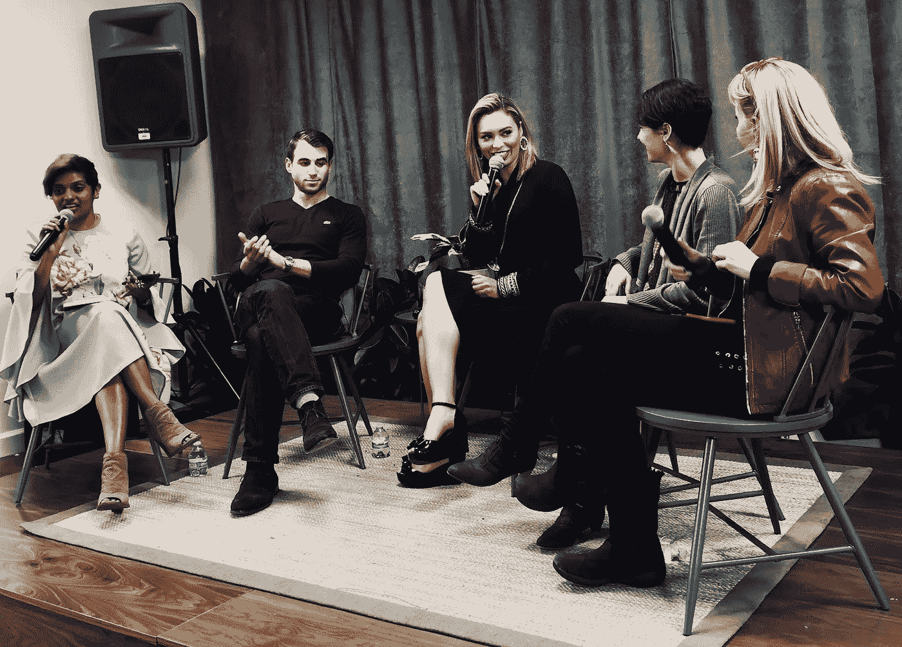

# 维基百科联合创始人和其他人在 SXSW 辩论区块链技术和数据所有权

> 原文：<https://medium.com/hackernoon/wikipedia-co-founder-and-others-debate-blockchain-technology-and-data-ownership-at-sxsw-83d5564f0a34>

Wikipedia co-founder and CIO of Everpedia, Dr. Larry Sanger at SXSW; Photo Credit: Veritoken Global

拥有你的数据意味着什么？对于布列塔尼·凯泽来说，数据所有权以数字资产的形式出现，也被称为“加密货币”或“稳定硬币”。

Kaiser 是 [DATA](https://www.digitalasset.org/) 的联合创始人，也是著名的剑桥分析/脸书告密者，他强调自社交媒体兴起以来，数据所有权变得多么重要。她在一次非正式的 [SXSW 炉边谈话](https://www.youtube.com/watch?v=FotPo3JKN3w&feature=youtu.be&fbclid=IwAR2eJAp6UOlIWeDDjKaxhSXdyhL3xpET6UYZuxJQKzEXrR3IXpOiyGxUpf4)中陈述了她的观点，旁边是 [Veritoken Global](https://veritoken.io/) 的首席执行官和 IBM Futurist 的 Anne Ahola Ward。

> “截至上周五，怀俄明州通过了第一部法律，承认所有类型数字资产的个人所有者的直接产权，包括虚拟货币、数字证券和公用事业令牌。这使得怀俄明州的任何人都可以拥有数字资产。虽然数字资产是区块链的象征，但它们现在正被用来保护个人数据，”Kaiser 解释道。

这场讨论揭示了一个事实，即一些世界上最大和最有价值的公司，如脸书和谷歌，由于收集用户的个人数据，往往在未经同意的情况下，已经发展成为数万亿美元的产业。

> “如果脸书和谷歌不是由我们的数字资产(实际上是我们的个人数据)组成的，你认为它们会有今天的价值吗？”凯撒问道。

凯泽解释了脸书等社交媒体平台如何操纵用户通过“无害”的应用和游戏分享他们的个人信息，沃德解释说，作为消费者，拥有任何类型的数据都变得很困难。沃德接着指出，NFTs 可以帮助解决这个问题。

> “我们消费一切，不再拥有任何属于自己的东西。沃德说:“我们给了少数人太多的权力，结果遭到了强烈反对。我相信未来将会在 NFTs 中。作为一名开发人员，我们有机会在发布软件时包含 NFTs。我现在唯一担心的是博彩公司在和我们作对。沃德说:“现在是我们大家团结起来，集中资源，停止为娱乐而分东西的时候了。”。

接着 Ward 的观点，Kaiser 提到智能合同也被某些组织用来确保公司不滥用用户数据。然而，凯泽和沃德都同意，区块链技术不是银弹解决方案。相反，必须通过立法来确保用户的数据不被滥用。

> “GDPR 实际上是公司的死刑。沃德说:“区块链让我们能够自我监管，特别是在非功能性交易方面，但我们仍可能看到国会关于大型科技的听证会导致新的法律。

CryptoVixens Panel during SXSW, featured a fireside chat with Brittany Kaiser and Anne Ahola Ward

## **分散社交媒体的案例**

维基百科的联合创始人、 [Everpedia](https://everipedia.org/) 的首席信息官拉里·桑格博士也提出了数据所有权的观点。在 SXSW 的一个[专题会议](https://schedule.sxsw.com/2019/speakers/2012659)上，桑格博士向满屋子的人讲述了集中式社交媒体平台带来的各种问题。

> “社交媒体用户经历了几次小灾难后才意识到脸书和其他平台窃取个人数据造成了多么严重的问题，这是一种耻辱。这些平台是为了赚钱。他们不仅通过代表广告商将我们置于显微镜下来赚钱，还通过以各种不符合他们利益的方式操纵用户来赚钱。如果我们拥有自己的数据，而整个系统是分散的，那么脸书和谷歌就无法做到这一点，”桑格博士说。

桑格博士还指出了“协调问题”他解释说，一旦家人、朋友和同事加入一个集中的社交媒体平台，比如脸书，没有人会离开这个网络，除非其他人都离开。因此，当人们试图脱离集中的社交媒体形式时，就会发现缺乏协调。

> “简而言之，应用于社交媒体的协调问题是，任何离开大型社交媒体平台的大规模迁移都需要我们所有人之间的协调，这很难。然而，协调似乎是必要的，因为社交媒体平台主要由于用户的临界质量而保持价值。尽管可能很糟糕，但脸书因为其网络上的所有人而具有价值。桑格博士解释说:“尽管替代平台可能很棒，但如果没有很多人使用它们，它们就不会有太大的价值。

桑格博士已经[提出](https://www.wired.com/story/larry-sanger-declaration-of-digital-independence/)召集一群志同道合的有影响力的人，试图协调群众使用各种去中心化的社交平台，比如 Everpedia。

> “了解一下分散式社交媒体平台在大规模使用时会是什么样的，这将是一件很棒的事情。然后，也许我们可以进行一场真正的公开辩论，讨论竞争对手的优点，以及我们真正希望社交媒体是什么样的。特别是如果开发人员社区采用了统一的社交媒体标准和协议，我们很可能会引发一场大规模的迁移，转向更尊重隐私的平台。”

## **带有标记化的数据所有权**

令牌化，即将现实世界的资产放到区块链网络上，也引起了广泛的争论。在一个非官方的 SXSW 小组会议上， [ATO 画廊的创始人 Carrie Eldridge 解释了标记资产，比如艺术品，如何帮助确保数据所有权。](https://atogallery.com/)

> “就标记化而言，ATO Gallery 提供了一种所有权感，因为我们的标记所代表的基础资产是由特定艺术家创作的艺术品，这些艺术家拥有数据、记录和经过验证的市场价值和需求。这些艺术品对收藏家、博物馆、艺术史学家和教育家都有价值。如果出于任何原因，代币停止铸造，现有所有者拥有手头基础资产的所有权。这是保护代币持有者和艺术家的法律义务，”埃尔德里奇说。

Founder of ATO Gallery, Carrie Eldridge, discussing tokenization of assets; Photo Credit: ATO Gallery

与埃尔德里奇一起， [NovaBlock Capital](http://www.novablock.io/) 的首席投资官 Blake Richman 指出，对于寻求更大流动性的散户投资者来说，令牌化已经变得多么重要。

> “令牌化实现了传统上与散户投资者隔离的金融工具的民主化，弥合了发行者和投资者在资本形成方面的关键差距。”

与此同时，在 ConsenSys SXSW Blockchain House 举行的“音乐的未来”小组讨论探讨了众筹音乐制作的变革性质以及区块链对出版商、唱片公司、艺术家、知识产权所有者和消费者的影响。

区块链基金会女性创始人兼 Vezt 顾问 Phu Styles 解释了标记化将如何让音乐家和其他艺术家拥有自己的数据。

> “我相信未来会更加分散。除了 Vezt 在允许音乐知识产权的部分所有权方面所提供的，我们将看到令牌化将如何赋予像我这样分散的个人更少的所有权和更多的生活。人类不必成为金手铐的奴隶，我们可以从我们的数据而不是公司中获利的未来，是我和我的区块链福音传道者们一起努力创造的去中心化的未来。”

*你可以在我的* [*福布斯专栏*](https://www.forbes.com/sites/rachelwolfson/#2de83003181c) *上阅读更多关于区块链科技的内容。关注我的* [*推特*](https://twitter.com/Rachelwolf00) *了解最新的区块链和加密新闻。*