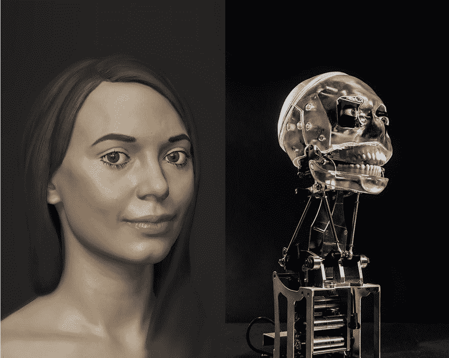
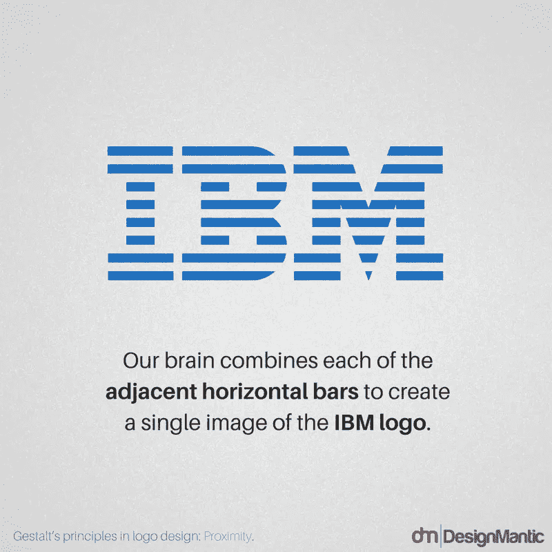
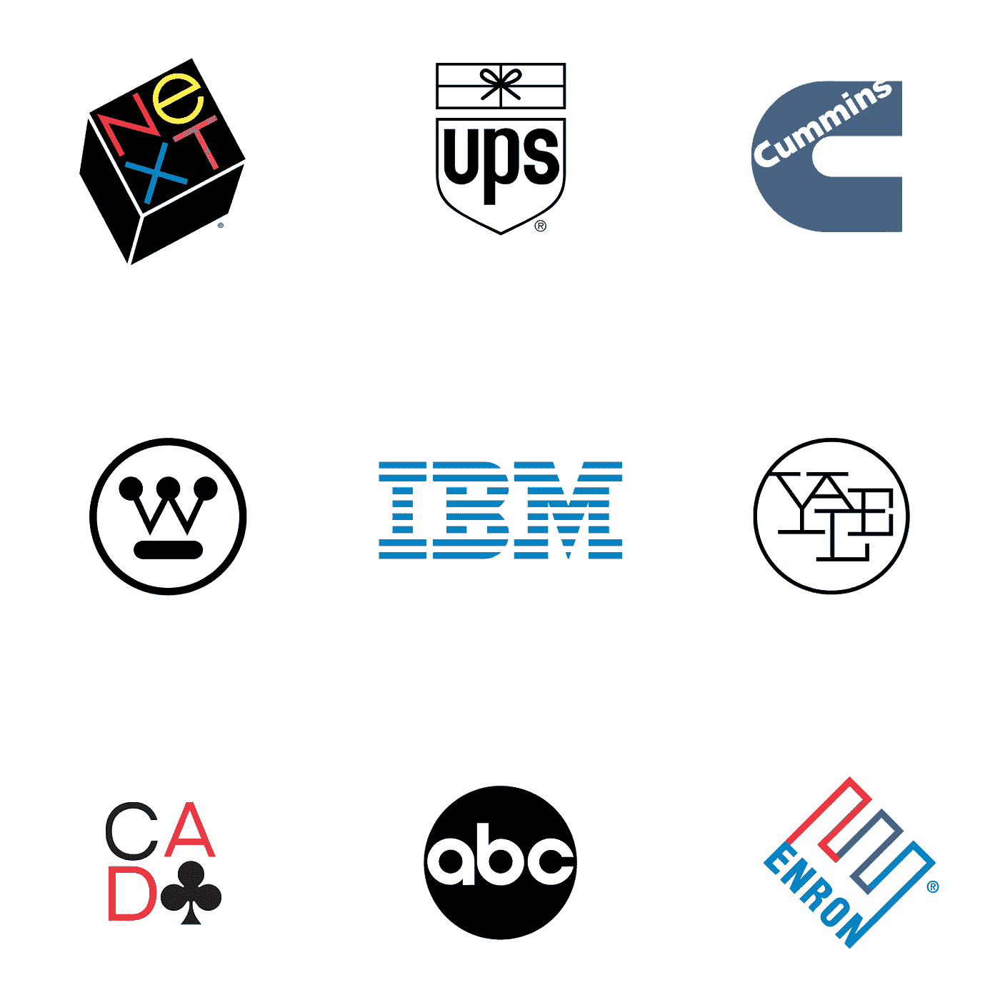

# 以人为中心的设计会把人类设计师甩在后面吗？

> 原文：<https://medium.com/hackernoon/will-human-centered-design-leave-the-human-designers-behind-1e8d778b52d9>

> 人工智能是一种花生酱，你可以在多个行业推广。有了对我设计的这个东西在现实生活中会遇到的情况的精确想法，我就能设计得更好。——[*莫里斯·孔蒂*](https://twitter.com/MauriceConti)

# 机器时代的设计思维

多亏了[设计思维倡导者](http://fortune.com/2019/02/15/change-by-design-new-excerpt-tim-brown/)，在过去的几十年里，设计师们已经开始接管许多大型科技公司的各种创建和管理角色。与此同时，机器学习的出现并没有成功挑战设计行业本身。还是做到了？当人工智能以如此迅猛的速度接管所有其他行业时，设计界和科技界都出现了一系列挥之不去的问题。我们如何驯服机器来产生引人注目的图形，引发人类的情感和思考？我们如何抑制业余非设计师向 AI 提供有偏见的数据？精致的 Adobe 软件最终会进化成接管人手的机器人工具吗？感觉和想法是非常复杂的，所以让我在这个博客中保留一点个人立场。

Ai-Da :第一个不需要任何人工干预就能画画的机器人艺术家。

# 抛弃人类设计师？

上世纪中期，可能是当时最著名的商业设计师，[保罗·兰德，](https://paulrand.design/)注意到广告行业的大多数“专业人士”

> …他们甚至没有足够的辨别力来区分好与坏、新潮与原创，也不总是能识别出天赋或专业技能。在设计领域，他们有特权，但不一定有资格——毕竟，设计不是他们的事。

大约 50 年过去了，情况已经大大恶化。网上丰富的工具和设计资产令人震惊，让每个掌握基本 Photoshop 技能的人都有机会创作出质量可疑的图形。抛开多年的设计培训/自学——你只需要一台 Macbook 和 Adobe 套件(旁注——你最好也买一台 Wacom)。

现在，有了机器人设计师，这种设计教育差距将完全失控。但另一方面，机器必须经过严格训练，最好是由顶尖设计师训练，以确保输出足够。对我来说，这听起来是一项昂贵的努力，然而，这可能是平面设计毕业生的另一条职业道路，也是对那些认为人类将被完全踢出这个行业的人的安慰。我确实相信，对于不断发展的艺术行业来说，这种促进者/教师的角色即使不激动人心，也是最可行的。在构建#ML 工具的同时协作和分享知识——我很乐意。

# 人工智能工具——设计师的小助手

在最近世界上第一个机器艺术家的新闻之后，一个合理的角度来看待人工智能就像是艺术家的另一个工具，就像照相机或架子鼓一样。创作者擅长玩设备和各种各样的合作，这是让这些果汁流动的好方法，不是吗？

更重要的是，随着人工智能广泛接管廉价免费设计工具的利基，进一步开发“小助手”以加快流程并自动化一些乏味的任务，如准备、排序或统一设计资产，似乎是合乎逻辑的。因为没有人喜欢花几个小时来裁剪/润色数百张 jpegs 图片。从创建即时图案[变体](https://www.dezeen.com/2017/06/01/algorithm-seven-million-different-jars-nutella-packaging-design/)和合法 [UI](https://airbnb.design/sketching-interfaces/) 工具到漂亮的[基本标志生成器](https://logojoy.com/)；到更精致的设计工具，如 Adobe Sensei 和 Intelligent Alerts——所有这些都是设计师和企业喜欢的节省时间的工具。机器人智能也是帮助做出设计决策的一种很好的方式，它将复杂的数据分析带到桌面上，以更快地迭代并考虑多种选择，否则人眼无法实现。

# 人工智能设计生成器有什么固有的问题？

在我看来，他们完全忽略了“设计背后的隐喻”这一点。如果对未来的机器人一代来说，表达与人类观众产生共鸣的任何有意义的情感的任务似乎是可行的，那么以某种方式设计一张海报来激发人类大脑“关闭格式塔”的任务将很难实现。当然，几乎没有一台机器(至少目前来说)能够制造出符合保罗·兰德爵士这一永恒标准的标志:“标志没有它所代表的产品重要；它的含义比它看起来更重要。

通过将人类偏见和设计无知放入机器大脑推断出的另一个危险。设计业余爱好者应该避开，在向机器人大脑提供艺术数据时，前瞻性设计社区有责任依靠高水平的设计教育者。*“缺乏谦逊和创意……缺乏约束，简单与肤浅、复杂与理解深度、晦涩与创新的等式，区分了这些时代的工作质量”，* —适用于我们的新 realia 的意思是“不要让品味差的工程师接近机器”。

*Cam robodesigners be that exquisite?*

更复杂的人工智能解决方案仍然很昂贵，所以大多数希望在“先进技术”的帮助下获得一些特殊结果的设计新手仍然只能使用初级的在线生成器，如。我的设计师们，你们注意到 Logobank 的图形是多么的基础和浅薄了吗？你扔进一些黄色和香蕉，它吐出一个完美排列的黄色圆形容器标志的“果汁棒”。得了吧，我们都知道一级协会在设计领域是行不通的！

# 想象一下由机器重新设计的 AIRBNB 标志

听起来很危险，不是吗？负责设计机器和机器学习应用程序的将是人类的天赋，而其他人将利用先进的 Photoshop 和 Illustrator 工具来减少令人厌倦的工作。随着时间的推移，机器肯定会学习设计原则和技术，但它们能学习人类的情感吗？根据 [*人工智能超级大国:中国、硅谷和新的世界秩序，*](https://www.amazon.com/AI-Superpowers-China-Silicon-Valley/dp/132854639X) 机器不能做的一件事是“建立同理心、同情心和信任——所有这些都需要人与人之间的联系”。只有人类才能真正制造出以有意义的方式为顾客服务的产品。正如保罗·兰德恰当地指出的:

> 设计可以帮助传达信息、愉悦甚至说服他人——假设设计者是一位艺术家，而不仅仅是一个关注“自我表达”或一时流行的人。…好的设计不是市场研究的产物，而是天赋的产物。