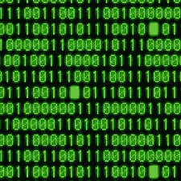
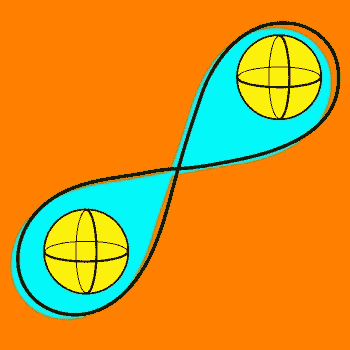
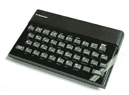

# 量子计算机会取代我们客厅里简陋的个人电脑吗？

> 原文：<https://medium.com/hackernoon/will-quantum-computers-ever-replace-the-humble-pc-in-our-living-rooms-8eec7afe968>

Photo by [Lorenzo Herrera](https://unsplash.com/photos/p0j-mE6mGo4?utm_source=unsplash&utm_medium=referral&utm_content=creditCopyText) on [Unsplash](https://unsplash.com/search/photos/zx-spectrum?utm_source=unsplash&utm_medium=referral&utm_content=creditCopyText)

## 从 20 世纪 70 年代末开始，个人电脑一度只对世界各地大学的研究人员开放，但由于尺寸和成本的变化，大众很容易就能买到。现在我们正处于量子计算机时代的风口浪尖，同样的事情会发生在他们身上吗？

# 黎明时分

法国诗人保罗·瓦列里曾经说过，未来不再是过去的样子，这句话在今天再恰当不过了。我们人类正在崛起，这都是因为科技的新视野，一个未来的巨人，量子计算机，这就是原因。几年前，在计算机发展的初期，数学家和科学家的梦想很简单:对简单的计算操作进行数字处理。[1944 年制造的康拉德·楚泽 Z4](http://zuse.zib.de/z4) 就是这样一台机器。从那以后，Z4 之后出现了几十台初级电脑。

Konrad Zuse’s Z4 computer. Source: alamy stock photo

后来，在 20 世纪 60 年代，达特茅斯学院的两位计算机科学家 Thomas E. Kurtz 和 John G. Kemeny 开发并编写了 BASIC 语言 **，这是一种简单的计算机语言，允许没有专业知识的普通人编写计算机程序。自从那些青葱岁月以来，传统计算机的发展已经进入了那些第一批开拓者只能梦想的领域。**

> 它向前，然后向上，除此之外。

从 20 世纪 50 年代到 70 年代中期的分水岭时期，所谓的“强大的计算机”完全掌握在麻省理工学院、斯坦福大学和牛津大学等知名高等学府的计算机科学家和其他专家手中。然后，奇迹出现了:电脑变得更小更便宜。像 Apple II 和 Commodore's PET 这样的机器使计算机的使用大众化，使每个人都可以使用它们。

> 万岁。

# 令人兴奋

如今，“量子”是我们前进方向的代名词，尽管这项技术仍处于萌芽阶段。理解量子计算机以及它们能为我们做什么——如果我们的大脑和设计应用掌握了它们——是令人兴奋的。由我们这个时代的天才马克斯·普朗克(Max Planck)和阿尔伯特·爱因斯坦(Albert Einstein)等人创立的量子理论，对许多人来说是一个如此难以理解的主题，如此受知识修辞的保护，以至于它让许多人感到害怕，如果仅仅是因为它完全不可理解的话。美国宇航局与科技巨头 IBM 和谷歌一起，正在将其无限的技术资金投入到探索理解和使用量子技术来建造新型计算机的过程中。在中国，这一领域的发展势头也越来越大。

> 一场量子竞赛很可能即将到来。

**在政府和科技公司的引领下，毫无疑问，在未来的几年或几十年里，量子计算机世界将像它们的经典兄弟一样，变得更加“规范”。有一些计算机科学家和量子物理学家相信这项技术的实际应用比我们想象的更接近现实。**

> 就看这个空间。

# 量子规范

1 或 0 的二进制系统是经典计算的运算形式，其本质是基于人类思维的运作方式。与之形成鲜明对比的是，量子计算机是根据宇宙的规律来建模的。在这个系统中，经典模型的所有操作复杂性都被包括在内，同时也包含了量子物理的法则。

The binary system, the model for classical computers. Source: Facebook

在量子计算中，“量子位”已经取代了“比特”，后者用于经典模型的二进制系统中。用量子比特代替比特的结果是一样的，你可以通过增加量子比特来获得量子比特的数量。使量子比特——以及量子模型非同寻常(或者我应该说是量子规范的)——的是，量子比特发生了两个在经典计算机模型中不会发生的激进事件，即[、](https://whatis.techtarget.com/definition/superposition)和[、【纠缠】、](https://www.sciencealert.com/entanglement)现象。在这里，物理定律走了一条非常怪异和不规则的道路。简单地说，在没有任何科学修饰的情况下，在量子模型叠加中，或“状态叠加”，意味着量子位，与一个比特相反，可以同时是 1 和 0，而不是一个比特的一个状态。随后，纠缠是两个量子比特相互“纠缠”的事件，而不管两个现象之间的空间宇称(这不是真正的现象，而是一个统一的现象)。

Qubits Entangled — don’t worry, I don’t understand it either. Source: MIT Technology Review

考虑到这一点，很难理解我们如何能够知道这样的异常，然后继续构建一台计算机，它可以操纵量子世界中的这些事件为我们服务。

> “量子物理学是我的一点爱好。真是非同寻常。有一个数学分支是建立在疯狂的基础上的，这太棒了。”
> 
> 鲍勃·霍斯金斯

# 正如我们所说的

然而它正在发生。此时此地，2019 年。说到这里，无可否认，我们正处于起点，但尽管如此，我们正在到达那里。在未来的某个时候，正如许多人工智能研究人员支持即将到来的[奇点](https://en.wikipedia.org/wiki/Technological_singularity)，或者埃隆·马斯克的载人火星任务 SpaceX 计划，量子计算机将会出现。

*但它们会适合所有人吗？如果是这样的话，它们会像过去五十年来经典计算机对人类一样有用吗？*

# 新电脑？

计算机科学家认为量子计算机在未来会有用处的一个关键领域是密码学。目前，经典计算机——就像加密货币及其操作的底层技术区块链一样——无法破解密码。科学家和加密货币倡导者担心，量子计算机的引入和广泛使用以及它们所拥有的能力将使经典计算机加密操作保护的区块链变得脆弱，使它们在安全意义上毫无用处，这种担心是有道理的。这反过来又促使研究人员开发加密方法(基于量子区块链的想法，一个简单的点对点的例子)，以对抗量子攻击和其他虚拟犯罪的威胁。

除了加密货币，专家们还猜测量子计算机将在医学、人工智能和其他科学领域的神经网络未来应用中发挥作用。

然而我们呢？它们会影响我们的生活吗？我们会像经典计算机模型一样，能够使用它们吗？

# 为所有人

他对最后一个问题的回答至少是可以回答的。2016 年，科技巨头 IBM 创造了 [Q Experience](https://www.research.ibm.com/ibm-q/technology/experience/) 量子计算机，它拥有两个 5 量子位处理器和一个 16 量子位处理器，并且开放供每个人免费使用。根据他们可能能够做的事情和他们在未来几年的样子来衡量，它不是很强大，但这个基于云的设备可以被任何有能力构建和运行量子电路的人使用。我认为还不错。

然而，谷歌——这是胜人一筹的一个主要例子——创造了自己的量子计算机，名为 [Bristlecone](https://ai.googleblog.com/2018/03/a-preview-of-bristlecone-googles-new.html) ，这是一个 72 量子位的基于门的超导系统，远远超过了 IBM，也让那些认为 50 量子位正在进入[“量子霸权”的专家们感到困惑。](http://discovermagazine.com/2019/jan/quantum-supremacy)

最近的例子是总部位于马里兰州的量子计算硬件和软件公司 [IonQ](https://en.wikipedia.org/wiki/IonQ) ，该公司在 2018 年底声称，它正在开发一种最高可达 160 量子位的量子计算机，打破了目前对处理器容量的说法。

> 无论发生什么，这肯定是一个狂野的西部场景。

因此，正如 70 年代末和 80 年代初 ZX 频谱和 Amstrad 64 成为人们家中的标准一样，也许很快——或者这是一个白日梦——量子计算机将出现在每个人的客厅或其他一些方便的地方。

ZX Spectrum, a classic PC. Source: Wikipedia

量子计算机的时代已经开始。当我们从经典模型转向这个新的量子模型时，只有时间能告诉我们如何使用它们。

但是不管它是什么，我希望它是出于创造性的道德方面。