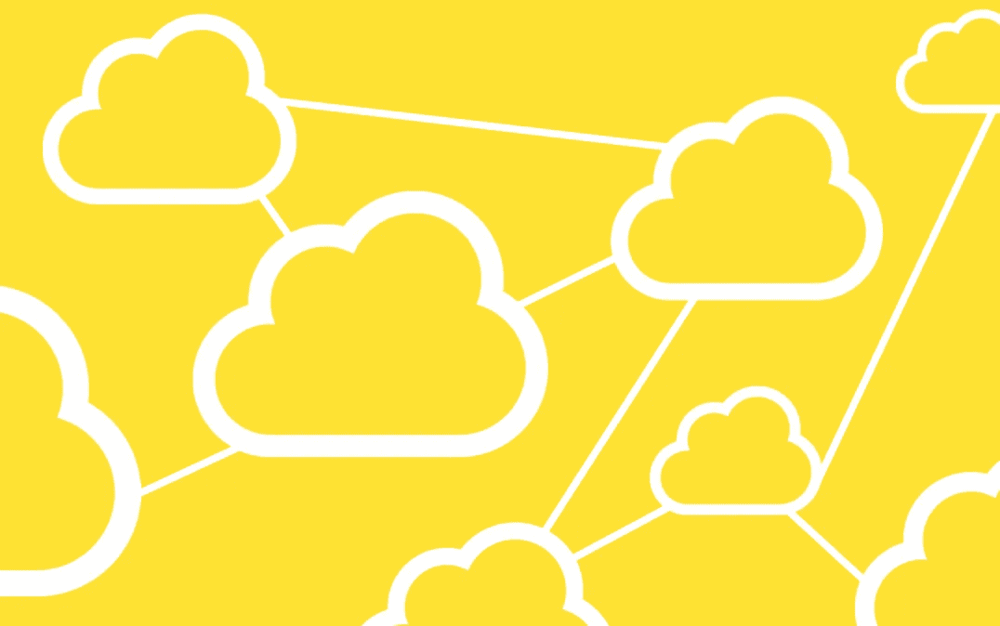

# 云会移动到区块链吗？

> 原文：<https://medium.com/hackernoon/will-the-cloud-move-to-the-blockchain-6ceabd0ce664>

## Cloud 2.0 专注于扩展区块链生态系统，以开发云领域的新机遇。

2018 年，全球各大云公司都对区块链表现出了极大的兴趣。亚马逊网络服务(AWS)、[谷歌云](https://medium.com/u/4f3f4ee0f977?source=post_page-----6ceabd0ce664--------------------------------)和微软[构建 Azure](https://medium.com/u/6cb5860f5c19?source=post_page-----6ceabd0ce664--------------------------------) ，都表达了分布式数字账本技术如何成为云未来的关键因素。

[ConsenSys](https://medium.com/u/6c7078bf7b01?source=post_page-----6ceabd0ce664--------------------------------) ，区块链领域的主要参与者之一，作为一家风险制作工作室和区块链软件开发咨询公司，通过与所谓的 ConsenSys mesh 的新成立部分 [Kaleido](https://medium.com/u/209f16e6ac4a?source=post_page-----6ceabd0ce664--------------------------------) 和 AWS 的合作，大举进军云行业。该公司旨在为 AWS 客户提供一个“简单的按钮”，以进入支撑加密货币和 d-apps 或分散应用程序的相同技术。

现在，ConsenSys 已经向云行业迈出了一大步。它最近与半导体制造商 AMD 和阿布扎比投资管理公司 Halo Holdings 合作，共同开发一个名为 W3BCLOUD 的新项目，这是一个位于区块链的云计算基础设施。

目标是通过创建 W3BCLOUD，为新兴的区块链工作负载开发优化的数据中心解决方案。利用 ConsenSys 丰富的区块链软件专业知识，W3BCLOUD 计划开发由 AMD 硬件支持的优化解决方案，能够支持政府和商业企业的各种工作负载和应用，并加快分散应用的采用。

以太坊和 ConsenSys 的创始人 Joseph Lubin 表示:“利用 AMD 的领先技术增强区块链网络的计算能力，将对全球新兴分散系统的大规模采用大有裨益。“硬件和软件的结合将为新的基础设施层提供动力，并加速区块链技术的发展。”

去年，MarketBlok 的 Ben Noble 称区块链的云计算为 Cloud2.0。他在 Cointelegraph 上写道:“云是第一个远离中心化的东西。”。“云将服务器移出了企业园区，并将处理能力集中到了别处。区块链正在分割处理能力，并将其分散到全球各地。”

根据[阿里·阿亚什](https://medium.com/u/c5f25b5936f4?source=post_page-----6ceabd0ce664--------------------------------)的说法，“区块链是云一直*所期望的*——一个真正透明和互联的网络，它消除了对集中式交易机构的需求，并解决了云最令人不安的安全风险。”

“在许多方面，区块链真的是云 2.0，”他在 [Hackernoon](https://medium.com/u/4a8a924edf41?source=post_page-----6ceabd0ce664--------------------------------) 的一篇帖子中写道。“区块链为开发者带来了世纪之交以来从未有过的机遇。”

2019 年是云 2.0 之年吗？