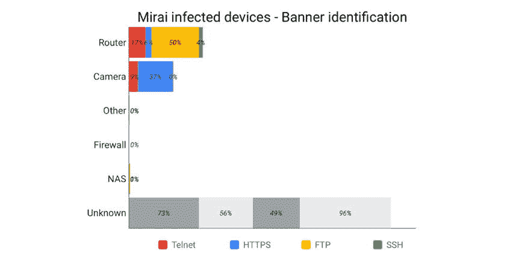
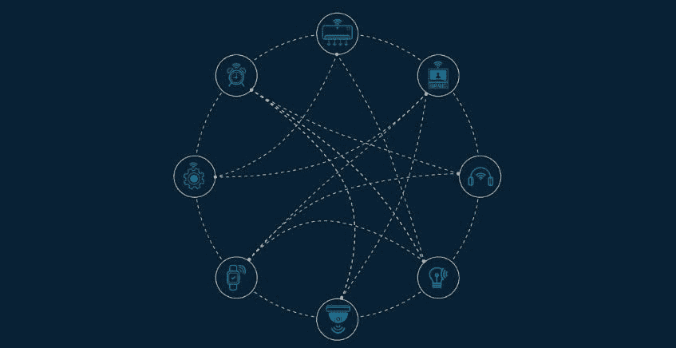
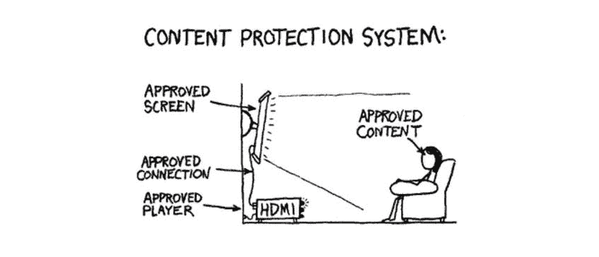

# 您能够让您的物联网设备远离黑客吗？

> 原文：<https://medium.com/hackernoon/will-you-be-able-to-keep-your-iot-devices-away-from-hackers-410ff3411f8d>

当你在思考机器人和全息图，或者至少是“更智能”的手机主宰的未来时，研究表明，这些技术发明旨在增强我们的娱乐，而不是实际改善我们的日常工作。物联网(IoT)行业拥有真正的颠覆潜力。

像三星、高通、LG、华为和英特尔这样的大公司已经看到了这一点，并且都在申请专利，希望在未来建立产品领先地位。你可能会问有多少专利？仅这五家公司迄今就拥有超过 13，300 项物联网专利，这使得物联网成为当今研究最多的新兴市场之一。

我们来看看 2019 年初物联网市场的[状态](https://iot-analytics.com/state-of-the-iot-update-q1-q2-2018-number-of-iot-devices-now-7b/):

*   70 亿台物联网设备
*   170 亿台联网设备
*   1510 亿美元的物联网市场评估
*   价值 640 亿美元的[工业 4.0](https://www.forbes.com/sites/bernardmarr/2018/09/02/what-is-industry-4-0-heres-a-super-easy-explanation-for-anyone/#602d12799788) 产品和服务
*   技术、媒体和电信行业 90%的高级管理人员[表示](https://www.statista.com/statistics/945058/worldwide-iot-importance-digital-trust-industry/)物联网对他们的部分或全部业务至关重要

如果你不能正确理解这些数字本身的意义，让我们这样解释这个市场增长:如果行业继续以同样的速度发展，物联网设备的数量将在[未来三年内超过智能手机的数量](https://www.ericsson.com/en/mobility-report/internet-of-things-forecast)！

[https://iot-analytics.com/state-of-the-iot-update-q1-q2-2018-number-of-iot-devices-now-7b/](https://iot-analytics.com/state-of-the-iot-update-q1-q2-2018-number-of-iot-devices-now-7b/)

消费者家中有超过 180 亿台物联网设备，行业专家和潜在客户正在质疑它们的安全性。他们这样做完全正确。目前， [80%](https://www.adaptivemobile.com/press-centre/press-releases) 的现有物联网设备没有得到充分保护。

# 为什么物联网设备安全性这么弱？

物联网设备面临的安全问题并不新鲜。物联网行业可能看起来很新，但在我们的家中拥有智能电器绝对不是什么新鲜事。事实上，第一台联网设备早在 1982 年就被发明了:一台[可乐自动售货机](https://www.cs.cmu.edu/~coke/history_long.txt)。从那时起，这个行业见证了 1999 年来自[微软和 P & G](https://www.rfidjournal.com/articles/view?4986) 的努力，2002 年赫尔辛基理工大学的努力(那时“物联网”这个术语第一次被使用)，最后，我们今天研究的概念是 2008 年[诞生的](https://en.wikipedia.org/wiki/Internet_of_things)。经过 10 多年的创新，安全问题仍然没有解决。

回顾 2016 年就可以理解其中的风险，当时最大的 DDoS 攻击就是在 2016 年发生的。[拒绝服务(DoS)攻击](https://en.wikipedia.org/wiki/Denial-of-service_attack)是指一台连接到互联网的机器被用来“淹没”目标服务器的多余请求，使其长时间不可用。考虑到大多数公司并不是只在一台机器上托管他们的软件，而是在整个仓库的服务器上托管，一对一的攻击似乎是没有用的。但是让我们看看 DDoS 中额外的“D”:分布式拒绝服务攻击。这时黑客使用多台机器来执行他们的泛洪攻击。

*   攻击者可以购买并在家中安装所有这些计算机，但这是极不可能的。即使他们有资金，也很容易追踪大宗购买或他们的实际位置。
*   它们可以感染人们的电脑或手机。但由于现在大多数操作系统都预装了防火墙和防病毒程序，这种方法变得越来越不可行。
*   或者，攻击者可以利用世界各地人们家中安全性差的物联网设备网络，将他们的计算能力导向目标服务器。这是最简单的解决方法吗？

这正是 2016 年发生的事情，当时攻击者开发了 [Mirai 未来组合恶意软件](https://www.corero.com/resources/ddos-attack-types/mirai-botnet-ddos-attack.html)，该软件正在搜索仍在使用默认密码的物联网设备。结果是毁灭性的。第一次攻击后不到一个月，下一次攻击发生了，亚马逊、SoundCloud、Reddit、Spotify 和许多其他网站同时关闭！

[https://blog.cloudflare.com/inside-mirai-the-infamous-iot-botnet-a-retrospective-analysis/](https://blog.cloudflare.com/inside-mirai-the-infamous-iot-botnet-a-retrospective-analysis/)

由 180 亿个未受保护的物联网设备组成的网络不仅对其实际所有者来说是危险的，而且可能会将整个开放互联网置于危险之中。

# 有没有针对安全物联网设备的解决方案？

问题根源于物联网系统的发展。提议的架构是集中式的，效率低下:设备必须连接到中央云服务器才能执行操作。它可以是谷歌云物联网，亚马逊的 AWS 物联网，苹果的 HomeKit，你说得出的。即使这些公司已经有了多年的 IT 经验，但他们的记录中有与云相关的黑客攻击，会让你在信任他们的系统安全之前三思而行。

我们如何解决他们的集中化问题？与之相反的方法是:一个分散的系统。我们正在考虑的分散式物联网生态系统基于区块链技术。这样一来:

*   网络保护——攻击者必须危及[整个网络](https://www.investopedia.com/terms/1/51-attack.asp)，而不仅仅是单个节点才能成功攻击。
*   总是最新的—默认情况下，节点保持[同步](https://ethereum.stackexchange.com/questions/54634/basic-blockchain-implementation-how-is-the-blockchain-on-a-given-node-synced?noredirect=1&lq=1)。
*   没有单个漏洞——每个设备都成为网络中的一个节点，将故障点从单个设备转移到整个分散的网络中。

*简而言之*:区块链使物联网设备能够保护自己。

[https://vecap.io/](https://vecap.io/)

那么，谁能为我们严峻的未来提供解决方案呢？我们在区块链物联网提供商中发现了一些有趣的应用，例如 IoT Chain 开发了一个物联网操作系统 Watson IoT 平台，该平台提出了一个在私有区块链或 Atonomi 上移动数据的解决方案，其基础设施基于设备在网络中的身份和声誉。即使是目前最受欢迎的区块链物联网项目 IOTA 也可以算在内，尽管它的解决方案专注于交易和数据传输方面。这实际上是这些项目的共同问题:他们更专注于解决其他问题，而不是解决我们现在面临的安全问题。

然而，一个基于区块链的项目却是安全第一的: [VeCap](https://vecap.io/) 。它的解决方案不是增强设备的内置安全功能。它实际上完全绕过了设备的安全性，将安全性转移到了一个统一的分散网络中。这正是之前讨论过的区块链解决方案。但是他们的野心更大。想象一下，不是每个人都有一个网络，而是由世界上所有活跃的设备组成一个全球网络！很大胆，对吧？在这种情况下，黑客需要攻击至少 51%的设备才能危害网络。我们谈论的是成千上万个家庭和办公室中的数百万个物联网设备。宣称这个任务听起来不可能，也不算太牵强。

# 通往全球物联网网络的道路

为了保持安全，全球网络需要一个看门人。然而，如果有一个政党负责让人们进出，网络就不再是分散的了，对吗？VeCap 找到了一个解决方法。在两种情况下，任何人都可以随时加入网络:

*   使用经 [VeCap 认证的设备](https://vecap.io/)——网络层面没有集中化，但它仍然给了 VeCap 公司太多的竞争力。这就是为什么有第二种选择…
*   使用 [VeCap 适配器](https://vecap.io/)连接未经认证的设备。

基本上，任何拥有任何类型设备的人都可以加入网络。有一定程度的安全性，但它不受任何一方的控制。

这是物联网目前迫切需要的安全第一的方法。由于软件公司和设备制造商的贪婪，对单个设备和单一用途应用程序的关注使我们远离了统一标准。欧盟委员会在 2017 年推出[欧洲互操作性框架(EIF)](https://ec.europa.eu/isa2/eif_en) 时就认识到了缺乏互操作性的问题，该框架为如何建立可互操作的数字公共服务提供了具体指导。

当涉及到新技术时，公司之间的这种不情愿是典型的。VHS 奋斗了很久，直到成为录像带的标准。直到今天，世界各地的能源插座仍然没有标准化。我们还有很长的路要走，但是对于已经提出的物联网 VeCap 解决方案，您是愿意等待这些供应商在这样一个竞争激烈的市场中达成一致，还是要帮助它成为现实？

# 我们离互联网故障还有多远？

自 2016 年物联网设备遭受首次攻击以来，仅在 3 年内，20%的公司[在其物联网设备上至少面临过一次网络攻击。一份报告](https://www.idc.com/getdoc.jsp?containerId=AP42165517)[显示](https://sharedassessments.org/iot-new-era2/)97%的攻击对组织来说可能是灾难性的，潜在损失高达其收入的 13%。这些数字令人担忧，因为黑客只需不到一分钟的时间就能进入一台未受保护的设备。单靠厂商已经跟不上攻击者了。但这正是像 [VeCap](https://vecap.io/) 这样的项目可以消除他们肩上的安全顾虑，给采纳者带来信心的地方。