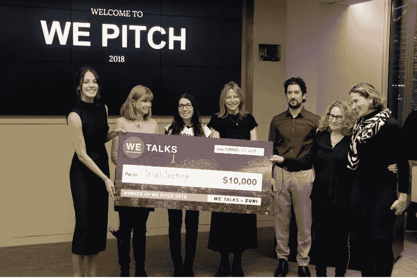
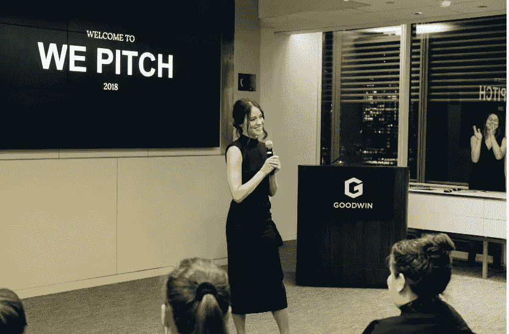

# 女企业家——不断变化的环境

> 原文：<https://medium.com/hackernoon/women-as-entrepreneurs-a-changing-climate-3b3f1268d42a>

通往商业成功的创业之路从来都不容易。但让创业成功之路变得更具挑战性的一个方法就是生来就是女性。女性企业家面临着她们的男性同行从未考虑过的挑战。

然而，尽管困难重重，女性在创业领域取得了惊人的进步。在这个旅程中，他们得到了新的创造性计划的帮助，这些计划旨在将这些企业与最能帮助他们取得成功的人联系起来。

**不稳定的统计数据**

女性在商界“出人头地”的一些方式表面上看起来是积极的，但实际上并不像听起来那么好。例如，美国教育部发现大学出勤率已经从以男性为主转变为超过 55%的女性对于大学和他们的统计数据来说是非常好的。但这到底意味着什么呢？

对于许多女性来说，尤其是那些已经获得研究生学位的女性，这也可能意味着她们获得学位并不是出于对更多信息或教育的明确需求，而是因为她们知道自己名字后面的额外字母将为她们的男性竞争对手提供急需的帮助。

对于技术和计算机科学领域来说尤其如此。在这些由男性主导的行业中，女性显然是少数。不仅如此，女性劳动力在这些领域的流动率高得离谱。

根据微软最近发布的关于劳动力多样性的[报告](http://geekzine.com)，科技巨头如亚马逊(40%为女性)、脸书(36%为女性)、苹果(32%为女性)和谷歌(31%为女性)实际上是女性劳动力代表的行业领导者。它们都远远领先于 28%的行业平均值。

对于女性科技企业家来说，事情更加艰难。斯蒂芬妮·雪莉(Stephanie Shirley)50 年前在英国创办了一家软件公司，现在名为 Xansa，她甚至在职业通信中使用了传统的男性绰号“史蒂夫”,只是为了避免证明自己是一名创业型科技天才。

这种差异可能在给予女企业家的风险投资资金少得令人难以置信的情况下最为明显。事实上，根据 2018 年 Techcrunch 的一项研究，[只有 2.2%的风险投资基金进入了女性企业家的手中](https://techcrunch.com/2018/11/04/female-founders-have-brought-in-just-2-2-of-us-vc-this-year-yes-again/)。

时至今日，尽管雪莉已经是一家价值数十亿美元的公司的老板，但她表示性别偏见仍然存在。她对女性在科技领域进展缓慢表示失望，尤其是在高管职位和初创公司。

**一些真正的进步**

然而，女企业家已经取得了进展，并将继续取得进展。其中有一项措施对推动女性创业者和企业主的事业非常有用。参议院小企业和企业家委员会研究了女性继续面临的不成比例的挑战:难以打入男性主导的网络，难以获得导师，难以获得足够的资金，等等。

现在有一些组织致力于帮助妇女克服这些障碍。非营利组织提供网络、技术支持、成功认可、资助机会和指导，所有这些都是专门为女性量身定制的。像全国女性主管协会、美国商业妇女协会、妇女商业交流、37 天使和妇女商业发展理事会这样的组织只是致力于确保妇女生存和发展的少数企业。

好消息是，一些敬业的专业人士为减轻女性企业主的风险和挑战而付出的努力真的有了回报。

根据全国女性企业主协会 2017 年进行的一项研究，仅在美国就有超过[1100 万女性拥有的企业](https://www.nawbo.org/resources/women-business-owner-statistics)。同一项研究表明，女性拥有的企业年收入超过 1.7 万亿美元。他们雇佣了 900 万人。这是经过巨大努力才实现的。

**我们投球**

其中一项努力是我们对话和祖瑞的合作，叫做我们演讲。该活动类似于 Techcrunch disrupt，但主要针对女性企业家。Disrupt 有一个粗略的性别记录，在四年的“改变”之后，[仍然有 2 比 1 的男女主持人比例。](https://www.genderavenger.com/blog/action-alert-techcrunch-disrupt-san-francisco-2018)

2018 年 11 月 27 日，我们召集了支持和雄心勃勃的女性企业家和杰出的投资者，举行了一场合作、支持和竞争的晚会。口碑广告活动在宣布后的几周内，吸引了纽约地区 300 多名早期女性创业公司。前十名决赛选手有机会在经验丰富的投资者面前展示他们的创业公司(Anu Duggal，Fran Hauser，Tikhon Bernstam，Pat 赫德利，Christina Vuleta)，获胜者 [Tzvia Bader](https://www.linkedin.com/in/tzvia-bader-0689a719) 获得了 1 万美元，这将帮助她推进她的平台[试验项目](https://www.trialjectory.com/)，该项目将癌症患者与正确的临床试验联系起来。

WE Talks 的创始人[拉娜·波芝达耶娃](https://www.forbes.com/sites/meganbruneau/2018/09/18/this-woman-turned-a-humiliating-networking-experience-into-a-business/)对参与创业的质量和数量并不感到意外。为满足支持女性领导的商业创新的需求，我们的对话促进了相关讨论、指导和联系机会，以及每月小组活动的教育议程。Pozhidaeva 在 4 月主办了第一次 WE Talks 聚会，大约 50 名妇女参加了小组讨论。从那以后,“我们谈话”以每月 50%的速度增长，成为纽约发展最快的女性社区之一，吸引了来自不同行业的雄心勃勃的女性。在船尾

初创公司投资者、资深媒体高管、全球女性代言人弗兰·豪泽(Fran Hauser )表达了她的鼓励，她说:“演讲的质量给我留下了深刻印象。我投票支持 TrialJectory 归结于拯救生命的治疗的可获得性的承诺，医疗保健提供商和创始人/市场 fit 对金融资源的低效使用。我喜欢看到创始人之间的友情，以及他们在演示期间和宣布获胜者后相互支持的程度。最佳纽约科技场景！."

互联网企业家、投资人、 [Scribd](https://en.wikipedia.org/wiki/Scribd) 和 [Parse](https://en.wikipedia.org/wiki/Parse_(company)) 的联合创始人 Tikhon Bernstam 也肯定了这次活动，他说:“WE Talks 和 ZURI 组织了一次非常棒的活动。演示的质量和我在 YC 演示日看到的一样高。”

像我们这样的努力正在引领和塑造女性企业家的未来。当初创公司认识到一种需求，寻求通过一个伟大的想法来满足这种需求，并通过不断发展来满足不断变化的客户需求，从而继续在自己的领域实现相关性，他们就会看到成功。

这确实是像 WE Talks 和 ZURI 这样的组织正在做的事情。唯一的区别是，他们是为整个性别而做的。当其他人正在讨论关于社会正义的想法时，我们的对话正在为超越社会正义和性别平等目标的机会提供便利，为女企业家提供突出和高度重视她们的技能和想法的经验。

**未来的希望**

女性企业家未来的成功看起来需要大量的工作。但是有了现在的支持，不久的将来会有一天，超过百分之五的创业公司由女性所有。当女人有一个伟大的梦想或改变世界的想法时，她们不会遇到难以逾越的障碍。

目前的现实是，由一个男人推销时，获得资金的可能性是现在的两倍，这将成为过去。思想比性别更受重视。

誓言 CEO 蒂姆·阿姆斯特朗的目标是“创造一个女性可以领导的职位”，或者币安 CEO 赵昌鹏最近在 Twitter 上提到币安女性高管时不幸使用了“女孩”一词，这些说法都不会存在。科技行业将根据业绩，而不是女性高管能力的陈旧观念，在配额内进行招聘。

与此同时，这一代女性企业家继续为可能的事情搭建舞台，因为她们在社会和知识上创造了历史。