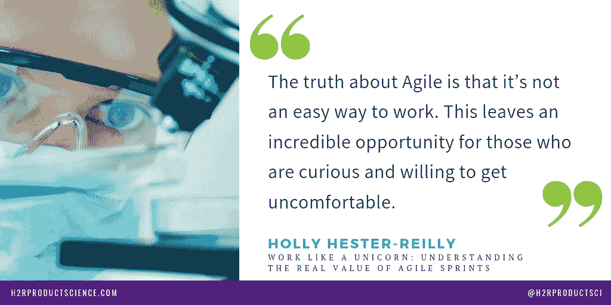

# 像独角兽一样工作:理解敏捷冲刺的真正价值

> 原文：<https://medium.com/hackernoon/work-like-a-unicorn-understanding-the-real-value-of-agile-sprints-8523a3d89ff0>

我想分享我对一个话题的想法，这个话题对于试图在一个业务中实践真正的敏捷软件开发的团队来说是一个真正的痛点，这个业务不一定与它所需要的一切保持一致。

如果你一直在使用敏捷框架，或者即使你没有，你可能对“冲刺”的概念很熟悉，这是一种在时间限制的迭代中交付工作软件的推动，通常是一周或两周。但是，正如富有洞察力的约翰·卡特勒(@johncutlefish)在 Twitter 上指出的那样，短跑经常引起人们的关注。

> *“短跑”的价值在很大程度上被误解/掩盖了。*
> 
> *sprint 是一种*健康*(有效)的强制功能/使能约束……不是一种驱动团队/个人的方式……不是一个仓鼠轮子……不是“破坏一个项目”(1/n)*
> 
> *-约翰·卡特勒(@ johncutlefish)*[*2019 年 4 月 20 日*](https://twitter.com/johncutlefish/status/1119699906384449537?ref_src=twsrc%5Etfw)

正如 John 指出的，如果你的组织误解了 sprint 的目的和价值，那么你就被困在了一个仓鼠轮子上，根据一些预先确定的路线图无休止地旋转出一个又一个的特性，并且感觉你永远都走得不够快。在这些环境中的团队经常感觉短跑的开始和结束是无意义的、程序性的步骤，他们很少对他们所取得的成就有成就感。

一个误解短跑价值的组织的明显标志是一个团队在“失败的”短跑上使用语言。正如 John 所说，他经常从团队那里听到类似这样的话，“是的，我们一直没有达到我们的故事点目标，这太令人沮丧了。总有一些松散的故事。我们的士气超级低落。”如果这听起来很熟悉，解决方法就是不要更加努力。

# 为什么没有“失败”的短跑

当我们谈论“失败的冲刺”时，要意识到的关键是冲刺实际上仍然完成了它的工作，即使它没有给你你想要的结果。这向团队发出了一个信号，即他们正在做的事情没有奏效。这种失败的 sprint 的想法是一个关键的指示器，表明组织正在将 sprint 作为交付的工具，而不是发现、检查和适应的工具。

Sprints are a forcing function for re-evaluating what’s most important.

相反，理解 sprint 的真正价值是频繁整合产品工作的所有方面是很重要的。

# 短跑的真正问题是

这里的问题是，短跑如何适应一个组织随着时间的推移而形成的模式和习惯。作为人类，尤其是作为人类群体，我们真的讨厌未知。与其等着看我们从每一次冲刺中学到了什么，然后进行相应的调整，不如把工作分成“冲刺”来做，同时坚持我们事先商定的整体、长期计划，这样会让我们感觉更舒服。尽管敏捷的核心是承认可能还不知道做事情的最佳方式，但我们希望感觉自己知道自己在往哪里走。

那些试图将他们的敏捷开发计划融入到仍然用项目思维方式管理的组织中的善意团队通常会放弃敏捷框架所遵循的原则。他们可能会称他们正在做的事情为敏捷，但这完全是另外一回事。

# 在独角兽公司工作

我第一次阅读敏捷软件开发原则背后的理论是在 2000 年代末，当时我第一次在一家初创公司工作。对我来说，关键一直是关于“检查和适应”的频率作为一名前化学工程师，作为一个[过程控制系统](https://en.wikipedia.org/wiki/Process_control)，它对我来说有着直观的意义:一个确保事情不会失控的过程，最糟糕的情况(在化学工程中)是工厂爆炸。

因此，在早期创业团队的这些年里，我尽最大努力实施和倡导敏捷开发。由于整个公司很小，只有一个团队，我首先在一个没有团队之外的很多因素的环境中练习，这些因素会使敏捷很难实现。

因此，当我在 2012 年被聘用时，我很高兴加入一家已经在高速增长阶段实践敏捷的公司，拥有许多工程师团队。我想看看在那个规模下它是如何工作的。

I wanted to see how Agile worked on a team of hundreds.

当具有命令和控制意识的领导让我做一些非敏捷的事情时，比如推动团队在每个 sprint 中投入更多，或者提前计划好我们要在 sprint 中做哪些故事，我解释说他们的要求违背了敏捷的核心原则。

值得称赞的是，他们接受了，没有再问我。因为我在科技之前在政府部门工作过，所以我把这种适应性反应和开放性归因于科技创业公司文化的新工作方式。

在我在 MediaMath 工作的三年中，我的产品团队在重新设计用户体验、开始整理我们的设计系统、执行技术平台迁移和为我们的核心用户推出新功能的同时，实践了持续的产品发现和敏捷软件开发。

只是在我离开 MediaMath 之后，当我开始与更多来自大公司和更传统背景的人一起工作时，我才意识到在 MediaMath 实践敏捷的信任是多么独特，即使是在科技界。去年，当 MediaMath 筹集了新一轮资金，使其估值超过 10 亿美元时，我认为这是对 MediaMath 作为独角兽的一种迟到的认可，我早就知道它是独角兽。

# 真正实践敏捷的挑战

敏捷的真相是它不是一种简单的工作方式。几乎我们的整个教育和职业体系都是围绕着教导人们遵循清晰的道路而建立的，有大量的计划、确定性的假设和标准化。当今世界技术日新月异，人口高度互联，变化极快。软件开发的基础设施变化也非常快。作为一种职业，我们刚刚开始开发在这种环境下工作的可重复过程。

对大多数人来说，这让他们在工作中非常不舒服。他们觉得自己在盲目飞行，所以他们依靠他们所知道的。他们专注于运输功能，推动更长的时间，认为越多越好，将 sprints 纳入更大的时间表，而没有花时间考虑他们正在学习的内容以及这些内容可能会如何改变未来的事情。

这给那些好奇的和[愿意变得不舒服的人留下了一个难以置信的机会](https://h2rproductscience.com/unlearn-past-successful-approaches/)。如果你能学习如何像独角兽一样工作，不管你感受到来自你周围每个人的压力，恢复舒适，你就能创造独特的产品并找到未开发的市场机会。这是不舒服的工作。但结果令人难以置信。

The truth about Agile is that it’s not an easy way to work.

> 如果你能学习如何像独角兽一样工作，不管你感受到来自你周围每个人的压力，恢复舒适，你就能创造独特的产品并找到未开发的市场机会。

> 在 [H2R 产品科学](http://h2rproductscience.com)，我们在这里帮助那些想要完成这一旅程的人。我有一些公开的研讨会，将帮助从业者提高他们的游戏:[数据驱动的产品决策:如何扼杀一个坏主意或倡导一个好主意](https://h2rproductscience.com/workshops/)。
> 
> 您也可以通过[订阅产品科学杂志](https://h2rproductscience.com/product-science-mailing-list-opt-in)或收听[产品科学播客来与我联系。](https://h2rproductscience.com/category/product-science-podcast/)真的，如果你想和一个不仅理解敏捷是什么，而且理解我们为什么要这么做的人一起工作，请伸出援手。让我们建立一个想要创造对世界有益的伟大科技产品的大军，不管旅途有多艰难和不舒服。

> 原载于 2019 年 5 月 23 日 https://h2rproductscience.com。

## 阅读更多信息:

 [## 约翰·卡特勒-黑客正午

### 阅读约翰·卡特勒在《黑客正午》中的文章。多个戴帽子的人。产品开发螺母。我喜欢争论复杂的问题和…

hackernoon.com](https://hackernoon.com/@johnpcutler)